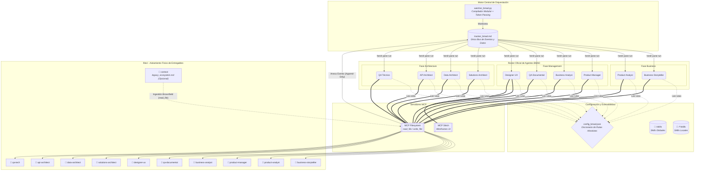
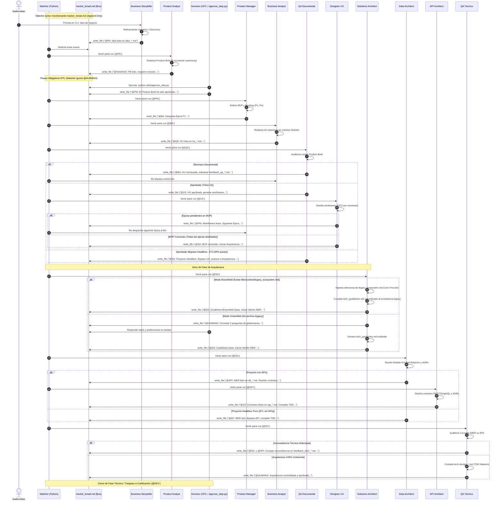

# BMAD Multi-Agent Ecosystem — Arquitectura Técnica

> Este documento describe la arquitectura técnica, la topología física y lógica de agentes, los diagramas de componentes y secuencia, la gestión de estado y el ciclo de vida secuencial (*Token-Passing*) del framework BMAD (Business, Management, Architecture & Development) sobre Herdr y herramientas MCP.

---

## 1. Visión General y Topología del Sistema

El framework BMAD está diseñado para guiar una iniciativa de software desde su concepción inicial informal hasta la especificación técnica completa con criterios BDD, wireframes de interfaz de usuario, diseño de persistencia relacional (MER), contratos de integración de APIs y auditoría cruzada de arquitectura (TDD).

### Principios Arquitectónicos Inmutables
1. **El Tracker como Único Bus de Datos y Comunicación:** Los agentes **NO** se comunican entre sí por chat ni invocaciones directas. Todos los agentes leen y escriben exclusivamente en un archivo central llamado `files/tracker_bmad.md`. Cada agente anexa su bitácora al final (*read -> concat -> write*) usando etiquetas formales de Handoff (ej. `@PA:`, `@PM:`, `@BA:`, `@QA:`, `@UX:`, `@SA:`, `@DA:`, `@API:`, `@QT:`).
2. **Plantillas Deterministas:** Todos los entregables (`pb_*.md`, `mvp_*.md`, `hu_*.md`, `ux_*.md`, `tech_guidelines.md`, `db_*.md`, `api_*.md`, `tech-design_*.md`) se generan a partir de plantillas estrictas (`.instructions.md`). Prohibido permitir que un agente invente la estructura de un documento.
3. **Lógica de Bypass Headless vs UI (Rutas Dinámicas):** El framework es consciente de la naturaleza del proyecto:
   - **Ruta con UI (Web, Mobile, Dashboards):** `BS -> PA -> (HITL) -> PM -> BA -> QA -> UX -> SA -> DA -> API -> QT`.
   - **Ruta Headless (ETL, SSIS, Pipelines de Datos, APIs puras):** El flujo salta automáticamente el diseño visual de interfaces: `BS -> PA -> (HITL) -> PM -> BA -> QA -> SA -> DA -> QT`.
4. **Política Anti-Alucinación:** Ningún agente asume alcances no definidos en el Product Brief o en las Historias de Usuario. Todo supuesto debe marcarse explícitamente con `⚠️ [PROPUESTO]` o `❓ No documentado`.
5. **Auditoría Cruzada:** El agente `qa-tech` es el compilador final. Audita matemáticamente que el diseño de base de datos (`db_*.md`) y los contratos (`api_*.md`) no se contradigan antes de generar el Technical Design Document (TDD).
6. **Estrategia Dual Greenfield / Brownfield (Agnosticismo Total):** El framework soporta de manera nativa tanto iniciativas completamente nuevas como sistemas preexistentes mediante el interruptor físico `files/context/legacy_ecosystem.md`. Si dicho archivo existe, todos los agentes (de negocio y arquitectura) subordinan obligatoriamente sus entregables al dominio, reglas y restricciones tecnológicas descritas en él. Si no existe, operan en modo Greenfield estándar sin precondiciones.

---

### Arquitectura de Componentes

---

## 2. Roster Oficial de Agentes y Responsabilidades

| Agente | Fase BMAD | Responsabilidad Principal | Entrada Principal | Entregable Canónico |
|---|:---:|---|---|---|
| `business-storyteller` | Business | Refina ideas crudas, evalúa ambigüedad (HITL) e inyecta dolor de negocio y actores. | Visión informal del stakeholder | `idea_*.md` |
| `product-analyst` | Business | Transforma la idea en un Product Brief formal de 8 secciones canónicas. Activa pausa HITL. | `idea_*.md` | `pb_*.md` |
| `product-manager` | Management | Define el MVP por Ruta Crítica (P1-P5) y orquesta la delegación iterativa de épicas al BA. | `pb_*.md` (Aprobado HITL) | `mvp_*.md` |
| `business-analyst` | Management | Desglosa épicas en Historias de Usuario atómicas con criterios de aceptación Gherkin (BDD). | `mvp_*.md` y `pb_*.md` | `hu_*.md` |
| `qa-documental` | Management | Audita trazabilidad BDD, coherencia y ausencia de alucinaciones. Gestiona el Bypass Headless. | `hu_*.md` vs `pb_*.md` | `aprobado_qa_*.md` / `feedback_qa_*.md` |
| `designer-ux` | Management / UX | Diseña estados visuales en wireframes ASCII (1 escenario BDD = 1 estado visual). | `hu_*.md` (Aprobada) | `ux_*.md` |
| `solutions-architect` | Architecture | Formula cuestionario técnico al humano y consolida el stack y reglas de gobernanza. | `pb_*.md`, `mvp_*.md` + Q&A | `tech_guidelines.md` |
| `data-architect` | Architecture | Modela la persistencia física: Modelo Entidad-Relación (MER), diccionario y ADRs de datos. | `hu_*.md`, `pb_*.md`, guidelines | `db_*.md` |
| `api-architect` | Architecture | Diseña los contratos de integración (Endpoints, payloads JSON, status codes) y ADRs. | `db_*.md`, `hu_*.md` | `api_*.md` |
| `qa-tech` | Architecture | Audita matemáticamente coherencia entre MER y API; compila el Tech Design Document (TDD). | `db_*.md` y `api_*.md` | `tech-design_*.md` |

---

## 3. Flujo End-to-End y Secuencia Asíncrona (Token-Passing)

### Diagrama de Secuencia Completo

---

## 4. Gestión de Estado y Fuentes de Verdad

El framework desacopla el almacenamiento de los entregables en subdirectorios exclusivos dentro de `files/`:

| Entregable / Dominio | Ubicación Física | Agente Creador | Consumidores Principales |
|---|---|---|---|
| Rutas Absolutas del Proyecto | `config_bmad.json` | `init_bmad.py` / Operador | Todos los agentes vía `read_file` |
| Contexto Ecosistema Heredado | `files/context/legacy_ecosystem.md` | Operador / Stakeholder | Todos los agentes vía `read_file` (Modo Brownfield) |
| Bus Central de Handoffs | `files/tracker_bmad.md` | Todos los agentes vía MCP | `watcher_bmad.py` y agentes |
| Ideas de Negocio Refinadas | `files/business-storyteller/idea_*.md` | `business-storyteller` | `product-analyst` |
| Product Briefs (PRD Canónico) | `files/product-analyst/pb_*.md` | `product-analyst` | `product-manager`, `business-analyst`, `qa-documental`, `solutions-architect` |
| Backlogs y Planes MVP | `files/product-manager/mvp_*.md` | `product-manager` | `business-analyst`, `designer-ux`, `solutions-architect` |
| Historias de Usuario BDD | `files/business-analyst/hu_*.md` | `business-analyst` | `qa-documental`, `designer-ux`, `data-architect`, `api-architect` |
| Reportes y Certificados QA | `files/qa-documental/qa_*.md` | `qa-documental` | `business-analyst`, `designer-ux`, `solutions-architect` |
| Wireframes y Diseños UI | `files/designer-ux/ux_*.md` | `designer-ux` | `solutions-architect`, Frontend Developer |
| Gobernanza y Stack | `files/solutions-architect/tech_guidelines.md` | `solutions-architect` | `data-architect`, `api-architect`, `qa-tech`, Developers |
| Diseño de Base de Datos (MER) | `files/data-architect/db_*.md` | `data-architect` | `api-architect`, `qa-tech`, Database Administrators |
| Contratos de API | `files/api-architect/api_*.md` | `api-architect` | `qa-tech`, Backend & Frontend Developers |
| Tech Design Document (TDD) | `files/qa-tech/tech-design_*.md` | `qa-tech` | Humano, Tech Lead, Developers |

---

## 5. Invariantes y Mecanismos de Resiliencia

1. **El Tracker como Event Sourcing Inmutable:** La comunicación es exclusivamente mediante adición al final de `tracker_bmad.md`. Se prohíbe sobreescribir borrando el histórico.
2. **Backpressure en Watcher:** El orquestador sondea el estado de cada panel en Herdr. Si el agente está `working`, la tarea se retiene en memoria evitando saturación de terminales.
3. **Pausas Human-in-the-Loop (HITL):** 
   - Post-Product Brief: Requiere `python utils/approve_step.py` para activar `@PM:`.
   - Post-Tech Design: Requiere aprobación humana para autorizar codificación (`@DEV:`).
4. **Recuperación tras Reinicio (Crash Recovery):**
   - El PM y el Diseñador UX reconstruyen el estado del backlog leyendo directamente `tracker_bmad.md` y `mvp_*.md`.
   - Solutions Architect lee el historial del tracker para determinar si se encuentra en fase Q&A o en fase de consolidación.
5. **Inyección Dinámica de Skills:** Mediante la sintaxis `[IMPORT_SKILL: skills/ruta/SKILL.md]`, el compilador inyecta capacidades reutilizables (como `tracker-logger` y `export-pdf`) en el `AGENTS.md` de cada agente sin duplicar texto.
6. **Detección Condicional No Bloqueante (Dualidad Greenfield / Brownfield):** Todos los agentes consultan la existencia de `files/context/legacy_ecosystem.md` mediante MCP Filesystem. Si no existe o la carpeta está vacía, no emiten errores ni bloqueos: continúan su ejecución en modo Greenfield limpio con paridad absoluta. Si existe, subordinan automáticamente sus decisiones y entregables a dicho contexto.

