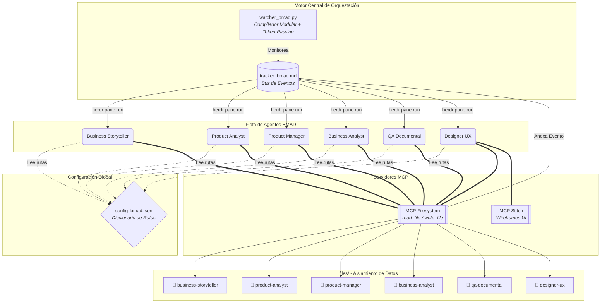
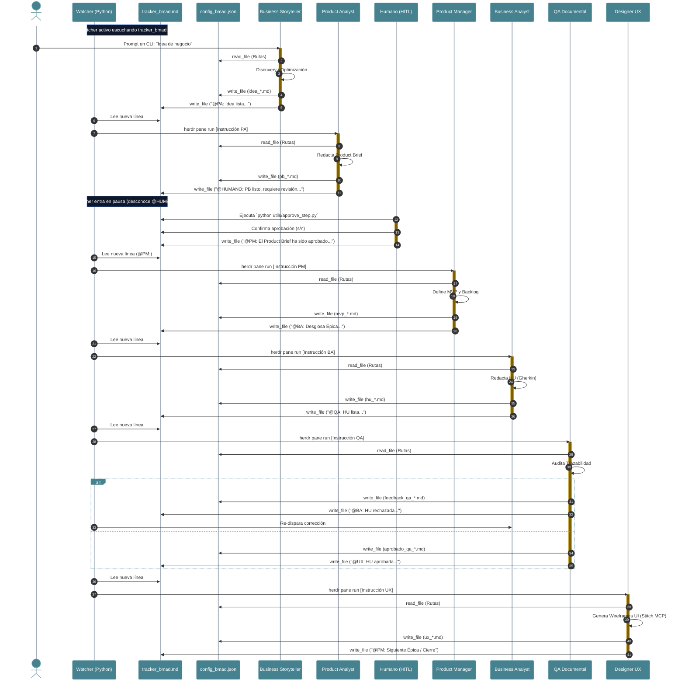

# BMAD Multi-Agent Ecosystem — Arquitectura

> Este documento describe la arquitectura técnica, la topología física y lógica de agentes, los diagramas de componentes y secuencia, la gestión de estado y el ciclo de vida secuencial (*Token-Passing*) del ecosistema multi-agente BMAD sobre Herdr y herramientas MCP.

---

## 1. Visión General y Topología del Sistema

El framework BMAD está diseñado para guiar una iniciativa de software desde su concepción inicial informal hasta la especificación técnica completa con criterios BDD y wireframes de interfaz de usuario.

La orquestación se realiza mediante un demonio en Python (`watcher_bmad.py`) que escucha eventos en un bus de mensajes de texto plano (`files/tracker_bmad.md`) y despacha instrucciones a terminales independientes en **Herdr** mediante inyección TTY atómica (`herdr pane run`). Los agentes operan de manera desacoplada utilizando el Model Context Protocol (MCP) para la lectura y escritura de artefactos en disco.

### Arquitectura de Componentes

---

## 2. Componentes y Responsabilidades

| Componente | Responsabilidad | Entrada | Salida |
|---|---|---|---|
| `watcher_bmad.py` | Compila definiciones modulares (`AGENTS.md`), monitorea `tracker_bmad.md`, encola tareas FIFO y despacha comandos vía TTY a Herdr. | Eventos en `tracker_bmad.md` | Inyección TTY (`herdr pane run`) |
| `business-storyteller` | Evalúa ambigüedad (HITL), refina ideas crudas e inyecta dolor de negocio y actores. | Idea cruda del stakeholder | `files/business-storyteller/idea_*.md` |
| `product-analyst` | Estructura el Product Brief (PRD) formal alineado a la metodología BMAD. | Idea refinada (`idea_*.md`) | `files/product-analyst/pb_*.md` |
| `product-manager` | Define el alcance del MVP, arquitectura funcional y prioriza el Backlog de Épicas. | Product Brief (`pb_*.md`) | `files/product-manager/mvp_*.md` |
| `business-analyst` | Desglosa épicas en Historias de Usuario atómicas con criterios de aceptación en Gherkin (BDD). | Backlog (`mvp_*.md`) y PB (`pb_*.md`) | `files/business-analyst/hu_*.md` |
| `qa-documental` | Audita trazabilidad, consistencia lógica, *sad paths* y ausencia de alucinaciones. | HU (`hu_*.md`) vs PB (`pb_*.md`) | `files/qa-documental/qa_*.md` |
| `designer-ux` | Diseña flujos UI y wireframes mediante MCP Stitch; audita alcance remanente en el Backlog. | HU aprobada (`hu_*.md`) | `files/designer-ux/ux_*.md` |
| `MCP Filesystem` | Herramientas estandarizadas de sistema de archivos (`read_file`, `write_file`). | Rutas en `config_bmad.json` | Operaciones de E/S en disco |
| `MCP Stitch` | Servidor MCP para generación y prototipado visual de pantallas. | Especificaciones UI en Gherkin | Wireframes y assets UI |

---

## 3. Flujo End-to-End y Secuencia Asíncrona

### Diagrama de Secuencia Asíncrona (Token-Passing)

### Detalle de las Fases:

1. **Compilación y Arranque:** Al iniciar `watcher_bmad.py`, el motor lee las carpetas `agents/` e `instructions/` de cada agente y ensambla su archivo unificado `AGENTS.md`. `start_agents.py` despliega la grilla de terminales en Herdr asignando modelos LLM y permisos de sandbox (`--add-dir`).
2. **Entrada y Discovery:** El stakeholder proporciona una idea cruda en el panel de `business-storyteller`. Si la idea es ambigua, el agente ejecuta preguntas interactivas (HITL). Al resolver la narrativa, guarda `idea_*.md` y escribe `@PA:` en el tracker.
3. **Análisis de Producto:** El Watcher detecta la línea `@PA:`, valida el estado `idle` del panel y le inyecta la instrucción. El PA lee la idea, genera `pb_*.md` y notifica `@HUMANO:`. Al desconocer este comando, el Watcher se queda inactivo (en pausa).
4. **Aprobación Manual (HITL):** El operador humano verifica el Product Brief. Si está conforme, ejecuta `python utils/approve_step.py`, selecciona al Product Analyst y aprueba (s/n). El script inyecta la orden `@PM:` en el tracker, despertando nuevamente al orquestador.
5. **Gestión de Alcance y MVP:** El PM define el Backlog de Épicas y asigna la primera épica al BA mediante `@BA:`.
6. **Especificación BDD:** El BA redacta la Historia de Usuario atómica (`hu_*.md`) con escenarios `Given-When-Then` y delega la auditoría al `@QA:`.
7. **Bifurcación de Calidad (QA Loop):**
   - **Rechazo:** El QA genera un reporte de observaciones y devuelve el control al `@BA:` para corrección inmediata.
   - **Aprobación:** El QA emite la certificación y despierta al `@UX:`.
8. **Diseño y Cierre de Ciclo:** El UX diseña los wireframes correspondientes con MCP Stitch, evalúa matemáticamente el avance del MVP en el tracker, y despierta al `@PM:` para la siguiente épica o notifica el cierre completo al `@HUMANO:`.

---

## 4. Estado y Fuente de Verdad

| Dato / Estado | Ubicación | Escribe | Lee |
|---|---|---|---|
| Rutas del Ecosistema | `config_bmad.json` | Operador / Configuración | Todos los agentes vía `read_file` |
| Bus de Eventos y Handoffs | `files/tracker_bmad.md` | Agentes vía MCP (`write_file`) | `watcher_bmad.py` y agentes |
| Definiciones Modulares | `*/agents/*.agent.md` e `*/instructions/*.md` | Equipo / Desarrollador | `watcher_bmad.py` (Compilador) |
| Entregables de Negocio | `files/business-storyteller/` | Business Storyteller | Product Analyst |
| Product Briefs (PRD) | `files/product-analyst/` | Product Analyst | PM, BA, QA |
| Backlog y Plan MVP | `files/product-manager/` | Product Manager | BA, UX |
| Historias de Usuario | `files/business-analyst/` | Business Analyst | QA Documental, UX |
| Auditorías de Calidad | `files/qa-documental/` | QA Documental | Business Analyst |
| Wireframes y UI Specs | `files/designer-ux/` | Designer UX | Stakeholder / Arquitectura |
| Trazabilidad de Versiones | Repositorio Local Git | `watcher_bmad.py` (Auto-commit) | Auditoría humana / `git diff` |

---

## 5. Decisiones e Invariantes

| Invariante | Razón | Cómo verificar |
|---|---|---|
| **Modelo Lineal (Token-Passing)** | Erradica condiciones de carrera, colisiones de TTY y sobrescritura de búfer en terminales. | Revisar que solo un agente recibe órdenes por ciclo en el log del Watcher. |
| **Aislamiento por Carpetas en `files/`** | Evita la corrupción de datos y colisión de nombres entre entregables de diferentes etapas. | Verificar jerarquía estricta en el directorio `files/`. |
| **Pausa Controlada (HITL)** | El orquestador se detiene al detectar `@HUMANO:`, permitiendo auditoría manual antes de continuar. | Ejecutar `approve_step.py` para reanudar. |
| **Sin Dependencia de Memoria Volátil** | Permite recuperación inmediata tras reinicios o fallas del sistema (*Boot Sequence*). | El PM y UX leen el estado histórico directamente desde `tracker_bmad.md`. |
| **Acceso Elevado al Sandbox (`--add-dir`)** | Permite a los agentes interactuar con archivos en carpetas de otros roles sin bloqueos de SO. | Comprobar flag `--add-dir` en el comando de inicio en `start_agents.py`. |
| **Protocolo Fallback en Prompts** | Si una herramienta MCP falla o una ruta no existe, el agente detiene su flujo y reporta en consola sin alucinar. | Prohibición explícita de inventar datos en `anti-hallucination-policy.instructions.md`. |

---

## 6. Límites y Stop Conditions

- 🛑 **Discovery Interactivo:** Si la idea del usuario es demasiado breve (< 3 líneas) o ambigua, el BS **no** escribe en el tracker ni llama a MCP hasta completar el diálogo con el humano.
- 🛑 **Rechazo Documental:** Si una HU carece de *sad paths* o introduce requerimientos no presentes en el Product Brief, el QA **bloquea el avance** a la fase de diseño UX.
- 🛑 **Falla de Rutas:** Si `config_bmad.json` no es accesible, el agente se detiene de forma segura y solicita intervención humana en su terminal.
- 🛑 **Fin de Proyecto:** Al finalizar la última épica del Backlog, el Designer UX transfiere el control final al `@HUMANO:` deteniendo el ciclo automático.

---

## 7. Referencias

- **Manual General:** [`README.md`](./README.md)
- **Guía de Uso Rápido:** [`GUIDE.md`](./GUIDE.md)
- **Instanciación y Despliegue:** [`SETUP.md`](./SETUP.md)
- **Preguntas Técnicas Frecuentes:** [`QUESTIONS.md`](./QUESTIONS.md)
- **Manifiesto del Plugin:** [`manifest.yaml`](./manifest.yaml)
- **Catálogo Backstage:** [`catalog-info.yaml`](./catalog-info.yaml)
