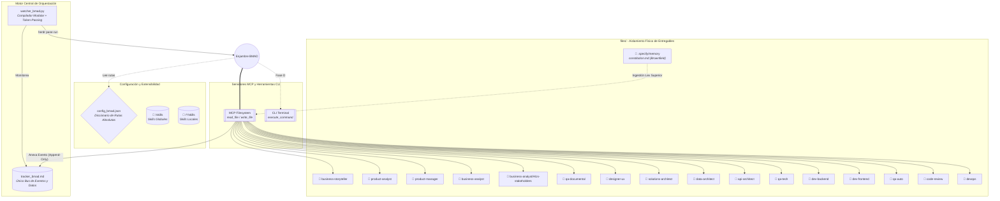
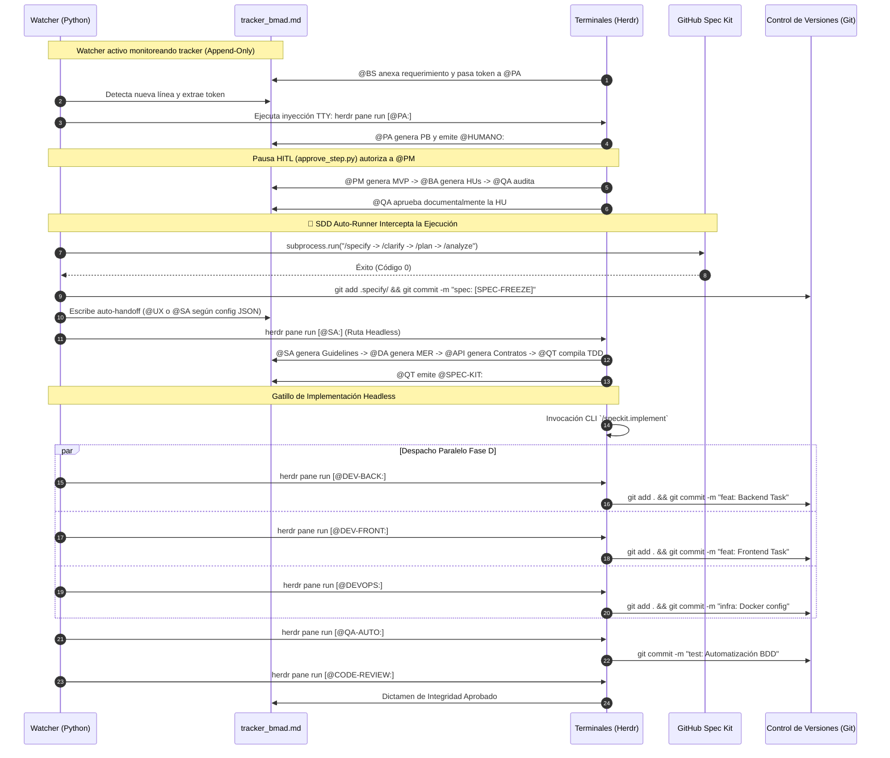

# 🏛️ BMAD Multi-Agent Ecosystem — Arquitectura Técnica Detallada

> **Nota Preliminar:** Para la visión estratégica del ecosistema, el motor Git Headless y la filosofía operativa del SDD Auto-Runner, consulta el documento maestro **[`framework_bmad.md`](./framework_bmad.md)**.
> Este documento se enfoca exclusivamente en la topología de almacenamiento físico, la gestión de estado de los artefactos, los mecanismos de resiliencia del orquestador Python y la especificación del cartucho de Fase D.

---

## 1. Arquitectura de Componentes y Almacenamiento Físico

El ecosistema aísla por completo el motor lógico (orquestador) de la capa de almacenamiento (entregables), garantizando que los agentes operen en entornos *sandboxed* mediante MCP.

```mermaid
flowchart TB
    subgraph Motor_Orquestacion ["Motor Central de Orquestación"]
        W["watcher_bmad.py<br><i>Compilador Modular + Token-Passing</i>"]
        T[("tracker_bmad.md<br><i>Único Bus de Eventos y Datos</i>")]
        W -- "Monitorea" --> T
    end

    subgraph Configuracion ["Configuración y Extensibilidad"]
        JSON{"config_bmad.json<br><i>Diccionario de Rutas Absolutas</i>"}
        SKILLS_G[("📁 /skills<br><i>Skills Globales</i>")]
        SKILLS_L[("📁 /*/skills<br><i>Skills Locales</i>")]
    end

    subgraph Herramientas_MCP ["Servidores MCP y Herramientas CLI"]
        MCP_FS[["MCP Filesystem<br><i>read_file / write_file</i>"]]
        CLI_EXEC[["CLI Terminal<br><i>execute_command</i>"]]
    end

    subgraph Almacenamiento ["files/ - Aislamiento Físico de Entregables"]
        DIR_CTX["📁 .specify/memory<br><i>constitution.md (Brownfield)</i>"]
        DIR_BS["📁 business-storyteller"]
        DIR_PA["📁 product-analyst"]
        DIR_PM["📁 product-manager"]
        DIR_BA["📁 business-analyst"]
        DIR_STK["📁 business-analyst/HUs-stakeholders"]
        DIR_QA["📁 qa-documental"]
        DIR_UX["📁 designer-ux"]
        DIR_SA["📁 solutions-architect"]
        DIR_DA["📁 data-architect"]
        DIR_API["📁 api-architect"]
        DIR_QT["📁 qa-tech"]
        DIR_DEVB["📁 dev-backend"]
        DIR_DEVF["📁 dev-frontend"]
        DIR_QAA["📁 qa-auto"]
        DIR_CR["📁 code-review"]
        DIR_DEVOPS["📁 devops"]
    end

    W -- "herdr pane run" --> Agentes((Enjambre BMAD))
    Agentes -. "Lee rutas" .-> JSON
    Agentes === MCP_FS
    Agentes -. "Fase D" .-> CLI_EXEC
    MCP_FS --> DIR_BS & DIR_PA & DIR_PM & DIR_BA & DIR_STK & DIR_QA & DIR_UX & DIR_SA & DIR_DA & DIR_API & DIR_QT & DIR_DEVB & DIR_DEVF & DIR_QAA & DIR_CR & DIR_DEVOPS
    DIR_CTX -. "Ingestión Lex Superior" .-> MCP_FS
    MCP_FS -- "Anexa Evento (Append-Only)" --> T
```

---

## 2. Roster Oficial de Agentes y Responsabilidades Técnicas

| Agente | Fase | Responsabilidad Principal | Entrada Principal | Entregable Canónico |
|---|:---:|---|---|---|
| `business-storyteller` | Business | Refina ideas crudas e inyecta métricas y actores. | Visión informal | `idea_*.md` |
| `product-analyst` | Business | Transforma la idea en un Product Brief formal (PRD). Activa HITL. | `idea_*.md` | `pb_*.md` |
| `product-manager` | Management | Define el MVP por Ruta Crítica y orquesta delegación de épicas. | `pb_*.md` (Aprobado) | `mvp_*.md` |
| `business-analyst` | Management | Desglosa épicas en HU Técnica (Gherkin puro) y HU para Stakeholders. | `mvp_*.md` / `pb_*.md` | `hu_*.md` / `HUs/hu_*.md` |
| `qa-documental` | Management | Audita trazabilidad BDD. Si aprueba, el orquestador lanza el Auto-Runner. | `hu_*.md` vs `pb_*.md` | `aprobado_qa_*.md` |
| `designer-ux` | UX | Diseña wireframes ASCII mapeados a estados visuales. | `spec.md`, `tasks.md` | `ux_*.md` |
| `solutions-architect` | Architecture | Consolida stack, gobernanza y formaliza ADRs MADR desde `plan.md`. | `plan.md`, `constitution.md` | `tech_guidelines.md` |
| `data-architect` | Architecture | Modela persistencia física (MER, esquemas) mapeado a `spec.md`. | `spec.md`, `tasks.md` | `db_*.md` |
| `api-architect` | Architecture | Diseña contratos REST/GraphQL mapeando endpoints. | `spec.md`, `db_*.md` | `api_*.md` |
| `qa-tech` | Architecture | Auditoría cruzada TDD vs Spec Kit; compila TDD maestro. | `db_*.md`, `api_*.md` | `tech-design_*.md` |
| `dev-backend` | Delivery | Construye backend vía CLI (`execute_command`) y realiza Commits Atómicos. | `tech-design_*.md` | Código fuente backend |
| `dev-frontend` | Delivery | Construye frontend vía CLI (`execute_command`) y realiza Commits Atómicos. | `tech-design_*.md`, `ux_*.md` | Código fuente frontend |
| `qa-auto` | QA | Diseña/ejecuta tests automáticos (`execute_command`) Zero-Tautology. | `hu_*.md`, código | Suites de pruebas |
| `code-review` | SecOps | Quality Gatekeeper final. Audita físicamente el código fuente (OWASP). | Código fuente y tests | Dictamen `[APROBADO]` |
| `devops` | SRE | Aprovisiona contenedores y CI/CD vía CLI (`execute_command`). | `tech-design_*.md` | Dockerfiles, Compose |

---

## 3. Secuencia Asíncrona Técnica (Token-Passing y Herdr)

Este diagrama revela cómo el orquestador inyecta los comandos físicamente en los procesos TTY de la terminal.

```mermaid
sequenceDiagram
    autonumber
    participant W as Watcher (Python)
    participant T as tracker_bmad.md
    participant Herdr as Terminales (Herdr)
    participant S as GitHub Spec Kit
    participant G as Control de Versiones (Git)

    Note over W, T: Watcher activo monitoreando tracker (Append-Only)
    Herdr->>T: @BS anexa requerimiento y pasa token a @PA
    
    W->>T: Detecta nueva línea y extrae token
    W->>Herdr: Ejecuta inyección TTY: herdr pane run [@PA:]
    Herdr->>T: @PA genera PB y emite @HUMANO:
    
    Note over W, Herdr: Pausa HITL (approve_step.py) autoriza a @PM
    Herdr->>T: @PM genera MVP -> @BA genera HUs -> @QA audita
    Herdr->>T: @QA aprueba documentalmente la HU
    
    Note over W, S: 🛑 SDD Auto-Runner Intercepta la Ejecución
    W->>S: subprocess.run("/specify -> /clarify -> /plan -> /analyze")
    S-->>W: Éxito (Código 0)
    W->>G: git add .specify/ && git commit -m "spec: [SPEC-FREEZE]"
    W->>T: Escribe auto-handoff (@UX o @SA según config JSON)
    
    W->>Herdr: herdr pane run [@SA:] (Ruta Headless)
    Herdr->>T: @SA genera Guidelines -> @DA genera MER -> @API genera Contratos -> @QT compila TDD
    Herdr->>T: @QT emite @SPEC-KIT:
    
    Note over W, Herdr: Gatillo de Implementación Headless
    Herdr->>Herdr: Invocación CLI `/speckit.implement`
    
    par Despacho Paralelo Fase D
        W->>Herdr: herdr pane run [@DEV-BACK:]
        Herdr->>G: git add . && git commit -m "feat: Backend Task"
    and
        W->>Herdr: herdr pane run [@DEV-FRONT:]
        Herdr->>G: git add . && git commit -m "feat: Frontend Task"
    and
        W->>Herdr: herdr pane run [@DEVOPS:]
        Herdr->>G: git add . && git commit -m "infra: Docker config"
    end

    W->>Herdr: herdr pane run [@QA-AUTO:]
    Herdr->>G: git commit -m "test: Automatización BDD"
    W->>Herdr: herdr pane run [@CODE-REVIEW:]
    Herdr->>T: Dictamen de Integridad Aprobado
```

---

## 4. Gestión de Estado y Fuentes de Verdad

BMAD no utiliza bases de datos para su estado; el sistema de archivos local es la única fuente de la verdad (*Event Sourcing*).

| Artefacto / Dominio | Ubicación Física | Productor | Consumidor(es) Principal(es) |
|---|---|---|---|
| Rutas Absolutas | `config_bmad.json` | `init_bmad.py` | Todos vía `read_file` |
| Contexto Invariante | `.specify/memory/constitution.md` | Operador / `@QT` | Arquitectos (Lex Superior) |
| Bus de Handoffs | `files/tracker_bmad.md` | Todos | `watcher_bmad.py` y agentes |
| Product Briefs (PRD) | `files/product-analyst/pb_*.md` | `@PA` | `@PM`, `@BA`, `@QA`, `@SA` |
| Planes MVP | `files/product-manager/mvp_*.md` | `@PM` | `@BA`, `@UX`, `@SA` |
| HUs Técnicas BDD | `files/business-analyst/hu_*.md` | `@BA` | Spec Kit, `@QA`, `@QA-AUTO` |
| Certificados QA | `files/qa-documental/qa_*.md` | `@QA` | Orquestador Python |
| Wireframes | `files/designer-ux/ux_*.md` | `@UX` | `@DEV-FRONT`, `@SA` |
| Gobernanza Técnica | `files/solutions-architect/tech_guidelines.md` | `@SA` | `@DA`, `@API`, `@QT`, Developers |
| Diseño de Datos (MER) | `files/data-architect/db_*.md` | `@DA` | `@API`, `@QT`, `@DEV-BACK` |
| Contratos REST/GraphQL | `files/api-architect/api_*.md` | `@API` | `@QT`, Developers |
| TDD Maestro | `files/qa-tech/tech-design_*.md` | `@QT` | Developers, `@DEVOPS` |
| Código Fuente & Tests | Repositorio Raíz (Git) | Fase D | `@CODE-REVIEW`, CI/CD |

---

## 5. Control de Repositorio (GitOps) y Product State Ledger

BMAD controla las transiciones del repositorio de código mediante un paradigma estricto de GitOps orquestado por macros.

### Product State Ledger (`specs/README.md`)
El estado macroscópico del producto (qué está en construcción, qué está listo para desarrollo, qué está en producción) se gobierna a través de un archivo de estado tabular inmutable llamado `Ledger`. Los agentes consultan obligatoriamente el Ledger para evitar solapamientos y lo mutan (`update-specs-map`) de `IN-PROGRESS` a `READY-FOR-DEV` conforme avanzan las aprobaciones.

### Feature Branching Transaccional
El ecosistema aísla por defecto todo el trabajo de Fase de Diseño de nuevas Historias de Usuario (HU).
- **Creación Transaccional:** El PM inyecta la macro `@WATCHER: GITOPS-BRANCH-CREATE feat/HU_[nombre]` en el tracker, lo que hace que el Watcher síncronamente audite el directorio (`git status --porcelain`), aplique *commits* preventivos y salte a la rama aislada.
- **Fusión (Auto-Merge) Segura:** Cuando el QT aprueba el diseño técnico y el Ledger, inyecta `@WATCHER: GITOPS-MERGE-CLOSE feat/HU_[nombre]`. El Watcher ejecuta un `git merge --no-ff`.
- **Degradación ante Conflictos:** Si el `git merge` falla por conflictos, el Watcher emite un `git merge --abort`, retorna a la rama *feat* y detiene la máquina enviando un token `@HUMANO:` al tracker con un Procedimiento Operativo Estándar. El sistema asume una "Amnesia Estratégica"; es decir, la resolución es de jurisdicción estrictamente humana, y tras completar el merge manualmente en la terminal, el usuario solo debe reiniciar el Watcher sin manipular el historial del tracker.
- **State Hydration:** En caso de reinicio de la terminal, el Watcher recorre históricamente el tracker, identifica macros de apertura huérfanas y reanuda el estado de Git en la rama correcta automáticamente.

---

## 6. Invariantes y Mecanismos de Resiliencia del Motor

1. **El Tracker como Event Sourcing Inmutable:** La comunicación fluye exclusivamente mediante adición (*Append-Only*) en `tracker_bmad.md`. Se penaliza la sobrescritura.
2. **Backpressure en Watcher:** El orquestador sondea el estado de cada panel TTY en Herdr. Si el agente está ocupado (`working`), la tarea se retiene en memoria evitando colisiones.
3. **Recuperación tras Reinicio (Crash Recovery):** Si el servidor se apaga, al reiniciar los agentes reconstruyen su contexto leyendo los entregables previos (ej. el PM lee el `mvp_*.md` para saber qué épica seguía).
4. **Inyección Dinámica de Skills:** Mediante la sintaxis `[IMPORT_SKILL: skills/ruta/SKILL.md]`, el orquestador auto-ensambla los perfiles de los agentes en tiempo de ejecución, permitiendo actualizaciones globales de comportamiento (ej. reglas de Git) sin duplicar prompts.

---

## 6. Arquitectura de Cartucho Intercambiable (Pluggable Phase D)

El framework BMAD implementa el principio de **Desacoplamiento Tecnológico Total**:

1. **Inmutabilidad del Core (Fases B, M, A):** Los requisitos, wireframes, diseños relacionales y contratos son especificaciones universales, puras y agnósticas.
2. **La Fase D como Cartucho:** La construcción y testing (`dev-backend`, `dev-frontend`, `qa-auto`, `code-review`, `devops`) funciona como un hardware *Plug & Play*.
3. **Mecanismo de Reemplazo Físico:** Para cambiar de stack (por ejemplo, de *.NET/Angular* a *Python/React*), **el orquestador Python jamás se modifica**. El intercambio se hace:
   - Editando `.specify/memory/constitution.md` (declarando el nuevo stack).
   - Reemplazando las subcarpetas de los agentes de Fase D con instrucciones específicas para el nuevo lenguaje.
4. **Enrutamiento Ciego:** El motor Python despacha el flujo basándose exclusivamente en tokens abstractos (`@DEV-BACK:`). El enrutador ignora el lenguaje de destino, garantizando estabilidad infinita.

---

## 🛑 Regla de Oro: Principio de Vertical Slicing Estricto

El ecosistema BMAD v2.0 opera bajo un modelo de **Vertical Slicing Estricto** para garantizar la salud del State Ledger y evitar divergencias arquitectónicas.

*   **Prohibición de Desarrollo Horizontal:** Queda estrictamente prohibido abrir o diseñar múltiples Historias de Usuario (HUs) a la vez. No se puede avanzar al diseño de una nueva característica si la anterior no ha cerrado su ciclo.
*   **Ciclo de Vida de Rebanada Vertical:** Toda HU debe atravesar el ciclo completo antes de iniciar la siguiente: `PM -> BA -> QA -> UX -> SA -> (Fases Técnicas) -> QT -> Retorno a PM`.
*   **Regla de Ramas GitOps:** Queda terminantemente prohibido que el `@PM` inicie una nueva historia y emita un `GITOPS-BRANCH-CREATE` si la historia anterior no ha sido debidamente compilada y fusionada en el código base principal por el `@QT` mediante `GITOPS-MERGE-CLOSE`.
