# Arquitectura del framework BMAD

BMAD es un motor Python que orquesta agentes de IA por roles sobre workspaces de proyecto
aislados. El motor (`ENGINE_ROOT`) se instala una vez y aporta runtime, perfiles, skills,
plantillas y dashboard. Cada proyecto (`WORKSPACE_ROOT`) conserva su identidad, configuración,
entregables, código, especificaciones, tracker y estado. El framework no impone el stack de
la aplicación: cada workspace lo define o lo descubre en su propia constitución técnica.

Este documento describe la arquitectura implementada. Instalación y configuración están en
[SETUP.md](SETUP.md); operación diaria en [GUIDE.md](GUIDE.md); el contrato por módulo
(funciones, consumidores y efectos) en [bmad_runtime/README.md](bmad_runtime/README.md).

## 1. Contexto del sistema

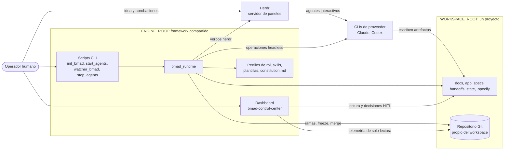
```mermaid
flowchart LR
    OP(["Operador humano"])
    subgraph Motor["ENGINE_ROOT: framework compartido"]
        CLI["Scripts CLI<br/>init_bmad, start_agents,<br/>watcher_bmad, stop_agents"]
        RT["bmad_runtime"]
        DB["Dashboard<br/>bmad-control-center"]
        RES["Perfiles de rol, skills,<br/>plantillas, constitution.md"]
    end
    HERDR["Herdr<br/>servidor de paneles"]
    PROV["CLIs de proveedor<br/>Claude, Codex"]
    subgraph WS["WORKSPACE_ROOT: un proyecto"]
        FILES["docs, app, specs,<br/>handoffs, state, .specify"]
        GIT[("Repositorio Git<br/>propio del workspace")]
    end
    OP --> CLI
    OP --> DB
    OP -->|"idea y aprobaciones"| HERDR
    CLI --> RT
    RT --> RES
    RT -->|"verbos herdr"| HERDR
    HERDR -->|"agentes interactivos"| PROV
    RT -->|"operaciones headless"| PROV
    PROV -->|"escriben artefactos"| FILES
    RT --> FILES
    RT -->|"ramas, freeze, merge"| GIT
    DB -->|"lectura y decisiones HITL"| FILES
    DB -->|"telemetría de solo lectura"| GIT
```

- El operador entrega la idea en el panel de Business Storyteller y atiende las compuertas
  humanas desde CLI (`utils/approve_step.py`, `utils/response_sa.py`) o el dashboard.
- Gemini está registrado en el adaptador, pero no construye comandos ejecutables.
- El motor no instala Herdr ni los CLIs de proveedor; los invoca como procesos externos.

## 2. Componentes

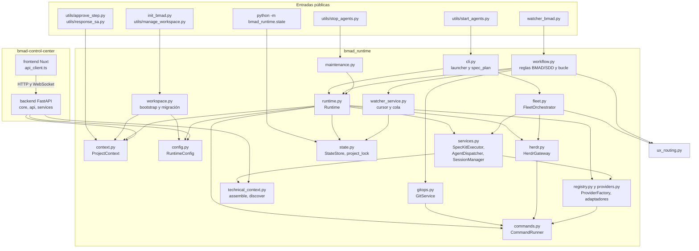
```mermaid
flowchart TB
    subgraph Entradas["Entradas públicas"]
        INIT["init_bmad.py<br/>utils/manage_workspace.py"]
        START["utils/start_agents.py"]
        WATCH["watcher_bmad.py"]
        STOP["utils/stop_agents.py"]
        HUMAN["utils/approve_step.py<br/>utils/response_sa.py"]
        STATECLI["python -m bmad_runtime.state"]
    end
    subgraph Nucleo["bmad_runtime"]
        CTX["context.py<br/>ProjectContext"]
        WSP["workspace.py<br/>bootstrap y migración"]
        CFG["config.py<br/>RuntimeConfig"]
        REG["registry.py y providers.py<br/>ProviderFactory, adaptadores"]
        RUN["runtime.py<br/>Runtime"]
        CMD["commands.py<br/>CommandRunner"]
        CLIPY["cli.py<br/>launcher y spec_plan"]
        FLEET["fleet.py<br/>FleetOrchestrator"]
        HG["herdr.py<br/>HerdrGateway"]
        SVC["services.py<br/>SpecKitExecutor,<br/>AgentDispatcher, SessionManager"]
        TC["technical_context.py<br/>assemble, discover"]
        ST["state.py<br/>StateStore, project_lock"]
        WSV["watcher_service.py<br/>cursor y cola"]
        WF["workflow.py<br/>reglas BMAD/SDD y bucle"]
        GO["gitops.py<br/>GitService"]
        MNT["maintenance.py"]
    end
    UXR["ux_routing.py"]
    subgraph Dash["bmad-control-center"]
        API["backend FastAPI<br/>core, api, services"]
        UI["frontend Nuxt<br/>api_client.ts"]
    end
    INIT --> WSP
    START --> CLIPY --> FLEET
    WATCH --> WF
    STOP --> MNT
    HUMAN --> CTX
    STATECLI --> ST
    WSP --> CTX
    WSP --> CFG
    RUN --> CTX
    RUN --> CFG
    RUN --> REG
    RUN --> CMD
    RUN --> HG
    RUN --> ST
    RUN --> SVC
    CLIPY --> RUN
    WF --> RUN
    MNT --> RUN
    FLEET --> SVC
    FLEET --> HG
    FLEET --> UXR
    SVC --> TC
    SVC --> REG
    WF --> WSV --> ST
    WF --> GO --> CMD
    WF --> UXR
    HG --> CMD
    REG --> CMD
    UI -->|"HTTP y WebSocket"| API
    API --> CTX
    API --> CFG
    API --> TC
```

| Componente | Módulos | Responsabilidad |
|---|---|---|
| Identidad y perímetro | `context.py` | Selección por CLI, entorno o registro; `output()` rechaza escapes, enlaces y rutas ambiguas; nombres de sesión `ID-hash-rol`; contrato de rutas para agentes |
| Bootstrap | `workspace.py`, `technical_context.initialize_constitution` | Scaffolding aditivo, constitución local neutral y migración legacy explícita |
| Configuración | `config.py` | Fusión global + `project.json`; resolución `defaults → fase → agente u operación` |
| Proveedores | `registry.py`, `providers.py` | Adaptadores Claude/Codex/Gemini, traducción de effort, verificación de flags y skills |
| Ejecución de procesos | `commands.py` | argv sin shell, timeout, límite de salida y de concurrencia por runner |
| Composición | `runtime.py` | Construye config, fábrica, runner, gateway, estado y servicios de un contexto |
| Flota interactiva | `cli.py`, `fleet.py`, `herdr.py` | 3 tabs y 13 paneles (12 sin UX); propiedad registrada en SQLite |
| Servicios | `services.py` | Spec Kit headless, despacho a paneles propios, rotación de contexto (deshabilitada) |
| Contexto técnico | `technical_context.py` | Índice por rol/operación, descubrimiento acotado del stack y ensamblado del prompt |
| Estado | `state.py`, `watcher_service.py` | Registros JSON en SQLite, claims idempotentes, locks de SO, cursor y cola del tracker |
| Flujo BMAD/SDD | `workflow.py`, `ux_routing.py`, `gitops.py` | Interpretación del tracker, compuertas, fases SDD, retrabajo y macros GitOps |
| Parada | `maintenance.py` | Cierre de tabs propios en estado idle/done |
| Dashboard | `bmad-control-center/` | Proyección de un workspace por proceso API: tracker, artefactos, gates, Git y eventos |

`watcher_bmad.py` reexporta `workflow` mediante `sys.modules`, por compatibilidad de imports.
El dashboard no consulta Herdr ni SQLite: lee el tracker, los archivos del perímetro y Git.

## 3. Estructura lógica de carpetas

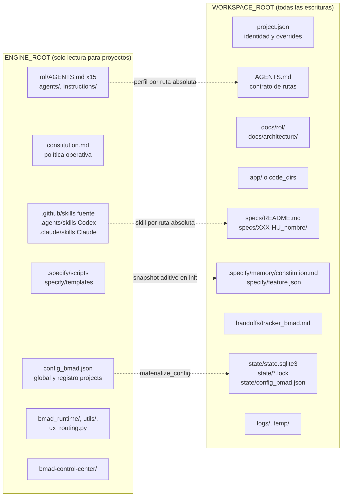
```mermaid
flowchart LR
    subgraph E["ENGINE_ROOT (solo lectura para proyectos)"]
        E1["config_bmad.json<br/>global y registro projects"]
        E2["constitution.md<br/>política operativa"]
        E3["rol/AGENTS.md x15<br/>agents/, instructions/"]
        E4[".github/skills fuente<br/>.agents/skills Codex<br/>.claude/skills Claude"]
        E5[".specify/scripts<br/>.specify/templates"]
        E6["bmad_runtime/, utils/,<br/>ux_routing.py"]
        E7["bmad-control-center/"]
    end
    subgraph W["WORKSPACE_ROOT (todas las escrituras)"]
        W1["project.json<br/>identidad y overrides"]
        W2["AGENTS.md<br/>contrato de rutas"]
        W3["docs/rol/<br/>docs/architecture/"]
        W4["app/ o code_dirs"]
        W5["specs/README.md<br/>specs/XXX-HU_nombre/"]
        W6[".specify/memory/constitution.md<br/>.specify/feature.json"]
        W7["handoffs/tracker_bmad.md"]
        W8["state/state.sqlite3<br/>state/*.lock<br/>state/config_bmad.json"]
        W9["logs/, temp/"]
    end
    E3 -.->|"perfil por ruta absoluta"| W2
    E4 -.->|"skill por ruta absoluta"| W5
    E5 -.->|"snapshot aditivo en init"| W6
    E1 -.->|"materialize_config"| W8
```

- Perfiles y skills se leen del motor por ruta absoluta; no se copian al workspace.
- `ProjectContext.validate()` rechaza un workspace igual al motor, que lo contenga o que se
  superponga con sus directorios compartidos.
- `state/config_bmad.json` es una vista generada; los orígenes editables son
  `config_bmad.json` del motor y `project.json`.
- En modo legacy (configuración sin registro `projects`) el tracker vive en `docs/` y el
  estado en `.bmad-runtime/`. El template incluye el registro, así que siempre exige selección.

## 4. Flujo de datos y persistencia

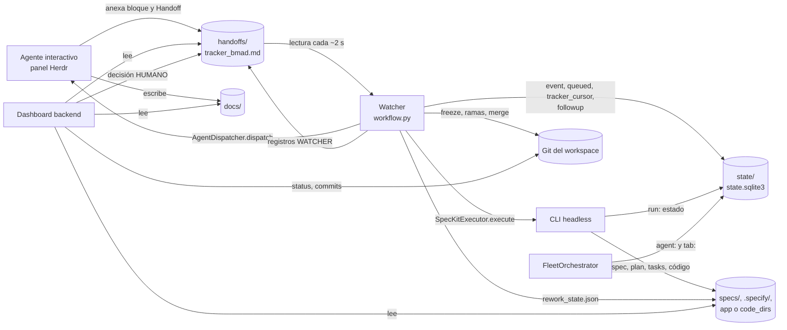
```mermaid
flowchart LR
    AG["Agente interactivo<br/>panel Herdr"] -->|"anexa bloque y Handoff"| TR[("handoffs/<br/>tracker_bmad.md")]
    AG -->|"escribe"| DOC[("docs/")]
    TR -->|"lectura cada ~2 s"| WT["Watcher<br/>workflow.py"]
    WT -->|"event, queued, tracker_cursor,<br/>followup"| SQL[("state/<br/>state.sqlite3")]
    WT -->|"AgentDispatcher.dispatch"| AG
    WT -->|"SpecKitExecutor.execute"| HL["CLI headless"]
    HL -->|"spec, plan, tasks, código"| SP[("specs/, .specify/,<br/>app o code_dirs")]
    HL -->|"run: estado"| SQL
    WT -->|"registros WATCHER"| TR
    WT -->|"freeze, ramas, merge"| GIT[("Git del workspace")]
    WT -->|"rework_state.json"| SP
    FL["FleetOrchestrator"] -->|"agent: y tab:"| SQL
    DASH["Dashboard backend"] -->|"lee"| TR
    DASH -->|"lee"| DOC
    DASH -->|"lee"| SP
    DASH -->|"decisión HUMANO"| TR
    DASH -->|"status, commits"| GIT
```

| Almacén | Contenido | Escritor |
|---|---|---|
| `handoffs/tracker_bmad.md` | Bus de handoffs: bloques `### [fecha] Autor` con artefacto, estado y línea `Handoff` | Agentes, watcher, scripts humanos, dashboard |
| `state/state.sqlite3`, tabla `records(id, data)` | `agent:`, `tab:`, `run:`, `dispatch:`, `event:`, `queued:`, `tracker_cursor`, `followup` | Flota, servicios, watcher, parada |
| `state/*.lock` | Locks de SO `bootstrap`, `fleet`, `watcher`, `speckit` | `project_lock()` |
| `.specify/memory/` | Constitución local, `rework_state.json`, `rework_last_classification.md` | Spec Kit, QT, watcher |
| `docs/`, `specs/`, `app/` | Entregables por rol, especificaciones y código | Agentes y CLIs headless |

SQLite guarda metadatos, no prompts ni credenciales. La cola persiste la referencia (línea,
hash y offsets) a la instrucción del tracker; al reanudar no se vuelve a extraer la línea, para
no repetir macros Git o fases SDD.

## 5. Ciclo de vida de un proyecto

El runtime no persiste un estado global del proyecto; el ciclo se deduce de artefactos,
registros y procesos en ejecución.

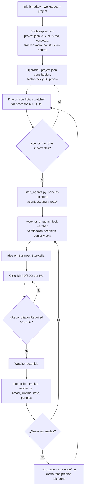
```mermaid
flowchart TD
    A["init_bmad.py --workspace --project"] --> B["Bootstrap aditivo:<br/>project.json, AGENTS.md, carpetas,<br/>tracker vacío, constitución neutral"]
    B --> C["Operador: project.json, constitución,<br/>tech-stack y Git propio"]
    C --> D["Dry-runs de flota y watcher<br/>sin procesos ni SQLite"]
    D --> E{"¿pending o rutas incorrectas?"}
    E -->|"Sí"| C
    E -->|"No"| F["start_agents.py: paneles en Herdr<br/>agent: starting a ready"]
    F --> G["watcher_bmad.py: lock watcher,<br/>verificación headless, cursor y cola"]
    G --> H["Idea en Business Storyteller"]
    H --> I["Ciclo BMAD/SDD por HU"]
    I --> J{"¿ReconciliationRequired<br/>o Ctrl+C?"}
    J -->|"No"| I
    J -->|"Sí"| K["Watcher detenido"]
    K --> L["Inspección: tracker, artefactos,<br/>bmad_runtime.state, paneles"]
    L --> M{"¿Sesiones válidas?"}
    M -->|"Sí"| G
    M -->|"No"| N["stop_agents.py --confirm<br/>cierra tabs propios idle/done"]
    N --> D
```

## 6. Flujo BMAD + SDD

BMAD reparte el trabajo en 15 roles y cuatro fases (B negocio, M gestión, A arquitectura,
D desarrollo, según `AGENT_PHASES`). SDD mantiene `spec.md`, `plan.md` y `tasks.md` por HU
mediante siete operaciones Spec Kit (`specify`, `clarify`, `plan`, `tasks`, `analyze`,
`converge`, `implement`) que el watcher ejecuta en modo headless.

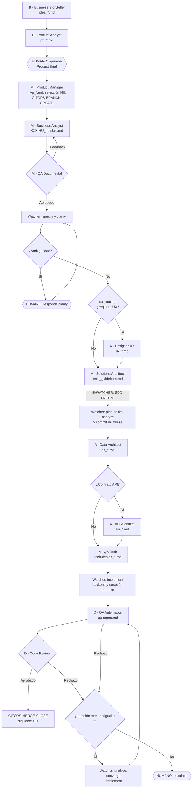
```mermaid
flowchart TD
    BS["B · Business Storyteller<br/>idea_*.md"] --> PA["B · Product Analyst<br/>pb_*.md"]
    PA --> H1{{"HUMANO: aprueba<br/>Product Brief"}}
    H1 --> PM["M · Product Manager<br/>mvp_*.md, selección HU,<br/>GITOPS-BRANCH-CREATE"]
    PM --> BA["M · Business Analyst<br/>XXX-HU_nombre.md"]
    BA --> QA{"M · QA Documental"}
    QA -->|"Feedback"| BA
    QA -->|"Aprobado"| SC["Watcher: specify y clarify"]
    SC --> H2{"¿Ambigüedad?"}
    H2 -->|"Sí"| H3{{"HUMANO: responde clarify"}}
    H3 --> SC
    H2 -->|"No"| UXD{"ux_routing:<br/>¿requiere UX?"}
    UXD -->|"Sí"| UX["A · Designer UX<br/>ux_*.md"]
    UXD -->|"No"| SA["A · Solutions Architect<br/>tech_guidelines.md"]
    UX --> SA
    SA -->|"@WATCHER: SDD-FREEZE"| FZ["Watcher: plan, tasks, analyze<br/>y commit de freeze"]
    FZ --> DA["A · Data Architect<br/>db_*.md"]
    DA --> API{"¿Contrato API?"}
    API -->|"Sí"| AA["A · API Architect<br/>api_*.md"]
    API -->|"No"| QT["A · QA Tech<br/>tech-design_*.md"]
    AA --> QT
    QT --> IMP["Watcher: implement<br/>backend y después frontend"]
    IMP --> QAA["D · QA Automation<br/>qa-report.md"]
    QAA --> CR{"D · Code Review"}
    CR -->|"Aprobado"| CL["GITOPS-MERGE-CLOSE<br/>siguiente HU"]
    CR -->|"Rechazo"| RW{"¿Iteración menor o igual a 2?"}
    QAA -->|"Rechazo"| RW
    RW -->|"Sí"| RE["Watcher: analyze, converge,<br/>implement"]
    RE --> QAA
    RW -->|"No"| H4{{"HUMANO: escalado"}}
```

Reglas de gobierno implementadas o exigidas por perfiles y watcher:

- **Vertical slicing:** una HU recorre el flujo completo antes de abrir la siguiente.
- **Identificador universal:** `XXX-HU_nombre_en_snake_case` se conserva en HU, carpeta
  `specs/XXX-HU_nombre/`, rama `feat/XXX-HU_nombre` y handoffs. El watcher fija
  `SPECIFY_FEATURE_DIRECTORY` y verifica `.specify/feature.json`; una divergencia detiene la fase.
- **Ledger:** `specs/README.md` con columnas `N° | Épica Origen | Nombre spec / HU | Qué aporta | Estado | Rama`.
- **UX:** `project_type=headless` o `ux_phase=off` omiten UX; `on` lo fuerza; `auto` lee
  `Requiere interfaz: Sí|No` en la HU y, si falta, diseña.
- **Implementación:** backend y frontend no tienen panel; Spec Kit `implement` monta sus perfiles
  como directiva y exige actualizar `docs/dev-backend/backend-architecture.md`,
  `docs/dev-frontend/frontend-architecture.md` y los README de cada `code_dirs`.
- **Retrabajo:** un rechazo de QA Automation o Code Review activa `analyze → converge → implement`
  sobre las tareas de corrección; tras dos iteraciones se escala al humano.
- **Cambio de stack:** no existe catálogo de stacks ni comando de sustitución. Se ajustan
  constitución local, guías y tareas del workspace.

## 7. Estados implementados

### Registro de agentes de la flota (`agent:<rol>`)

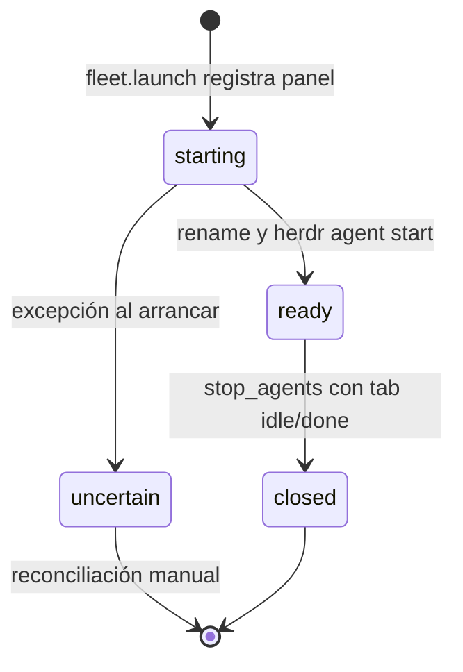
```mermaid
stateDiagram-v2
    [*] --> starting: fleet.launch registra panel
    starting --> ready: rename y herdr agent start
    starting --> uncertain: excepción al arrancar
    ready --> closed: stop_agents con tab idle/done
    uncertain --> [*]: reconciliación manual
    closed --> [*]
```

`AgentDispatcher` solo despacha a registros `ready` cuyo panel, proveedor y modelo coinciden con
la selección vigente y cuyo `agent_status` en Herdr es `idle` o `done`.

### Operaciones idempotentes (`event:`, `dispatch:`, `run:`, `queued:`)

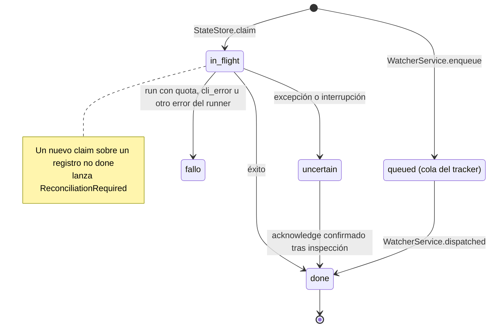
```mermaid
stateDiagram-v2
    [*] --> in_flight: StateStore.claim
    in_flight --> done: éxito
    in_flight --> uncertain: excepción o interrupción
    in_flight --> fallo: run con quota, cli_error u otro error del runner
    uncertain --> done: acknowledge confirmado tras inspección
    done --> [*]
    note right of in_flight
        Un nuevo claim sobre un registro no done
        lanza ReconciliationRequired
    end note
    state "queued (cola del tracker)" as queued
    [*] --> queued: WatcherService.enqueue
    queued --> done: WatcherService.dispatched
```

`fallo` agrupa los valores de `provider.classify()` y del runner (`quota`, `cli_error`,
`cli_missing`, `native_executable_required`, `process_limit`, `spawn_failed`, entre otros).
No hay reintento automático: el workflow registra el error en el tracker y se detiene o pausa.

### Watcher

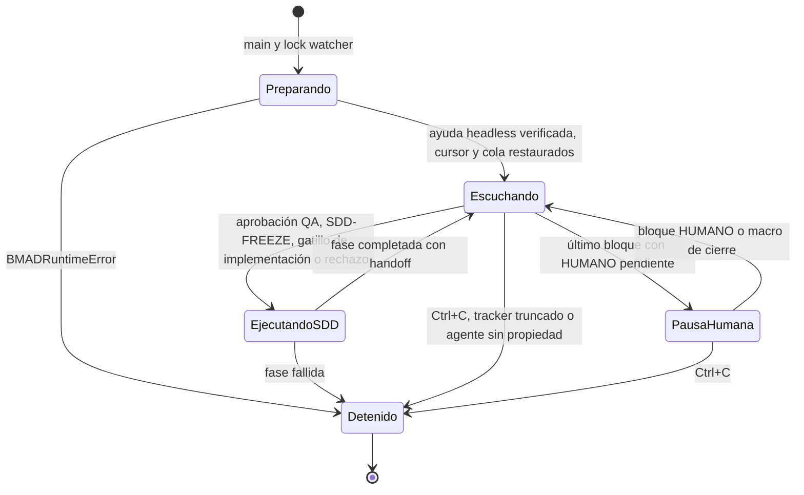
```mermaid
stateDiagram-v2
    [*] --> Preparando: main y lock watcher
    Preparando --> Escuchando: ayuda headless verificada, cursor y cola restaurados
    Preparando --> Detenido: BMADRuntimeError
    Escuchando --> PausaHumana: último bloque con HUMANO pendiente
    PausaHumana --> Escuchando: bloque HUMANO o macro de cierre
    Escuchando --> EjecutandoSDD: aprobación QA, SDD-FREEZE, gatillo de implementación o rechazo
    EjecutandoSDD --> Escuchando: fase completada con handoff
    EjecutandoSDD --> Detenido: fase fallida
    Escuchando --> Detenido: Ctrl+C, tracker truncado o agente sin propiedad
    PausaHumana --> Detenido: Ctrl+C
    Detenido --> [*]
```

La pausa humana no se persiste: `is_tracker_paused_for_human()` la recalcula leyendo el último
bloque con handoff. Una detención por `ReconciliationRequired` sale con código 1 y exige
inspección antes de reanudar.

## 8. Secuencias

### Inicio de proyecto, agentes y persistencia

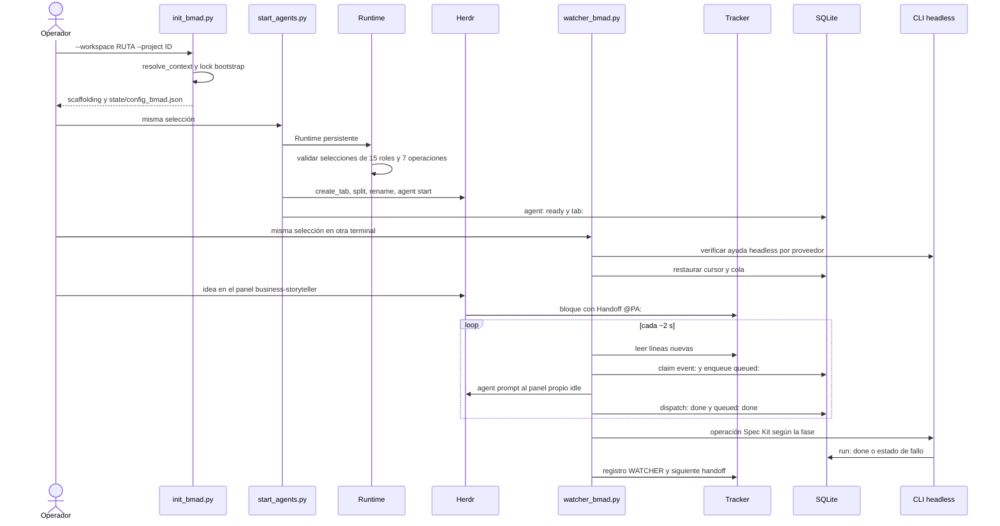
```mermaid
sequenceDiagram
    actor OP as Operador
    participant I as init_bmad.py
    participant L as start_agents.py
    participant RT as Runtime
    participant H as Herdr
    participant W as watcher_bmad.py
    participant T as Tracker
    participant S as SQLite
    participant SK as CLI headless
    OP->>I: --workspace RUTA --project ID
    I->>I: resolve_context y lock bootstrap
    I-->>OP: scaffolding y state/config_bmad.json
    OP->>L: misma selección
    L->>RT: Runtime persistente
    RT->>RT: validar selecciones de 15 roles y 7 operaciones
    L->>H: create_tab, split, rename, agent start
    L->>S: agent: ready y tab:
    OP->>W: misma selección en otra terminal
    W->>SK: verificar ayuda headless por proveedor
    W->>S: restaurar cursor y cola
    OP->>H: idea en el panel business-storyteller
    H->>T: bloque con Handoff @PA:
    loop cada ~2 s
        W->>T: leer líneas nuevas
        W->>S: claim event: y enqueue queued:
        W->>H: agent prompt al panel propio idle
        W->>S: dispatch: done y queued: done
    end
    W->>SK: operación Spec Kit según la fase
    SK->>S: run: done o estado de fallo
    W->>T: registro WATCHER y siguiente handoff
```

### Handoff entre agentes con aprobación humana

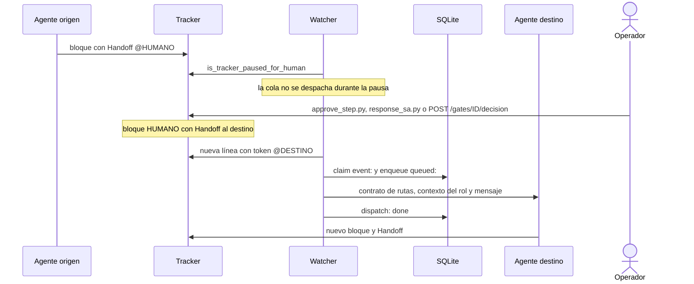
```mermaid
sequenceDiagram
    participant A as Agente origen
    participant T as Tracker
    participant W as Watcher
    participant S as SQLite
    participant B as Agente destino
    actor OP as Operador
    A->>T: bloque con Handoff @HUMANO
    W->>T: is_tracker_paused_for_human
    Note over W: la cola no se despacha durante la pausa
    OP->>T: approve_step.py, response_sa.py o POST /gates/ID/decision
    Note over T: bloque HUMANO con Handoff al destino
    W->>T: nueva línea con token @DESTINO
    W->>S: claim event: y enqueue queued:
    W->>B: contrato de rutas, contexto del rol y mensaje
    W->>S: dispatch: done
    B->>T: nuevo bloque y Handoff
```

Un único token de destinatario por derivación. En un handoff al humano, los demás agentes se
nombran sin `@TOKEN:` para no disparar despachos. Las macros `@WATCHER: GITOPS-BRANCH-CREATE`,
`@WATCHER: SDD-FREEZE` y `@WATCHER: GITOPS-MERGE-CLOSE` van en líneas independientes antes del
handoff. El cierre de rama pide además escribir el nombre de la rama en la consola del watcher.

### Consulta del dashboard

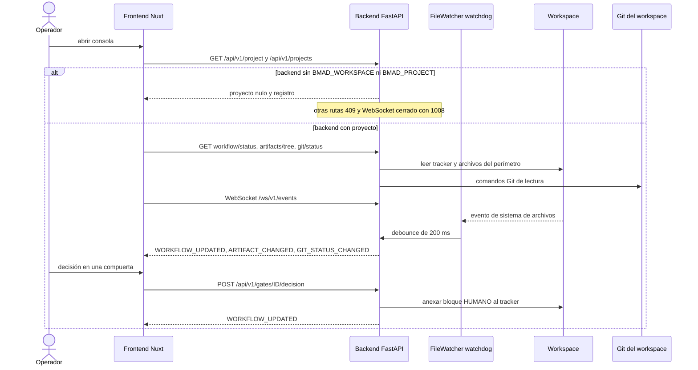
```mermaid
sequenceDiagram
    actor OP as Operador
    participant UI as Frontend Nuxt
    participant API as Backend FastAPI
    participant FW as FileWatcher watchdog
    participant FS as Workspace
    participant G as Git del workspace
    OP->>UI: abrir consola
    UI->>API: GET /api/v1/project y /api/v1/projects
    alt backend sin BMAD_WORKSPACE ni BMAD_PROJECT
        API-->>UI: proyecto nulo y registro
        Note over API: otras rutas 409 y WebSocket cerrado con 1008
    else backend con proyecto
        UI->>API: GET workflow/status, artifacts/tree, git/status
        API->>FS: leer tracker y archivos del perímetro
        API->>G: comandos Git de lectura
        UI->>API: WebSocket /ws/v1/events
        FS-->>FW: evento de sistema de archivos
        FW->>API: debounce de 200 ms
        API-->>UI: WORKFLOW_UPDATED, ARTIFACT_CHANGED, GIT_STATUS_CHANGED
        OP->>UI: decisión en una compuerta
        UI->>API: POST /api/v1/gates/ID/decision
        API->>FS: anexar bloque HUMANO al tracker
        API-->>UI: WORKFLOW_UPDATED
    end
```

El backend observa `docs`, `specs`, `.specify`, `handoffs` y `.git` con watchdog. El
frontend usa REST para la carga inicial y el WebSocket para actualizaciones; el latido
PING/PONG mantiene la conexión. Las decisiones del dashboard llegan al watcher solo a través
del tracker.

### Resolución de contexto

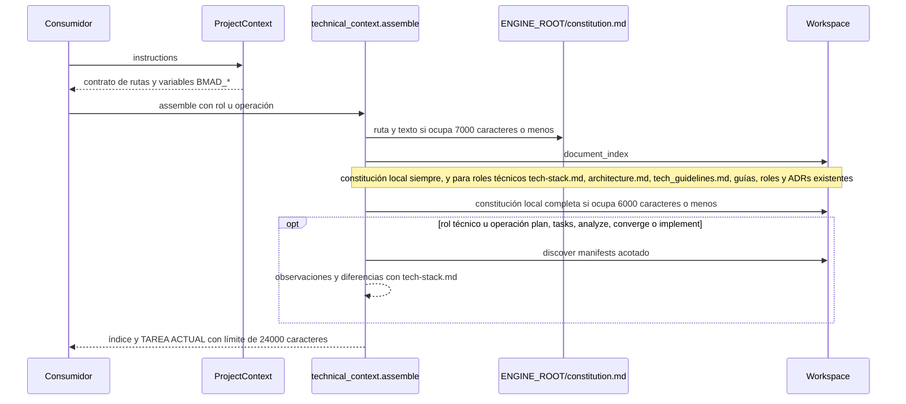
```mermaid
sequenceDiagram
    participant C as Consumidor
    participant CTX as ProjectContext
    participant TC as technical_context.assemble
    participant P as ENGINE_ROOT/constitution.md
    participant WS as Workspace
    C->>CTX: instructions
    CTX-->>C: contrato de rutas y variables BMAD_*
    C->>TC: assemble con rol u operación
    TC->>P: ruta y texto si ocupa 7000 caracteres o menos
    TC->>WS: document_index
    Note over TC,WS: constitución local siempre, y para roles técnicos tech-stack.md, architecture.md, tech_guidelines.md, guías, roles y ADRs existentes
    TC->>WS: constitución local completa si ocupa 6000 caracteres o menos
    opt rol técnico u operación plan, tasks, analyze, converge o implement
        TC->>WS: discover manifests acotado
        TC-->>TC: observaciones y diferencias con tech-stack.md
    end
    TC-->>C: índice y TAREA ACTUAL con límite de 24000 caracteres
```

| Consumidor | Composición del prompt |
|---|---|
| Arranque del panel (`interactive_command`) | contrato de rutas + `assemble(role, compact=True)`: solo rutas de política y documentos, hasta 8 observaciones |
| Despacho (`AgentDispatcher.dispatch`) | contrato + `assemble(role)` completo + mensaje del tracker |
| Spec Kit (`SpecKitExecutor.prepare`) | `assemble(operation)` + contrato + ruta absoluta de la skill `speckit-<operación>` + argumentos |

El encabezado fija la precedencia: política operativa del motor para aislamiento y seguridad;
constitución local para restricciones técnicas; ADR aprobado para decisiones particulares. Una
propuesta, un plan o una dependencia observada no equivalen a aprobación. Las guías largas se
enlazan para lectura bajo demanda. `discover()` no ejecuta scripts, omite secretos, enlaces y
workspaces anidados, y limita a 512 000 bytes por archivo, 2 000 directorios y 300 observaciones.

## 9. Orquestación

Un proceso watcher fija sus rutas globales al workspace con `configure_project()`; no cambia de
proyecto en caliente. Cada proyecto necesita su propio launcher, watcher y backend de dashboard.

### Ejemplo 1: un proyecto activo

Nombres ficticios: proyecto `agenda-citas`, workspace `D:\Proyectos\Agenda`.

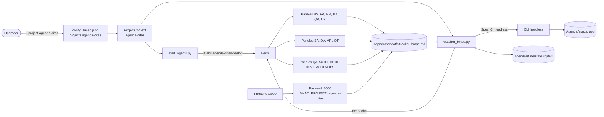
```mermaid
flowchart LR
    OP(["Operador"]) -->|"--project agenda-citas"| REG["config_bmad.json<br/>projects.agenda-citas"]
    REG --> CTX["ProjectContext<br/>agenda-citas"]
    CTX --> L["start_agents.py"]
    CTX --> W["watcher_bmad.py"]
    L -->|"3 tabs agenda-citas-hash-*"| H["Herdr"]
    H --> P1["Paneles BS, PA, PM, BA, QA, UX"]
    H --> P2["Paneles SA, DA, API, QT"]
    H --> P3["Paneles QA-AUTO, CODE-REVIEW, DEVOPS"]
    W -->|"despacho"| H
    W -->|"Spec Kit headless"| SK["CLI headless"]
    P1 & P2 & P3 --> T[("Agenda/handoffs/tracker_bmad.md")]
    T --> W
    SK --> A[("Agenda/specs, app")]
    W --> S[("Agenda/state/state.sqlite3")]
    D["Backend :8000<br/>BMAD_PROJECT=agenda-citas"] --> T
    UI["Frontend :3000"] --> D
```

### Ejemplo 2: dos proyectos simultáneos

Nombres ficticios: `agenda-citas` y `inventario`, registrados en el mismo motor.

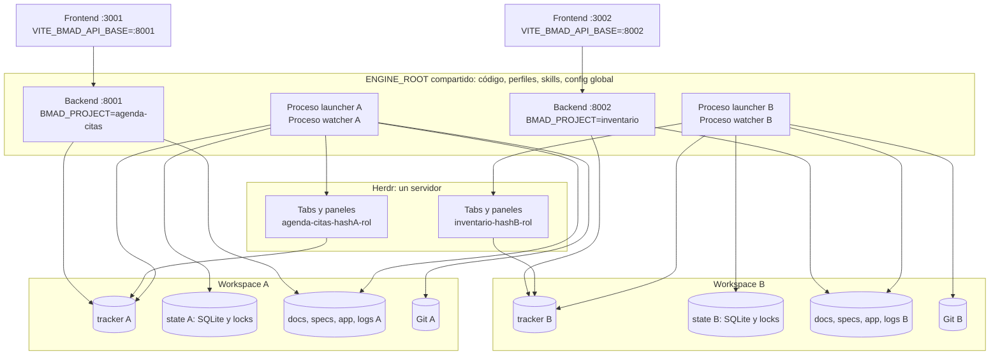
```mermaid
flowchart TB
    subgraph Motor["ENGINE_ROOT compartido: código, perfiles, skills, config global"]
        RA["Proceso launcher A<br/>Proceso watcher A"]
        RB["Proceso launcher B<br/>Proceso watcher B"]
        DA["Backend :8001<br/>BMAD_PROJECT=agenda-citas"]
        DB["Backend :8002<br/>BMAD_PROJECT=inventario"]
    end
    subgraph HerdrSrv["Herdr: un servidor"]
        HA["Tabs y paneles<br/>agenda-citas-hashA-rol"]
        HB["Tabs y paneles<br/>inventario-hashB-rol"]
    end
    subgraph WA["Workspace A"]
        TA[("tracker A")]
        SA[("state A: SQLite y locks")]
        AA[("docs, specs, app, logs A")]
        GA[("Git A")]
    end
    subgraph WB["Workspace B"]
        TB[("tracker B")]
        SB[("state B: SQLite y locks")]
        AB[("docs, specs, app, logs B")]
        GB[("Git B")]
    end
    RA --> HA
    RB --> HB
    RA --> TA & SA & AA & GA
    RB --> TB & SB & AB & GB
    HA --> TA
    HB --> TB
    DA --> TA & AA
    DB --> TB & AB
    UA["Frontend :3001<br/>VITE_BMAD_API_BASE=:8001"] --> DA
    UB["Frontend :3002<br/>VITE_BMAD_API_BASE=:8002"] --> DB
```

Mecanismos contra la contaminación cruzada:

- **Rutas:** `ProjectContext.output()` resuelve cada escritura dentro del workspace y rechaza
  escapes; los procesos hijos reciben `cwd` y variables `BMAD_*` del proyecto, y `CommandRunner`
  elimina variables heredadas de feature/Git.
- **Sesiones:** los nombres incluyen ID y hash de la ruta normalizada; el launcher rechaza nombres
  existentes y el despacho exige propiedad registrada en el SQLite del proyecto.
- **Estado:** SQLite, cursor, cola y locks viven en `state/` de cada workspace. Un segundo
  watcher sobre el mismo workspace falla al tomar el lock; sobre otro workspace no compite.
- **Git:** `GitService` exige `.git` local en el workspace y rechaza un repositorio padre.
- **Dashboard:** cada backend fija un proyecto al importarse; HTTP, WebSocket, observadores y
  cachés pertenecen a ese proceso.

Limitaciones actuales:

- No existe orquestador central ni selector global: la simultaneidad consiste en procesos
  independientes por proyecto, que el operador arranca y supervisa por separado.
- El dashboard no agrega proyectos: la portada lista el registro (`/projects`), pero cada
  supervisión requiere un backend y un frontend propios; `VITE_BMAD_API_BASE` se fija al
  arrancar o compilar el frontend.
- `ai.limits.max_processes` limita cada `CommandRunner`, no el total de la máquina.
- El aislamiento de dos workspaces está verificado con dobles (`tests/test_multiworkspace.py`,
  `tests/validate_offline.py`); no hay prueba automatizada de dos flotas reales en un mismo
  Herdr ni de cuota compartida entre proveedores.

## 10. Límites de seguridad y operación

- El perímetro de rutas es una regla del runtime y del contrato inyectado, no un sandbox del
  sistema operativo: un CLI externo puede ejecutar acciones arbitrarias según sus permisos.
- En Windows, `CommandRunner` exige ejecutables nativos y rechaza `.cmd`, `.bat` y `.ps1`.
- Gemini, una skill instalada distinta de `.github/skills`, una configuración inválida o un CLI
  ausente producen errores explícitos; no hay fallback de proveedor.
- `idle`/`done` en Herdr o la aceptación de un prompt no prueban que el agente terminó: cuentan
  el artefacto y el handoff.
- La rotación automática de contexto y `/clear` están deshabilitados en los adaptadores.
- `ai.git.auto_commit=false` desactiva el autosave; el freeze y las macros GitOps siguen creando
  commits, ramas y merges. El freeze exige staging vacío y añade solo `specs/` y `.specify/`.
- `Runtime` cachea la configuración: un cambio requiere reiniciar los procesos afectados.
