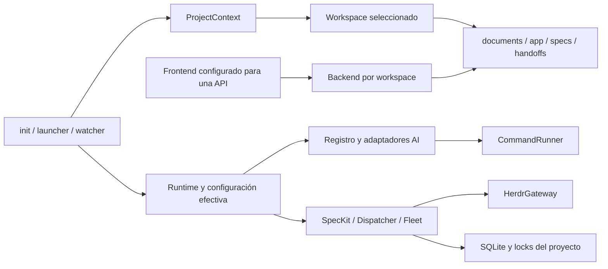

# Arquitectura implementada

El sistema separa el motor compartido de un contexto inmutable por proyecto. [Runtime](bmad_runtime/README.md) es la referencia normativa para operación/configuración.

```mermaid
flowchart LR
    CLI[init / launcher / watcher] --> Context[ProjectContext]
    Context --> Workspace[Workspace seleccionado]
    CLI --> Runtime[Runtime y configuración efectiva]
    Runtime --> Factory[Registro y adaptadores AI]
    Factory --> Commands[CommandRunner]
    Runtime --> Services[SpecKit / Dispatcher / Fleet]
    Services --> Gateway[HerdrGateway]
    Services --> State[SQLite y locks del proyecto]
    Workspace --> Artifacts[documents / app / specs / handoffs]
    Dashboard[Backend por workspace] --> Artifacts
    UI[Frontend configurado para una API] --> Dashboard
```

| Módulo | Responsabilidad |
|---|---|
| context.py / workspace.py | Identidad, selección, límites de rutas, bootstrap aditivo, migración explícita |
| config.py / registry.py / providers.py | Overrides, selección por rol/operación, capacidades y flags nativos |
| runtime.py / commands.py | Composición; ejecución argv sin shell, timeout/salida/concurrencia limitada |
| fleet.py / herdr.py | Topología de paneles y gateway de verbos Herdr |
| services.py | Preparación/ejecución SpecKit, despacho y rechazo de limpieza de contexto no verificada |
| state.py / watcher_service.py | Claims SQLite, locks, cursor y cola recuperable |
| workflow.py / ux_routing.py / gitops.py | Flujo BMAD/SDD, gates, UX, retrabajo y operaciones Git |
| [bmad-control-center/backend/core/config.py](bmad-control-center/backend/core/config.py) | Un workspace por proceso API y límites de artefactos |
| [bmad-control-center/frontend/services/api_client.ts](bmad-control-center/frontend/services/api_client.ts) | Base HTTP configurable y WebSocket del mismo backend |

Los módulos Python de la tabla están en `bmad_runtime/`, salvo `ux_routing.py`, que está en la raíz. Las rutas del dashboard se muestran completas desde la raíz del repositorio.

Los scripts raíz/utils delegan al runtime. El backend usa directamente main, api, core, models y services. Las skills instaladas son dependencias dinámicas que se cotejan contra su fuente compartida.

La separación de rutas y sesiones reduce cruces accidentales; no equivale a sandbox del sistema operativo. El watcher mantiene globals de un contexto y requiere proceso separado por workspace. El ciclo de vida de sesiones se controla mediante servicios y estado persistente; la rotación automática de contexto está deshabilitada.

## Estado y eventos

Cada workspace tiene `state/state.sqlite3` y locks propios para bootstrap, fleet, watcher y SpecKit. El template exige selección explícita; no crea estado de aplicación en el motor. El watcher guarda cursor, hashes y referencias a líneas del tracker; la cola no copia prompts. Los estados de entrega incierta requieren reconciliación explícita y no se reintentan automáticamente.

Los nombres de sesión incorporan ID, hash de la ruta y rol. El gateway de Herdr ejecuta argumentos como listas, y la parada verifica propiedad y estado de cada panel. `CommandRunner` limita tiempo, salida y concurrencia; la separación de rutas no impide acciones arbitrarias de herramientas externas.

El dashboard tiene su propio observador para proyectar eventos y artefactos; no sustituye al watcher de orquestación. Ambos seleccionan el contexto mediante el mecanismo de rutas compartido.

Sin selección de proyecto, el dashboard muestra el registro `projects` y no inicia
observadores, sesiones ni acceso a entregables. Cada API seleccionada mantiene un workspace fijo.
