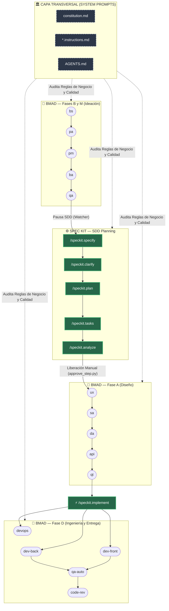
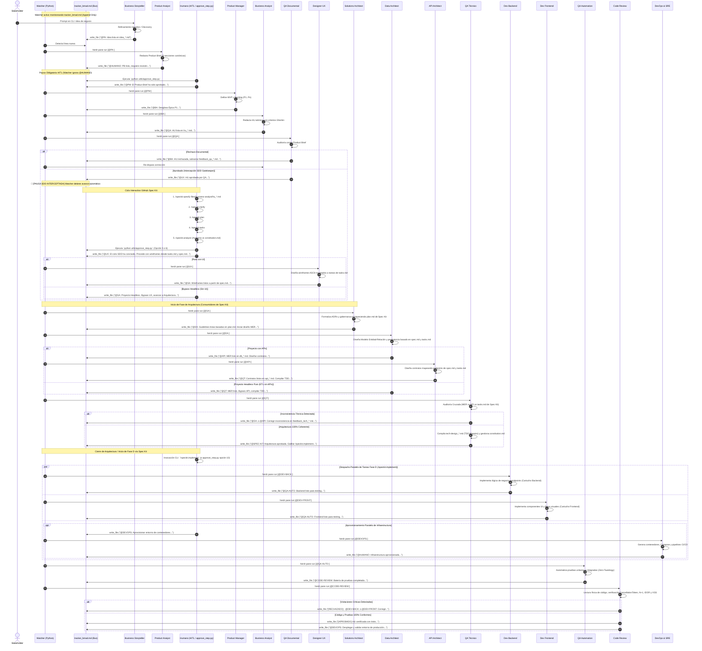

# BMAD Multi-Agent Ecosystem — Arquitectura Técnica

> Este documento describe la arquitectura técnica, la topología física y lógica de agentes, los diagramas de componentes y secuencia, la gestión de estado y el ciclo de vida secuencial (*Token-Passing*) del framework BMAD (Business, Management, Architecture & Development) sobre Herdr y herramientas MCP.

---

## 1. Visión General y Topología del Sistema

El framework BMAD está diseñado para guiar una iniciativa de software desde su concepción inicial informal hasta la especificación técnica completa con criterios BDD, wireframes de interfaz de usuario, diseño de persistencia relacional (MER), contratos de integración de APIs y auditoría cruzada de arquitectura (TDD).

### Principios Arquitectónicos Inmutables
1. **El Tracker como Único Bus de Datos y Comunicación:** Los agentes **NO** se comunican entre sí por chat ni invocaciones directas. Todos los agentes leen y escriben exclusivamente en un archivo central llamado `files/tracker_bmad.md`. Cada agente anexa su bitácora al final (*read -> concat -> write*) usando etiquetas formales de Handoff (ej. `@PA:`, `@PM:`, `@BA:`, `@QA:`, `@UX:`, `@SA:`, `@DA:`, `@API:`, `@QT:`).
2. **Plantillas Deterministas:** Todos los entregables (`pb_*.md`, `mvp_*.md`, `hu_*.md`, `ux_*.md`, `tech_guidelines.md`, `db_*.md`, `api_*.md`, `tech-design_*.md`) se generan a partir de plantillas estrictas (`.instructions.md`). Prohibido permitir que un agente invente la estructura de un documento.
3. **Lógica de Bypass Headless vs UI (Rutas Dinámicas):** El framework es consciente de la naturaleza del proyecto:
   - **Ruta con UI (Web, Mobile, Dashboards):** `BS -> PA -> (HITL) -> PM -> BA -> QA -> UX -> SA -> DA -> API -> QT`.
   - **Ruta Headless (ETL, SSIS, Pipelines de Datos, APIs puras):** El flujo salta automáticamente el diseño visual de interfaces: `BS -> PA -> (HITL) -> PM -> BA -> QA -> SA -> DA -> QT`.
4. **Política Anti-Alucinación:** Ningún agente asume alcances no definidos en el Product Brief o en las Historias de Usuario. Todo supuesto debe marcarse explícitamente con `⚠️ [PROPUESTO]` o `❓ No documentado`.
5. **Auditoría Cruzada:** El agente `qa-tech` es el compilador final. Audita matemáticamente que el diseño de base de datos (`db_*.md`) y los contratos (`api_*.md`) no se contradigan antes de generar el Technical Design Document (TDD).
6. **Estrategia Dual Greenfield / Brownfield (Agnosticismo Total):** El framework soporta de manera nativa tanto iniciativas completamente nuevas como sistemas preexistentes mediante el interruptor físico `files/context/constitution.md`. Si dicho archivo existe, todos los agentes (de negocio y arquitectura) subordinan obligatoriamente sus entregables al dominio, reglas y restricciones tecnológicas descritas en él. Si no existe, operan en modo Greenfield estándar sin precondiciones.
7. **Puente SDD (Spec-Driven Development con GitHub Spec Kit):** Tras la aprobación de requisitos por QA Documental, el orquestador aplica una pausa lógica obligatoria (**SDD Gatekeeper**) para permitir el ciclo interactivo de especificación formal (`/speckit.specify -> /speckit.clarify -> /speckit.plan -> /speckit.tasks -> /speckit.analyze`). Su liberación controlada mediante `utils/approve_step.py` provee como fuente de la verdad los artefactos `spec.md`, `tasks.md` y `plan.md` a la Fase de Arquitectura y UX. La ejecución en Fase D es gatillada por `/speckit.implement`.
8. **Estrategia Dual-Output de Requisitos:** El `business-analyst` genera dos versiones de HU: Técnica (Gherkin estricto para Spec Kit en `files/business-analyst/`) y de Stakeholders (orientada a valor y usuarios clave en `files/business-analyst/HUs-stakeholders/`).

---

### Conceptos Clave de la Fase 2 (SDD)

- **🏛️ Gobernanza Transversal (Lex Superior como System Prompts):**
  El archivo físico `files/context/constitution.md` (reflejado en `.specify/memory/constitution.md`) y las políticas transversales `*.instructions.md` actúan como *System Prompts* inmutables que auditan todas las fases del ciclo de vida (Discovery, SDD Planning, Arquitectura y Delivery). Ningún agente ni usuario humano en el tracker puede relajar o contradecir esta constitución técnica sin una Cláusula de Excepción formalmente escrita en el archivo físico.

- **📑 Estrategia Dual-Output (Fase M - Management):**
  El agente `business-analyst` (`@BA:`) ya no redacta un único documento libre. Ejecuta un desdoblamiento determinista en dos artefactos complementarios:
  1. **HU Técnica (Spec Kit Ready):** Estructurada en sintaxis Gherkin pura, aséptica y con contratos tipados, guardada en `files/business-analyst/hu_[ID]_[nombre].md` para consumo directo por `/speckit.specify`.
  2. **HU para Stakeholders:** Documento de cara al negocio y Product Owners, archivado en `files/business-analyst/HUs-stakeholders/hu_[ID]_[nombre].md`, priorizando impacto operativo y valor de negocio.

- **🛑 SDD Gatekeeper (El Puente Spec Kit en Python):**
  El orquestador central `watcher_bmad.py` incorpora un interceptor lógico que detecta el certificado de aprobación emitido por el agente `qa-documental` (`@QA:`). En lugar de avanzar ciegamente hacia UX o Arquitectura, el orquestador detiene el avance automático y entra en **Pausa Lógica SDD**, permitiendo al operador interactuar con la suite de GitHub Spec Kit (`/speckit.specify`, `/speckit.clarify`, `/speckit.plan`, `/speckit.tasks`, `/speckit.analyze`). Una vez auditada la especificación con `/speckit.analyze`, el operador ejecuta `python utils/approve_step.py` (Opción 5 o 6) para reanudar el enjambre hacia la Fase A. Posteriormente, la Fase D es comandada y despachada mediante el gatillo `/speckit.implement`.

---

### Diagrama Maestro de Topología SDD

```mermaid
flowchart TD
    classDef gov fill:#2d3748,stroke:#cbd5e0,stroke-width:2px,color:#fff,stroke-dasharray: 5 5
    classDef bmad fill:#1a365d,stroke:#2b6cb0,stroke-width:2px,color:#fff
    classDef speckit fill:#276749,stroke:#48bb78,stroke-width:2px,color:#fff

    subgraph GOVERNANCE ["🏛️ CAPA TRANSVERSAL (SYSTEM PROMPTS)"]
        direction LR
        CONST["constitution.md"]:::gov
        POLICIES["*.instructions.md"]:::gov
        AGISTRY["AGENTS.md"]:::gov
    end

    subgraph DISCOVERY ["🤖 BMAD — Fases B y M (Ideación)"]
        direction TB
        BS(["bs"]) --> PA(["pa"]) --> PM(["pm"]) --> BA(["ba"]) --> QA_DOC(["qa"])
    end

    subgraph SPECKIT_PLAN ["⚙️ SPEC KIT — SDD Planning"]
        direction TB
        SPEC["/speckit.specify"]:::speckit --> CLAR["/speckit.clarify"]:::speckit
        CLAR --> PLAN["/speckit.plan"]:::speckit
        PLAN --> TASKS["/speckit.tasks"]:::speckit
        TASKS --> AN["/speckit.analyze"]:::speckit
    end

    subgraph ARCHITECTURE ["🤖 BMAD — Fase A (Diseño)"]
        direction TB
        UX(["ux"]) --> SA(["sa"]) --> DA(["da"]) --> API(["api"]) --> QT(["qt"])
    end

    IMP["⚡ /speckit.implement"]:::speckit

    subgraph DELIVERY ["🤖 BMAD — Fase D (Ingeniería y Entrega)"]
        direction TB
        DEVOPS(["devops"])
        DEV_B(["dev-back"])
        DEV_F(["dev-front"])
        QA_A(["qa-auto"])
        CR(["code-rev"])

        DEVOPS ~~~ DEV_B
        DEV_B --> QA_A
        DEV_F --> QA_A
        QA_A --> CR
    end

    %% Flujo Principal
    QA_DOC -- "Pausa SDD (Watcher)" --> SPEC
    AN -- "Liberación Manual (approve_step.py)" --> UX
    QT --> IMP
    IMP --> DEVOPS & DEV_B & DEV_F
    
    GOVERNANCE -. "Audita Reglas de Negocio y Calidad" .-> DISCOVERY & SPECKIT_PLAN & ARCHITECTURE & DELIVERY
```

---

### Arquitectura de Componentes y Almacenamiento Físico

```mermaid
flowchart TB
    subgraph Motor_Orquestacion ["Motor Central de Orquestación"]
        W["watcher_bmad.py<br><i>Compilador Modular + Token-Passing</i>"]
        T[("tracker_bmad.md<br><i>Único Bus de Eventos y Datos</i>")]
        W -- "Monitorea" --> T
    end

    subgraph Configuracion ["Configuración y Extensibilidad"]
        JSON{"config_bmad.json<br><i>Diccionario de Rutas Absolutas</i>"}
        SKILLS_G[("📁 /skills<br><i>Skills Globales</i>")]
        SKILLS_L[("📁 /*/skills<br><i>Skills Locales</i>")]
    end

    subgraph Flota_BMAD ["Roster Oficial de Agentes BMAD"]
        direction TB
        subgraph Fase_B ["Fase Business"]
            BS["Business Storyteller"]
            PA["Product Analyst"]
        end
        subgraph Fase_M ["Fase Management"]
            PM["Product Manager"]
            BA["Business Analyst"]
            QA["QA Documental"]
            UX["Designer UX"]
        end
        subgraph Fase_A ["Fase Architecture"]
            SA["Solutions Architect"]
            DA["Data Architect"]
            API["API Architect"]
            QT["QA Técnico"]
        end
        subgraph Fase_D ["Fase Development & Delivery (Cartucho Intercambiable)"]
            DEV_B["Dev Backend (Lógica de Servidor)"]
            DEV_F["Dev Frontend (Interfaz de Usuario)"]
            QA_A["QA Auto (Pruebas Automatizadas)"]
            CR["Code Review (SecOps & Gatekeeper)"]
            DEVOPS["DevOps & SRE (Infraestructura)"]
        end
    end

    subgraph Herramientas_MCP ["Servidores MCP y Herramientas CLI"]
        MCP_FS[["MCP Filesystem<br><i>read_file / write_file</i>"]]
        MCP_ST[["MCP Stitch<br><i>Wireframes UI</i>"]]
        CLI_EXEC[["CLI Terminal<br><i>execute_command</i>"]]
    end

    subgraph Almacenamiento ["files/ - Aislamiento Físico de Entregables"]
        DIR_CTX["📁 context<br><i>constitution.md (Opcional)</i>"]
        DIR_BS["📁 business-storyteller"]
        DIR_PA["📁 product-analyst"]
        DIR_PM["📁 product-manager"]
        DIR_BA["📁 business-analyst"]
        DIR_STK["📁 business-analyst/HUs-stakeholders"]
        DIR_QA["📁 qa-documental"]
        DIR_UX["📁 designer-ux"]
        DIR_SA["📁 solutions-architect"]
        DIR_DA["📁 data-architect"]
        DIR_API["📁 api-architect"]
        DIR_QT["📁 qa-tech"]
        DIR_DEVB["📁 dev-backend"]
        DIR_DEVF["📁 dev-frontend"]
        DIR_QAA["📁 qa-auto"]
        DIR_CR["📁 code-review"]
        DIR_DEVOPS["📁 devops"]
    end

    W -- "herdr pane run" --> BS & PA & PM & BA & QA & UX & SA & DA & API & QT & DEV_B & DEV_F & QA_A & CR & DEVOPS
    BS & PA & PM & BA & QA & UX & SA & DA & API & QT & DEV_B & DEV_F & QA_A & CR & DEVOPS -. "Lee rutas" .-> JSON
    BS & PA & PM & BA & QA & UX & SA & DA & API & QT & DEV_B & DEV_F & QA_A & CR & DEVOPS === MCP_FS
    DEV_B & DEV_F & QA_A & DEVOPS -. "Terminal CLI" .-> CLI_EXEC
    UX === MCP_ST
    MCP_FS --> DIR_BS & DIR_PA & DIR_PM & DIR_BA & DIR_STK & DIR_QA & DIR_UX & DIR_SA & DIR_DA & DIR_API & DIR_QT & DIR_DEVB & DIR_DEVF & DIR_QAA & DIR_CR & DIR_DEVOPS
    DIR_CTX -. "Ingestión Brownfield (read_file)" .-> MCP_FS
    MCP_FS -- "Anexa Evento (Append-Only)" --> T
```

---

## 2. Roster Oficial de Agentes y Responsabilidades

| Agente | Fase BMAD | Responsabilidad Principal | Entrada Principal | Entregable Canónico |
|---|:---:|---|---|---|
| `business-storyteller` | Business | Refina ideas crudas, evalúa ambigüedad (HITL) e inyecta dolor de negocio y actores. | Visión informal del stakeholder | `idea_*.md` |
| `product-analyst` | Business | Transforma la idea en un Product Brief formal de 8 secciones canónicas. Activa pausa HITL. | `idea_*.md` | `pb_*.md` |
| `product-manager` | Management | Define el MVP por Ruta Crítica (P1-P5) y orquesta la delegación iterativa de épicas al BA. | `pb_*.md` (Aprobado HITL) | `mvp_*.md` |
| `business-analyst` | Management | Estrategia Dual-Output: desglosa épicas en HU Técnica (Gherkin puro / Spec Kit) y HU para Stakeholders. | `mvp_*.md` y `pb_*.md` | `hu_*.md` y `HUs-stakeholders/hu_*.md` |
| `qa-documental` | Management | Audita trazabilidad BDD. Si aprueba, activa el interceptor **SDD Gatekeeper** para invocar Spec Kit. | `hu_*.md` vs `pb_*.md` | `aprobado_qa_*.md` / `feedback_qa_*.md` |
| `designer-ux` | Management / UX | Diseña wireframes ASCII subordinados a `spec.md` y tareas de UI de `tasks.md` (1 escenario = 1 estado visual). | `spec.md`, `tasks.md`, `hu_*.md` | `ux_*.md` |
| `solutions-architect` | Architecture | Consolida stack, gobernanza y formaliza ADRs MADR enriquecidos desde `plan.md` de Spec Kit. | `plan.md`, `tasks.md`, `constitution.md` | `tech_guidelines.md` |
| `data-architect` | Architecture | Modela persistencia física (MER, diccionario y ADRs) mapeado a entidades de `spec.md` y `tasks.md`. | `spec.md`, `tasks.md`, `db_*.md` | `db_*.md` |
| `api-architect` | Architecture | Diseña contratos de integración REST/GraphQL mapeando endpoints de `spec.md` y `tasks.md`. | `spec.md`, `tasks.md`, `db_*.md` | `api_*.md` |
| `qa-tech` | Architecture | Auditoría cruzada TDD vs Spec Kit (`tasks.md`/`spec.md`); compila TDD y gatilla `/speckit.implement`. | `db_*.md`, `api_*.md`, `tasks.md` | `tech-design_*.md` |
| `dev-backend` | Development | Construye backend vía CLI (`execute_command`) comandado por `/speckit.implement` (Cartucho .NET/otro). | `tech-design_*.md`, `tasks.md` | Código fuente backend |
| `dev-frontend` | Development | Construye frontend y componentes vía CLI (`execute_command`) comandado por `/speckit.implement`. | `tech-design_*.md`, `ux_*.md` | Código fuente frontend |
| `qa-auto` | Delivery / QA | Diseña y ejecuta tests automáticos vía CLI (`execute_command`) con cobertura estricta de CAs (Zero-Tautology). | `hu_*.md`, `spec.md`, código | Suites de pruebas y reportes |
| `code-review` | Delivery / SecOps | Quality Gatekeeper final. Audita físicamente el código fuente (anti-rubber-stamping, seguridad OWASP). | Código fuente y tests | Dictamen `[APROBADO]` / `[RECHAZADO]` |
| `devops` | Delivery / SRE | Aprovisiona contenedores y CI/CD vía CLI (`execute_command`) para despliegue reproducible. | `tech-design_*.md`, Compose | Dockerfiles, Compose y CI/CD |

---

## 3. Flujo End-to-End y Secuencia Asíncrona (Token-Passing)

### Diagrama de Secuencia Completo

```mermaid
sequenceDiagram
    autonumber
    actor Stakeholder
    participant W as Watcher (Python)
    participant T as tracker_bmad.md (Bus)
    participant BS as Business Storyteller
    participant PA as Product Analyst
    participant H as Humano (HITL / approve_step.py)
    participant PM as Product Manager
    participant BA as Business Analyst
    participant QA as QA Documental
    participant UX as Designer UX
    participant SA as Solutions Architect
    participant DA as Data Architect
    participant API as API Architect
    participant QT as QA Técnico
    participant DEVB as Dev Backend
    participant DEVF as Dev Frontend
    participant QAA as QA Automation
    participant CR as Code Review
    participant DOPS as DevOps & SRE

    Note over W, T: Watcher activo monitoreando tracker_bmad.md (Append-Only)
    
    Stakeholder->>BS: Prompt en CLI: Idea de negocio
    BS->>BS: Refinamiento narrativo / Discovery
    BS->>T: write_file ("@PA: Idea lista en idea_*.md")
    
    W->>T: Detecta línea nueva
    W->>PA: herdr pane run [@PA:]
    PA->>PA: Redacta Product Brief (8 secciones canónicas)
    PA->>T: write_file ("@HUMANO: PB listo, requiere revisión...")
    
    Note over W, T: Pausa Obligatoria HITL (Watcher ignora @HUMANO)
    H->>T: Ejecuta `python utils/approve_step.py`
    H->>T: write_file ("@PM: El Product Brief ha sido aprobado...")
    
    W->>PM: herdr pane run [@PM:]
    PM->>PM: Define MVP y Backlog (P1..Pn)
    PM->>T: write_file ("@BA: Desglosa Épica P1...")
    
    W->>BA: herdr pane run [@BA:]
    BA->>BA: Redacta HU atómica con criterios Gherkin
    BA->>T: write_file ("@QA: HU lista en hu_*.md...")
    
    W->>QA: herdr pane run [@QA:]
    QA->>QA: Auditoría contra Product Brief
    
    alt Rechazo Documental
        QA->>T: write_file ("@BA: HU rechazada, subsanar feedback_qa_*.md...")
        W->>BA: Re-dispara corrección
    else Aprobado (Intercepción SDD Gatekeeper)
        QA->>T: write_file ("@UX: HU aprobada por QA...")
        Note over W, T: 🛑 [PAUSA SDD INTERCEPTADA] Watcher detiene avance automático
        Note over H, T: Ciclo Interactivo GitHub Spec Kit:
        H->>H: 1. /speckit.specify files/business-analyst/hu_*.md
        H->>H: 2. /speckit.clarify
        H->>H: 3. /speckit.plan
        H->>H: 4. /speckit.tasks
        H->>H: 5. /speckit.analyze (Auditoría vs constitution.md)
        H->>T: Ejecuta `python utils/approve_step.py` (Opción 5 o 6)
        H->>T: write_file ("@UX: El ciclo SDD ha concluido. Procede con wireframes desde tasks.md y spec.md...")
        
        alt Ruta con UI
            W->>UX: herdr pane run [@UX:]
            UX->>UX: Diseña wireframes ASCII mapeados a tareas de tasks.md
            UX->>T: write_file ("@SA: Wireframes listos a partir de spec.md...")
        else Bypass Headless (Sin UI)
            H->>T: write_file ("@SA: Proyecto Headless. Bypass UX, avanzar a Arquitectura...")
        end
    end

    Note over W, SA: Inicio de Fase de Arquitectura (Consumidores de Spec Kit)
    W->>SA: herdr pane run [@SA:]
    SA->>SA: Formaliza ADRs y gobernanza enriqueciendo plan.md de Spec Kit
    SA->>T: write_file ("@DA: Guidelines listas basadas en plan.md. Iniciar diseño MER...")

    W->>DA: herdr pane run [@DA:]
    DA->>DA: Diseña Modelo Entidad-Relación y persistencia basado en spec.md y tasks.md
    alt Proyecto con APIs
        DA->>T: write_file ("@API: MER listo en db_*.md. Diseñar contratos...")
        W->>API: herdr pane run [@API:]
        API->>API: Diseña contratos mapeando endpoints de spec.md y tasks.md
        API->>T: write_file ("@QT: Contratos listos en api_*.md. Compilar TDD...")
    else Proyecto Headless Puro (ETL sin APIs)
        DA->>T: write_file ("@QT: MER listo. Bypass API, compilar TDD...")
    end

    W->>QT: herdr pane run [@QT:]
    QT->>QT: Auditoría Cruzada (MER vs API vs tasks.md de Spec Kit)
    alt Inconsistencia Técnica Detectada
        QT->>T: write_file ("@DA: o @API: Corregir inconsistencia en feedback_tech_*.md...")
    else Arquitectura 100% Coherente
        QT->>QT: Compila tech-design_*.md (TDD Maestro) y gestiona constitution.md
        QT->>T: write_file ("@SPEC-KIT: Arquitectura aprobada. Gatillar /speckit.implement...")
    end

    Note over W, H: Cierre de Arquitectura / Inicio de Fase D vía Spec Kit
    H->>H: Invocación CLI: `/speckit.implement` (o approve_step.py opción 10)
    
    par Despacho Paralelo de Tareas Fase D (/speckit.implement)
        W->>DEVB: herdr pane run [@DEV-BACK:]
        DEVB->>DEVB: Implementa lógica de negocio y endpoints (Cartucho Backend)
        DEVB->>T: write_file ("@QA-AUTO: Backend listo para testing...")
    and
        W->>DEVF: herdr pane run [@DEV-FRONT:]
        DEVF->>DEVF: Implementa componentes UI y flujos visuales (Cartucho Frontend)
        DEVF->>T: write_file ("@QA-AUTO: Frontend listo para testing...")
    and
        opt Aprovisionamiento Paralelo de Infraestructura
            H->>T: write_file ("@DEVOPS: Aprovisionar entorno de contenedores...")
            W->>DOPS: herdr pane run [@DEVOPS:]
            DOPS->>DOPS: Genera contenedores, Compose y pipelines CI/CD
            DOPS->>T: write_file ("@HUMANO: Infraestructura aprovisionada...")
        end
    end

    W->>QAA: herdr pane run [@QA-AUTO:]
    QAA->>QAA: Automatiza pruebas unitarias e integradas (Zero-Tautology)
    QAA->>T: write_file ("@CODE-REVIEW: Batería de pruebas completada...")

    W->>CR: herdr pane run [@CODE-REVIEW:]
    CR->>CR: Lectura física de código, verificación CancellationToken, N+1, IDOR y XSS
    alt Violaciones Críticas Detectadas
        CR->>T: write_file ("[RECHAZADO] - @DEV-BACK: o @DEV-FRONT: Corregir...")
    else Código y Pruebas 100% Conformes
        CR->>T: write_file ("[APROBADO] HU certificada con éxito...")
        CR->>T: write_file ("@DEVOPS: Desplegar y validar entorno de producción...")
    end
```

---

## 4. Gestión de Estado y Fuentes de Verdad

El framework desacopla el almacenamiento de los entregables en subdirectorios exclusivos dentro de `files/`:

| Entregable / Dominio | Ubicación Física | Agente Creador | Consumidores Principales |
|---|---|---|---|
| Rutas Absolutas del Proyecto | `config_bmad.json` | `init_bmad.py` / Operador | Todos los agentes vía `read_file` |
| Contexto Ecosistema Heredado | `files/context/constitution.md` | Operador / Stakeholder | Todos los agentes vía `read_file` (Modo Brownfield) |
| Bus Central de Handoffs | `files/tracker_bmad.md` | Todos los agentes vía MCP | `watcher_bmad.py` y agentes |
| Ideas de Negocio Refinadas | `files/business-storyteller/idea_*.md` | `business-storyteller` | `product-analyst` |
| Product Briefs (PRD Canónico) | `files/product-analyst/pb_*.md` | `product-analyst` | `product-manager`, `business-analyst`, `qa-documental`, `solutions-architect` |
| Backlogs y Planes MVP | `files/product-manager/mvp_*.md` | `product-manager` | `business-analyst`, `designer-ux`, `solutions-architect` |
| Historias de Usuario BDD | `files/business-analyst/hu_*.md` | `business-analyst` | `qa-documental`, `designer-ux`, `data-architect`, `api-architect`, `dev-backend`, `dev-frontend` |
| Reportes y Certificados QA | `files/qa-documental/qa_*.md` | `qa-documental` | `business-analyst`, `designer-ux`, `solutions-architect` |
| Wireframes y Diseños UI | `files/designer-ux/ux_*.md` | `designer-ux` | `solutions-architect`, `dev-frontend` |
| Gobernanza y Stack | `files/solutions-architect/tech_guidelines.md` | `solutions-architect` | `data-architect`, `api-architect`, `qa-tech`, Developers |
| Diseño de Base de Datos (MER) | `files/data-architect/db_*.md` | `data-architect` | `api-architect`, `qa-tech`, `dev-backend` |
| Contratos de API | `files/api-architect/api_*.md` | `api-architect` | `qa-tech`, `dev-backend`, `dev-frontend` |
| Tech Design Document (TDD) | `files/qa-tech/tech-design_*.md` | `qa-tech` | Humano, `dev-backend`, `dev-frontend`, `devops` |
| Código Fuente Backend | Directorios de código backend (según Cartucho activo) | `dev-backend` | `qa-auto`, `code-review`, `devops` |
| Código Fuente Frontend | Directorios de código frontend (según Cartucho activo) | `dev-frontend` | `qa-auto`, `code-review`, `devops` |
| Baterías de Pruebas Automáticas | Directorios de pruebas (según Cartucho activo) | `qa-auto` | `code-review`, CI/CD Pipeline |
| Dictámenes de Code Review | Registrado en `tracker_bmad.md` | `code-review` | Desarrolladores, Humano, `devops` |
| Infraestructura y CI/CD | Archivos de Compose, Dockerfiles y CI/CD | `devops` | Desarrolladores, Operador, Servidores |

---

## 5. Invariantes y Mecanismos de Resiliencia

1. **El Tracker como Event Sourcing Inmutable:** La comunicación es exclusivamente mediante adición al final de `tracker_bmad.md`. Se prohíbe sobreescribir borrando el histórico.
2. **Backpressure en Watcher:** El orquestador sondea el estado de cada panel en Herdr. Si el agente está `working`, la tarea se retiene en memoria evitando saturación de terminales.
3. **Pausas Human-in-the-Loop (HITL):** 
   - Post-Product Brief: Requiere `python utils/approve_step.py` para activar `@PM:`.
   - Post-Tech Design: Requiere aprobación humana para autorizar codificación (`@DEV:`).
4. **Recuperación tras Reinicio (Crash Recovery):**
   - El PM y el Diseñador UX reconstruyen el estado del backlog leyendo directamente `tracker_bmad.md` y `mvp_*.md`.
   - Solutions Architect lee el historial del tracker para determinar si se encuentra en fase Q&A o en fase de consolidación.
5. **Inyección Dinámica de Skills:** Mediante la sintaxis `[IMPORT_SKILL: skills/ruta/SKILL.md]`, el compilador inyecta capacidades reutilizables (como `tracker-logger` y `export-pdf`) en el `AGENTS.md` de cada agente sin duplicar texto.
6. **Detección Condicional No Bloqueante (Dualidad Greenfield / Brownfield):** Todos los agentes consultan la existencia de `files/context/constitution.md` mediante MCP Filesystem. Si no existe o la carpeta está vacía, no emiten errores ni bloqueos: continúan su ejecución en modo Greenfield limpio con paridad absoluta. Si existe, subordinan automáticamente sus decisiones y entregables a dicho contexto.

---

## 6. Arquitectura de Cartucho Intercambiable (Pluggable Phase D)

El framework BMAD implementa el principio de **Desacoplamiento Tecnológico Total**:

1. **Inmutabilidad del Core (Fases B, M, A):** Los requerimientos de negocio (`pb_*.md`), los desgloses BDD (`hu_*.md`), los wireframes de interfaz (`ux_*.md`), el diseño relacional (`db_*.md`) y los contratos de integración (`api_*.md`) son especificaciones universales, puras y agnósticas de cualquier lenguaje.
2. **La Fase D como Cartucho:** La construcción, testing y entrega de software (`dev-backend`, `dev-frontend`, `qa-auto`, `code-review`, `devops`) funciona como un cartucho *Plug & Play*.
3. **Mecanismo de Reemplazo sin Fricción:** Para cambiar de stack (por ejemplo, de *.NET / Angular* a *Java Spring Boot / React*, *Python / Vue* o *Go / Svelte*), **el motor de orquestación en Python NO se modifica**. El intercambio se realiza en 2 pasos:
   - **Paso 1 (Memoria Tecnológica):** Modificar `files/context/constitution.md` indicando el nuevo lenguaje, frameworks, base de datos y librerías mandatorias.
   - **Paso 2 (Instrucciones de Agente):** Actualizar los archivos `.instructions.md` dentro de las carpetas de la Fase D (`dev-backend/`, `dev-frontend/`, `qa-auto/`, `code-review/`, `devops/`).
4. **Transparencia en el Enrutamiento:** El motor Python despacha el flujo basándose exclusivamente en tokens abstractos (`@DEV-BACK:`, `@DEV-FRONT:`, `@QA-AUTO:`, `@CODE-REVIEW:`, `@DEVOPS:`). El enrutador ignora el lenguaje de destino, garantizando estabilidad operativa infinita frente a la evolución tecnológica.

> Para consultar la guía de migración y ejemplos de cartuchos homologados (Java, Python, Go, Node), ver [`PLUGGABLE_PHASE_D.md`](./PLUGGABLE_PHASE_D.md).

