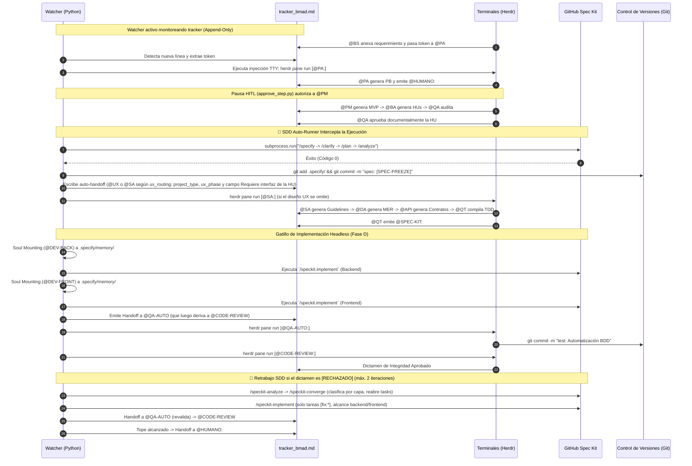
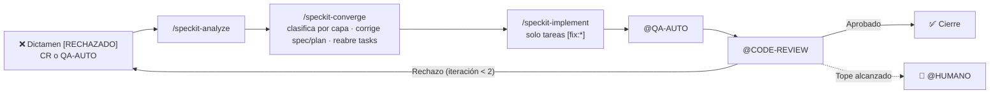

# 🏛️ BMAD Multi-Agent Ecosystem — Arquitectura Técnica Detallada

> **Nota Preliminar:** Para la visión estratégica del ecosistema, el motor Git Headless y la filosofía operativa del SDD Auto-Runner, consulta el documento maestro **[`framework_bmad.md`](./framework_bmad.md)**.
> Este documento se enfoca exclusivamente en la topología de almacenamiento físico, la gestión de estado de los artefactos, los mecanismos de resiliencia del orquestador Python y la especificación del cartucho de Fase D.

---

## 1. Arquitectura de Componentes y Almacenamiento Físico

El ecosistema aísla por completo el motor lógico (orquestador) de la capa de almacenamiento (entregables), garantizando que los agentes operen en entornos *sandboxed* mediante MCP.

```mermaid
flowchart TB
    subgraph Motor_Orquestacion ["Motor Central de Orquestación"]
        W["watcher_bmad.py<br><i>Compilador Modular + Token-Passing</i>"]
        T[("tracker_bmad.md<br><i>Único Bus de Eventos y Datos</i>")]
        W -- "Monitorea" --> T
    end

    subgraph Configuracion ["Configuración y Extensibilidad"]
        JSON{"config_bmad.json<br><i>Diccionario de Rutas Absolutas</i>"}
        SKILLS_G[("📁 /skills<br><i>Skills Globales</i>")]
        SKILLS_L[("📁 /*/skills<br><i>Skills Locales</i>")]
    end

    subgraph Herramientas_MCP ["Servidores MCP y Herramientas CLI"]
        MCP_FS[["MCP Filesystem<br><i>read_file / write_file</i>"]]
        CLI_EXEC[["CLI Terminal<br><i>execute_command</i>"]]
    end

    subgraph Almacenamiento ["documents/ - Aislamiento Físico de Entregables"]
        DIR_CTX["📁 .specify/memory<br><i>constitution.md (Brownfield)</i>"]
        DIR_BS["📁 business-storyteller"]
        DIR_PA["📁 product-analyst"]
        DIR_PM["📁 product-manager"]
        DIR_BA["📁 business-analyst"]
        DIR_STK["📁 business-analyst/HUs-stakeholders"]
        DIR_QA["📁 qa-documental"]
        DIR_UX["📁 designer-ux"]
        DIR_SA["📁 solutions-architect"]
        DIR_DA["📁 data-architect"]
        DIR_API["📁 api-architect"]
        DIR_QT["📁 qa-tech"]
        DIR_DEVB["📁 dev-backend"]
        DIR_DEVF["📁 dev-frontend"]
        DIR_QAA["📁 qa-auto"]
        DIR_CR["📁 code-review"]
        DIR_DEVOPS["📁 devops"]
    end

    W -- "herdr pane run" --> Agentes((Enjambre BMAD))
    Agentes -. "Lee rutas" .-> JSON
    Agentes === MCP_FS
    Agentes -. "Fase D" .-> CLI_EXEC
    MCP_FS --> DIR_BS & DIR_PA & DIR_PM & DIR_BA & DIR_STK & DIR_QA & DIR_UX & DIR_SA & DIR_DA & DIR_API & DIR_QT & DIR_DEVB & DIR_DEVF & DIR_QAA & DIR_CR & DIR_DEVOPS
    DIR_CTX -. "Ingestión Lex Superior" .-> MCP_FS
    MCP_FS -- "Anexa Evento (Append-Only)" --> T
```

---

## 2. Roster Oficial de Agentes y Responsabilidades Técnicas

| Agente | Fase | Responsabilidad Principal | Entrada Principal | Entregable Canónico |
|---|:---:|---|---|---|
| `business-storyteller` | Business | Refina ideas crudas e inyecta métricas y actores. | Visión informal | `idea_*.md` |
| `product-analyst` | Business | Transforma la idea en un Product Brief formal (PRD). Activa HITL. | `idea_*.md` | `pb_*.md` |
| `product-manager` | Management | Define el MVP por Ruta Crítica y orquesta delegación de épicas. | `pb_*.md` (Aprobado) | `mvp_*.md` |
| `business-analyst` | Management | Desglosa épicas en HU Técnica (Gherkin puro) y HU para Stakeholders. | `mvp_*.md` / `pb_*.md` | `hu_*.md` / `HUs/hu_*.md` |
| `qa-documental` | Management | Audita trazabilidad BDD. Si aprueba, el orquestador lanza el Auto-Runner. | `hu_*.md` vs `pb_*.md` | `aprobado_qa_*.md` |
| `designer-ux` | UX | Diseña wireframes ASCII mapeados a estados visuales. | `spec.md`, `tasks.md` | `ux_*.md` |
| `solutions-architect` | Architecture | Consolida stack, gobernanza y formaliza ADRs MADR desde `plan.md`. | `plan.md`, `constitution.md` | `tech_guidelines.md` |
| `data-architect` | Architecture | Modela persistencia física (MER, esquemas) mapeado a `spec.md`. | `spec.md`, `tasks.md` | `db_*.md` |
| `api-architect` | Architecture | Diseña contratos REST/GraphQL mapeando endpoints. | `spec.md`, `db_*.md` | `api_*.md` |
| `qa-tech` | Architecture | Auditoría cruzada TDD vs Spec Kit; compila TDD maestro. | `db_*.md`, `api_*.md` | `tech-design_*.md` |
| `dev-backend` | Deployment | Construye backend vía CLI (`execute_command`) y realiza Commits Atómicos. | `tech-design_*.md` | Código fuente backend |
| `dev-frontend` | Deployment | Construye frontend vía CLI (`execute_command`) y realiza Commits Atómicos. | `tech-design_*.md`, `ux_*.md` | Código fuente frontend |
| `qa-auto` | QA | Diseña/ejecuta tests automáticos (`execute_command`) Zero-Tautology. | `hu_*.md`, código | Suites de pruebas |
| `code-review` | SecOps | Quality Gatekeeper final. Audita físicamente el código fuente (OWASP). | Código fuente y tests | Dictamen `[APROBADO]` |
| `devops` | SRE | Aprovisiona contenedores y CI/CD vía CLI (`execute_command`). | `tech-design_*.md` | Dockerfiles, Compose |

---

## 3. Secuencia Asíncrona Técnica (Token-Passing y Herdr)

Este diagrama revela cómo el orquestador inyecta los comandos físicamente en los procesos TTY de la terminal.

```mermaid
sequenceDiagram
    autonumber
    participant W as Watcher (Python)
    participant T as tracker_bmad.md
    participant Herdr as Terminales (Herdr)
    participant S as GitHub Spec Kit
    participant G as Control de Versiones (Git)

    Note over W, T: Watcher activo monitoreando tracker (Append-Only)
    Herdr->>T: @BS anexa requerimiento y pasa token a @PA
    
    W->>T: Detecta nueva línea y extrae token
    W->>Herdr: Ejecuta inyección TTY: herdr pane run [@PA:]
    Herdr->>T: @PA genera PB y emite @HUMANO:
    
    Note over W, Herdr: Pausa HITL (approve_step.py) autoriza a @PM
    Herdr->>T: @PM genera MVP -> @BA genera HUs -> @QA audita
    Herdr->>T: @QA aprueba documentalmente la HU
    
    Note over W, S: 🛑 SDD Auto-Runner Intercepta la Ejecución
    W->>S: subprocess.run("/specify -> /clarify -> /plan -> /analyze")
    S-->>W: Éxito (Código 0)
    W->>G: git add .specify/ && git commit -m "spec: [SPEC-FREEZE]"
    W->>T: Escribe auto-handoff (@UX o @SA según ux_routing: project_type, ux_phase y campo Requiere interfaz de la HU)
    
    W->>Herdr: herdr pane run [@SA:] (si el diseño UX se omite)
    Herdr->>T: @SA genera Guidelines -> @DA genera MER -> @API genera Contratos -> @QT compila TDD
    Herdr->>T: @QT emite @SPEC-KIT:
    
    Note over W, S: Gatillo de Implementación Headless (Fase D)
    W->>W: Soul Mounting (@DEV-BACK) a .specify/memory/
    W->>S: Ejecuta `/speckit.implement` (Backend)
    W->>W: Soul Mounting (@DEV-FRONT) a .specify/memory/
    W->>S: Ejecuta `/speckit.implement` (Frontend)
    W->>T: Emite Handoff a @QA-AUTO (que luego deriva a @CODE-REVIEW)

    W->>Herdr: herdr pane run [@QA-AUTO:]
    Herdr->>G: git commit -m "test: Automatización BDD"
    W->>Herdr: herdr pane run [@CODE-REVIEW:]
    Herdr->>T: Dictamen de Integridad Aprobado

    Note over W, S: 🔁 Retrabajo SDD si el dictamen es [RECHAZADO] (máx. 2 iteraciones)
    W->>S: /speckit-analyze -> /speckit-converge (clasifica por capa, reabre tasks)
    W->>S: /speckit-implement (solo tareas [fix:*], alcance backend/frontend)
    W->>T: Handoff a @QA-AUTO (revalida) -> @CODE-REVIEW
    W->>T: Tope alcanzado -> Handoff a @HUMANO:
```

---

## 4. Gestión de Estado y Fuentes de Verdad

BMAD no utiliza bases de datos para su estado; el sistema de archivos local es la única fuente de la verdad (*Event Sourcing*).

| Artefacto / Dominio | Ubicación Física | Productor | Consumidor(es) Principal(es) |
|---|---|---|---|
| Rutas Absolutas | `config_bmad.json` | `init_bmad.py` | Todos vía `read_file` |
| Contexto Invariante | `.specify/memory/constitution.md` | Operador / `@QT` | Arquitectos (Lex Superior) |
| Bus de Handoffs | `documents/tracker_bmad.md` | Todos | `watcher_bmad.py` y agentes |
| Product Briefs (PRD) | `documents/product-analyst/pb_*.md` | `@PA` | `@PM`, `@BA`, `@QA`, `@SA` |
| Planes MVP | `documents/product-manager/mvp_*.md` | `@PM` | `@BA`, `@UX`, `@SA` |
| HUs Técnicas BDD | `documents/business-analyst/hu_*.md` | `@BA` | Spec Kit, `@QA`, `@QA-AUTO` |
| Certificados QA | `documents/qa-documental/qa_*.md` | `@QA` | Orquestador Python |
| Wireframes | `documents/designer-ux/ux_*.md` | `@UX` | `@DEV-FRONT`, `@SA` |
| Gobernanza Técnica | `documents/solutions-architect/tech_guidelines.md` | `@SA` | `@DA`, `@API`, `@QT`, Developers |
| Diseño de Datos (MER) | `documents/data-architect/db_*.md` | `@DA` | `@API`, `@QT`, `@DEV-BACK` |
| Contratos REST/GraphQL | `documents/api-architect/api_*.md` | `@API` | `@QT`, Developers |
| TDD Maestro | `documents/qa-tech/tech-design_*.md` | `@QT` | Developers, `@DEVOPS` |
| Código Fuente & Tests | Repositorio Raíz (Git) | Fase D | `@CODE-REVIEW`, CI/CD |

---

## 5. Control de Repositorio (GitOps) y Product State Ledger

BMAD controla las transiciones del repositorio de código mediante un paradigma estricto de GitOps orquestado por macros.

### Product State Ledger (`specs/README.md`)
El estado macroscópico del producto (qué está en construcción, qué está listo para desarrollo, qué está en producción) se gobierna a través de un archivo de estado tabular inmutable llamado `Ledger`. Los agentes consultan obligatoriamente el Ledger para evitar solapamientos y lo mutan (`update-specs-map`) de `IN-PROGRESS` a `READY-FOR-DEV` conforme avanzan las aprobaciones.

**Épica = varias HU.** Una épica es un bloque de valor del plan del PM y se materializa en **varias Historias de Usuario**; la HU es la unidad que se delega al BA y recorre el pipeline (una rama `feat/XXX-HU_...` por HU). Al crear el plan, el PM descompone cada épica en historias candidatas y las registra en el ledger como `BACKLOG` (marcadas `⚠️ [PROPUESTO]`); la primera pasa a `IN-PROGRESS` y el Stage-Gate pide al humano validar también la descomposición. Al cerrarse cada HU, el PM la promueve a `ACTIVE` y elige la siguiente **historia**: la siguiente de la misma épica, o la primera de la épica inmediata si aquella no tiene elegibles. Una épica está completa solo cuando todas sus HU funcionales están `ACTIVE` (las HU de calidad derivadas de un riesgo no cuentan), y el cierre final del MVP exige que todas lo estén. Si la elección implica adelantar una porción de otra épica por una dependencia, el PM no abre rama: pregunta al humano con opciones numeradas.

### Feature Branching Transaccional
El ecosistema aísla por defecto todo el trabajo de Fase de Diseño de nuevas Historias de Usuario (HU).
- **Creación Transaccional:** El PM inyecta la macro `@WATCHER: GITOPS-BRANCH-CREATE feat/HU_[nombre]` en el tracker, lo que hace que el Watcher síncronamente audite el directorio (`git status --porcelain`), aplique *commits* preventivos y salte a la rama aislada.
- **Fusión (Auto-Merge) Segura:** Cuando el QT aprueba el diseño técnico y el Ledger, inyecta `@WATCHER: GITOPS-MERGE-CLOSE feat/HU_[nombre]`. El Watcher ejecuta un `git merge --no-ff`.
- **Degradación ante Conflictos:** Si el `git merge` falla por conflictos, el Watcher emite un `git merge --abort`, retorna a la rama *feat* y detiene la máquina enviando un token `@HUMANO:` al tracker con un Procedimiento Operativo Estándar. El sistema asume una "Amnesia Estratégica"; es decir, la resolución es de jurisdicción estrictamente humana, y tras completar el merge manualmente en la terminal, el usuario solo debe reiniciar el Watcher sin manipular el historial del tracker.
- **State Hydration:** En caso de reinicio de la terminal, el Watcher recorre históricamente el tracker, identifica macros de apertura huérfanas y reanuda el estado de Git en la rama correcta automáticamente.

---

## 6. Invariantes y Mecanismos de Resiliencia del Motor

1. **El Tracker como Event Sourcing Inmutable:** La comunicación fluye exclusivamente mediante adición (*Append-Only*) en `tracker_bmad.md`. Se penaliza la sobrescritura.
2. **Backpressure en Watcher:** El orquestador sondea el estado de cada panel TTY en Herdr. Si el agente está ocupado (`working`), la tarea se retiene en memoria evitando colisiones.
3. **Recuperación tras Reinicio (Crash Recovery):** Si el servidor se apaga, al reiniciar los agentes reconstruyen su contexto leyendo los entregables previos (ej. el PM lee el `mvp_*.md` para saber qué épica seguía).
4. **Inyección Dinámica de Skills:** Mediante la sintaxis `[IMPORT_SKILL: skills/ruta/SKILL.md]`, el orquestador auto-ensambla los perfiles de los agentes en tiempo de ejecución, permitiendo actualizaciones globales de comportamiento (ej. reglas de Git) sin duplicar prompts.

---

## 6. Arquitectura de Cartucho Intercambiable (Pluggable Phase D)

El framework BMAD implementa el principio de **Desacoplamiento Tecnológico Total**:

1. **Inmutabilidad del Core (Fases B, M, A):** Los requisitos, wireframes, diseños relacionales y contratos son especificaciones universales, puras y agnósticas.
2. **La Fase D como Cartucho:** La construcción y testing (`dev-backend`, `dev-frontend`, `qa-auto`, `code-review`, `devops`) funciona como un hardware *Plug & Play*.
3. **Mecanismo de Reemplazo Físico:** Para cambiar de stack (por ejemplo, de *.NET/Angular* a *Python/React*), **el orquestador Python jamás se modifica**. El intercambio se hace:
   - Editando `.specify/memory/constitution.md` (declarando el nuevo stack).
   - Reemplazando las subcarpetas de los agentes de Fase D con instrucciones específicas para el nuevo lenguaje.
4. **Enrutamiento Ciego:** El motor Python despacha el flujo basándose exclusivamente en tokens abstractos (`@DEV-BACK:`). El enrutador ignora el lenguaje de destino, garantizando estabilidad infinita.

---

## 🛑 Regla de Oro: Principio de Vertical Slicing Estricto

El ecosistema BMAD v2.0 opera bajo un modelo de **Vertical Slicing Estricto** para garantizar la salud del State Ledger y evitar divergencias arquitectónicas.

*   **Prohibición de Desarrollo Horizontal:** Queda estrictamente prohibido abrir o diseñar múltiples Historias de Usuario (HUs) a la vez. No se puede avanzar al diseño de una nueva característica si la anterior no ha cerrado su ciclo.
*   **Ciclo de Vida de Rebanada Vertical:** Toda HU debe atravesar el ciclo completo antes de iniciar la siguiente: `PM -> BA -> QA -> UX -> SA -> (Fases Técnicas) -> QT -> Retorno a PM`.
*   **Regla de Ramas GitOps:** Queda terminantemente prohibido que el `@PM` inicie una nueva historia y emita un `GITOPS-BRANCH-CREATE` si la historia anterior no ha sido debidamente compilada y fusionada en el código base principal por el `@QT` mediante `GITOPS-MERGE-CLOSE`.

---

## 🔒 Consistencia de Nomenclatura y Trazabilidad (Identificador Universal)

El ecosistema BMAD v2.0 impone una trazabilidad matemática exacta (1:1) entre el Product State Ledger, el control de versiones y el sistema de archivos físico mediante el uso de un **Identificador Universal Estricto**.

1. **Formato Inmutable:** Todas las historias de usuario deben adoptar la nomenclatura `XXX-HU_nombre_en_snake_case` (ej. `001-HU_tarjeta_identidad_digital`).
2. **Columnas del Ledger:** La tabla del Ledger (`specs/README.md`) utiliza oficialmente la estructura: `| N° | Épica Origen | Nombre spec / HU | Qué aporta | Estado | Rama |`.
3. **Uso Obligatorio Transversal:** Este identificador exacto y sin truncar se utiliza obligatoriamente para:
   - Registrar la funcionalidad en la columna `Nombre spec / HU` y en la columna `Rama` (`feat/001-HU_...`) del Ledger.
   - Orquestar la bifurcación GitOps (`@WATCHER: GITOPS-BRANCH-CREATE feat/XXX-HU_...`).
   - Nombrar los archivos físicos `.md` generados por los agentes (`@BA`, `@BS`, `@SA`, etc.). Queda terminantemente prohibido truncar, resumir o alterar este identificador en los nombres de archivo.

---

## 🚪 El Motor: "Doble Compuerta SDD" (Two-Stage Gatekeeper)
El orquestador BMAD implementa un "Two-Stage Gatekeeper" para fraccionar la ejecución automática del puente **Spec Kit**. Esto evita la alucinación técnica y asegura que el modelo tecnológico propuesto por el orquestador obedezca a los arquitectos.

*   **Compuerta 1 (Negocio):** Al recibir la aprobación del `@QA` (QA Documental), el Watcher intercepta la ejecución para lanzar de forma independiente `/speckit.specify` y `/speckit.clarify`. El Watcher fija de forma explícita la carpeta de la especificación (`specs/XXX-HU_nombre`, igual al identificador universal) y detiene la fase si Spec Kit no la respeta. Esto detalla funcionalmente el comportamiento sin inferir el stack.
*   **Compuerta 2 (Arquitectura):** Tras el diseño de gobernanza del `@SA` (Solutions Architect), este agente emite la macro `@WATCHER: SDD-FREEZE`. El orquestador pausa el flujo nuevamente y ejecuta `/speckit.plan`, `/speckit.tasks` y `/speckit.analyze`. En esta fase, Spec-Kit asimila las guidelines inyectadas por el Arquitecto para generar un plan técnico realista y congelarlo (`[SPEC-FREEZE]`).
*   **Compuerta 3 (Implementación):** Tras la compilación del Tech Design maestro por el `@QT` (QA Tech), este emite la señal `@SPEC-KIT:`. El Watcher intercepta esta señal y ejecuta de manera totalmente aislada y secuencial la Fase D. Mediante la inyección de la "Tarea Fantasma", SpecKit programa bajo la identidad del agente y, obligatoriamente, debe generar y actualizar la documentación de **Arquitectura Viva** y el **README del código de cada capa** (`app/backend/README.md`, `app/frontend/README.md`; se crea si falta y se actualiza solo lo alterado; configurable con `code_dirs` en `config_bmad.json`) antes de devolver el control y hacer handoff a `@QA-AUTO` (que, al aprobar, deriva a `@CODE-REVIEW`).
*   **Compuerta 4 (Retrabajo):** Si `@CODE-REVIEW` o `@QA-AUTO` rechazan la implementación, el Watcher no despacha a un agente: ejecuta el ciclo de convergencia (`/speckit-analyze` → `/speckit-converge` → `/speckit-implement` acotado a las tareas `[fix:*]`) y devuelve el turno a `@QA-AUTO` y luego a `@CODE-REVIEW`, con tope de 2 iteraciones antes de escalar a `@HUMANO:`. Ver *Ciclo de Retrabajo SDD*.

> **Nota Operativa:** Durante el desarrollo asistido, el usuario notará que el Watcher (`watcher_bmad.py`) detiene el avance automático en estos dos hitos exactos de la línea de tiempo, delegando silenciosamente la ejecución hacia el puente SDD antes de reanudar el Handoff hacia los desarrolladores.

---

## 🔁 Ciclo de Retrabajo SDD (Rechazos de `@CODE-REVIEW` / `@QA-AUTO`)

En SDD la fuente de verdad es la especificación, no el código. Por eso un dictamen `[RECHAZADO]` **no se parchea directamente en el código**: se clasifica por la **capa de origen** y se corrige desde ahí hacia abajo. Cuando `@CODE-REVIEW` o `@QA-AUTO` rechazan y su handoff asigna `@DEV-BACK:` / `@DEV-FRONT:`, el Watcher (**Compuerta 4**) ejecuta el ciclo de convergencia en lugar de despachar a un agente:

| Paso | Comando | Qué ocurre |
|---|---|---|
| 1 | `/speckit-analyze` | Auditoría de consistencia spec ↔ plan ↔ tasks (solo lectura). Revela si el rechazo esconde una grieta entre artefactos. |
| 2 | (dentro de converge) | Se corrige primero la capa que falló, con el cambio mínimo: contrato → `spec.md`; diseño incompleto → `plan.md`; si es solo código, **no se tocan spec ni plan**. |
| 3 | `/speckit-converge` | Compara el código real con spec, plan y tasks. Reabre las tareas falsamente `[X]` y añade al final de `tasks.md` una tarea por hallazgo: `T0NN [fix:CAPA:n]`. |
| 4 | `/speckit-implement` | Ejecuta **solo** las tareas `[fix:*]`, con alcance backend o frontend según el handoff y con Soul Mounting. |
| 5 | Re-validación | El último bloque DEV deriva a `@QA-AUTO:` y este, al aprobar, a `@CODE-REVIEW:`. El ciclo cierra cuando ambos aprueban. |

```mermaid
flowchart LR
    R["❌ Dictamen [RECHAZADO]<br>CR o QA-AUTO"] --> A["/speckit-analyze"]
    A --> C["/speckit-converge<br>clasifica por capa · corrige spec/plan · reabre tasks"]
    C --> I["/speckit-implement<br>solo tareas [fix:*]"]
    I --> Q["@QA-AUTO"] --> V["@CODE-REVIEW"]
    V -->|"Aprobado"| F["✅ Cierre"]
    V -->|"Rechazo (iteración < 2)"| R
    V -.->|"Tope alcanzado"| H["👤 @HUMANO"]
```

**Etiquetado por capa.** `code-review` y `qa-auto` incluyen la instrucción `rework-layer-labeling.instructions.md`: cada hallazgo lleva `[CAPA:SPEC]`, `[CAPA:PLAN]`, `[CAPA:TASKS]` o `[CAPA:CODE]`. Si todos son `CODE`/`TASKS`, el Watcher ordena no modificar spec ni plan; si hay `SPEC`/`PLAN`, se corrigen primero. Sin etiquetas, `converge` clasifica con criterio conservador (ante la duda, la capa superior).

**Principios**
- **Trazabilidad:** cada hallazgo se convierte en una tarea con ID (`[fix:...]`), así se puede probar que se resolvió.
- **La verdad de "terminado" es la verificación, no el `[X]`:** `converge` reconcilia las tareas falsamente cerradas.
- **Constitución como árbitro:** si un hallazgo viola `.specify/memory/constitution.md`, se corrige el código; si la constitución es ambigua, se enmienda con `/speckit-constitution`, no se reinterpreta.
- **Alcance mínimo:** cada iteración corrige solo lo rechazado, sin regenerar lo aprobado.
- **Tope de iteraciones:** máximo **2** por rama (`.specify/memory/rework_state.json`, se reinicia con `GITOPS-BRANCH-CREATE` / `GITOPS-MERGE-CLOSE`). Al excederlo, el Watcher escribe un handoff a `@HUMANO:` y se detiene: la causa suele estar en la spec o el plan.

**Límites conocidos.** Los cambios de spec/plan los aplica `converge` con edición mínima; el Watcher no vuelve a recorrer la cadena `@BA → @QA → @UX → @SA → @DA → @API → @QT` (regenerar `spec.md`/`tasks.md` borraría el progreso `[X]`). En su lugar deja una nota en el tracker para sincronizar manualmente los artefactos de diseño de `@BA`, `@API` y `@DA`. La clasificación por capa depende de que el revisor etiquete bien sus hallazgos. La última clasificación queda en `.specify/memory/rework_last_classification.md`.

**Reflejo en `bmad-control-center`.** El *Pipeline de Agentes* muestra el rechazo en vivo: el revisor aparece en rojo (`✗ [RECHAZADO]`), las etapas a corregir en ámbar (`↻ [RETRABAJO i/2]`) y un banner resume el ciclo. El backend lo proyecta desde el tracker (`rework` + `rework_state` por etapa) y lo emite en `WORKFLOW_UPDATED`.

## Enrutamiento del diseño UX (interruptor global y por HU)

El diseño UX es una pieza removible del pipeline. **Quien decide si una HU pasa por UX es el Watcher, no el QA Documental**:
el token `@UX:`/`@SA:` que escribe el QA en su aprobación es informativo, porque el Gate 1 lo intercepta y el Watcher
despacha el handoff real al terminar `specify` + `clarify`.

| Orden | Fuente | Efecto |
|:---:|---|---|
| 1 | `project_type: headless` en `config_bmad.json` | Se omite UX siempre |
| 2 | `ux_phase` en `config_bmad.json`: `off` / `on` / `auto` (por defecto) | `off` omite, `on` diseña siempre, `auto` pasa a la HU |
| 3 | Campo `Requiere interfaz: Sí o No` de la HU técnica (lo declara el BA, lo verifica el QA) | `No` omite, `Sí` diseña |
| 4 | Sin campo | Se diseña (valor seguro por defecto) |

- **Dónde vive la regla:** `ux_routing.py` (raíz). Solo usa la biblioteca estándar y no depende del Watcher ni de herdr; devuelve `RutaUX(destino, motivo, omitida)`. El Watcher traduce `destino` al token del tracker (`decidir_ruta_ux` / `registrar_traspaso_fase_a` en `watcher_bmad.py`).
- **Cambio de orquestador:** son datos y contratos y sobreviven: `ux_phase`, el campo de la HU y el bloque del tracker. Hay que reimplementar solo el nodo de enrutamiento, que importa `ux_routing`.
- **Lectura en caliente:** el config se lee en cada decisión; no hay que reiniciar el Watcher. Tras un `off`, reiniciar `utils/start_agents.py` para volver a levantar el panel de `designer-ux`.
- **Huella en el tracker:** al omitir, el Watcher escribe un bloque `WATCHER` con `⏭️ [UX] Diseño UX omitido: <motivo>` y un handoff al `@SA:`. Ese texto no puede contener "aprobad…" o re-dispararía el Gate 1.
- **Dashboard:** `WorkflowService` marca la etapa UX como `SKIPPED` (cuenta como avance) y `WorkflowStepper.vue` la muestra como `[⏭ OMITIDA]`.
- **Panel:** con `ux_phase=off` o proyecto headless, `start_agents.py` no levanta `designer-ux` (`ux_routing.agentes_omitidos`).
