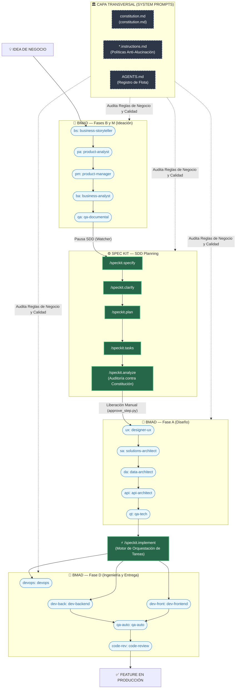
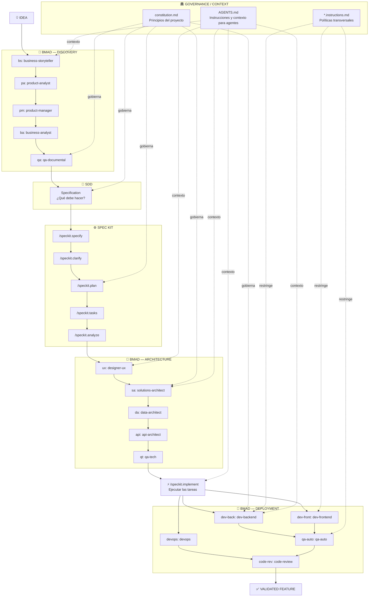

# Diagramas

## **Diagrama Operacional de Máquina de Estados (Flujo de Trabajo Secuencial)**

* Este diagrama ilustra la ejecución técnica del sistema y muestra exactamente por dónde viaja un ticket en la vida real.

* Está diseñado principalmente para el programador que debe escribir y gestionar el código del orquestador en Python.

* Destaca la mecánica interna del flujo al incluir nodos de enrutamiento, como la división en paralelismo y la posterior integración, además de los bucles de retroalimentación donde el código rechazado retorna desde la revisión al desarrollador backend.

```mermaid
flowchart TD
    %% Estilos de los Nodos
    classDef bmad fill:#1a365d,stroke:#2b6cb0,stroke-width:2px,color:#fff
    classDef speckit fill:#276749,stroke:#48bb78,stroke-width:2px,color:#fff,stroke-dasharray: 5 5
    classDef agent fill:#ebf8ff,stroke:#3182ce,stroke-width:1px,color:#2b6cb0
    classDef endpoint fill:#48bb78,stroke:#2f855a,stroke-width:2px,color:#fff
    classDef router fill:#ecc94b,stroke:#b7791f,stroke-width:2px,color:#000
    classDef gov fill:#2d3748,stroke:#cbd5e0,stroke-width:2px,color:#fff,stroke-dasharray: 5 5

    START(("💡 IDEA DE NEGOCIO")) --> BS

    subgraph GOVERNANCE ["🏛️ CAPA DE GOBERNANZA TRANSVERSAL (SYSTEM PROMPTS)"]
        direction LR
        CONST["constitution.md<br>(constitution.md)"]:::gov
        POLICIES["*.instructions.md<br>(Políticas Anti-Alucinación)"]:::gov
        AGISTRY["AGENTS.md<br>(Registro de Flota)"]:::gov
    end

    subgraph DISCOVERY ["Fábrica de Ideas (BMAD Fases B y M)"]
        direction TB
        BS(["bs: business-storyteller"]):::agent --> PA(["pa: product-analyst"]):::agent
        PA --> PM(["pm: product-manager"]):::agent
        PM --> BA(["ba: business-analyst"]):::agent
        BA --> QA_DOC(["qa: qa-documental"]):::agent
    end

    QA_DOC -- "Pausa SDD (Watcher: PRD & Gherkin)" --> SPEC

    subgraph SDD ["Puente SDD (GitHub Spec Kit Workflow)"]
        direction TB
        SPEC["/speckit.specify<br>(Formaliza la Especificación)"]:::speckit --> CLAR["/speckit.clarify<br>(Resuelve Ambigüedades)"]:::speckit
        CLAR --> PLAN["/speckit.plan<br>(Estrategia Técnica Macro)"]:::speckit
        PLAN --> TASKS["/speckit.tasks<br>(Genera Tickets Atómicos)"]:::speckit
        TASKS --> AN["/speckit.analyze<br>(Auditoría contra Constitución)"]:::speckit
    end

    AN -- "Liberación Manual (approve_step.py)" --> UX

    subgraph ARCHITECTURE ["Diseño Estructural (BMAD Fase A)"]
        direction TB
        UX(["ux: designer-ux"]):::agent --> SA(["sa: solutions-architect"]):::agent
        SA --> DA(["da: data-architect"]):::agent
        DA --> API(["api: api-architect"]):::agent
        API --> QT(["qt: qa-tech"]):::agent
    end

    QT -- "Tech Design Aprobado" --> IMP["⚡ /speckit.implement<br>(Despachador Automático de Tareas)"]:::speckit

    IMP -- "Enruta Trabajo (Lee AGENTS.md)" --> SPLIT{{"Paralelismo<br>de Ejecución"}}:::router

    subgraph DEPLOYMENT ["Fábrica de Código (BMAD Fase D)"]
        direction TB
        SPLIT --> DEVOPS(["devops: devops"]):::agent
        SPLIT --> DEV_B(["dev-back: dev-backend"]):::agent
        SPLIT --> DEV_F(["dev-front: dev-frontend"]):::agent

        DEV_B --> QA_A(["qa-auto: qa-auto"]):::agent
        DEV_F --> QA_A
        
        QA_A --> CR(["code-rev: code-review"]):::agent
        
        %% Bucle de corrección adversarial
        CR -. "❌ [RECHAZADO] Fallo VSA/Backend" .-> DEV_B
        CR -. "❌ [RECHAZADO] Fallo UI/Zoneless" .-> DEV_F
        
        CR -- "✅ [APROBADO]" --> MERGE{{"Integración y Despliegue"}}:::router
        DEVOPS -- "Infraestructura & CI/CD Listo" --> MERGE
    end

    MERGE --> END(("✅ FEATURE EN PRODUCCIÓN")):::endpoint

    %% Relaciones de Gobernanza Transversal (Lineas Punteadas)
    GOVERNANCE -. "Inyecta Contexto Inmutable" .-> DISCOVERY
    GOVERNANCE -. "Cruza Tareas vs Reglas" .-> AN
    GOVERNANCE -. "Fuerza Patrones (VSA/Zoneless)" .-> ARCHITECTURE
    GOVERNANCE -. "Rige Calidad y Seguridad" .-> DELIVERY
    GOVERNANCE -. "Indica a quién asignar la tarea" .-> IMP

    class DISCOVERY,ARCHITECTURE,DEPLOYMENT bmad
```

---

## **Diagrama de Capa Transversal (Cross-Cutting Concerns)**

* Este modelo visual detalla cómo la gobernanza funciona como un "System Prompt" global que envuelve a todo el ecosistema.

* Muestra que los principios del proyecto, el registro de agentes y las políticas no son pasos secuenciales, sino elementos que inyectan contexto inmutable desde la ideación hasta la entrega.

* Refleja cómo esta capa superior audita las reglas de negocio durante la planificación de Spec Kit, fuerza patrones arquitectónicos y rige la calidad y seguridad en la fase de desarrollo.

---

## **Diagrama de Arquitectura Lógica de Alto Nivel**

* Este gráfico actúa como un mapa conceptual diseñado para un CTO o Product Manager.

* Su objetivo es evidenciar quién pertenece a qué grupo de trabajo y cómo se estructuran las influencias dentro del ecosistema.

* Explica visualmente cómo el flujo de Spec Kit se posiciona y se intercala como puente entre los equipos de Discovery y Delivery.

