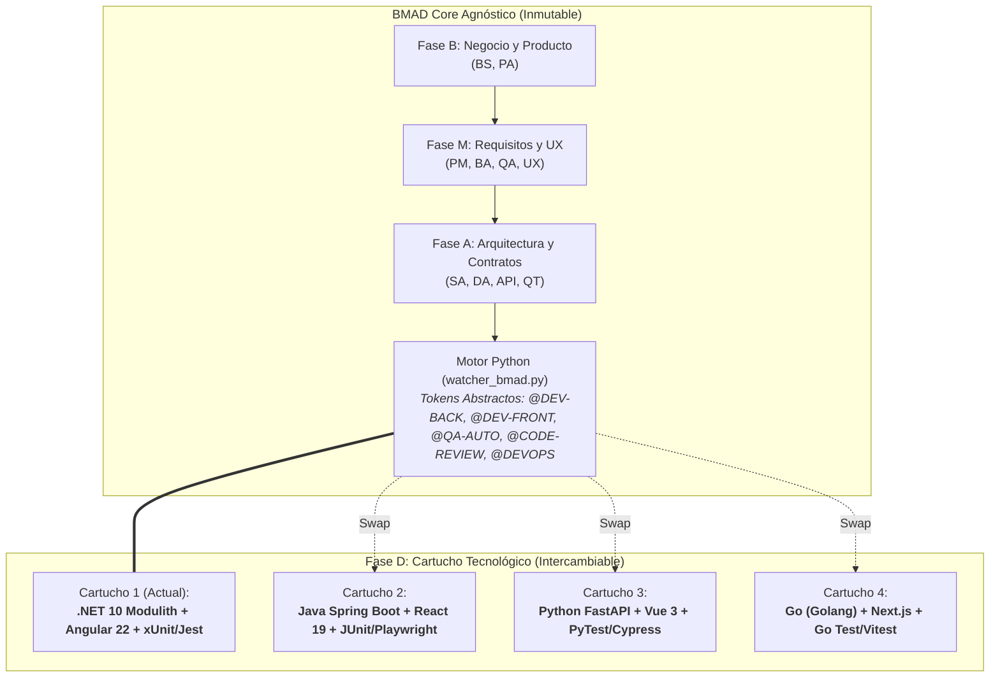
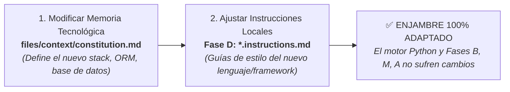

# Arquitectura de Cartucho Intercambiable (Pluggable Phase D)

> **Principio de Diseño BMAD:** El framework central, el ciclo de vida metodológico y el motor de orquestación en Python son **100% agnósticos de tecnología**. La Fase D (Ingeniería de Software y Entrega) opera como un **Cartucho Intercambiable (Plug & Play)** que puede acoplarse y desacoplarse a cualquier ecosistema tecnológico sin alterar el flujo general.

---

## 1. Filosofía de Desacoplamiento

El ecosistema BMAD divide la creación de software en 4 fases canónicas:
- **Fase B (Business):** Descubrimiento y definición del producto (`pb_*.md`).
- **Fase M (Management):** Alcance, desglose BDD/Gherkin y wireframes (`mvp_*.md`, `hu_*.md`, `ux_*.md`).
- **Fase A (Architecture):** Persistencia, contratos de red y TDD compilado (`db_*.md`, `api_*.md`, `tech-design_*.md`).
- **Fase D (Development & Delivery):** Construcción, pruebas automatizadas, auditoría SecOps e infraestructura.

Las **Fases B, M y A** producen especificaciones funcionales y técnicas puras (contratos de datos, esquemas de endpoints, wireframes y criterios de aceptación) que son universales e independientes del lenguaje de programación.

La **Fase D** implementa esos contratos. Para garantizar máxima flexibilidad empresarial, la Fase D está diseñada bajo el patrón de **Cartucho Intercambiable**:

---

## 2. Los 5 Roles Funcionales de la Fase D

En lugar de definir a los agentes por sus herramientas temporales, BMAD los define por sus **responsabilidades funcionales inmutables**:

| Agente | Rol Funcional Universal | Responsabilidad Metodológica |
|---|---|---|
| `dev-backend` | **Construcción de Lógica de Negocio y Servidor** | Implementa los endpoints, servicios, entidades de persistencia y lógica de dominio especificados en el TDD. |
| `dev-frontend` | **Construcción de Interfaces de Usuario y Clientes** | Implementa los componentes visuales, consumo de APIs, estado del cliente y navegación especificados en los wireframes y contratos. |
| `qa-auto` | **Automatización y Cobertura de Pruebas** | Diseña y ejecuta baterías de pruebas automáticas (unitarias, integración, e2e) con cobertura estricta de Criterios de Aceptación (Zero-Tautology). |
| `code-review` | **Auditoría SecOps, Calidad y Gatekeeper** | Inspecciona físicamente el código fuente y las pruebas, validando seguridad (OWASP, inyecciones, IDOR), resiliencia y emite el dictamen formal `[APROBADO]` / `[RECHAZADO]`. |
| `devops` | **Infraestructura, Contenedores y SRE** | Diseña los contenedores de despliegue, configuración de servicios auxiliares (Docker Compose), variables de entorno y pipelines de CI/CD. |

---

## 3. Protocolo de "Desenganche" y Cambio de Stack

Para migrar el enjambre hacia un nuevo stack tecnológico (por ejemplo, de *.NET / Angular* a *Java Spring Boot / React*), **NO se modifica el núcleo del framework**. Se ejecutan exclusivamente estos 2 pasos:

### Paso 1: Actualizar el Cerebro Tecnológico (`files/context/constitution.md`)
Declara la nueva arquitectura en el archivo de contexto:
- Lenguaje backend y runtime (ej. Java 21 LTS, Node.js 22 LTS, Go 1.23, Python 3.12).
- Framework backend (ej. Spring Boot 3, NestJS, FastAPI, Gin).
- Motor de persistencia y ORM (ej. PostgreSQL 16 con Hibernate/Prisma/SQLAlchemy).
- Framework frontend (ej. React 19, Vue 3, Svelte 5, Next.js).
- Frameworks de prueba (ej. JUnit 5, Mockito, PyTest, Playwright, Vitest).

### Paso 2: Ajustar las Reglas Locales de la Fase D (`.instructions.md`)
Dentro de las carpetas de los 5 agentes de la Fase D, actualiza o adapta sus archivos `.instructions.md`:
- `dev-backend/instructions/`: Configura la estructura de carpetas (ej. Hexagonal, Clean Architecture, Feature Folders) y linters del nuevo lenguaje.
- `dev-frontend/instructions/`: Establece el sistema de diseño (ej. Tailwind, Shadcn, Material UI) y manejo de estado.
- `qa-auto/instructions/`: Define los comandos de ejecución del nuevo test runner (ej. `mvn test`, `pytest`, `npm test`).
- `code-review/instructions/`: Ajusta las reglas estáticas y firmas de seguridad propias del nuevo ecosistema.
- `devops/instructions/`: Adapta los Dockerfiles multi-stage para compilar los nuevos artefactos (ej. JAR, wheels, binarios estáticos).

### Paso 3: Cero Modificaciones en el Motor de Orquestación
El motor Python (`watcher_bmad.py`, `utils/approve_step.py`, `utils/start_agents.py`):
- **Permanece intacto**: El enrutamiento depende exclusivamente de los tags canónicos abstractos:
  - `@DEV-BACK:`
  - `@DEV-FRONT:`
  - `@QA-AUTO:`
  - `@CODE-REVIEW:`
  - `@DEVOPS:`
- Los agentes se comunican por el tracker exactamente de la misma forma, independientemente de si compilan C#, Java, TypeScript, Python o Rust.

---

## 4. Ejemplos de Cartuchos Tecnológicos Homologados

### Cartucho A: .NET Modulith & Angular (Plantilla Base de Referencia)
- **Backend:** .NET 8/10, C# 12, Vertical Slice Architecture, Carter, MediatR, Mapster, FluentValidation.
- **Frontend:** Angular 22 Zoneless con Signals, PrimeNG, TypeScript.
- **Persistencia:** PostgreSQL con esquemas separados por módulo.
- **Testing:** xUnit, Testcontainers, FluentAssertions.

### Cartucho B: Java Enterprise Cloud-Native
- **Backend:** Java 21 LTS, Spring Boot 3.3, Spring Data JPA / Hibernate, MapStruct.
- **Frontend:** React 19, Next.js 15, Tailwind CSS, TanStack Query.
- **Persistencia:** PostgreSQL / MySQL con Liquibase/Flyway.
- **Testing:** JUnit 5, Mockito, Testcontainers, Playwright.

### Cartucho C: Python Fast-API & Microservicios
- **Backend:** Python 3.12, FastAPI, Pydantic v2, SQLAlchemy 2.0 (asyncio).
- **Frontend:** Vue 3 (Composition API), Nuxt 3, Pinia, Tailwind CSS.
- **Persistencia:** PostgreSQL / MongoDB (Motor async).
- **Testing:** PyTest, pytest-asyncio, Playwright.

### Cartucho D: High-Performance Go & Modern Web
- **Backend:** Go 1.23, Standard Library / Chi router, SQLC, pgx.
- **Frontend:** SvelteKit 2 / TypeScript o HTMX + Tailwind.
- **Persistencia:** PostgreSQL / Redis.
- **Testing:** Go testing package, Testify, Vitest.

---

## 5. Resumen de Garantías Arquitectónicas

1. **Agnosticismo Total:** Ninguna regla de negocio ni contrato de arquitectura se contamina con la sintaxis del lenguaje de programación.
2. **Portabilidad Inmediata:** Un requerimiento documentado en BMAD puede compilarse en .NET hoy y re-compilarse en Java o Go mañana simplemente intercambiando las instrucciones de la Fase D.
3. **Respeto a la Lex Superior:** El archivo `constitution.md` mantiene soberanía absoluta sobre cualquier cartucho activo, impidiendo desviaciones o complacencia algorítmica.
