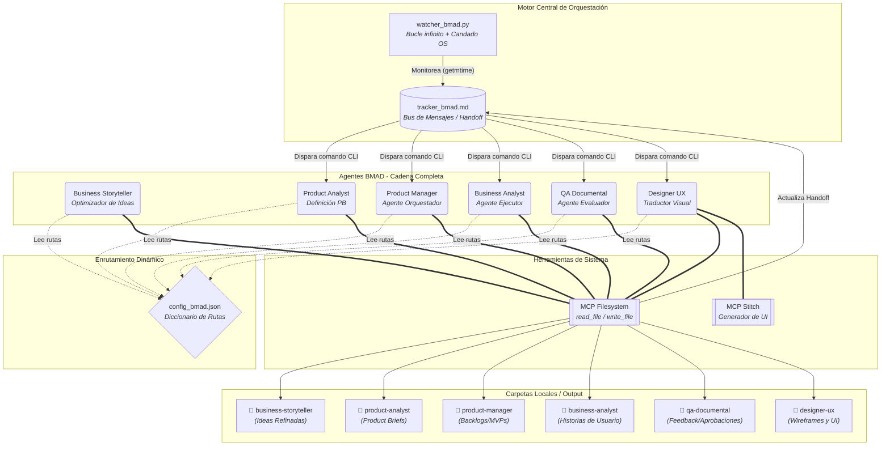
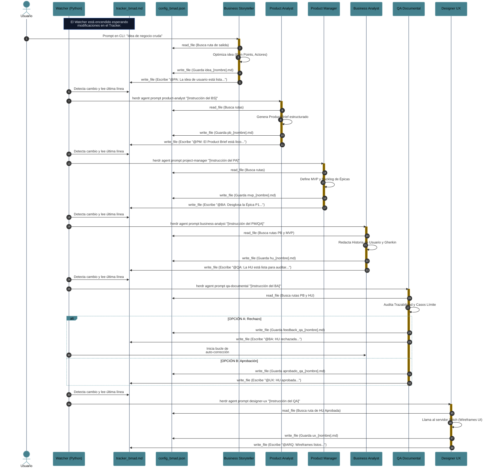

# Ecosistema Multi-Agente BMAD con Herdr

**Capacidades del Ecosistema Multi-Agente (BMAD)**

* **Orquestación Asíncrona Descentralizada:** Diseñé un pipeline completo de agentes (Business Storyteller, Product Analyst, Product Manager, Business Analyst, QA Documental y Diseñador UX) que operan sobre Herdr de forma independiente, a los cuales coordino mediante un único archivo de estado (`tracker_bmad.md`).
* **Inyección Atómica en Terminales (TTY):** Implementé la resolución dinámica de IDs de paneles en tiempo de ejecución para inyectar comandos directamente a los procesos de Agy mediante `herdr pane run`.
* **Integración Avanzada de MCP:** Habilité el uso autónomo del sistema de archivos (`read_file`, `write_file`) para que mis agentes lean configuraciones JSON globales, extraigan contexto de documentos previos y generen nuevos entregables markdown en rutas específicas.
* **Discovery Interactivo (HITL):** Le di al agente BS la capacidad de detener la automatización, evaluar la ambigüedad de una idea y dialogar conmigo antes de inyectar los requerimientos al sistema.
* **Gestión de Concurrencia y Contrapresión (Backpressure):** Programé mi orquestador (`watcher_bmad.py`) para que monitoree el estado en tiempo real (`idle`, `working`) de cada panel, reteniendo instrucciones en memoria RAM si el agente destinatario está ocupado, previniendo así colisiones de búfer.
* **Ruteo Dinámico de Mensajes Parcelados:** Añadí soporte para "Handoffs Múltiples" en una sola línea (ej. el QA despertando al UX y al PM simultáneamente), donde mi sistema parsea y entrega a cada agente exclusivamente su fragmento de la orden.
* **Tolerancia a Fallos y Reconciliación de Estado (Boot Sequence):** Centralicé la lógica de orquestación en el PM, dotándolo de la capacidad de leer el historial del tracker tras un reinicio del servidor, comparar las tareas delegadas contra las aprobadas por el QA, y revivir procesos huérfanos sin romper el backlog.
* **Trazabilidad Continua:** Integré un control de versiones automatizado que ejecuta commits en Git de forma silenciosa por cada tarea que el ecosistema procesa exitosamente.
* **Despliegue Interactivo de Entornos:** Escribí un script de consola modular (`create_agents.py`) que me permite seleccionar numéricamente qué agentes instanciar, validando y distribuyendo los prompts automáticamente.

**Los problemas estructurales y lógicos que solucioné:**

* **Bloqueo de Canal Interactivo:** Noté que los comandos estándar de Herdr (`agent prompt`) no lograban activar a los agentes de Agy; lo solucioné auditando la CLI e implementando envíos directos de pulsaciones de teclado al panel.
* **Restricciones de Sandbox (Access Denied):** Mis agentes no podían leer el `config_bmad.json` ni los archivos de sus compañeros. Lo corregí inyectando el flag de elevación de privilegios `--add-dir` en la raíz del proyecto durante el arranque.
* **Aniquilación de Historial:** Me di cuenta de que la herramienta MCP `write_file` sobrescribía el tracker completo. Para evitarlo, diseñé un patrón estricto de anexión (`read` -> `concat \n` -> `write`).
* **Sangrado de Instrucciones (Instruction Bleed):** Al ordenar a los LLMs que usaran una línea continua bajo una "regla inquebrantable" o la automatización fallaría, los modelos entraban en pánico y eliminaban todos los saltos de línea (incluso los del sistema de archivos). Lo solucioné aislando las reglas de formato de redacción de las instrucciones mecánicas de guardado.
* **Desconexión de Cadena (Handoff Ciego):** Mi PM generaba el Backlog pero no le indicaba al BA en qué archivo leerlo. Corregí las plantillas para pasar siempre la referencia exacta del documento generado.
* **Trampa del Bucle Infinito en el Watcher:** Mi script original solo leía si la fecha del archivo cambiaba, dejando tareas atrapadas si un agente estaba ocupado. Lo reescribí usando un patrón de "Línea Pendiente" que bombardea el intento hasta que el ecosistema está libre.
* **Amnesia de Tránsito:** Sufría la pérdida de tareas (como una Épica atorada) ante caídas de red o falta de tokens. Lo solucioné retirando la dependencia de la memoria local y forzando al PM a utilizar el tracker como su única "fuente de la verdad" para reconciliar el avance del equipo.

---


**Un poco de historia**

Mi viaje para construir este ecosistema comenzó con un desafío arquitectónico ambicioso: lograr que múltiples inteligencias artificiales colaboraran en un pipeline de desarrollo de software complejo, no mediante llamadas de API estáticas, sino operando como entidades vivas en terminales independientes. La visión era clara, pero el entorno técnico presentó resistencia inmediata.

Mi primera barrera fue de comunicación pura. Tenía a los agentes despiertos en sus paneles, pero estaban aislados. Intenté hablarles por los canales oficiales, pero el backend no interceptaba los eventos. Al bajar al nivel de la terminal virtual y utilizar la inyección directa de texto, logré abrir el flujo de datos. Inmediatamente después, choqué con la seguridad del Model Context Protocol; los agentes estaban encerrados en sandboxes que les impedían leer la configuración global o pasarse archivos. Tuve que reconfigurar los permisos de arranque desde la raíz para unificar su acceso al disco.

Una vez que pudieron leer y escribir, me enfrenté a la naturaleza impredecible de los LLMs interactuando con sistemas deterministas. Observé cómo el instinto de la herramienta MCP borraba el historial completo de mi rastreador en cada turno. Les enseñé a leer antes de escribir, pero entonces descubrí un fenómeno fascinante: el "sangrado de instrucciones". Al amenazar al modelo con que el sistema fallaría si usaba saltos de línea en su mensaje, la IA aplicó esa restricción de forma tan severa que saboteó el formato del propio archivo de texto. Tuve que aplicar ingeniería de prompts para relajar las instrucciones, separando el "cómo redactas" del "cómo guardas", logrando por fin un historial limpio y acumulativo.

Con la comunicación estable, el reto evolucionó de lineal a asíncrono. Cuando los agentes empezaron a trabajar a máxima velocidad, las instrucciones colisionaban. El Watcher disparaba órdenes mientras aún estaban procesando tareas anteriores, perdiendo información en el vacío. Tuve que dotar al orquestador de consciencia, enseñándole a interrogar el estado de cada panel (working vs idle) y a aplicar contrapresión, reteniendo las tareas en memoria hasta que el agente estuviera listo para escuchar. Finalmente, sellé la resiliencia del sistema dándole al Product Manager la capacidad de leer el estado global tras un apagón, detectar si el QA había dejado alguna Historia de Usuario huérfana, y retomar la orquestación exactamente donde se había quedado. Lo que empezó como un script que leía un archivo de texto, se convirtió en una máquina de estados robusta, tolerante a fallos y completamente desatendida.

---


# Manual de Uso

Este repositorio contiene la configuración y la guía detallada para ejecutar un flujo de desarrollo de software totalmente autónomo basado en la metodología **BMAD (Business, Management, Architecture, Development)**. El ecosistema integra orquestación en terminal mediante **Herdr**, automatización mediante un _Watcher_ en Python y gestión de archivos físicos distribuidos vía herramientas MCP.

## 📁 1. Estructura del Proyecto

El ecosistema requiere una jerarquía de carpetas estandarizada en la raíz de tu proyecto para separar la configuración, la memoria de los agentes y los archivos físicos. Asegúrate de contar con la siguiente estructura base:

Plaintext

```
/tu-proyecto-raiz/
├── agents/               # Directorios de entorno virtual para los paneles de Herdr
├── files/                # Sistema de almacenamiento de salidas y estado
│   ├── business-storyteller/ # Salida de Idea de Usuario Refinada
│   ├── product-analyst/  # Salida de Products Briefs
│   ├── product-manager/  # Salida de Backlogs y MVPs
│   ├── business-analyst/ # Salida de Historias de Usuario (HU)
│   ├── qa-documental/    # Salida de reportes de auditoría y feedback
│   ├── designer-ux/      # Salida de wireframes y enlaces UI
│   └── tracker_bmad.md   # Bus de mensajes unificado para el handoff entre agentes
├── prompts/              # System Prompts de cada agente
│   ├── bs.md             # System Prompt del Business Storyteller
│   ├── pa.md             # System Prompt del Product Analyst
│   ├── pm.md             # System Prompt del Project Manager
│   ├── ba.md             # System Prompt del Business Analyst
│   ├── qa.md             # System Prompt del QA Documental
│   └── ux.md             # System Prompt del Diseñador UX
├── config_bmad.json      # Diccionario de rutas absolutas para las herramientas MCP
└── watcher_bmad.py       # Script orquestador (Bucle infinito + Candado OS)
```

_(Nota: Las subcarpetas dentro de `files/` corresponden a las áreas de trabajo de cada rol)._

## 🚀 2. Configuración y Arranque Inicial

La arquitectura mantiene a todos los agentes vivos en memoria, permitiendo que el orquestador enrute los mensajes de forma autónoma.

### ⚙️ Personalización de Rutas (Reemplazo Obligatorio)

Al clonar o adaptar este plantilla a un nuevo entorno o proyecto, debes reemplazar todas las referencias a la ruta absoluta original (`D:\Paulo\Cursos\DMC\template-bmad`) por la ruta absoluta correspondiente a tu nuevo directorio raíz (ej. `C:\Ruta\A\TuProyecto`).

A continuación se detalla la lista completa de ubicaciones donde se debe realizar dicho reemplazo:

1. **Configuración General (`config_bmad.json`)**:
   - Reemplazar todas las rutas de carpetas de agentes y el archivo tracker (`tracker_bmad.md`).
2. **Orquestador (`watcher_bmad.py`)**:
   - Línea 6: Actualizar la constante `TRACKER_PATH`.
3. **Configuracion de Prompts (`prompts/`)**:
   - Cambiar el valor de `RUTA_CONFIGURACION` (Línea 4) en:
     - `prompts/bs.md`, `prompts/pa.md`, `prompts/pm.md`, `prompts/ba.md`, `prompts/qa.md`, `prompts/ux.md`
     - `agents/business-storyteller/AGENTS.md`
     - `agents/product-analyst/AGENTS.md`
     - `agents/product-manager/AGENTS.md`
     - `agents/business-analyst/AGENTS.md`
     - `agents/qa-documental/AGENTS.md`
     - `agents/designer-ux/AGENTS.md`
4. **Comandos de Herdr (`README.md`)**:
   - Actualizar los argumentos `--add-dir` en los comandos de arranque de paneles de Herdr indicados abajo.

---

### Paso 1: Levantar los Paneles de Herdr (Inicialización en frío)

Debes crear los espacios de trabajo e inicializar a los 6 agentes en sus respectivos paneles para que estén listos para escuchar comandos. Ejecuta esto en tu terminal (adaptando el comando según tu CLI):

PowerShell

```
# 1. Business Storyteller
New-Item -ItemType Directory -Force .\agents\business-storyteller
Copy-Item ".\prompts\bs.md" .\agents\business-storyteller\AGENTS.md
herdr pane split --current --direction right --cwd .\agents\business-storyteller
herdr agent start business-storyteller --kind agy --pane wF:p1 -- --add-dir "D:\Paulo\Cursos\DMC\template-bmad"

# 2. Product Analyst
New-Item -ItemType Directory -Force .\agents\product-analyst
Copy-Item ".\prompts\pa.md" .\agents\product-analyst\AGENTS.md
herdr pane split --current --direction down --cwd .\agents\product-analyst
herdr agent start product-analyst --kind agy --pane wF:p3 -- --add-dir "D:\Paulo\Cursos\DMC\template-bmad"

# Repite el proceso
herdr agent start product-manager --kind agy --pane wF:p4 -- --add-dir "D:\Paulo\Cursos\DMC\template-bmad"
herdr agent start business-analyst --kind agy --pane wF:p2 -- --add-dir "D:\Paulo\Cursos\DMC\template-bmad"
herdr agent start qa-documental --kind agy --pane wF:p5 -- --add-dir "D:\Paulo\Cursos\DMC\template-bmad"
herdr agent start designer-ux --kind agy --pane wF:p6 -- --add-dir "D:\Paulo\Cursos\DMC\template-bmad"
```

### Paso 2: Activar el Motor de Automatización (Watcher)

Abre una nueva pestaña en tu terminal (fuera de los paneles de los agentes) e inicia el script de Python. El script aplicará el candado del sistema operativo y quedará a la espera:

Bash

```
python watcher_bmad.py
```

## 🛠️ 3. Modalidad de Ejecución Independiente y Desacople (Fase Business)

No es obligatorio que los agentes **Business Storyteller (BS)** y **Product Analyst (PA)** operen estrictamente dentro del flujo encadenado. Si deseas utilizarlos como herramientas independientes para refinar ideas o redactar _Product Briefs_ puntuales sin que el orquestador intervenga, debes retirarlos del alcance del script de Python.

### Desacople en el Watcher

Para evitar que el Watcher procese a estos agentes automáticamente, edita el archivo `watcher_bmad.py` y comenta (o elimina) las líneas correspondientes a `@BS:` y `@PA:` dentro del diccionario `agentes` en la función `procesar_tracker`:

Python

```
def procesar_tracker(ultima_linea):
    linea = ultima_linea.strip()
    
    # Mapeo de las etiquetas con el ID exacto del agente en Herdr
    agentes = {
        # "@BS:": "business-storyteller",   # COMENTADO: Fuera del flujo automático
        # "@PA:": "product-analyst",        # COMENTADO: Fuera del flujo automático
        "@PM:": "product-manager",  # Almacena el product backlog y las instrucciones
        "@BA:": "business-analyst",  # Almancena las historias de usuario
        "@QA:": "qa-documental",    # Almacena las historias de usuario aprobadas
        "@UX:": "designer-ux"   # Almacena las propuestas de diseño
    }
# ... (resto del script sin alteraciones)
```

### Ejecución Manual de Agentes Independientes

Con los agentes desacoplados, puedes ejecutarlos a voluntad utilizando cualquiera de estos tres métodos directamente en tu terminal:

**Opción A: Ingresando el texto en el chat (Uso de etiquetas XML)** Envía el texto crudo encapsulado en sus etiquetas correspondientes directamente por la CLI:

Bash

```
herdr agent prompt product-analyst "<idea_usuario>Necesito un bot de WhatsApp para mi veterinaria, solo para consultas, no urgencias.</idea_usuario>"
```

**Opción B: Ingresando el nombre del archivo generado** Si ya generaste un archivo markdown con el insumo en la carpeta correspondiente, puedes despertar al agente pasándole solo el nombre del archivo. El agente usará el `config_bmad.json` para extraer el contenido:

Bash

```
herdr agent prompt product-analyst "idea_veterinaria.md"
```

**Opción C: Actualizando manualmente el tracker_bmad.md** Si mantuviste al PA dentro del Watcher pero decidiste no usar al BS, puedes disparar el flujo autónomo a partir del Product Analyst abriendo tu archivo `files/tracker_bmad.md` y escribiendo manualmente:

Markdown

```
@PA: La idea de usuario está lista en el archivo idea_veterinaria.md. Procede con la creación del PRODUCT BRIEF.
```

## 🔄 4. Flujo de Trabajo Autónomo (Guía End-to-End)

Si decides mantener a los 6 agentes en el diccionario del `watcher_bmad.py`, el proceso completo de definición de software se ejecuta en cadena.

### Fase 1: Disparo Inicial (Ingreso de la Idea Cruda)

Interactúas directamente con el **Business Storyteller (BS)** entregándole la idea de negocio informal a través de un prompt en su panel:

Bash

```
herdr agent prompt business-storyteller "Quiero un bot de WhatsApp para mi veterinaria 'Patitas'. La gente llama mucho para sacar citas y a veces no contestamos..."
```

_A partir de este punto, el sistema opera sin intervención humana._

### Fase 2: Refinamiento y Product Brief (Fase Business)

1. **El Business Storyteller (BS):** Optimiza la idea cruda inyectando el dolor de negocio y agrupando actores. Guarda el archivo `idea_veterinaria.md` y actualiza automáticamente el Tracker escribiendo `@PA: La idea de usuario está lista...`.
    
2. **El Product Analyst (PA):** El Watcher detecta la línea, despierta al PA. Este lee la idea optimizada, estructura el **Product Brief (PRD)**, guarda su archivo `pb_veterinaria.md` y actualiza el Tracker escribiendo `@PM: El Product Brief está listo...`.
    

### Fase 3: Orquestación y Análisis (Fase Management)

1. **El Project Manager (PM):** Despertado por el Watcher, lee el Product Brief, redacta la visión estratégica y prioriza el **Backlog del MVP**. Guarda el documento y delega el trabajo en el Tracker (`@BA: Desglosa la Épica 1...`).
    
2. **El Business Analyst (BA):** Lee el MVP y el PB, redacta la **Historia de Usuario** atómica utilizando sintaxis Gherkin (BDD), guarda la especificación y solicita la auditoría (`@QA: La historia está lista...`).
    

### Fase 4: Auditoría y Auto-Corrección (QA)

El agente **QA Documental** cruza la Historia de Usuario contra el Product Brief original. Ocurre una bifurcación lógica:

- **Ruta de Rechazo (Bucle Autónomo):** Si detecta flujos alternativos faltantes (_Sad Paths_), genera un reporte de _feedback_ y devuelve la tarea (`@BA: La historia fue RECHAZADA...`). El Watcher despierta al BA, quien corrige el documento y vuelve a invocar al QA.
    
- **Ruta de Aprobación:** Si la historia es hermética, el QA genera el certificado y despierta al siguiente eslabón (`@UX: Historia aprobada...`).
    

### Fase 5: Traducción Visual (UX)

El **Designer UX** lee la historia aprobada, se conecta al servidor MCP de Stitch para inicializar el proyecto y generar los estados visuales (wireframes) correspondientes a cada escenario Gherkin. Guarda su reporte y notifica al área técnica (`@ARQ: Wireframes listos...`).

## 📊 5. Diagramas de Arquitectura y Secuencia

A continuación se detalla la topología física y el flujo asíncrono del sistema.

### Arquitectura Física y Lógica (Ecosistema BMAD)



---

### Flujo de Trabajo (Secuencia Asíncrona)



---


## Algunas preguntas técnicas _ antes que me las hagan _

### 1. Arquitectura y Gestión de Estado

**Pregunta:** ¿Por qué decidiste utilizar un archivo Markdown (`tracker_bmad.md`) como gestor de estado y orquestación en lugar de una base de datos transaccional (como PostgreSQL) o un gestor de colas (como RabbitMQ)?

**Respuesta:**
Decidí usar un archivo Markdown porque mi prioridad era mantener la compatibilidad nativa con el Model Context Protocol (MCP) y asegurar la observabilidad humana. Un archivo de texto actúa como un *Event Sourcing* de solo adición (append-only log). Los agentes LLM son excelentes leyendo y analizando texto plano para extraer contexto; al usar Markdown, no necesito construir APIs intermedias para que consulten una base de datos. Además, al forzar la regla estricta de "leer, concatenar salto de línea y escribir", evito la sobrescritura del historial. Es una solución altamente desacoplada, ligera y auditable en tiempo real.

### 2. Concurrencia y Control de Tráfico

**Pregunta:** Al inyectar comandos directamente en las terminales (TTY), ¿cómo evitas las colisiones de búfer o *race conditions* si el orquestador envía una instrucción mientras el agente aún está procesando la anterior?

**Respuesta:**
Implementé un mecanismo de contrapresión (*backpressure*) directamente en el Watcher. El script no dispara las instrucciones a ciegas; primero consulta el panel de Herdr dinámicamente para leer el estado del agente (`idle` o `working`). Si el agente destinatario está ocupado, el Watcher retiene la instrucción en una variable de memoria RAM como "línea pendiente" y aborta la inyección. En el siguiente ciclo de sondeo, vuelve a intentarlo. Esto crea una cola asíncrona implícita que previene las colisiones en la terminal y permite que múltiples agentes (como el UX y el BA) trabajen en paralelo a distintos ritmos.

### 3. Ingeniería de IA y Comportamiento de Modelos

**Pregunta:** ¿Cómo lograste estabilizar el uso de herramientas (Tool Use) de los agentes? Es común que los LLMs rompan los formatos JSON o de texto cuando se les imponen reglas muy estrictas.

**Respuesta:**
Me enfrenté a un fenómeno que bauticé como "sangrado de instrucciones" (*instruction bleed*). Al principio, amenazaba a los agentes en el prompt diciéndoles que "la automatización fallaría" si usaban saltos de línea en sus entregables. El modelo entraba en un modo de sobre-precaución tan alto que eliminaba incluso el salto de línea (`\n`) que le pedía usar mecánicamente con la herramienta MCP, destruyendo el historial. Lo solucioné aplicando aislamiento de contexto: separé explícitamente las "reglas de redacción de texto" de las "instrucciones mecánicas de guardado". Al suavizar la amenaza técnica y delimitar las responsabilidades, los modelos empezaron a usar el `read_file` y `write_file` con precisión quirúrgica.

### 4. Tolerancia a Fallos y Sistemas Distribuidos

**Pregunta:** En una arquitectura distribuida sin estado (*stateless*), ¿cómo se recupera tu sistema de una "muerte silenciosa", por ejemplo, si el servidor se reinicia o si un agente se queda sin tokens en medio de una Épica?

**Respuesta:**
Resolví la "amnesia de tránsito" centralizando la lógica de reconciliación de estado en el Product Manager mediante una *Boot Sequence* (Secuencia de Arranque). Cuando el sistema se reinicia, el PM no se fía de su memoria volátil. Primero verifica si el archivo del Producto Mínimo Viable (`mvp.md`) ya existe. Si es así, lee el tracker completo y busca cuál fue la última Épica que recibió un estado de APROBADO por el QA Documental. Si el PM nota que envió la Épica 4 pero nunca hubo respuesta del QA, deduce que el proceso murió en tránsito y vuelve a disparar la instrucción para la Épica 4. Es un orquestador auto-reparable.

### 5. Ruteo y Desacoplamiento

**Pregunta:** ¿Cómo manejas el *Handoff* cuando un agente necesita detonar procesos en múltiples agentes a la vez sin que se contaminen los contextos?

**Respuesta:**
Desarrollé un ruteo dinámico de mensajes parcelados en el orquestador de Python. Cuando el QA Documental aprueba una Historia de Usuario, emite una sola línea en el tracker que contiene dos etiquetas, por ejemplo: `@UX: haz los wireframes. @PM: asigna la siguiente épica`. El Watcher parsea esa línea, identifica todas las etiquetas presentes y fragmenta el string. Al agente UX solo le inyecta su porción del texto, y al PM la suya. Esto evita que los agentes lean instrucciones que no les corresponden, reduciendo el consumo de tokens y evitando alucinaciones por contexto cruzado.

### 6. Escalabilidad (Scalability & Cuellos de Botella)

**Pregunta:** Tu sistema actual usa un script `watcher.py` leyendo un archivo de texto (`tracker_bmad.md`) en un bucle local. ¿Cómo escalarías esta arquitectura si necesitaras gestionar 50 agentes o procesar múltiples proyectos simultáneamente sin que la lectura/escritura del disco se convierta en un cuello de botella?

**Respuesta:**
Es cierto que usar el *file system* tiene un límite físico de IOPS. Concebí el `tracker_bmad.md` para la fase inicial porque me da visibilidad y trazabilidad inmediata. Para escalar horizontalmente, abstraería el tracker y lo reemplazaría por un *Message Broker* o un sistema *Pub/Sub* (como Redis Streams o Apache Kafka), manteniendo exactamente el mismo patrón de "append-only log" (registro de solo adición). Como mis agentes son agnósticos al sistema y solo usan herramientas de MCP (Model Context Protocol), bastaría con crear un servidor MCP personalizado que, en lugar de ejecutar `read/write` en el disco local, publique y consuma mensajes del broker. La lógica de contrapresión (*backpressure*) que ahora tengo en el Watcher pasaría a ser gestionada de forma natural por los *consumer groups* del broker.

### 7. Seguridad y Sandboxing

**Pregunta:** Mencionaste que tuviste que inyectar el flag `--add-dir` en la raíz del proyecto para que los agentes pudieran usar MCP y pasarse archivos entre sí. ¿No supone esto un riesgo de seguridad masivo, permitiendo que un agente modifique configuraciones del sistema o borre el trabajo de los demás?

**Respuesta:**
Completamente, es el trade-off clásico entre interoperabilidad y seguridad. Lo resolví aplicando el principio de mínimo privilegio (*Least Privilege*) a nivel de la ingeniería del prompt y de variables de entorno, delimitando qué carpetas (ej. `CARPETA_ENTRADA` y `CARPETA_SALIDA`) puede tocar cada agente. Sin embargo, a nivel de arquitectura dura, la solución para llevar esto a producción es implementar un "Proxy MCP". En lugar de darles acceso directo al sistema de archivos local, los agentes se conectarían a un servidor MCP intermedio configurado por mí. Este proxy interceptaría los comandos y aplicaría un Control de Acceso Basado en Roles (RBAC), validando, por ejemplo, que el "QA Documental" tenga permisos de solo lectura (`R`) sobre la carpeta del "Product Manager" y escritura (`W`) únicamente en su propia carpeta de reportes.

### 8. Observabilidad y Debugging Silencioso

**Pregunta:** Depurar pipelines de LLMs asíncronos suele ser una pesadilla porque fallan de manera impredecible. Si la cadena se rompe o un modelo empieza a alucinar datos, ¿cómo auditas la ejecución paso a paso sin un motor de *traces* tradicional (como LangSmith o Datadog)?

**Respuesta:**
Esa fue una de las razones principales para usar un enfoque basado en archivos e integrarlo con Git. Mi observabilidad se basa en dos pilares nativos. Primero, el `tracker_bmad.md` actúa como un log de eventos de negocio legible por humanos; con abrirlo sé al instante en qué fase estamos. Segundo, le inyecté al Watcher un mecanismo de *auto-commits*. Cada vez que un agente finaliza un entregable y el Watcher entrega la instrucción exitosamente, se dispara un `git commit` silencioso. Si descubro que un archivo tiene alucinaciones, simplemente hago un `git log` o `git diff` para aislar el momento exacto y el agente (autor del commit) que introdujo la falla, restauro el repositorio al estado previo, y obligo a ese agente a reprocesar. Es un control de estado nativo, sin *overhead* de plataformas externas.

### 9. Justificación del Model Context Protocol (MCP)

**Pregunta:** ¿Por qué utilizaste el estándar MCP para las acciones del sistema en lugar de usar flujos basados en llamadas a funciones (*Function Calling*) nativas de la API, o frameworks pesados como LangChain, AutoGen o CrewAI?

**Respuesta:**
Decidí usar MCP porque priorizo el desacoplamiento absoluto y evitar el *vendor lock-in* (dependencia del proveedor). Frameworks como CrewAI o LangChain introducen capas de abstracción muy pesadas que te atan a sus propias lógicas de ruteo. Al mantener a mis agentes como procesos puros en la CLI (Herdr) y utilizar MCP para sus "sentidos" (leer/escribir), traté al sistema de archivos como una API estandarizada. La ventaja es que si mañana quiero cambiar el "cerebro" del agente QA de un modelo de OpenAI a un modelo de Anthropic o Llama, solo cambio una variable de entorno. La forma en la que el agente interactúa con el mundo (MCP) se mantiene idéntica, sin tener que reescribir ni una sola línea del código de integración.

### 10. Mecánica del Human-in-the-Loop (HITL)

**Pregunta:** Has mencionado que el agente Business Storyteller (BS) tiene la capacidad de detener la automatización para realizar un *Discovery* interactivo contigo. ¿Cómo logras que esta pausa humana no bloquee el hilo principal del orquestador asíncrono y colapse el Watcher?

**Respuesta:**
Lo logro porque mi asincronía está basada en el sondeo pasivo de eventos (*polling*), no en hilos bloqueados (*blocking threads*). El Watcher reacciona única y exclusivamente cuando se detecta una nueva línea en el tracker. Cuando el BS identifica ambigüedad en mis ideas, no escribe la instrucción de delegación (`@PA:`) en el tracker; en su lugar, se queda interactuando conmigo directamente en su panel de la terminal. Durante ese tiempo, su estado en el sistema es `idle` o `working` procesando mis respuestas, pero como no ha inyectado el disparador en el archivo central, el Watcher lo ignora y sigue verificando si hay tráfico para el resto del equipo. Es un bloqueo lógico a nivel de negocio, no un bloqueo de recursos computacionales. Solo cuando le doy mi aprobación, el BS redacta el requerimiento, usa MCP para guardarlo y notifica al tracker, despertando al siguiente eslabón.

### 11. Condición de Carrera en el Gestor de Estado (Race Condition)

**Pregunta:** ¿Qué pasaría si, por ejemplo, el BA termina de escribir los Criterios de Aceptación y, exactamente en el mismo milisegundo, el BS termina de dialogar con el usuario y ambos intentan actualizar el `tracker_bmad.md` usando sus herramientas MCP? ¿No se sobrescribiría el archivo o se corrompería el historial al no tener un bloqueo de base de datos?

**Respuesta:**
Es un escenario clásico de condición de carrera. Como dependo del sistema de archivos local y el estándar MCP no implementa un bloqueo de escritura nativo (file lock) a nivel de SO, existe un riesgo marginal de colisión si la acción es literalmente simultánea. Sin embargo, mitigo este riesgo en la capa de orquestación. Los agentes de Agy no se ejecutan en paralelo absoluto frente al Watcher, sino que están desacoplados. Si llegara a ocurrir una colisión física que corrompa el formato del texto, mi mecanismo de trazabilidad continua actúa como red de seguridad. Como el Watcher hace un `git commit` silencioso por cada instrucción exitosa, si noto una corrupción visual en el tracker, simplemente detengo el script, hago un `git restore` al commit anterior (que ocurrió segundos antes) y dejo que el PM ejecute su secuencia de recuperación para reasignar las tareas faltantes. Para escalar a un entorno empresarial, reemplazaría el archivo físico por un motor Pub/Sub (como Redis o Kafka) que serialice los eventos de forma nativa.

### 12. El Bucle Infinito por Alucinación (Ping-Pong de Agentes)

**Pregunta:** Imagina que el BA y el QA entran en un bucle infinito. El BA genera una historia con una inconsistencia lógica, el QA la audita, la rechaza y le pide corregirla. Pero el LLM del BA "alucina", no logra procesar bien el feedback y vuelve a guardar la misma historia errónea. El QA la vuelve a rechazar, y así eternamente. ¿Cómo evitas que este bucle consuma todos tus tokens en cuestión de minutos?

**Respuesta:**
Me anticipé a los bucles infinitos por alucinación diseñando el sistema para soportar intervención humana en caliente (Human-in-the-Loop dinámico). Si mi orquestador estuviera "hardcodeado" con LangChain o CrewAI, detener un bucle interno sería un dolor de cabeza. Pero como mis agentes operan directamente en terminales independientes de Herdr, yo tengo control total sobre la TTY. Si veo en el tracker un patrón repetitivo de "Rechazado -> Corregido -> Rechazado", simplemente cancelo el Watcher temporalmente, entro a la terminal del BA y le inyecto contexto manualmente: *"Detente. El error que no logras corregir es X. Modifica la regla de negocio de esta forma exacta"*. Una vez que el BA procesa mi *prompt* y guarda el archivo correctamente con MCP, reactivo el Watcher y la automatización sigue su curso natural.

### 13. Falla de Herramientas y Corrupción de Entorno

**Pregunta:** Digamos que por error humano modificas el `config_bmad.json` para cambiar una carpeta y rompes la sintaxis (olvidas una coma). El agente PM es invocado, intenta usar `read_file` sobre el JSON, pero la herramienta falla o devuelve un string corrupto. ¿Qué impide que el LLM intente "adivinar" las rutas, se invente un alcance de producto y rompa la cadena enviándole basura al BA?

**Respuesta:**
La prevención de fallas en cascada la manejo directamente mediante lo que llamo el "Protocolo de Seguridad (Fallback)" en la ingeniería del prompt principal (System Prompt) de cada agente. Les he inyectado una regla restrictiva explícita: si la herramienta MCP falla, no pueden acceder al directorio, o el archivo no existe, tienen **absolutamente prohibido** intentar deducir variables, inventar alcance o continuar con el flujo lógico. Su única vía de acción permitida es detener el análisis inmediatamente e imprimir un reporte de error en su panel, pidiendo al humano que introduzca los datos crudos en el chat. Esto garantiza que un error técnico de infraestructura resulte en un *fail-safe* (parada segura) y nunca en una alucinación que propague datos inválidos hacia el resto del pipeline.

### 14. Falsos Positivos en el Ruteo Dinámico

**Pregunta:** Ahora que tu Watcher puede fragmentar mensajes múltiples (ej. el QA despertando al UX y al PM), ¿qué pasaría si un agente decide ser "conversacional" en el tracker? Por ejemplo, si el PM escribe: *"@BA: Empieza la Épica 2. Y por cierto, avísale al @UX: que los colores los defina después"*. Tu función `extraer_instruccion` parsearía el `@UX` y le inyectaría un fragmento roto al diseñador. ¿Cómo previenes esto?

**Respuesta:**
Esa es una vulnerabilidad lógica real del parseo de texto plano, y la resolví controlando el comportamiento determinista de las salidas (Prompting de Formato Estricto). No le permito a los agentes ser conversacionales al momento de usar la herramienta de escritura en el tracker. Las instrucciones de "ORDEN DE DELEGACIÓN" en sus prompts no son sugerencias, son plantillas de texto rígidas. Les indico exactamente que deben copiar y pegar el texto de la plantilla reemplazando solo los corchetes, prohibiéndoles agregar saludos, notas extra o referencias a etiquetas de otros agentes fuera del guion. Al forzar este comportamiento mecánico en el uso del MCP, el *payload* de texto que el Watcher lee y fragmenta siempre viene limpio y predecible, erradicando los falsos positivos en el enrutamiento.

### 15. Pruebas de Estrés en un Entorno TTY

**Pregunta:** ¿Cómo realizas pruebas de estrés en este ecosistema? Las herramientas tradicionales como JMeter o Gatling están diseñadas para inundar endpoints HTTP, pero tu arquitectura funciona inyectando comandos en terminales y leyendo un archivo Markdown.

**Respuesta:**
Exacto, no puedo usar un *load tester* HTTP tradicional. Mi estrategia de estrés se enfoca en saturar la cola asíncrona del Watcher y llevar al límite las cuotas de la API del LLM. Para lograrlo, creé un script de automatización que inyecta artificialmente ráfagas de líneas en el `tracker_bmad.md` de forma simultánea. Por ejemplo, simulo que 20 agentes QA acaban de aprobar 20 Historias de Usuario al mismo tiempo, escribiendo 20 líneas con doble etiqueta (`@UX:` y `@PM:`).

Lo que mido aquí no es el tiempo de respuesta del servidor (latencia de red), sino cómo la lista `cola_tareas` de mi `watcher_bmad.py` crece y retiene las 40 tareas pendientes aplicando *backpressure*. Monitoreo que el Watcher no colapse por operaciones de lectura/escritura en el disco, y observo cómo los agentes despachan el trabajo a medida que pasan de `working` a `idle`. El verdadero cuello de botella que busco estresar no es mi hardware local, sino el límite de Tokens por Minuto (TPM) y Peticiones por Minuto (RPM) del proveedor del LLM.

### 16. Ingeniería de Pruebas Negativas (Chaos Engineering para QA)

**Pregunta:** ¿Cómo creas casos de prueba efectivos para garantizar que tu agente QA Documental realmente cumpla su función y rechace una Historia de Usuario (HU), en lugar de aprobar todo ciegamente por sesgo de complacencia (sycophancy)?

**Respuesta:**
Para asegurar que el QA es una barrera implacable y no un simple sello de goma, aplico técnicas de inyección de fallos o *prompt poisoning* en los entregables intermedios. Genero archivos `hu_*.md` corrompidos intencionalmente antes de despertar al QA, atacando los tres vectores exactos que le programé para auditar:

1. **Alucinación de Alcance (Scope Creep):** Modifico la HU para incluir un requerimiento que jamás existió en el Product Brief original. Por ejemplo, si el producto era solo una pasarela web, le agrego al BA un criterio de aceptación sobre "notificaciones push en iOS".
2. **Amputación de Casos Límite (Sad Paths):** Tomo una historia perfecta y le borro deliberadamente los escenarios Gherkin que manejan errores (como fallos de red, timeouts o tarjetas rechazadas), dejando solo el *Happy Path*.
3. **Contradicción Lógica:** Introduzco una regla de negocio que choca matemáticamente con los Criterios de Aceptación (ej. Regla: "El monto máximo es $50", Gherkin: "Dado que el usuario intenta transferir $100... el sistema lo permite").

Una vez que guardo estos archivos trampa, inyecto manualmente la etiqueta `@QA:` en el tracker. Mi prueba es exitosa únicamente si el QA detecta la trampa específica, genera la ramificación `[ESTADO: RECHAZADO]`, elabora el reporte de observaciones precisas y devuelve la tarea al `@BA:` para su corrección. Es la única forma de calibrar la severidad de su auditoría.

### 17. Prevención de Pérdida de Tareas (El "Asesinato" de la Memoria)

**Pregunta:** El problema de pérdida de tareas en tránsito al que se llama "asesinato de la memoria". ¿Por qué ocurría exactamente esta fuga de información en el orquestador y cómo lograste controlarla para garantizar la entrega?

**Respuesta:**
Ocurría por una limitación en el diseño inicial del ciclo de lectura de mi orquestador. Al principio, el Watcher solo memorizaba la "última línea" del tracker en una única variable (`linea_pendiente`). Cuando el QA detonaba un Handoff múltiple (ej. una tarea para el UX y otra para el PM), el Watcher veía que el UX estaba ocupado y retenía su tarea, pero le entregaba la orden al PM (que estaba libre). El problema era que el PM procesaba su orden tan rápido que escribía una nueva línea en el tracker casi de inmediato. Mi script leía esa nueva línea y sobrescribía la variable en memoria, "asesinando" para siempre la tarea que el UX tenía pendiente, deteniendo toda la producción.

Lo controlé refactorizando el motor del Watcher: migré de una variable de estado simple a una Cola de Tareas asíncrona (FIFO Queue). Ahora, el orquestador lee todas las líneas nuevas desde su última revisión, extrae cada instrucción por separado, les asigna un hash único (para evitar duplicados) y las apila en una lista (`cola_tareas`). Durante el ciclo de *backpressure*, las tareas solo se eliminan de esta lista si la inyección al panel del agente es exitosa. Si el UX está trabajando durante horas, su tarea sobrevivirá intacta en la memoria RAM del Watcher, sin importar cuántas decenas de líneas nuevas escriban los demás agentes en el archivo.

### 18. Condición de Carrera de Doble Despacho (Double Dispatch Race Condition)

**Pregunta:** ¿Tuviste el caso de Condición de Carrera de Doble Despacho (Double Dispatch Race Condition) y cómo lo resolviste?

**Tu respuesta:**
¡Sí, fue uno de los bugs de concurrencia más fascinantes que enfrenté! Me ocurrió cuando había un cuello de botella y la cola de tareas acumulaba múltiples requerimientos para un mismo agente. Por ejemplo, el equipo avanzó tan rápido que las Épicas 4 y 5 ya estaban aprobadas por el QA y encoladas en el Watcher, esperando a que el UX terminara de diseñar la Épica 3.

El problema estalló en el milisegundo exacto en que el UX terminó su tarea y pasó a estado `idle`. Mi orquestador iteró sobre la cola: vio la Épica 4, verificó que el UX estaba libre, y se la inyectó. Pero como el bucle `for` de Python se ejecuta en microsegundos, inmediatamente evaluó la Épica 5. El fallo ocurrió porque el backend del panel (Herdr) tarda alrededor de 1 o 2 segundos en refrescar el estado del agente de `idle` a `working`. Al consultarlo tan rápido, el sistema le devolvió al Watcher un falso positivo de `idle`, provocando que inyectara la Épica 5 aplastando a la Épica 4 en la misma terminal. Como el orquestador creyó que entregó ambas con éxito, las borró de la RAM y ambas se perdieron en el limbo.

Lo resolví implementando un "Candado de Ciclo" (*Cycle Lock*). Modifiqué el Watcher para que, en cada ciclo de revisión, lleve un registro temporal de a quién le ha disparado (un set llamado `agentes_despachados_hoy`). Ahora, si el Watcher le entrega la Épica 4 al UX, lo añade a esa lista de exclusión inmediata. Cuando el bucle evalúa la Épica 5 una fracción de segundo después, el candado se activa y obliga a retener esa tarea en la cola, saltándose la inyección. Esto le da al entorno el "respiro" necesario para que el agente cambie su estado a `working` de manera oficial, garantizando que los mensajes se procesen estrictamente de uno en uno sin saturar el búfer de entrada.

### 19. Latencia de Transición y Parpadeo de Estado (State Flapping)

**Pregunta:** ¿Por qué un agente no empieza a procesar inmediatamente después de que su agente predecesor termina su tarea?

**Tu respuesta:**
La razón principal es la gestión de la asincronía y el fenómeno conocido como **Parpadeo de Estado** (*State Flapping*). Cuando un agente (por ejemplo, el Diseñador UX) está trabajando intensamente, realiza pausas breves entre el uso de diferentes herramientas (como leer o escribir archivos con MCP). En esos microsegundos de pausa analítica, la API del entorno (Herdr) puede reportar erróneamente al orquestador que el agente se encuentra libre (`idle`) cuando en realidad sigue ocupado procesando la tarea.

Si el Watcher disparara una nueva instrucción en ese exacto instante de "parpadeo", interceptaría al agente a mitad de su trabajo, rompiendo su contexto y sobrescribiendo su búfer de terminal. Para prevenirlo, el orquestador desacopla la velocidad: aunque la tarea predecesora termine y se encole de inmediato, el Watcher actúa con contrapresión, esperando a que el agente demuestre un estado `idle` real y sostenido antes de inyectarle el siguiente requerimiento, garantizando una transición limpia y segura sin colisiones de búfer.

### 20. Autonomía y Orquestación Descentralizada

**Pregunta:** ¿Cómo hiciste para que todos los agentes trabajen de manera autónoma y orquestada?

**Respuesta:**
Construí un modelo de orquestación asíncrona basado en eventos, fusionando un archivo de texto plano (`tracker_bmad.md`) como nuestro "bus de mensajes" central y un script demonio en Python (`watcher_bmad.py`) como director de orquesta.

El diseño se basa en la reactividad. Cada agente opera aislado en su propio panel de terminal (Herdr) enfocado en una tarea atómica. Cuando un agente termina su trabajo, utiliza el Model Context Protocol (MCP) para guardar su entregable en disco y anexa una orden de delegación estructurada (por ejemplo, `@UX: procede con los wireframes`) al final del tracker.

La autonomía real ocurre gracias al Watcher. Este orquestador lee las nuevas líneas del tracker, fragmenta las órdenes y las apila en una cola interna (FIFO Queue). Luego, sondea en tiempo real el estado de cada agente; si el destinatario está libre (`idle`), inyecta la instrucción directamente en el búfer de su terminal usando comandos TTY (`herdr pane run`), despertándolo. De esta manera, el cierre documentado de un agente se convierte automática e instantáneamente en el *prompt* de inicio del siguiente, logrando una cadena de producción de software paralela, desatendida y capaz de regular su propio tráfico sin colisionar.

---

## Nota de Arquitectura: Transición al Modelo Secuencial Estricto (Token-Passing)

### El Problema: Limitaciones de la Concurrencia y Latencia de Estado

Durante las primeras iteraciones del motor de orquestación (BMAD), el sistema operaba bajo un modelo concurrente donde el script central (`watcher_bmad.py`) intentaba despachar múltiples tareas en paralelo basándose en los estados reportados por la API de Herdr (`idle`, `working`, `done`). Este enfoque generó tres fallas críticas de infraestructura:

* **El Efecto "Ametralladora" (Sobrescritura de Búfer):** La API de Herdr presentaba una latencia de 3 a 4 segundos en actualizar el estado de un agente. Si la cola tenía múltiples requerimientos, el Watcher inyectaba la Tarea 1, y al consultar inmediatamente después, la API seguía reportando el estado anterior (`done` o `idle`). El Watcher, asumiendo falsamente que el agente estaba libre, inyectaba la Tarea 2 en la misma terminal, destruyendo el contexto del LLM y perdiendo tareas en el limbo.
* **Colapso de la Máquina de Estados:** Al intentar mitigar el error anterior, se forzó al Watcher a esperar a que la API reportara estrictamente el estado `working` antes de liberar la siguiente tarea. Esto falló porque los agentes LLM a veces procesan la información tan rápido que completan su ciclo (`idle` -> `working` -> `done`) en menos de los 2 segundos que tarda el Watcher en volver a escanear el log (`time.sleep(2)`). El script nunca veía el estado `working` y la cola se bloqueaba infinitamente.
* **Condiciones de Carrera en Git (`index.lock`):** El procesamiento en paralelo provocaba que múltiples agentes intentaran escribir y hacer `git commit` sobre el archivo `tracker_bmad.md` en el mismo milisegundo, resultando en colisiones a nivel de sistema operativo por bloqueos del archivo `index.lock`.

### La Solución: Implementación del Modelo Secuencial (Token-Passing)

Para erradicar los errores de concurrencia, se pivotó la arquitectura transfiriendo la responsabilidad de la orquestación desde el script de Python hacia la lógica de los propios agentes (Prompts). Se implementó un modelo lineal donde solo un agente trabaja a la vez, pasándose el "testigo" de forma determinista.

Los ajustes estructurales realizados fueron los siguientes:

**1. Refactorización del Orquestador Central (`watcher_bmad.py`)**

* Se eliminaron los temporizadores de estabilización, diccionarios de retención y validaciones de estado complejas.
* Se implementó un **Candado de Disparo Único** (`candado_disparo`). El script ahora recorre la cola, inyecta una única instrucción al primer agente disponible (`idle` o `done`), bloquea inmediatamente el resto de la cola en ese milisegundo y espera al siguiente ciclo de 2 segundos. Esto erradica el efecto ametralladora.

**2. Rediseño Lógico en los Prompts (Ingeniería de Comportamiento)**

* **QA Documental (`qa.md`):** Se le retiró la instrucción de orquestación dual. Al aprobar una historia, ya no notifica al PM y al UX al mismo tiempo; ahora despierta *exclusivamente* al Diseñador UX para mantener la linealidad del proceso.
* **Diseñador UX (`ux.md`):** Se le asignó una nueva responsabilidad de **Auditoría de Alcance**. Al finalizar sus wireframes, el UX debe leer dinámicamente el Backlog (`mvp_*.md`) y el historial del Tracker. Si matemáticamente detecta que quedan épicas pendientes, despierta al Product Manager (`@PM:`); si detecta que es la última, cierra el pipeline de forma autónoma notificando al `@HUMANO:`.
* **Product Manager (`pm.md`):** Se ajustó su lógica de iteración para obligarlo a extraer y resaltar el ID de la Épica en negritas (ej. **[P2]**) dentro del Tracker. Esto garantiza la legibilidad estructural para el rastreo del flujo y evita alucinaciones al invocar herramientas del sistema de archivos (`read_file` vs herramientas inventadas).

**Trade-off Arquitectónico:**
Esta transición sacrifica la velocidad de generación pura (paralelismo) a cambio de obtener una **estabilidad del 100%**, trazabilidad lineal perfecta en el archivo de seguimiento y la eliminación absoluta de las condiciones de carrera y dependencias de latencia en la API del entorno.
