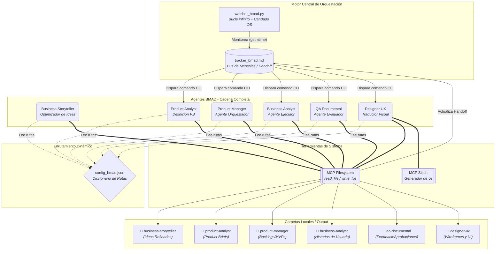
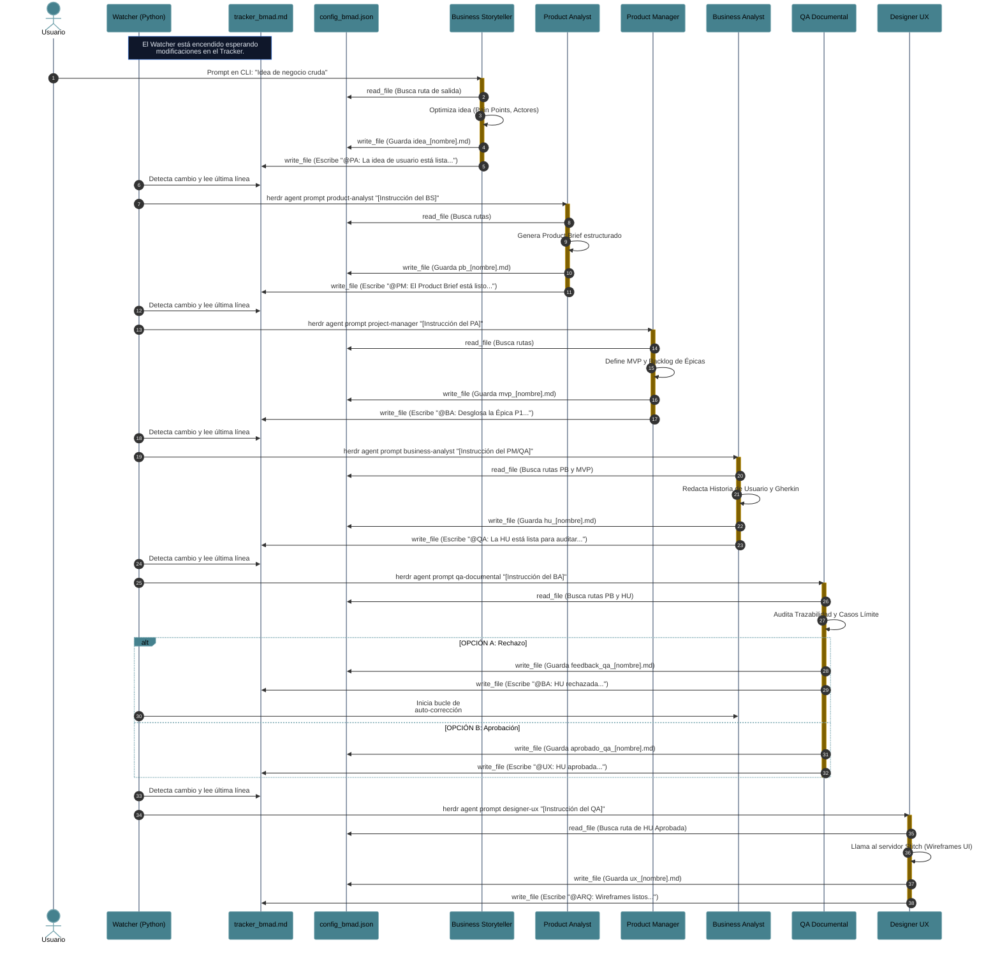

# Ecosistema Multi-Agente BMAD con Herdr

**Capacidades del Ecosistema Multi-Agente (BMAD)**

* **Orquestación Asíncrona Descentralizada:** Diseñé un pipeline completo de agentes (Business Storyteller, Product Analyst, Product Manager, Business Analyst, QA Documental y Diseñador UX) que operan sobre Herdr de forma independiente, a los cuales coordino mediante un único archivo de estado (`tracker_bmad.md`).
* **Inyección Atómica en Terminales (TTY):** Implementé la resolución dinámica de IDs de paneles en tiempo de ejecución para inyectar comandos directamente a los procesos de Agy mediante `herdr pane run`.
* **Integración Avanzada de MCP:** Habilité el uso autónomo del sistema de archivos (`read_file`, `write_file`) para que mis agentes lean configuraciones JSON globales, extraigan contexto de documentos previos y generen nuevos entregables markdown en rutas específicas.
* **Discovery Interactivo (HITL):** Le di al agente BS la capacidad de detener la automatización, evaluar la ambigüedad de una idea y dialogar conmigo antes de inyectar los requerimientos al sistema.
* **Gestión de Concurrencia y Contrapresión (Backpressure):** Programé mi orquestador (`watcher_bmad.py`) para que monitoree el estado en tiempo real (`idle`, `working`) de cada panel, reteniendo instrucciones en memoria RAM si el agente destinatario está ocupado, previniendo así colisiones de búfer.
* **Ruteo Dinámico de Mensajes Parcelados:** Añadí soporte para "Handoffs Múltiples" en una sola línea (ej. el QA despertando al UX y al PM simultáneamente), donde mi sistema parsea y entrega a cada agente exclusivamente su fragmento de la orden.
* **Tolerancia a Fallos y Reconciliación de Estado (Boot Sequence):** Centralicé la lógica de orquestación en el PM, dotándolo de la capacidad de leer el historial del tracker tras un reinicio del servidor, comparar las tareas delegadas contra las aprobadas por el QA, y revivir procesos huérfanos sin romper el backlog.
* **Trazabilidad Continua:** Integré un control de versiones automatizado que ejecuta commits en Git de forma silenciosa por cada tarea que el ecosistema procesa exitosamente.
* **Despliegue Interactivo de Entornos:** Escribí un script de consola modular (`create_agents.py`) que me permite seleccionar numéricamente qué agentes instanciar, validando y distribuyendo los prompts automáticamente.

**Los problemas estructurales y lógicos que solucioné:**

* **Bloqueo de Canal Interactivo:** Noté que los comandos estándar de Herdr (`agent prompt`) no lograban activar a los agentes de Agy; lo solucioné auditando la CLI e implementando envíos directos de pulsaciones de teclado al panel.
* **Restricciones de Sandbox (Access Denied):** Mis agentes no podían leer el `config_bmad.json` ni los archivos de sus compañeros. Lo corregí inyectando el flag de elevación de privilegios `--add-dir` en la raíz del proyecto durante el arranque.
* **Aniquilación de Historial:** Me di cuenta de que la herramienta MCP `write_file` sobrescribía el tracker completo. Para evitarlo, diseñé un patrón estricto de anexión (`read` -> `concat \n` -> `write`).
* **Sangrado de Instrucciones (Instruction Bleed):** Al ordenar a los LLMs que usaran una línea continua bajo una "regla inquebrantable" o la automatización fallaría, los modelos entraban en pánico y eliminaban todos los saltos de línea (incluso los del sistema de archivos). Lo solucioné aislando las reglas de formato de redacción de las instrucciones mecánicas de guardado.
* **Desconexión de Cadena (Handoff Ciego):** Mi PM generaba el Backlog pero no le indicaba al BA en qué archivo leerlo. Corregí las plantillas para pasar siempre la referencia exacta del documento generado.
* **Trampa del Bucle Infinito en el Watcher:** Mi script original solo leía si la fecha del archivo cambiaba, dejando tareas atrapadas si un agente estaba ocupado. Lo reescribí usando un patrón de "Línea Pendiente" que bombardea el intento hasta que el ecosistema está libre.
* **Amnesia de Tránsito:** Sufría la pérdida de tareas (como una Épica atorada) ante caídas de red o falta de tokens. Lo solucioné retirando la dependencia de la memoria local y forzando al PM a utilizar el tracker como su única "fuente de la verdad" para reconciliar el avance del equipo.

---


**Un poco de historia**

Mi viaje para construir este ecosistema comenzó con un desafío arquitectónico ambicioso: lograr que múltiples inteligencias artificiales colaboraran en un pipeline de desarrollo de software complejo, no mediante llamadas de API estáticas, sino operando como entidades vivas en terminales independientes. La visión era clara, pero el entorno técnico presentó resistencia inmediata.

Mi primera barrera fue de comunicación pura. Tenía a los agentes despiertos en sus paneles, pero estaban aislados. Intenté hablarles por los canales oficiales, pero el backend no interceptaba los eventos. Al bajar al nivel de la terminal virtual y utilizar la inyección directa de texto, logré abrir el flujo de datos. Inmediatamente después, choqué con la seguridad del Model Context Protocol; los agentes estaban encerrados en sandboxes que les impedían leer la configuración global o pasarse archivos. Tuve que reconfigurar los permisos de arranque desde la raíz para unificar su acceso al disco.

Una vez que pudieron leer y escribir, me enfrenté a la naturaleza impredecible de los LLMs interactuando con sistemas deterministas. Observé cómo el instinto de la herramienta MCP borraba el historial completo de mi rastreador en cada turno. Les enseñé a leer antes de escribir, pero entonces descubrí un fenómeno fascinante: el "sangrado de instrucciones". Al amenazar al modelo con que el sistema fallaría si usaba saltos de línea en su mensaje, la IA aplicó esa restricción de forma tan severa que saboteó el formato del propio archivo de texto. Tuve que aplicar ingeniería de prompts para relajar las instrucciones, separando el "cómo redactas" del "cómo guardas", logrando por fin un historial limpio y acumulativo.

Con la comunicación estable, el reto evolucionó de lineal a asíncrono. Cuando los agentes empezaron a trabajar a máxima velocidad, las instrucciones colisionaban. El Watcher disparaba órdenes mientras aún estaban procesando tareas anteriores, perdiendo información en el vacío. Tuve que dotar al orquestador de consciencia, enseñándole a interrogar el estado de cada panel (working vs idle) y a aplicar contrapresión, reteniendo las tareas en memoria hasta que el agente estuviera listo para escuchar. Finalmente, sellé la resiliencia del sistema dándole al Product Manager la capacidad de leer el estado global tras un apagón, detectar si el QA había dejado alguna Historia de Usuario huérfana, y retomar la orquestación exactamente donde se había quedado. Lo que empezó como un script que leía un archivo de texto, se convirtió en una máquina de estados robusta, tolerante a fallos y completamente desatendida.

---


# Manual de Uso

Este repositorio contiene la configuración y la guía detallada para ejecutar un flujo de desarrollo de software totalmente autónomo basado en la metodología **BMAD (Business, Management, Architecture, Development)**. El ecosistema integra orquestación en terminal mediante **Herdr**, automatización mediante un _Watcher_ en Python y gestión de archivos físicos distribuidos vía herramientas MCP.

## 📁 1. Estructura del Proyecto

El ecosistema requiere una jerarquía de carpetas estandarizada en la raíz de tu proyecto para separar la configuración, la memoria de los agentes y los archivos físicos. Asegúrate de contar con la siguiente estructura base:

Plaintext

```
/tu-proyecto-raiz/
├── agents/               # Directorios de entorno virtual para los paneles de Herdr
├── files/                # Sistema de almacenamiento de salidas y estado
│   ├── business-storyteller/ # Salida de Idea de Usuario Refinada
│   ├── product-analyst/  # Salida de Products Briefs
│   ├── product-manager/  # Salida de Backlogs y MVPs
│   ├── business-analyst/ # Salida de Historias de Usuario (HU)
│   ├── qa-documental/    # Salida de reportes de auditoría y feedback
│   ├── designer-ux/      # Salida de wireframes y enlaces UI
│   └── tracker_bmad.md   # Bus de mensajes unificado para el handoff entre agentes
├── prompts/              # System Prompts de cada agente
│   ├── bs.md             # System Prompt del Business Storyteller
│   ├── pa.md             # System Prompt del Product Analyst
│   ├── pm.md             # System Prompt del Project Manager
│   ├── ba.md             # System Prompt del Business Analyst
│   ├── qa.md             # System Prompt del QA Documental
│   └── ux.md             # System Prompt del Diseñador UX
├── config_bmad.json      # Diccionario de rutas absolutas para las herramientas MCP
└── watcher_bmad.py       # Script orquestador (Bucle infinito + Candado OS)
```

_(Nota: Las subcarpetas dentro de `files/` corresponden a las áreas de trabajo de cada rol)._

## 🚀 2. Configuración y Arranque Inicial

La arquitectura mantiene a todos los agentes vivos en memoria, permitiendo que el orquestador enrute los mensajes de forma autónoma.

### ⚙️ Personalización de Rutas (Reemplazo Obligatorio)

Al clonar o adaptar este plantilla a un nuevo entorno o proyecto, debes reemplazar todas las referencias a la ruta absoluta original (`D:\Paulo\Cursos\DMC\template-bmad`) por la ruta absoluta correspondiente a tu nuevo directorio raíz (ej. `C:\Ruta\A\TuProyecto`).

A continuación se detalla la lista completa de ubicaciones donde se debe realizar dicho reemplazo:

1. **Configuración General (`config_bmad.json`)**:
   - Reemplazar todas las rutas de carpetas de agentes y el archivo tracker (`tracker_bmad.md`).
2. **Orquestador (`watcher_bmad.py`)**:
   - Línea 6: Actualizar la constante `TRACKER_PATH`.
3. **Configuracion de Prompts (`prompts/`)**:
   - Cambiar el valor de `RUTA_CONFIGURACION` (Línea 4) en:
     - `prompts/bs.md`, `prompts/pa.md`, `prompts/pm.md`, `prompts/ba.md`, `prompts/qa.md`, `prompts/ux.md`
     - `agents/business-storyteller/AGENTS.md`
     - `agents/product-analyst/AGENTS.md`
     - `agents/product-manager/AGENTS.md`
     - `agents/business-analyst/AGENTS.md`
     - `agents/qa-documental/AGENTS.md`
     - `agents/designer-ux/AGENTS.md`
4. **Comandos de Herdr (`README.md`)**:
   - Actualizar los argumentos `--add-dir` en los comandos de arranque de paneles de Herdr indicados abajo.

---

### Paso 1: Levantar los Paneles de Herdr (Inicialización en frío)

Debes crear los espacios de trabajo e inicializar a los 6 agentes en sus respectivos paneles para que estén listos para escuchar comandos. Ejecuta esto en tu terminal (adaptando el comando según tu CLI):

PowerShell

```
# 1. Business Storyteller
New-Item -ItemType Directory -Force .\agents\business-storyteller
Copy-Item ".\prompts\bs.md" .\agents\business-storyteller\AGENTS.md
herdr pane split --current --direction right --cwd .\agents\business-storyteller
herdr agent start business-storyteller --kind agy --pane wF:p1 -- --add-dir ..\..

# 2. Product Analyst
New-Item -ItemType Directory -Force .\agents\product-analyst
Copy-Item ".\prompts\pa.md" .\agents\product-analyst\AGENTS.md
herdr pane split --current --direction down --cwd .\agents\product-analyst
herdr agent start product-analyst --kind agy --pane wF:p3 -- --add-dir ..\..

# Repite el proceso
herdr agent start product-manager --kind agy --pane wF:p4 -- --add-dir "D:\Paulo\Cursos\DMC\template-bmad"
herdr agent start business-analyst --kind agy --pane wF:p2 -- --add-dir "D:\Paulo\Cursos\DMC\template-bmad"
herdr agent start qa-documental --kind agy --pane wF:p5 -- --add-dir "D:\Paulo\Cursos\DMC\template-bmad"
herdr agent start designer-ux --kind agy --pane wF:p6 -- --add-dir "D:\Paulo\Cursos\DMC\template-bmad"
```

### Paso 2: Activar el Motor de Automatización (Watcher)

Abre una nueva pestaña en tu terminal (fuera de los paneles de los agentes) e inicia el script de Python. El script aplicará el candado del sistema operativo y quedará a la espera:

Bash

```
python watcher_bmad.py
```

## 🛠️ 3. Modalidad de Ejecución Independiente y Desacople (Fase Business)

No es obligatorio que los agentes **Business Storyteller (BS)** y **Product Analyst (PA)** operen estrictamente dentro del flujo encadenado. Si deseas utilizarlos como herramientas independientes para refinar ideas o redactar _Product Briefs_ puntuales sin que el orquestador intervenga, debes retirarlos del alcance del script de Python.

### Desacople en el Watcher

Para evitar que el Watcher procese a estos agentes automáticamente, edita el archivo `watcher_bmad.py` y comenta (o elimina) las líneas correspondientes a `@BS:` y `@PA:` dentro del diccionario `agentes` en la función `procesar_tracker`:

Python

```
def procesar_tracker(ultima_linea):
    linea = ultima_linea.strip()
    
    # Mapeo de las etiquetas con el ID exacto del agente en Herdr
    agentes = {
        # "@BS:": "business-storyteller",   # COMENTADO: Fuera del flujo automático
        # "@PA:": "product-analyst",        # COMENTADO: Fuera del flujo automático
        "@PM:": "product-manager",  # Almacena el product backlog y las instrucciones
        "@BA:": "business-analyst",  # Almancena las historias de usuario
        "@QA:": "qa-documental",    # Almacena las historias de usuario aprobadas
        "@UX:": "designer-ux"   # Almacena las propuestas de diseño
    }
# ... (resto del script sin alteraciones)
```

### Ejecución Manual de Agentes Independientes

Con los agentes desacoplados, puedes ejecutarlos a voluntad utilizando cualquiera de estos tres métodos directamente en tu terminal:

**Opción A: Ingresando el texto en el chat (Uso de etiquetas XML)** Envía el texto crudo encapsulado en sus etiquetas correspondientes directamente por la CLI:

Bash

```
herdr agent prompt product-analyst "<idea_usuario>Necesito un bot de WhatsApp para mi veterinaria, solo para consultas, no urgencias.</idea_usuario>"
```

**Opción B: Ingresando el nombre del archivo generado** Si ya generaste un archivo markdown con el insumo en la carpeta correspondiente, puedes despertar al agente pasándole solo el nombre del archivo. El agente usará el `config_bmad.json` para extraer el contenido:

Bash

```
herdr agent prompt product-analyst "idea_veterinaria.md"
```

**Opción C: Actualizando manualmente el tracker_bmad.md** Si mantuviste al PA dentro del Watcher pero decidiste no usar al BS, puedes disparar el flujo autónomo a partir del Product Analyst abriendo tu archivo `files/tracker_bmad.md` y escribiendo manualmente:

Markdown

```
@PA: La idea de usuario está lista en el archivo idea_veterinaria.md. Procede con la creación del PRODUCT BRIEF.
```

## 🔄 4. Flujo de Trabajo Autónomo (Guía End-to-End)

Si decides mantener a los 6 agentes en el diccionario del `watcher_bmad.py`, el proceso completo de definición de software se ejecuta en cadena.

### Fase 1: Disparo Inicial (Ingreso de la Idea Cruda)

Interactúas directamente con el **Business Storyteller (BS)** entregándole la idea de negocio informal a través de un prompt en su panel:

Bash

```
herdr agent prompt business-storyteller "Quiero un bot de WhatsApp para mi veterinaria 'Patitas'. La gente llama mucho para sacar citas y a veces no contestamos..."
```

_A partir de este punto, el sistema opera sin intervención humana._

### Fase 2: Refinamiento y Product Brief (Fase Business)

1. **El Business Storyteller (BS):** Optimiza la idea cruda inyectando el dolor de negocio y agrupando actores. Guarda el archivo `idea_veterinaria.md` y actualiza automáticamente el Tracker escribiendo `@PA: La idea de usuario está lista...`.
    
2. **El Product Analyst (PA):** El Watcher detecta la línea, despierta al PA. Este lee la idea optimizada, estructura el **Product Brief (PRD)**, guarda su archivo `pb_veterinaria.md` y actualiza el Tracker escribiendo `@PM: El Product Brief está listo...`.
    

### Fase 3: Orquestación y Análisis (Fase Management)

1. **El Project Manager (PM):** Despertado por el Watcher, lee el Product Brief, redacta la visión estratégica y prioriza el **Backlog del MVP**. Guarda el documento y delega el trabajo en el Tracker (`@BA: Desglosa la Épica 1...`).
    
2. **El Business Analyst (BA):** Lee el MVP y el PB, redacta la **Historia de Usuario** atómica utilizando sintaxis Gherkin (BDD), guarda la especificación y solicita la auditoría (`@QA: La historia está lista...`).
    

### Fase 4: Auditoría y Auto-Corrección (QA)

El agente **QA Documental** cruza la Historia de Usuario contra el Product Brief original. Ocurre una bifurcación lógica:

- **Ruta de Rechazo (Bucle Autónomo):** Si detecta flujos alternativos faltantes (_Sad Paths_), genera un reporte de _feedback_ y devuelve la tarea (`@BA: La historia fue RECHAZADA...`). El Watcher despierta al BA, quien corrige el documento y vuelve a invocar al QA.
    
- **Ruta de Aprobación:** Si la historia es hermética, el QA genera el certificado y despierta al siguiente eslabón (`@UX: Historia aprobada...`).
    

### Fase 5: Traducción Visual (UX)

El **Designer UX** lee la historia aprobada, se conecta al servidor MCP de Stitch para inicializar el proyecto y generar los estados visuales (wireframes) correspondientes a cada escenario Gherkin. Guarda su reporte y notifica al área técnica (`@ARQ: Wireframes listos...`).

## 📊 5. Diagramas de Arquitectura y Secuencia

A continuación se detalla la topología física y el flujo asíncrono del sistema.

### Arquitectura Física y Lógica (Ecosistema BMAD)



---

### Flujo de Trabajo (Secuencia Asíncrona)



---


## Algunas preguntas técnicas _ antes que me las hagan _

### 1. Arquitectura y Gestión de Estado

**Pregunta:** ¿Por qué decidiste utilizar un archivo Markdown (`tracker_bmad.md`) como gestor de estado y orquestación en lugar de una base de datos transaccional (como PostgreSQL) o un gestor de colas (como RabbitMQ)?

**Respuesta:**
Decidí usar un archivo Markdown porque mi prioridad era mantener la compatibilidad nativa con el Model Context Protocol (MCP) y asegurar la observabilidad humana. Un archivo de texto actúa como un *Event Sourcing* de solo adición (append-only log). Los agentes LLM son excelentes leyendo y analizando texto plano para extraer contexto; al usar Markdown, no necesito construir APIs intermedias para que consulten una base de datos. Además, al forzar la regla estricta de "leer, concatenar salto de línea y escribir", evito la sobrescritura del historial. Es una solución altamente desacoplada, ligera y auditable en tiempo real.

### 2. Concurrencia y Control de Tráfico

**Pregunta:** Al inyectar comandos directamente en las terminales (TTY), ¿cómo evitas las colisiones de búfer o *race conditions* si el orquestador envía una instrucción mientras el agente aún está procesando la anterior?

**Respuesta:**
Implementé un mecanismo de contrapresión (*backpressure*) directamente en el Watcher. El script no dispara las instrucciones a ciegas; primero consulta el panel de Herdr dinámicamente para leer el estado del agente (`idle` o `working`). Si el agente destinatario está ocupado, el Watcher retiene la instrucción en una variable de memoria RAM como "línea pendiente" y aborta la inyección. En el siguiente ciclo de sondeo, vuelve a intentarlo. Esto crea una cola asíncrona implícita que previene las colisiones en la terminal y permite que múltiples agentes (como el UX y el BA) trabajen en paralelo a distintos ritmos.

### 3. Ingeniería de IA y Comportamiento de Modelos

**Pregunta:** ¿Cómo lograste estabilizar el uso de herramientas (Tool Use) de los agentes? Es común que los LLMs rompan los formatos JSON o de texto cuando se les imponen reglas muy estrictas.

**Respuesta:**
Me enfrenté a un fenómeno que bauticé como "sangrado de instrucciones" (*instruction bleed*). Al principio, amenazaba a los agentes en el prompt diciéndoles que "la automatización fallaría" si usaban saltos de línea en sus entregables. El modelo entraba en un modo de sobre-precaución tan alto que eliminaba incluso el salto de línea (`\n`) que le pedía usar mecánicamente con la herramienta MCP, destruyendo el historial. Lo solucioné aplicando aislamiento de contexto: separé explícitamente las "reglas de redacción de texto" de las "instrucciones mecánicas de guardado". Al suavizar la amenaza técnica y delimitar las responsabilidades, los modelos empezaron a usar el `read_file` y `write_file` con precisión quirúrgica.

### 4. Tolerancia a Fallos y Sistemas Distribuidos

**Pregunta:** En una arquitectura distribuida sin estado (*stateless*), ¿cómo se recupera tu sistema de una "muerte silenciosa", por ejemplo, si el servidor se reinicia o si un agente se queda sin tokens en medio de una Épica?

**Respuesta:**
Resolví la "amnesia de tránsito" centralizando la lógica de reconciliación de estado en el Product Manager mediante una *Boot Sequence* (Secuencia de Arranque). Cuando el sistema se reinicia, el PM no se fía de su memoria volátil. Primero verifica si el archivo del Producto Mínimo Viable (`mvp.md`) ya existe. Si es así, lee el tracker completo y busca cuál fue la última Épica que recibió un estado de APROBADO por el QA Documental. Si el PM nota que envió la Épica 4 pero nunca hubo respuesta del QA, deduce que el proceso murió en tránsito y vuelve a disparar la instrucción para la Épica 4. Es un orquestador auto-reparable.

### 5. Ruteo y Desacoplamiento

**Pregunta:** ¿Cómo manejas el *Handoff* cuando un agente necesita detonar procesos en múltiples agentes a la vez sin que se contaminen los contextos?

**Respuesta:**
Desarrollé un ruteo dinámico de mensajes parcelados en el orquestador de Python. Cuando el QA Documental aprueba una Historia de Usuario, emite una sola línea en el tracker que contiene dos etiquetas, por ejemplo: `@UX: haz los wireframes. @PM: asigna la siguiente épica`. El Watcher parsea esa línea, identifica todas las etiquetas presentes y fragmenta el string. Al agente UX solo le inyecta su porción del texto, y al PM la suya. Esto evita que los agentes lean instrucciones que no les corresponden, reduciendo el consumo de tokens y evitando alucinaciones por contexto cruzado.

---
