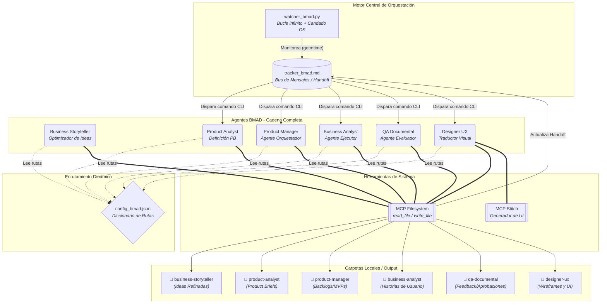
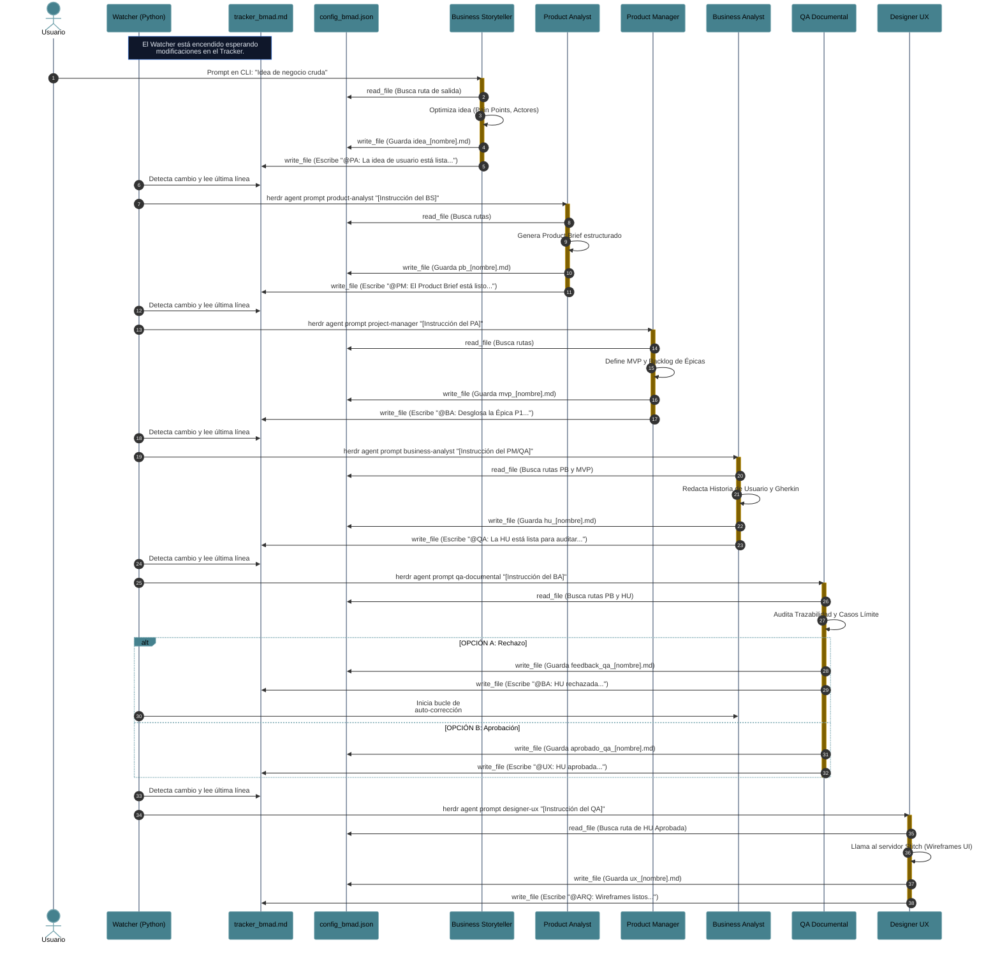

# Manual de Uso: Ecosistema Multi-Agente BMAD con Herdr

Este repositorio contiene la configuración y la guía detallada para ejecutar un flujo de desarrollo de software totalmente autónomo basado en la metodología **BMAD (Business, Management, Architecture, Development)**. El ecosistema integra orquestación en terminal mediante **Herdr**, automatización mediante un _Watcher_ en Python y gestión de archivos físicos distribuidos vía herramientas MCP.

## 📁 1. Estructura del Proyecto

El ecosistema requiere una jerarquía de carpetas estandarizada en la raíz de tu proyecto para separar la configuración, la memoria de los agentes y los archivos físicos. Asegúrate de contar con la siguiente estructura base:

Plaintext

```
/tu-proyecto-raiz/
├── agents/               # Directorios de entorno virtual para los paneles de Herdr
├── files/                # Sistema de almacenamiento de salidas y estado
│   ├── business-storyteller/ # Salida de Idea de Usuario Refinada
│   ├── product-analyst/  # Salida de Products Briefs
│   ├── product-manager/  # Salida de Backlogs y MVPs
│   ├── business-analyst/ # Salida de Historias de Usuario (HU)
│   ├── qa-documental/    # Salida de reportes de auditoría y feedback
│   ├── designer-ux/      # Salida de wireframes y enlaces UI
│   └── tracker_bmad.md   # Bus de mensajes unificado para el handoff entre agentes
├── prompts/              # System Prompts de cada agente
│   ├── bs.md             # System Prompt del Business Storyteller
│   ├── pa.md             # System Prompt del Product Analyst
│   ├── pm.md             # System Prompt del Project Manager
│   ├── ba.md             # System Prompt del Business Analyst
│   ├── qa.md             # System Prompt del QA Documental
│   └── ux.md             # System Prompt del Diseñador UX
├── config_bmad.json      # Diccionario de rutas absolutas para las herramientas MCP
└── watcher_bmad.py       # Script orquestador (Bucle infinito + Candado OS)
```

_(Nota: Las subcarpetas dentro de `files/` corresponden a las áreas de trabajo de cada rol)._

## 🚀 2. Configuración y Arranque Inicial

La arquitectura mantiene a todos los agentes vivos en memoria, permitiendo que el orquestador enrute los mensajes de forma autónoma.

### Paso 1: Levantar los Paneles de Herdr (Inicialización en frío)

Debes crear los espacios de trabajo e inicializar a los 6 agentes en sus respectivos paneles para que estén listos para escuchar comandos. Ejecuta esto en tu terminal (adaptando el comando según tu CLI):

PowerShell

```
# 1. Business Storyteller
New-Item -ItemType Directory -Force .\agents\business-storyteller
Copy-Item ".\prompts\bs.md" .\agents\business-storyteller\AGENTS.md
herdr pane split --current --direction right --cwd .\agents\business-storyteller
herdr agent start business-storyteller --kind agy --pane wF:p1 -- --add-dir ..\..

# 2. Product Analyst
New-Item -ItemType Directory -Force .\agents\product-analyst
Copy-Item ".\prompts\pa.md" .\agents\product-analyst\AGENTS.md
herdr pane split --current --direction down --cwd .\agents\product-analyst
herdr agent start product-analyst --kind agy --pane wF:p3 -- --add-dir ..\..

# Repite el proceso
herdr agent start product-manager --kind agy --pane wF:p4 -- --add-dir "D:\Paulo\Cursos\DMC\template-bmad"
herdr agent start business-analyst --kind agy --pane wF:p2 -- --add-dir "D:\Paulo\Cursos\DMC\template-bmad"
herdr agent start qa-documental --kind agy --pane wF:p5 -- --add-dir "D:\Paulo\Cursos\DMC\template-bmad"
herdr agent start designer-ux --kind agy --pane wF:p6 -- --add-dir "D:\Paulo\Cursos\DMC\template-bmad"
```

### Paso 2: Activar el Motor de Automatización (Watcher)

Abre una nueva pestaña en tu terminal (fuera de los paneles de los agentes) e inicia el script de Python. El script aplicará el candado del sistema operativo y quedará a la espera:

Bash

```
python watcher_bmad.py
```

## 🛠️ 3. Modalidad de Ejecución Independiente y Desacople (Fase Business)

No es obligatorio que los agentes **Business Storyteller (BS)** y **Product Analyst (PA)** operen estrictamente dentro del flujo encadenado. Si deseas utilizarlos como herramientas independientes para refinar ideas o redactar _Product Briefs_ puntuales sin que el orquestador intervenga, debes retirarlos del alcance del script de Python.

### Desacople en el Watcher

Para evitar que el Watcher procese a estos agentes automáticamente, edita el archivo `watcher_bmad.py` y comenta (o elimina) las líneas correspondientes a `@BS:` y `@PA:` dentro del diccionario `agentes` en la función `procesar_tracker`:

Python

```
def procesar_tracker(ultima_linea):
    linea = ultima_linea.strip()
    
    # Mapeo de las etiquetas con el ID exacto del agente en Herdr
    agentes = {
        # "@BS:": "business-storyteller",   # COMENTADO: Fuera del flujo automático
        # "@PA:": "product-analyst",        # COMENTADO: Fuera del flujo automático
        "@PM:": "product-manager",  # Almacena el product backlog y las instrucciones
        "@BA:": "business-analyst",  # Almancena las historias de usuario
        "@QA:": "qa-documental",    # Almacena las historias de usuario aprobadas
        "@UX:": "designer-ux"   # Almacena las propuestas de diseño
    }
# ... (resto del script sin alteraciones)
```

### Ejecución Manual de Agentes Independientes

Con los agentes desacoplados, puedes ejecutarlos a voluntad utilizando cualquiera de estos tres métodos directamente en tu terminal:

**Opción A: Ingresando el texto en el chat (Uso de etiquetas XML)** Envía el texto crudo encapsulado en sus etiquetas correspondientes directamente por la CLI:

Bash

```
herdr agent prompt product-analyst "<idea_usuario>Necesito un bot de WhatsApp para mi veterinaria, solo para consultas, no urgencias.</idea_usuario>"
```

**Opción B: Ingresando el nombre del archivo generado** Si ya generaste un archivo markdown con el insumo en la carpeta correspondiente, puedes despertar al agente pasándole solo el nombre del archivo. El agente usará el `config_bmad.json` para extraer el contenido:

Bash

```
herdr agent prompt product-analyst "idea_veterinaria.md"
```

**Opción C: Actualizando manualmente el tracker_bmad.md** Si mantuviste al PA dentro del Watcher pero decidiste no usar al BS, puedes disparar el flujo autónomo a partir del Product Analyst abriendo tu archivo `files/tracker_bmad.md` y escribiendo manualmente:

Markdown

```
@PA: La idea de usuario está lista en el archivo idea_veterinaria.md. Procede con la creación del PRODUCT BRIEF.
```

## 🔄 4. Flujo de Trabajo Autónomo (Guía End-to-End)

Si decides mantener a los 6 agentes en el diccionario del `watcher_bmad.py`, el proceso completo de definición de software se ejecuta en cadena.

### Fase 1: Disparo Inicial (Ingreso de la Idea Cruda)

Interactúas directamente con el **Business Storyteller (BS)** entregándole la idea de negocio informal a través de un prompt en su panel:

Bash

```
herdr agent prompt business-storyteller "Quiero un bot de WhatsApp para mi veterinaria 'Patitas'. La gente llama mucho para sacar citas y a veces no contestamos..."
```

_A partir de este punto, el sistema opera sin intervención humana._

### Fase 2: Refinamiento y Product Brief (Fase Business)

1. **El Business Storyteller (BS):** Optimiza la idea cruda inyectando el dolor de negocio y agrupando actores. Guarda el archivo `idea_veterinaria.md` y actualiza automáticamente el Tracker escribiendo `@PA: La idea de usuario está lista...`.
    
2. **El Product Analyst (PA):** El Watcher detecta la línea, despierta al PA. Este lee la idea optimizada, estructura el **Product Brief (PRD)**, guarda su archivo `pb_veterinaria.md` y actualiza el Tracker escribiendo `@PM: El Product Brief está listo...`.
    

### Fase 3: Orquestación y Análisis (Fase Management)

1. **El Project Manager (PM):** Despertado por el Watcher, lee el Product Brief, redacta la visión estratégica y prioriza el **Backlog del MVP**. Guarda el documento y delega el trabajo en el Tracker (`@BA: Desglosa la Épica 1...`).
    
2. **El Business Analyst (BA):** Lee el MVP y el PB, redacta la **Historia de Usuario** atómica utilizando sintaxis Gherkin (BDD), guarda la especificación y solicita la auditoría (`@QA: La historia está lista...`).
    

### Fase 4: Auditoría y Auto-Corrección (QA)

El agente **QA Documental** cruza la Historia de Usuario contra el Product Brief original. Ocurre una bifurcación lógica:

- **Ruta de Rechazo (Bucle Autónomo):** Si detecta flujos alternativos faltantes (_Sad Paths_), genera un reporte de _feedback_ y devuelve la tarea (`@BA: La historia fue RECHAZADA...`). El Watcher despierta al BA, quien corrige el documento y vuelve a invocar al QA.
    
- **Ruta de Aprobación:** Si la historia es hermética, el QA genera el certificado y despierta al siguiente eslabón (`@UX: Historia aprobada...`).
    

### Fase 5: Traducción Visual (UX)

El **Designer UX** lee la historia aprobada, se conecta al servidor MCP de Stitch para inicializar el proyecto y generar los estados visuales (wireframes) correspondientes a cada escenario Gherkin. Guarda su reporte y notifica al área técnica (`@ARQ: Wireframes listos...`).

## 📊 5. Diagramas de Arquitectura y Secuencia

A continuación se detalla la topología física y el flujo asíncrono del sistema.

### Arquitectura Física y Lógica (Ecosistema BMAD)



---

### Flujo de Trabajo (Secuencia Asíncrona)

