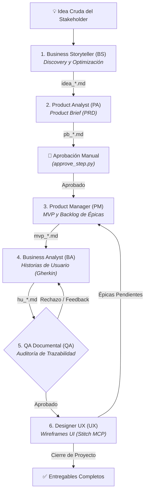

# Ecosistema Multi-Agente BMAD con Herdr

> Framework y plugin organizacional para la definición integral, autónoma y desacoplada de software bajo metodología BMAD (Business, Management, Architecture, Development), orquestado sobre terminales independientes en **Herdr** y herramientas MCP.

---

## 🌟 Capacidades Principales

* **Orquestación Asíncrona Secuencial (Token-Passing):** Pipeline de 6 agentes especializados (Business Storyteller, Product Analyst, Product Manager, Business Analyst, QA Documental y Diseñador UX) coordinados mediante un archivo central de eventos (`tracker_bmad.md`).
* **Arquitectura Modular de Agentes:** Cada agente define su rol (`agents/*.agent.md`) y reglas satélite (`instructions/*.instructions.md`), auto-ensambladas en tiempo de ejecución (`AGENTS.md`) por el orquestador.
* **Inyección Atómica en Terminales (TTY):** Resolución dinámica de IDs de paneles en tiempo de ejecución para inyectar comandos directamente a los procesos mediante `herdr pane run`.
* **Integración Avanzada de MCP:** Lectura de configuraciones JSON globales (`config_bmad.json`), extracción de contexto documental y guardado de entregables en rutas aisladas (`files/`) vía `MCP Filesystem` y generación de pantallas con `MCP Stitch`.
* **Aprobación Manual (HITL):** Soporte para interrupciones controladas (`@HUMANO:`), permitiendo auditar y aprobar entregables (ej. Product Brief vía `utils/approve_step.py`) o aclarar requerimientos antes de continuar la automatización.
* **Inyección Dinámica de Skills:** Motor de compilación que integra de manera modular habilidades transversales (globales) y de dominio (locales) en los agentes en tiempo de ejecución.
* **Control de Concurrencia y FinOps:** Candado de disparo único en el orquestador (`watcher_bmad.py`) y asignación granular de modelos/esfuerzo de razonamiento en `utils/start_agents.py`.
* **Trazabilidad Continua:** Commits automáticos en Git por cada tarea procesada con éxito.

---

## 🛠️ Problemas Estructurales Resueltos

* **Bloqueo de Canal Interactivo:** Inyecciones directas de comandos TTY al panel (`herdr pane run`).
* **Restricciones de Sandbox (Access Denied):** Habilitación del flag `--add-dir` en la raíz del proyecto para permitir a los agentes compartir archivos en `files/`.
* **Aniquilación de Historial:** Patrón estricto de anexión (*read -> concat -> write*) en `tracker_bmad.md`.
* **Sangrado de Instrucciones (Instruction Bleed):** Separación de reglas de formato de redacción respecto a las instrucciones mecánicas de guardado.
* **Condiciones de Carrera y Doble Despacho:** Eliminación del paralelismo inestable en favor del modelo secuencial determinista (*Token-Passing*).

---

## 📁 Estructura del Proyecto

```text
/template-bmad
├── config_bmad.json                  # Diccionario de rutas absolutas para herramientas MCP
├── watcher_bmad.py                   # Orquestador del ciclo de vida y compilador de agentes
├── README.md                         # Portada principal y resumen del ecosistema
├── ARCHITECTURE.md                   # Arquitectura técnica profunda y diagramas Mermaid
├── GUIDE.md                          # Guía de uso paso a paso y solución de problemas
├── SETUP.md                          # Manual de instanciación y clonado en nuevas rutas
├── QUESTIONS.md                      # Compendio de preguntas y respuestas técnicas
├── manifest.yaml                     # Manifiesto de capacidades y gobernanza del plugin
├── catalog-info.yaml                 # Definición para el catálogo Backstage
│
├── /skills                           # Repositorio global de habilidades (export-pdf, etc.)
├── /utils                            # Scripts de automatización y mantenimiento
│   ├── start_agents.py               # Despliega la grilla de terminales en Herdr (Rutas dinámicas)
│   ├── clean_files.py                # Limpia interactivamente los entregables en files/
│   └── delete_agents.py              # Elimina los archivos AGENTS.md auto-compilados
│
├── /business-storyteller             # Agente BS: Discovery y narrativa de negocio
├── /product-analyst                  # Agente PA: Product Brief (PRD)
│   └── /skills                       # Skills locales de dominio (ej. pb-validator)
├── /product-manager                  # Agente PM: Alcance, MVP y Backlog
├── /business-analyst                 # Agente BA: Historias de Usuario (BDD/Gherkin)
├── /qa-documental                    # Agente QA: Auditoría de trazabilidad y calidad
├── /designer-ux                      # Agente UX: Wireframes y flujos UI
│
├── /prompts                          # Prompts monolíticos de referencia (Legacy)
│
└── /files                            # Directorio de Entregables (Aislamiento de Datos)
    ├── tracker_bmad.md               # Bus de eventos y cola de orquestación
    ├── /business-storyteller         # Salidas BS: ideas estructuradas (idea_*.md)
    ├── /product-analyst              # Salidas PA: product briefs (pb_*.md)
    ├── /product-manager              # Salidas PM: planes de gestión / MVP (mvp_*.md)
    ├── /business-analyst             # Salidas BA: historias de usuario (hu_*.md)
    ├── /qa-documental                # Salidas QA: reportes de auditoría (qa_*.md)
    └── /designer-ux                  # Salidas UX: especificaciones UI/UX (ux_*.md)
```

---

## 🚀 Puesta en Marcha Rápida

1. **Configuración:** Actualizar rutas absolutas en `config_bmad.json` (ver [SETUP.md](./SETUP.md)).
2. **Terminal 1 - Watcher:**
   ```bash
   python watcher_bmad.py
   ```
3. **Terminal 2 - Herdr:**
   ```bash
   python utils/start_agents.py
   ```
4. **Disparo:** Ingresar la idea en la terminal de `@BS:` o mediante el tracker.

---

## 🔄 Flujo del Ciclo BMAD



---

## 📚 Documentación de Referencia

| Documento | Descripción |
|---|---|
| [**`ARCHITECTURE.md`**](./ARCHITECTURE.md) | **Arquitectura detallada, diagramas de componentes y de secuencia completos.** |
| [**`GUIDE.md`**](./GUIDE.md) | **Guía operativa paso a paso, matriz de entradas/salidas y solución de problemas.** |
| [**`SETUP.md`**](./SETUP.md) | **Guía de parametrización e instanciación para nuevos proyectos.** |
| [**`QUESTIONS.md`**](./QUESTIONS.md) | **20 preguntas técnicas y arquitectónicas con sus respuestas explicadas.** |
| [**`manifest.yaml`**](./manifest.yaml) | **Manifiesto de capacidades y ciclo de vida del plugin.** |
| [**`catalog-info.yaml`**](./catalog-info.yaml) | **Ficha de integración en Backstage.** |
