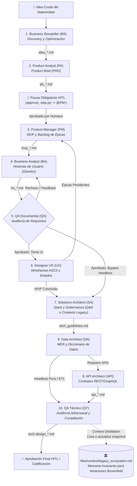
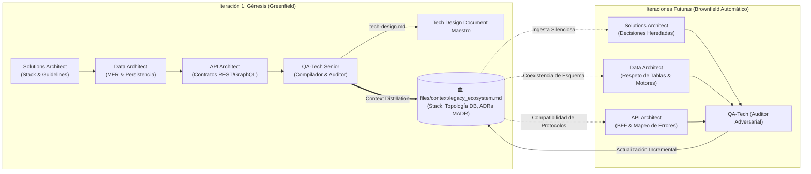

# Ecosistema Multi-Agente BMAD con Herdr

> Framework y plugin organizacional para la definición integral, autónoma y desacoplada de software bajo metodología BMAD (Business, Management, Architecture, Development), orquestado sobre terminales independientes en **Herdr** y herramientas MCP.

---

## 🌟 Capacidades Principales

* **El Tracker como Único Bus de Datos y Comunicación:** Los agentes **NO** se comunican entre sí por chat ni APIs directas. Toda la coordinación y paso de entregables fluye exclusivamente mediante eventos anexados al final de `files/tracker_bmad.md` bajo el patrón estricto de adición (*read -> concat -> write*).
* **Roster Oficial de Agentes:** Pipeline estructurado de 9 agentes core (`product-analyst`, `product-manager`, `business-analyst`, `qa-documental`, `designer-ux`, `solutions-architect`, `data-architect`, `api-architect` y `qa-tech`), junto al agente de intake `business-storyteller`.
* **Lógica de Bypass (Headless vs UI):** El ecosistema reconoce la naturaleza del proyecto:
  - **Proyectos con UI:** Transitan el pipeline visual completo: `BA -> QA -> UX -> SA -> DA -> API -> QT`.
  - **Proyectos Headless (ETL, SSIS, APIs puras, Pipelines de Datos):** Saltan automáticamente la fase de diseño UX: `BA -> QA -> SA -> DA -> QT`.
* **Estrategia Dual Greenfield / Brownfield (Agnosticismo Total):** Capacidad nativa para operar en proyectos desde cero o sobre sistemas preexistentes mediante el interruptor físico `files/context/legacy_ecosystem.md`. Si el archivo existe, todos los agentes (negocio, requisitos y arquitectura) subordinan de forma autónoma y sin fricción sus diseños a las reglas, dominio y tecnologías descritas allí. Si no existe, operan en modo Greenfield estándar sin precondiciones.
* **Auto-Evolución y Destilación de Contexto (Context Distillation):** El QA Tech (`qa-tech`) actúa como **Bibliotecario de Arquitectura**. Al compilar el Tech Design Document (TDD), evalúa si hubo cambios estructurales y genera o actualiza automáticamente el archivo `files/context/legacy_ecosystem.md`. Esto cierra el ciclo de vida arquitectónico, permitiendo que un proyecto nacido como *Greenfield* destile sus propias invariantes y prepare el terreno para futuras iteraciones evolutivas (*Brownfield*) de manera 100% desatendida.
* **Auditoría Adversarial Zero-Trust (Quality Gate Técnico):** El QA Tech no valida ciegamente; aplica duda metódica por defecto, audita trazabilidad forzosa UI-Data (cero campos huérfanos), detector de mentiras en ADRs (cazando alternativas absurdas o trade-offs cosméticos) y clasifica hallazgos en una matriz de severidad (Crítico, Advertencia, Sugerencia) con auto-sanación agéntica.
* **Aprobación Manual Obligatoria (HITL):** Soporte para interrupciones controladas (`@HUMANO:`), donde la activación del `@PM:` depende obligatoriamente de la aprobación humana del Product Brief mediante `utils/approve_step.py`, garantizando control de alcance antes del desglose de épicas.
* **Arquitectura Modular de Agentes:** Cada agente define su rol (`agents/*.agent.md`) y reglas satélite (`instructions/*.instructions.md`), auto-ensambladas en tiempo de ejecución (`AGENTS.md`) por el orquestador.
* **Inyección Atómica en Terminales (TTY):** Resolución dinámica de IDs de paneles en tiempo de ejecución para inyectar comandos directamente a los procesos mediante `herdr pane run`.
* **Integración Avanzada de MCP:** Lectura de configuraciones JSON globales (`config_bmad.json`), extracción de contexto documental y guardado de entregables en rutas aisladas (`files/`) vía `MCP Filesystem` y generación de pantallas con `MCP Stitch`.
* **Inyección Dinámica de Skills:** Motor de compilación que integra de manera modular habilidades transversales (globales) y de dominio (locales) en los agentes en tiempo de ejecución mediante la sintaxis `[IMPORT_SKILL: skills/ruta/SKILL.md]`.
* **Control de Concurrencia y FinOps:** Candado de disparo único en el orquestador (`watcher_bmad.py`) y asignación granular de modelos/esfuerzo de razonamiento en `utils/start_agents.py`.
* **Trazabilidad Continua:** Commits automáticos en Git por cada tarea procesada con éxito.

---

## 🛠️ Problemas Estructurales Resueltos

* **Bloqueo de Canal Interactivo:** Inyecciones directas de comandos TTY al panel (`herdr pane run`).
* **Restricciones de Sandbox (Access Denied):** Habilitación del flag `--add-dir` en la raíz del proyecto para permitir a los agentes compartir archivos en `files/`.
* **Aniquilación de Historial:** Patrón estricto de anexión (*read -> concat -> write*) en `tracker_bmad.md`.
* **Sangrado de Instrucciones (Instruction Bleed):** Separación de reglas de formato de redacción respecto a las instrucciones mecánicas de guardado.
* **Condiciones de Carrera y Doble Despacho:** Eliminación del paralelismo inestable en favor del modelo secuencial determinista (*Token-Passing*).

---

## 📁 Estructura del Proyecto

```text
/template-bmad
├── config_bmad.json                  # Diccionario de rutas absolutas para herramientas MCP
├── watcher_bmad.py                   # Orquestador del ciclo de vida y compilador de agentes
├── init_bmad.py                      # Scaffolding automatizado y reseteo limpio del tracker
├── README.md                         # Portada principal y resumen del ecosistema
├── ARCHITECTURE.md                   # Arquitectura técnica profunda y diagramas Mermaid
├── GUIDE.md                          # Guía de uso paso a paso y solución de problemas
├── SETUP.md                          # Manual de instanciación y clonado en nuevas rutas
├── QUESTIONS.md                      # Compendio de preguntas y respuestas técnicas
├── BMAD_AUDIT_REPORT.md              # Reporte de auditoría y health check de consistencia
├── manifest.yaml                     # Manifiesto de capacidades y gobernanza del plugin
├── catalog-info.yaml                 # Definición para el catálogo Backstage
│
├── /skills                           # Repositorio global de habilidades (tracker-logger, export-pdf, etc.)
├── /utils                            # Scripts de automatización y mantenimiento
│   ├── start_agents.py               # Despliega la grilla de terminales en Herdr (Rutas dinámicas)
│   ├── approve_step.py               # Script HITL para autorizar transiciones (@PM:, @DEV:)
│   ├── clean_files.py                # Limpia interactivamente los entregables en files/
│   └── delete_agents.py              # Elimina los archivos AGENTS.md auto-compilados
│
├── /business-storyteller             # Agente BS: Discovery y narrativa de negocio
├── /product-analyst                  # Agente PA: Product Brief (PRD)
│   └── /skills                       # Skills locales de dominio (pb-validator)
├── /product-manager                  # Agente PM: Alcance, MVP y Backlog
├── /business-analyst                 # Agente BA: Historias de Usuario (BDD/Gherkin)
│   └── /skills                       # Skills locales de dominio (hu-validator)
├── /qa-documental                    # Agente QA: Auditoría de trazabilidad y calidad documental
├── /designer-ux                      # Agente UX: Wireframes y flujos UI
├── /solutions-architect              # Agente SA: Stack técnico, gobernanza y guidelines
├── /data-architect                   # Agente DA: Modelo Entidad-Relación (MER) y persistencia
├── /api-architect                    # Agente API: Contratos de integración REST/GraphQL
├── /qa-tech                          # Agente QT: Auditoría cruzada y compilación del TDD
│
├── /prompts                          # Prompts monolíticos de referencia (Legacy)
│
└── /files                            # Directorio de Entregables (Aislamiento de Datos)
    ├── tracker_bmad.md               # Único bus de eventos y cola de orquestación
    ├── /context                      # Contexto opcional de ecosistema heredado (Brownfield)
    │   └── legacy_ecosystem.md       # Interruptor físico con directrices del sistema preexistente
    ├── /business-storyteller         # Salidas BS: ideas estructuradas (idea_*.md)
    ├── /product-analyst              # Salidas PA: product briefs (pb_*.md)
    ├── /product-manager              # Salidas PM: planes de gestión / MVP (mvp_*.md)
    ├── /business-analyst             # Salidas BA: historias de usuario (hu_*.md)
    ├── /qa-documental                # Salidas QA: reportes de auditoría (aprobado_qa_*.md, feedback_qa_*.md)
    ├── /designer-ux                  # Salidas UX: especificaciones UI/UX (ux_*.md)
    ├── /solutions-architect          # Salidas SA: gobernanza técnica (tech_guidelines.md)
    ├── /data-architect               # Salidas DA: diseño de persistencia (db_*.md)
    ├── /api-architect                # Salidas API: contratos de interfaz (api_*.md)
    └── /qa-tech                      # Salidas QT: compilado maestro (tech-design_*.md)
```

---

## 🚀 Puesta en Marcha Rápida

1. **Configuración Inicial:** Ejecutar `python init_bmad.py "Nombre del Proyecto"` (o actualizar rutas en `config_bmad.json`, ver [SETUP.md](./SETUP.md)).
   - **Modo Greenfield (Proyecto Nuevo):** Operación estándar sin precondiciones (verificar que `files/context/legacy_ecosystem.md` no exista).
   - **Modo Brownfield (Sistema Existente):** Crear `files/context/legacy_ecosystem.md` documentando el dominio, tecnologías, bases de datos y restricciones del sistema legado.
2. **Terminal 1 - Watcher:**
   ```bash
   python watcher_bmad.py
   ```
3. **Terminal 2 - Herdr:**
   ```bash
   python utils/start_agents.py
   ```
4. **Disparo:** Ingresar la idea en la terminal de `@BS:` o mediante el tracker.

---

## 🔄 Flujo del Ciclo BMAD



---

## 🧬 Auto-Evolución de Proyectos: El Ciclo de Vida Cerrado (Context Distillation)

Uno de los mayores retos en la arquitectura con agentes autónomos es la **amnesia evolutiva**: los proyectos comienzan desde cero (*Greenfield*), pero a medida que el software crece a lo largo de múltiples épicas o sprints, los nuevos agentes pueden perder de vista las decisiones estructurales iniciales, provocando dispersión tecnológica, duplicidad de patrones y regresiones en la persistencia.

El framework BMAD resuelve este problema convirtiendo al **QA Técnico (`qa-tech`)** en el **Bibliotecario de Arquitectura** del enjambre:



### ⚙️ Protocolo Operativo del Bibliotecario de Arquitectura:

1. **Génesis Greenfield (Creación Autónoma del Snapshot Fundacional):**
   * Si el proyecto arrancó sin precondiciones (`files/context/legacy_ecosystem.md` no existía), el QA Tech, tras auditar y compilar exitosamente el `tech-design_*.md`, destila automáticamente las **invariantes duras del sistema**:
     * **Stack tecnológico base:** Runtimes, frameworks, nube y directivas de despliegue.
     * **Topología de base de datos:** Motor de persistencia, dialecto relacional y entidades de dominio core.
     * **Patrones de comunicación:** Protocolos de red, estándares de payload y convenciones de endpoints.
     * **Registro formal de decisiones (ADRs MADR):** Consolida las decisiones iniciales marcadas como base del ecosistema.
   * Filtra el ruido temporal (omite wireframes transitorios, criterios Gherkin específicos o épicas individuales) para concentrar la esencia arquitectónica pura.

2. **Evolución Brownfield (Preservación y Anexión Incremental):**
   * Si el archivo ya existía (en iteraciones posteriores o proyectos sobre software preexistente), el QA Tech tiene **estrictamente prohibido sobrescribirlo** o borrar el historial fundacional.
   * Evalúa mediante análisis cruzado si la nueva entrega introduce **cambios de nivel estructural** (ej. adición de una base de datos secundaria, una nueva entidad core de dominio o un patrón arquitectónico mayor).
   * **Si hay cambios estructurales:** Actualiza y anexa las nuevas entidades o decisiones al documento existente sin tocar las invariantes previas.
   * **Si la entrega es menor (ej. un CRUD estándar):** Mantiene el archivo intacto evitando la polución de contexto.

3. **Cierre de Ciclo sin Intervención Humana:**
   * La próxima vez que el enjambre despierte para una nueva funcionalidad, los agentes detectarán el snapshot automáticamente:
     * El `solutions-architect` omite el cuestionario interactivo genérico y registra los ADRs previos como `Aceptado (heredado)`.
     * El `data-architect` diseña nuevas tablas extendiendo las existentes sin colisiones relacionales.
     * El `api-architect` respeta los estándares de red establecidos.
   * El ciclo se vuelve **auto-sostenible y evolutivo por diseño**.

---

## 📚 Documentación de Referencia

| Documento | Descripción |
|---|---|
| [**`ARCHITECTURE.md`**](./ARCHITECTURE.md) | **Arquitectura detallada, diagramas de componentes y de secuencia completos.** |
| [**`GUIDE.md`**](./GUIDE.md) | **Guía operativa paso a paso, matriz de entradas/salidas y solución de problemas.** |
| [**`SETUP.md`**](./SETUP.md) | **Guía de parametrización e instanciación para nuevos proyectos.** |
| [**`QUESTIONS.md`**](./QUESTIONS.md) | **Compendio de preguntas técnicas y arquitectónicas explicadas.** |
| [**`BMAD_AUDIT_REPORT.md`**](./BMAD_AUDIT_REPORT.md) | **Reporte de auditoría profunda de consistencia metodológica.** |
| [**`manifest.yaml`**](./manifest.yaml) | **Manifiesto de capacidades y gobernanza del plugin.** |
| [**`catalog-info.yaml`**](./catalog-info.yaml) | **Ficha de integración en Backstage.** |
