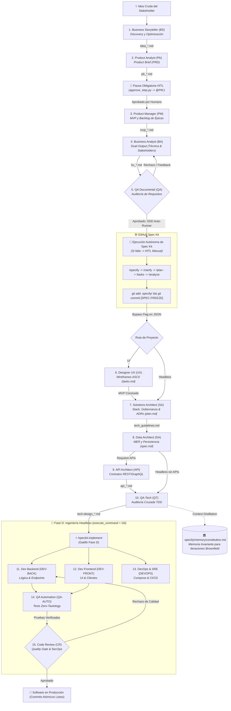
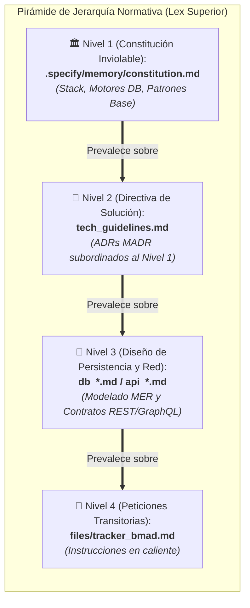

# 🏛️ Ecosistema Multi-Agente BMAD v2.0 (con SDD y Herdr)

> Framework y plugin organizacional para la definición integral, autónoma y desacoplada de software bajo metodología BMAD (Business, Management, Architecture, Development). Orquestado sobre terminales independientes en **Herdr**, automatización Git Headless y herramientas MCP.

---

## 🚀 Arranque Rápido (Quick Start)

El ecosistema v2.0 asume control estricto de repositorios. Para instanciar y correr un proyecto limpio:

1. **Clonar de forma segura:**
   ```bash
   python utils/clone_template.py "D:\ruta\a\nuevo-proyecto"
   ```
2. **Inicializar Repositorio y Entorno (en la nueva ruta):**
   ```bash
   cd "D:\ruta\a\nuevo-proyecto"
   git init && git add . && git commit -m "chore: inicialización BMAD"
   python init_bmad.py "Mi Nuevo Sistema"
   ```
3. **Arrancar el Motor Orquestador:**
   ```bash
   python watcher_bmad.py  # Desplegará un menú interactivo para seleccionar o crear la rama
   ```
4. **Levantar la Flota de Agentes en Herdr (en otra terminal):**
   ```bash
   python utils/start_agents.py
   ```

---

## 🛠️ Bitácora de Herramientas de Mantenimiento (`/utils`)

La carpeta `utils/` contiene los scripts operativos que le dan al humano el control absoluto sobre el ciclo de vida del framework:

| Script | Propósito y Comportamiento |
|---|---|
| **`clone_template.py`** | Script automatizado de *Scaffolding*. Utiliza una lista blanca estricta para clonar el motor BMAD hacia una nueva ruta. Evita arrastrar historiales (`.git/`), archivos transitorios (`plan.md`) o cachés de proyectos anteriores. |
| **`start_agents.py`** | Despliega simultáneamente a los 15 agentes de IA. Crea 3 pestañas temáticas en **Herdr** (Negocio, Arquitectura y Deployment), divide los paneles inyectando el contexto de las instrucciones y arranca los bucles de escucha. |
| **`stop_agents.py`** | *Kill-switch* controlado. Busca y cierra limpiamente todas las pestañas, paneles y procesos residuales de Herdr asociados al ecosistema para liberar memoria de la terminal. |
| **`approve_step.py`** | Motor del *Human-in-the-Loop (HITL)*. Cuando el framework se pausa obligatoriamente (ej. tras el Product Brief o la auditoría Spec Kit), este script permite al humano revisar los artefactos y autorizar matemáticamente la transición hacia el siguiente agente en el tracker. |
| **`clean_files.py`** | Utilidad interactiva de mantenimiento. Permite purgar selectivamente los entregables (Markdowns, PDFs, Códigos) generados en la carpeta `files/` para resetear un pipeline fallido, conservando intactos el Tracker y la Constitución. |
| **`delete_agents.py`** | Limpiador del Meta-Agente. Borra los archivos `AGENTS.md` compilados dinámicamente para forzar al orquestador a re-inyectar las skills (`[IMPORT_SKILL]`) en el siguiente arranque. |
| **`response_sa.py`** | Herramienta de *mocking* o debugging interno utilizada para simular las respuestas del Arquitecto de Soluciones y destrabar cuellos de botella en la fase de pruebas de handoff. |

---

## 🔧 Ejecución Manual de Agentes DEV (Modo Fallback / Micro-mantenimiento)

Por diseño arquitectónico (BMAD v2.0), el script `utils/start_agents.py` **no inicia** terminales interactivas para los desarrolladores (`@DEV-BACK` y `@DEV-FRONT`). La Fase D masiva es asimilada al 100% por el motor de ejecución automatizada (`/speckit.implement`) mediante la técnica de *Soul Mounting*.

Sin embargo, si necesitas realizar micro-ajustes rápidos, refactorizaciones menores o correcciones puntuales ignorando el flujo pesado de SpecKit (por ejemplo: `@DEV-FRONT: cambia el color de este botón`), debes instanciar al agente en su propia terminal.

**Para despertar a un DEV manualmente en Herdr:**

1. Selecciona la pestaña de "Desarrollo y Despliegue" en la UI de Herdr.
2. Abre un panel nuevo apuntando al directorio del agente:
   ```bash
   herdr pane split --direction right --cwd dev-frontend
   ```
3. Ejecuta el agente con su "Alma" (Archivo de Reglas Maestro) inyectada:
   ```bash
   herdr agent start dev-frontend --kind agy -- --dangerously-skip-permissions --add-dir . --agent AGENTS.md
   ```
*(Sustituye `dev-frontend` por `dev-backend` según corresponda). Una vez en línea, el orquestador (`watcher_bmad.py`) o tú mismo podrán despacharle instrucciones directas.*
---

## 🌟 Características Fundamentales

* **Mapa de Specs (Product State Ledger):** Base de datos determinista en texto plano (`specs/README.md`) que rastrea el ciclo de vida inmutable de las historias de usuario y requerimientos arquitectónicos. Actúa como fuente de verdad anti-alucinación, forzando a los agentes a ingerir este contexto histórico antes de proponer nuevos diseños.
* **Integración Nativa SDD (Spec-Driven Development vía GitHub Spec Kit):** El framework incorpora un puente determinista llamado **SDD Auto-Runner**. Tras la validación de QA Documental, el orquestador congela automáticamente el diseño (`git commit -m "[SPEC-FREEZE]"`) ejecutando de manera desatendida `/speckit.specify -> /clarify -> /plan -> /tasks -> /analyze`.
* **Commits Atómicos Headless:** Durante la Fase D, los agentes programadores carecen de capacidades interactivas. Ejecutan código e inyectan commits en Git aislando lógicamente cada característica (`git add . && git commit -m "feat: [TASK-ID]"`).
* **Estrategia Dual-Output de Requisitos (Business Analyst):** Generación simultánea de Historias Técnicas (Gherkin puro para Spec Kit) y Funcionales (Narrativas amigables para Stakeholders).
* **Fase D (Ingeniería) como Cartucho Intercambiable:** Arquitectura desacoplada con segregación entre Constructores (`DEV-BACK`, `DEV-FRONT`) y Auditores (`QA-AUTO`, `CODE-REVIEW`). Todos dotados con `execute_command` para operar físicamente la máquina del host.
* **Lógica de Bypass Inteligente:** El `config_bmad.json` decide rutas. En `project_type: ui` pasa al diseñador `@UX:`. En `project_type: headless`, salta directamente al `@SA:` ahorrando tiempo.
* **El Tracker como Único Bus de Datos:** Eliminación de alucinaciones inter-agente. Se comunican exclusivamente anexando texto (*read -> concat -> write*) en `files/tracker_bmad.md`.

---

## 🔄 Flujo Secuencial del Ciclo BMAD


```mermaid
flowchart TD
    Idea["💡 Idea Cruda del Stakeholder"] --> BS["1. Business Storyteller (BS)<br><i>Discovery y Optimización</i>"]
    BS -->|"idea_*.md"| PA["2. Product Analyst (PA)<br><i>Product Brief (PRD)</i>"]
    PA -->|"pb_*.md"| HITL["👤 Pausa Obligatoria HITL<br><i>(approve_step.py -> @PM:)</i>"]
    HITL -->|"Aprobado por Humano"| PM["3. Product Manager (PM)<br><i>MVP y Backlog de Épicas</i>"]
    PM -->|"mvp_*.md"| BA["4. Business Analyst (BA)<br><i>Dual-Output (Técnica & Stakeholders)</i>"]
    BA -->|"hu_*.md"| QA{"5. QA Documental (QA)<br><i>Auditoría de Requisitos</i>"}
    QA -->|"Rechazo / Feedback"| BA
    
    %% Puente SDD Gatekeeper
    QA -->|"Aprobado: SDD Auto-Runner"| SDD_PAUSE["🤖 Ejecución Autónoma de Spec Kit<br><i>(Si falla -> HITL Manual)</i>"]
    subgraph SPEC_SUITE ["⚙️ GitHub Spec Kit"]
        direction TB
        SDD_PAUSE --> SPEC_CMD["/specify -> /clarify -> /plan -> /tasks -> /analyze"]
        SPEC_CMD --> FREEZE["git add .specify/ && git commit [SPEC-FREEZE]"]
    end
    FREEZE -->|"Bypass Flag en JSON"| ROUTE{"Ruta de Proyecto"}
    
    ROUTE -->|"UI"| UX["6. Designer UX (UX)<br><i>Wireframes ASCII (tasks.md)</i>"]
    UX -->|"MVP Concluido"| SA["7. Solutions Architect (SA)<br><i>Stack, Gobernanza & ADRs (plan.md)</i>"]
    ROUTE -->|"Headless"| SA
    
    SA -->|"tech_guidelines.md"| DA["8. Data Architect (DA)<br><i>MER y Persistencia (spec.md)</i>"]
    DA -->|"Requiere APIs"| API["9. API Architect (API)<br><i>Contratos REST/GraphQL</i>"]
    API -->|"api_*.md"| QT["10. QA-Tech (QT)<br><i>Auditoría Cruzada TDD</i>"]
    DA -->|"Headless sin APIs"| QT
    
    QT -->|"tech-design_*.md"| IMP["⚡ /speckit.implement<br><i>(Gatillo Fase D)</i>"]
    
    subgraph FASE_D ["🤖 Fase D: Ingeniería Headless (execute_command + Git)"]
        direction TB
        IMP --> DevBack["11. Dev Backend (DEV-BACK)<br><i>Lógica & Endpoints</i>"]
        IMP --> DevFront["12. Dev Frontend (DEV-FRONT)<br><i>UI & Clientes</i>"]
        IMP --> DevOps["13. DevOps & SRE (DEVOPS)<br><i>Compose & CI/CD</i>"]
        DevBack & DevFront --> QAAuto["14. QA Automation (QA-AUTO)<br><i>Tests Zero-Tautology</i>"]
        QAAuto -->|"Pruebas Verificadas"| CR{"15. Code Review (CR)<br><i>Quality Gate & SecOps</i>"}
    end
    
    CR -->|"Rechazo de Calidad"| DevBack
    CR -->|"Aprobado"| Fin["🚀 Software en Producción (Commits Atómicos Listos)"]
    QT -.->|"Context Distillation"| Legacy[("🏛️ .specify/memory/constitution.md<br><i>Memoria Invariante para Iteraciones Brownfield</i>")]
```

---

## 🛡️ Gobernanza Arquitectónica Automatizada (Lex Superior) y Blindaje Anti-Sycophancy

En sistemas multi-agente operados con modelos fundacionales (LLMs), un riesgo latente es la **complacencia algorítmica (*sycophancy*)**: la tendencia del modelo a obedecer sumisamente las solicitudes inmediatas de un usuario, incluso cuando contradicen directamente las invariantes técnicas preexistentes.

BMAD instituye el principio jurídico-técnico de **Lex Superior** y un sistema de **Defensa en Profundidad**:


```mermaid
flowchart TD
    subgraph JerarquiaNormativa ["Pirámide de Jerarquía Normativa (Lex Superior)"]
        direction TB
        L1["🏛️ Nivel 1 (Constitución Inviolable):<br><b>.specify/memory/constitution.md</b><br><i>(Stack, Motores DB, Patrones Base)</i>"]
        L2["📐 Nivel 2 (Directiva de Solución):<br><b>tech_guidelines.md</b><br><i>(ADRs MADR subordinados al Nivel 1)</i>"]
        L3["💾 Nivel 3 (Diseño de Persistencia y Red):<br><b>db_*.md / api_*.md</b><br><i>(Modelado MER y Contratos REST/GraphQL)</i>"]
        L4["💬 Nivel 4 (Peticiones Transitorias):<br><b>files/tracker_bmad.md</b><br><i>(Instrucciones en caliente)</i>"]
    end
    
    L1 ==>|Prevalece sobre| L2
    L2 ==>|Prevalece sobre| L3
    L3 ==>|Prevalece sobre| L4
```

1. **Barrera 1 - Solutions Architect (SA):** Anula de plano peticiones transitorias si contradicen el archivo físico de Constitución.
2. **Barrera 2 - Data & API Architects:** Tienen inmunidad jerárquica para desobedecer directrices del SA si detectan desviación constitucional.
3. **Barrera 3 - QA Tech (Guardián Inflexible):** Rechaza sumariamente diseños que violen la constitución emitiendo error 🔴 **CRÍTICO: Complacencia Ilegal (Sycophancy Breach)**.

---

## 📚 Documentación de Referencia

| Documento / Archivo | Propósito Principal |
|---|---|
| [**`framework_bmad.md`**](./framework_bmad.md) | **[DOCUMENTO MAESTRO] Arquitectura técnica profunda, Git Headless y topología de componentes.** |
| [**`SETUP.md`**](./SETUP.md) | Guía de parametrización estricta para crear y clonar proyectos con `clone_template.py`. |
| [**`GUIDE.md`**](./GUIDE.md) | Manual operativo paso a paso y solución de incidentes del día a día. |
| [**`PLUGGABLE_PHASE_D.md`**](./PLUGGABLE_PHASE_D.md) | Especificación de Cartucho Intercambiable (Cambio de Lenguaje/Stack de los agentes programadores). |
| [**`BMAD_AUDIT_REPORT.md`**](./BMAD_AUDIT_REPORT.md) | Reporte interno de certificación de salud arquitectónica del framework. |


---

## 🛑 Regla de Oro: Principio de Vertical Slicing Estricto

El ecosistema BMAD v2.0 opera bajo un modelo de **Vertical Slicing Estricto** para garantizar la salud del State Ledger y evitar divergencias arquitectónicas.

*   **Prohibición de Desarrollo Horizontal:** Queda estrictamente prohibido abrir o diseñar múltiples Historias de Usuario (HUs) a la vez. No se puede avanzar al diseño de una nueva característica si la anterior no ha cerrado su ciclo.
*   **Ciclo de Vida de Rebanada Vertical:** Toda HU debe atravesar el ciclo completo antes de iniciar la siguiente: `PM -> BA -> QA -> UX -> SA -> (Fases Técnicas) -> QT -> Retorno a PM`.
*   **Regla de Ramas GitOps:** Queda terminantemente prohibido que el `@PM` inicie una nueva historia y emita un `GITOPS-BRANCH-CREATE` si la historia anterior no ha sido debidamente compilada y fusionada en el código base principal por el `@QT` mediante `GITOPS-MERGE-CLOSE`.

---

## 🔒 Consistencia de Nomenclatura y Trazabilidad (Identificador Universal)

El ecosistema BMAD v2.0 impone una trazabilidad matemática exacta (1:1) entre el Product State Ledger, el control de versiones y el sistema de archivos físico mediante el uso de un **Identificador Universal Estricto**.

1. **Formato Inmutable:** Todas las historias de usuario deben adoptar la nomenclatura `XXX-HU_nombre_en_snake_case` (ej. `001-HU_tarjeta_identidad_digital`).
2. **Columnas del Ledger:** La tabla del Ledger (`specs/README.md`) utiliza oficialmente la estructura: `| N° | Épica Origen | Nombre spec / HU | Qué aporta | Estado | Rama |`.
3. **Uso Obligatorio Transversal:** Este identificador exacto y sin truncar se utiliza obligatoriamente para:
   - Registrar la funcionalidad en la columna `Nombre spec / HU` y en la columna `Rama` (`feat/001-HU_...`) del Ledger.
   - Orquestar la bifurcación GitOps (`@WATCHER: GITOPS-BRANCH-CREATE feat/XXX-HU_...`).
   - Nombrar los archivos físicos `.md` generados por los agentes (`@BA`, `@BS`, `@SA`, etc.). Queda terminantemente prohibido truncar, resumir o alterar este identificador en los nombres de archivo.

---

## 🚪 El Motor: "Doble Compuerta SDD" (Two-Stage Gatekeeper)
El orquestador BMAD implementa un "Two-Stage Gatekeeper" para fraccionar la ejecución automática del puente **Spec Kit**. Esto evita la alucinación técnica y asegura que el modelo tecnológico propuesto por el orquestador obedezca a los arquitectos.

*   **Compuerta 1 (Negocio):** Al recibir la aprobación del `@QA` (QA Documental), el Watcher intercepta la ejecución para lanzar de forma independiente `/speckit.specify` y `/speckit.clarify`. Esto detalla funcionalmente el comportamiento sin inferir el stack.
*   **Compuerta 2 (Arquitectura):** Tras el diseño de gobernanza del `@SA` (Solutions Architect), este agente emite la macro `@WATCHER: SDD-FREEZE`. El orquestador pausa el flujo nuevamente y ejecuta `/speckit.plan`, `/speckit.tasks` y `/speckit.analyze`. En esta fase, Spec-Kit asimila las guidelines inyectadas por el Arquitecto para generar un plan técnico realista y congelarlo (`[SPEC-FREEZE]`).

> **Nota Operativa:** Durante el desarrollo asistido, el usuario notará que el Watcher (`watcher_bmad.py`) detiene el avance automático en estos dos hitos exactos de la línea de tiempo, delegando silenciosamente la ejecución hacia el puente SDD antes de reanudar el Handoff hacia los desarrolladores.
