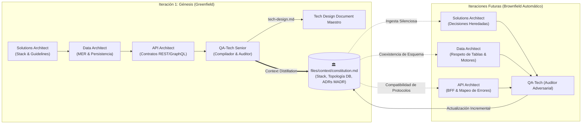
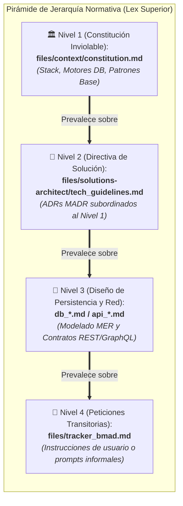

# Ecosistema Multi-Agente BMAD con Herdr

> Framework y plugin organizacional para la definición integral, autónoma y desacoplada de software bajo metodología BMAD (Business, Management, Architecture, Development), orquestado sobre terminales independientes en **Herdr** y herramientas MCP.

---

* **Integración Nativa SDD (Spec-Driven Development vía GitHub Spec Kit):** El framework incorpora el puente determinista con GitHub Spec Kit. Tras la aprobación de requisitos por parte del QA Documental, el orquestador activa una pausa lógica interceptora (**SDD Gatekeeper**) para transitar el ciclo interactivo de especificación formal (`/speckit.specify -> /speckit.clarify -> /speckit.plan -> /speckit.tasks -> /speckit.analyze`), cuya liberación controlada mediante `utils/approve_step.py` nutre directamente a la Fase de Arquitectura y UX (`spec.md`, `tasks.md`, `plan.md`). La ejecución en Fase D es gatillada por `/speckit.implement`.
* **Estrategia Dual-Output de Requisitos (Business Analyst):** Generación simultánea y determinista de dos variantes de Historias de Usuario:
  - **HU Técnica (Spec Kit Ready):** Formato aséptico, metadatos estructurados y sintaxis Gherkin pura guardada en `files/business-analyst/hu_[ID]_[nombre].md` para consumo directo por `/speckit.specify`.
  - **HU para Stakeholders:** Enfoque de negocio, narrativa en primera persona y criterios funcionales amigables archivados en `files/business-analyst/HUs-stakeholders/hu_[ID]_[nombre].md`.
* **Capacitación CLI en Fase D (Terminal Execution):** Equipamiento de la herramienta canónica de terminal (`execute_command`) en los agentes de implementación (`dev-backend`, `dev-frontend`, `qa-auto` y `devops`) para permitir la compilación, ejecución de tests y despacho coordinado de tareas comandado por `/speckit.implement`.
* **El Tracker como Único Bus de Datos y Comunicación:** Los agentes **NO** se comunican entre sí por chat ni APIs directas. Toda la coordinación y paso de entregables fluye exclusivamente mediante eventos anexados al final de `files/tracker_bmad.md` bajo el patrón estricto de adición (*read -> concat -> write*).
* **Fase D (Ingeniería de Software & Delivery) como Cartucho Intercambiable:** Arquitectura desacoplada (*Plug & Play*) con segregación estricta entre Constructores (`dev-backend` para lógica de negocio de servidor y `dev-frontend` para clientes e interfaces visuales) y Auditores (`qa-auto` para pruebas automatizadas no-tautológicas y `code-review` como compuerta SecOps/OWASP). La infraestructura es aprovisionada en paralelo por `devops` (contenedores multi-stage, compose resiliente y CI/CD). El stack tecnológico (ej. .NET, Java, Python, Go) es 100% intercambiable sin tocar el motor de orquestación.
* **Lógica de Bypass (Headless vs UI):** El ecosistema reconoce la naturaleza del proyecto:
  - **Proyectos con UI:** Transitan el pipeline visual completo: `BA -> QA -> [SDD Gatekeeper: Spec Kit] -> UX -> SA -> DA -> API -> QT -> /speckit.implement -> (DEV-BACK / DEV-FRONT) -> QA-AUTO -> CODE-REVIEW`.
  - **Proyectos Headless (ETL, SSIS, APIs puras, Pipelines de Datos):** Saltan automáticamente la fase de diseño UX: `BA -> QA -> [SDD Gatekeeper: Spec Kit] -> SA -> DA -> QT -> /speckit.implement -> DEV-BACK -> QA-AUTO -> CODE-REVIEW`.
* **Estrategia Dual Greenfield / Brownfield (Agnosticismo Total):** Capacidad nativa para operar en proyectos desde cero o sobre sistemas preexistentes mediante el interruptor físico `files/context/constitution.md`. Si el archivo existe, todos los agentes (negocio, requisitos y arquitectura) subordinan de forma autónoma y sin fricción sus diseños a las reglas, dominio y tecnologías descritas allí. Si no existe, operan en modo Greenfield estándar sin precondiciones.
* **Auto-Evolución y Destilación de Contexto (Context Distillation):** El QA Tech (`qa-tech`) actúa como **Bibliotecario de Arquitectura**. Al compilar el Tech Design Document (TDD), evalúa si hubo cambios estructurales y genera o actualiza automáticamente el archivo `files/context/constitution.md`. Esto cierra el ciclo de vida arquitectónico, permitiendo que un proyecto nacido como *Greenfield* destile sus propias invariantes y prepare el terreno para futuras iteraciones evolutivas (*Brownfield*) de manera 100% desatendida.
* **Auditoría Adversarial Zero-Trust (Quality Gate Técnico):** El QA Tech no valida ciegamente; aplica duda metódica por defecto, audita trazabilidad forzosa UI-Data (cero campos huérfanos), detector de mentiras en ADRs (cazando alternativas absurdas o trade-offs cosméticos) y clasifica hallazgos en una matriz de severidad (Crítico, Advertencia, Sugerencia) con auto-sanación agéntica.
* **Gobernanza Arquitectónica Automatizada (Lex Superior) y Blindaje Anti-Sycophancy:** Blindaje institucional contra la complacencia de los LLMs (*sycophancy*). Las invariantes técnicas del archivo físico `files/context/constitution.md` tienen jerarquía constitucional sobre peticiones informales en el tracker. Si un usuario solicita tecnologías incompatibles sin una Cláusula de Excepción formal en el archivo físico, el SA, DA y API están obligados a ignorar la solicitud, y el QA Tech actúa como guardián adversarial rechazando sumariamente cualquier diseño complaciente con severidad 🔴 CRÍTICO.
* **Aprobación Manual Obligatoria (HITL):** Soporte para interrupciones controladas (`@HUMANO:`), donde la activación del `@PM:` depende obligatoriamente de la aprobación humana del Product Brief mediante `utils/approve_step.py`, garantizando control de alcance antes del desglose de épicas.
* **Arquitectura Modular de Agentes:** Cada agente define su rol (`agents/*.agent.md`) y reglas satélite (`instructions/*.instructions.md`), auto-ensambladas en tiempo de ejecución (`AGENTS.md`) por el orquestador.
* **Inyección Atómica en Terminales (TTY):** Resolución dinámica de IDs de paneles en tiempo de ejecución para inyectar comandos directamente a los procesos mediante `herdr pane run`.
* **Integración Avanzada de MCP:** Lectura de configuraciones JSON globales (`config_bmad.json`), extracción de contexto documental y guardado de entregables en rutas aisladas (`files/`) vía `MCP Filesystem` y generación de pantallas con `MCP Stitch`.
* **Inyección Dinámica de Skills:** Motor de compilación que integra de manera modular habilidades transversales (globales) y de dominio (locales) en los agentes en tiempo de ejecución mediante la sintaxis `[IMPORT_SKILL: skills/ruta/SKILL.md]`.
* **Control de Concurrencia y FinOps:** Candado de disparo único en el orquestador (`watcher_bmad.py`) y asignación granular de modelos/esfuerzo de razonamiento en `utils/start_agents.py`.
* **Trazabilidad Continua:** Commits automáticos en Git por cada tarea procesada con éxito.

---

## 🛠️ Problemas Estructurales Resueltos

* **Bloqueo de Canal Interactivo:** Inyecciones directas de comandos TTY al panel (`herdr pane run`).
* **Restricciones de Sandbox (Access Denied):** Habilitación del flag `--add-dir` en la raíz del proyecto para permitir a los agentes compartir archivos en `files/`.
* **Aniquilación de Historial:** Patrón estricto de anexión (*read -> concat -> write*) en `tracker_bmad.md`.
* **Sangrado de Instrucciones (Instruction Bleed):** Separación de reglas de formato de redacción respecto a las instrucciones mecánicas de guardado.
* **Condiciones de Carrera y Doble Despacho:** Eliminación del paralelismo inestable en favor del modelo secuencial determinista (*Token-Passing*).

---

## 📁 Estructura del Proyecto

```text
/template-bmad
├── config_bmad.json                  # Diccionario de rutas absolutas para herramientas MCP
├── watcher_bmad.py                   # Orquestador del ciclo de vida y compilador de agentes
├── init_bmad.py                      # Scaffolding automatizado y reseteo limpio del tracker
├── README.md                         # Portada principal y resumen del ecosistema
├── ARCHITECTURE.md                   # Arquitectura técnica profunda y diagramas Mermaid
├── GUIDE.md                          # Guía de uso paso a paso y solución de problemas
├── SETUP.md                          # Manual de instanciación y clonado en nuevas rutas
├── QUESTIONS.md                      # Compendio de preguntas y respuestas técnicas
├── PLUGGABLE_PHASE_D.md              # Especificación de Cartucho Intercambiable (Fase D Plug & Play)
├── BMAD_AUDIT_REPORT.md              # Reporte de auditoría y health check de consistencia
├── manifest.yaml                     # Manifiesto de capacidades y gobernanza del plugin
├── catalog-info.yaml                 # Definición para el catálogo Backstage
│
├── /skills                           # Repositorio global de habilidades (tracker-logger, export-pdf, etc.)
├── /utils                            # Scripts de automatización y mantenimiento
│   ├── start_agents.py               # Despliega la flota en 3 pestañas temáticas en Herdr (Rutas dinámicas)
│   ├── stop_agents.py                # Cierra limpiamente todas las pestañas y paneles de los agentes en Herdr
│   ├── approve_step.py               # Script HITL para autorizar transiciones (@PM:, @DEV:)
│   ├── clean_files.py                # Limpia interactivamente los entregables en files/
│   └── delete_agents.py              # Elimina los archivos AGENTS.md auto-compilados
│
├── /business-storyteller             # Agente BS: Discovery y narrativa de negocio
├── /product-analyst                  # Agente PA: Product Brief (PRD)
│   └── /skills                       # Skills locales de dominio (pb-validator)
├── /product-manager                  # Agente PM: Alcance, MVP y Backlog
├── /business-analyst                 # Agente BA: Historias de Usuario (BDD/Gherkin)
│   └── /skills                       # Skills locales de dominio (hu-validator)
├── /qa-documental                    # Agente QA: Auditoría de trazabilidad y calidad documental
├── /designer-ux                      # Agente UX: Wireframes y flujos UI
├── /solutions-architect              # Agente SA: Stack técnico, gobernanza y guidelines
├── /data-architect                   # Agente DA: Modelo Entidad-Relación (MER) y persistencia
├── /api-architect                    # Agente API: Contratos de integración REST/GraphQL
├── /qa-tech                          # Agente QT: Auditoría cruzada y compilación del TDD
├── /dev-backend                      # Agente DEV-BACK: Construcción de lógica de negocio y servidor
├── /dev-frontend                     # Agente DEV-FRONT: Construcción de interfaz de usuario y clientes
├── /qa-auto                          # Agente QA-AUTO: Automatización de pruebas (Zero-Tautology)
├── /code-review                      # Agente CR: Auditoría SecOps, calidad y gatekeeper final
├── /devops                           # Agente DEVOPS: Infraestructura, contenedores y CI/CD
│
├── /prompts                          # Prompts monolíticos de referencia (Legacy)
│
└── /files                            # Directorio de Entregables (Aislamiento de Datos)
    ├── tracker_bmad.md               # Único bus de eventos y cola de orquestación
    ├── /context                      # Contexto opcional de ecosistema heredado (Brownfield)
    │   └── constitution.md       # Interruptor físico con directrices del sistema preexistente
    ├── /business-storyteller         # Salidas BS: ideas estructuradas (idea_*.md)
    ├── /product-analyst              # Salidas PA: product briefs (pb_*.md)
    ├── /product-manager              # Salidas PM: planes de gestión / MVP (mvp_*.md)
    ├── /business-analyst             # Salidas BA: historias de usuario técnicas (hu_*.md)
    │   └── /HUs-stakeholders         # Salidas BA: historias de usuario funcionales para negocio
    ├── /qa-documental                # Salidas QA: reportes de auditoría (aprobado_qa_*.md, feedback_qa_*.md)
    ├── /designer-ux                  # Salidas UX: especificaciones UI/UX (ux_*.md)
    ├── /solutions-architect          # Salidas SA: gobernanza técnica (tech_guidelines.md)
    ├── /data-architect               # Salidas DA: diseño de persistencia (db_*.md)
    ├── /api-architect                # Salidas API: contratos de interfaz (api_*.md)
    ├── /qa-tech                      # Salidas QT: compilado maestro (tech-design_*.md)
    ├── /dev-backend                  # Salidas DEV-BACK: logs y artefactos backend
    ├── /dev-frontend                 # Salidas DEV-FRONT: logs y artefactos frontend
    ├── /qa-auto                      # Salidas QA-AUTO: suites de pruebas y cobertura
    ├── /code-review                  # Salidas CR: certificaciones y dictámenes SecOps
    └── /devops                       # Salidas DEVOPS: configs de despliegue y compose
```

---

## 🚀 Puesta en Marcha y Flujo de Ejecución

### 1. Inicialización y Arranque
1. **Configuración Inicial:** Ejecutar `python init_bmad.py "Nombre del Proyecto"` (o actualizar rutas en `config_bmad.json`, ver [SETUP.md](./SETUP.md)).
   - **Modo Greenfield (Proyecto Nuevo):** Operación estándar sin precondiciones (verificar que `files/context/constitution.md` no exista).
   - **Modo Brownfield (Sistema Existente):** Crear `files/context/constitution.md` documentando el dominio, tecnologías, bases de datos y restricciones del sistema legado.
2. **Terminal 1 - Watcher (Orquestador y Compilador):**
   ```bash
   python watcher_bmad.py
   ```
3. **Terminal 2 - Herdr (Flota de Agentes):**
   ```bash
   python utils/start_agents.py
   ```
4. **Disparo:** Ingresar la idea en la terminal de `@BS:` o mediante el tracker.

### 2. Flujo de Ejecución Paso a Paso

1. **Discovery e Ideación (`@BS:` -> `@PA:`):** `business-storyteller` refina la idea y delega a `product-analyst`, quien redacta el Product Brief (`pb_*.md`).
2. **Pausa Obligatoria HITL (Product Brief):** El PA detiene el avance emitiendo `@HUMANO:`. El operador revisa el Product Brief y ejecuta:
   ```bash
   python utils/approve_step.py
   ```
   Selecciona la opción `[2] Product Analyst` para autorizar a `@PM:`.
3. **Estrategia Dual-Output de Requisitos (`@PM:` -> `@BA:` -> `@QA:`):** 
   - `product-manager` prioriza el MVP (`mvp_*.md`) y delega al `business-analyst`.
   - `business-analyst` genera simultáneamente dos entregables: la **HU Técnica** en Gherkin estricto (`files/business-analyst/hu_*.md`) y la **HU para Stakeholders** (`files/business-analyst/HUs-stakeholders/hu_*.md`).
   - `qa-documental` audita la trazabilidad contra el Product Brief.
4. **🛑 Pausa Lógica del SDD Gatekeeper (GitHub Spec Kit):**
   Tras la emisión del certificado de aprobación documental por parte de QA Documental, **la consola de `watcher_bmad.py` se pausará automáticamente** (interceptor SDD Gatekeeper), indicando al operador humano que debe ejecutar los comandos CLI de GitHub Spec Kit para el refinamiento formal:
   ```bash
   /speckit.specify files/business-analyst/hu_[ID]_[nombre].md
   /speckit.clarify
   /speckit.plan
   /speckit.tasks
   /speckit.analyze
   ```
5. **Reanudación del Orquestador hacia la Fase A (Arquitectura):**
   Una vez concluido y analizado el ciclo SDD con `/speckit.analyze`, el operador reanuda el orquestador ejecutando:
   ```bash
   python utils/approve_step.py
   ```
   Selecciona la opción **`[5] Spec Kit (SDD Bridge) -> UX`** (o **`[6] Spec Kit -> SA`** si es un proyecto Headless). Los agentes de arquitectura (`designer-ux`, `solutions-architect`, `data-architect`, `api-architect`, `qa-tech`) consumirán directamente `spec.md`, `tasks.md` y `plan.md` como fuente de la verdad inmutable.
6. **Compilación de Arquitectura y Gatillo de Implementación (`/speckit.implement`):**
   `qa-tech` realiza la auditoría cruzada (MER vs APIs vs Spec Kit), compila el `tech-design_*.md` y emite `@SPEC-KIT:`. El operador o el pipeline gatilla `/speckit.implement` (o `approve_step.py` opción `[10]`).
7. **Fase D con Capacidad de Terminal (`execute_command`):**
   Los agentes constructores y de soporte (`dev-backend`, `dev-frontend`, `qa-auto`, `devops`) están dotados de la herramienta **`execute_command`**. Esto les otorga capacidad de ejecución real en terminal para:
   - Compilar proyectos y restaurar dependencias.
   - Ejecutar migraciones de bases de datos.
   - Correr suites de pruebas automatizadas no-tautológicas (`qa-auto`).
   - Aprovisionar y validar contenedores Docker / Compose (`devops`).
8. **Quality Gate y Cierre (`code-review`):**
   `code-review` realiza la inspección física de código y pruebas, emitiendo el veredicto formal `[APROBADO]`.

---

## 🔄 Flujo del Ciclo BMAD

```mermaid
flowchart TD
    Idea["💡 Idea Cruda del Stakeholder"] --> BS["1. Business Storyteller (BS)<br><i>Discovery y Optimización</i>"]
    BS -->|idea_*.md| PA["2. Product Analyst (PA)<br><i>Product Brief (PRD)</i>"]
    PA -->|pb_*.md| HITL["👤 Pausa Obligatoria HITL<br><i>(approve_step.py -> @PM:)</i>"]
    HITL -->|Aprobado por Humano| PM["3. Product Manager (PM)<br><i>MVP y Backlog de Épicas</i>"]
    PM -->|mvp_*.md| BA["4. Business Analyst (BA)<br><i>Dual-Output (Técnica & Stakeholders)</i>"]
    BA -->|hu_*.md| QA{"5. QA Documental (QA)<br><i>Auditoría de Requisitos</i>"}
    QA -->|Rechazo / Feedback| BA
    
    %% Puente SDD Gatekeeper
    QA -->|Aprobado: Pausa SDD Gatekeeper| SDD_PAUSE["🛑 Pausa Lógica SDD (Watcher)<br><i>Comandos CLI de Spec Kit</i>"]
    subgraph SPEC_SUITE ["⚙️ GitHub Spec Kit"]
        direction TB
        SDD_PAUSE --> SPEC_CMD["/speckit.specify -> /clarify -> /plan -> /tasks -> /analyze"]
    end
    SPEC_CMD -->|Liberación: python utils/approve_step.py| ROUTE{"Ruta de Proyecto"}
    
    ROUTE -->|Ruta con UI| UX["6. Designer UX (UX)<br><i>Wireframes ASCII (tasks.md)</i>"]
    UX -->|Épicas Pendientes| PM
    UX -->|MVP Concluido| SA["7. Solutions Architect (SA)<br><i>Stack, Gobernanza & ADRs (plan.md)</i>"]
    ROUTE -->|Bypass Headless| SA
    
    SA -->|tech_guidelines.md| DA["8. Data Architect (DA)<br><i>MER y Persistencia (spec.md)</i>"]
    DA -->|Requiere APIs| API["9. API Architect (API)<br><i>Contratos REST/GraphQL</i>"]
    API -->|api_*.md| QT["10. QA-Tech (QT)<br><i>Auditoría Cruzada TDD</i>"]
    DA -->|Headless sin APIs| QT
    
    QT -->|tech-design_*.md (@SPEC-KIT:)| IMP["⚡ /speckit.implement<br><i>(Gatillo Fase D / approve_step.py #10)</i>"]
    
    subgraph FASE_D ["🤖 Fase D: Ingeniería con execute_command"]
        direction TB
        IMP --> DevBack["11. Dev Backend (DEV-BACK)<br><i>Lógica & Endpoints (execute_command)</i>"]
        IMP --> DevFront["12. Dev Frontend (DEV-FRONT)<br><i>UI & Clientes (execute_command)</i>"]
        IMP --> DevOps["13. DevOps & SRE (DEVOPS)<br><i>Compose & CI/CD (execute_command)</i>"]
        DevBack & DevFront --> QAAuto["14. QA Automation (QA-AUTO)<br><i>Tests Zero-Tautology (execute_command)</i>"]
        QAAuto -->|Pruebas Verificadas| CR{"15. Code Review (CR)<br><i>Quality Gate & SecOps</i>"}
    end
    
    CR -->|Rechazo de Calidad| DevBack
    CR -->|Rechazo de Calidad| DevFront
    CR -->|Rechazo de Pruebas| QAAuto
    CR -->|Aprobado| Fin["🚀 Software en Producción Certificado"]
    QT -.->|Context Distillation<br><i>Crea o actualiza snapshot</i>| Legacy[("🏛️ files/context/constitution.md<br><i>Memoria Invariante para Iteraciones Brownfield</i>")]
```

---

## 🧬 Auto-Evolución de Proyectos: El Ciclo de Vida Cerrado (Context Distillation)

Uno de los mayores retos en la arquitectura con agentes autónomos es la **amnesia evolutiva**: los proyectos comienzan desde cero (*Greenfield*), pero a medida que el software crece a lo largo de múltiples épicas o sprints, los nuevos agentes pueden perder de vista las decisiones estructurales iniciales, provocando dispersión tecnológica, duplicidad de patrones y regresiones en la persistencia.

El framework BMAD resuelve este problema convirtiendo al **QA Técnico (`qa-tech`)** en el **Bibliotecario de Arquitectura** del enjambre:


```mermaid
flowchart LR
    subgraph Iteracion1 ["Iteración 1: Génesis (Greenfield)"]
        direction TB
        SA1["Solutions Architect\n(Stack & Guidelines)"] --> DA1["Data Architect\n(MER & Persistencia)"]
        DA1 --> API1["API Architect\n(Contratos REST/GraphQL)"]
        API1 --> QT1["QA-Tech Senior\n(Compilador & Auditor)"]
        QT1 -->|tech-design.md| TDD1["Tech Design Document Maestro"]
        QT1 ==>|Context Distillation| Snapshot[("🏛️ files/context/constitution.md\n(Stack, Topología DB, ADRs MADR)")]
    end

    subgraph Iteracion2 ["Iteraciones Futuras (Brownfield Automático)"]
        direction TB
        Snapshot -.->|Ingesta Silenciosa| SA2["Solutions Architect\n(Decisiones Heredadas)"]
        Snapshot -.->|Coexistencia de Esquema| DA2["Data Architect\n(Respeto de Tablas & Motores)"]
        Snapshot -.->|Compatibilidad de Protocolos| API2["API Architect\n(BFF & Mapeo de Errores)"]
        SA2 & DA2 & API2 --> QT2["QA-Tech (Auditor Adversarial)"]
        QT2 -->|Actualización Incremental| Snapshot
    end
```

### ⚙️ Protocolo Operativo del Bibliotecario de Arquitectura:

1. **Génesis Greenfield (Creación Autónoma del Snapshot Fundacional):**
   * Si el proyecto arrancó sin precondiciones (`files/context/constitution.md` no existía), el QA Tech, tras auditar y compilar exitosamente el `tech-design_*.md`, destila automáticamente las **invariantes duras del sistema**:
     * **Stack tecnológico base:** Runtimes, frameworks, nube y directivas de despliegue.
     * **Topología de base de datos:** Motor de persistencia, dialecto relacional y entidades de dominio core.
     * **Patrones de comunicación:** Protocolos de red, estándares de payload y convenciones de endpoints.
     * **Registro formal de decisiones (ADRs MADR):** Consolida las decisiones iniciales marcadas como base del ecosistema.
   * Filtra el ruido temporal (omite wireframes transitorios, criterios Gherkin específicos o épicas individuales) para concentrar la esencia arquitectónica pura.

2. **Evolución Brownfield (Preservación y Anexión Incremental):**
   * Si el archivo ya existía (en iteraciones posteriores o proyectos sobre software preexistente), el QA Tech tiene **estrictamente prohibido sobrescribirlo** o borrar el historial fundacional.
   * Evalúa mediante análisis cruzado si la nueva entrega introduce **cambios de nivel estructural** (ej. adición de una base de datos secundaria, una nueva entidad core de dominio o un patrón arquitectónico mayor).
   * **Si hay cambios estructurales:** Actualiza y anexa las nuevas entidades o decisiones al documento existente sin tocar las invariantes previas.
   * **Si la entrega es menor (ej. un CRUD estándar):** Mantiene el archivo intacto evitando la polución de contexto.

3. **Cierre de Ciclo sin Intervención Humana:**
   * La próxima vez que el enjambre despierte para una nueva funcionalidad, los agentes detectarán el snapshot automáticamente:
     * El `solutions-architect` omite el cuestionario interactivo genérico y registra los ADRs previos como `Aceptado (heredado)`.
     * El `data-architect` diseña nuevas tablas extendiendo las existentes sin colisiones relacionales.
     * El `api-architect` respeta los estándares de red establecidos.
   * El ciclo se vuelve **auto-sostenible y evolutivo por diseño**.

---

## 🛡️ Gobernanza Arquitectónica Automatizada (Lex Superior) y Blindaje Anti-Sycophancy

En sistemas multi-agente operados con modelos fundacionales (LLMs), un riesgo latente es la **complacencia algorítmica (*sycophancy*)**: la tendencia del modelo a obedecer sumisamente las solicitudes inmediatas de un usuario en el chat o tracker, incluso cuando contradicen directamente las invariantes técnicas, la infraestructura preexistente o las decisiones de gobernanza corporativa.

Para erradicar este riesgo y dotar al enjambre de autoridad técnica real, el framework BMAD instituye el principio jurídico-técnico de **Lex Superior** y un sistema de **Defensa en Profundidad en Tres Barreras**:


```mermaid
flowchart TD
    subgraph JerarquiaNormativa ["Pirámide de Jerarquía Normativa (Lex Superior)"]
        direction TB
        L1["🏛️ Nivel 1 (Constitución Inviolable):<br><b>files/context/constitution.md</b><br><i>(Stack, Motores DB, Patrones Base)</i>"]
        L2["📐 Nivel 2 (Directiva de Solución):<br><b>files/solutions-architect/tech_guidelines.md</b><br><i>(ADRs MADR subordinados al Nivel 1)</i>"]
        L3["💾 Nivel 3 (Diseño de Persistencia y Red):<br><b>db_*.md / api_*.md</b><br><i>(Modelado MER y Contratos REST/GraphQL)</i>"]
        L4["💬 Nivel 4 (Peticiones Transitorias):<br><b>files/tracker_bmad.md</b><br><i>(Instrucciones de usuario o prompts informales)</i>"]
    end
    
    L1 ==>|Prevalece sobre| L2
    L2 ==>|Prevalece sobre| L3
    L3 ==>|Prevalece sobre| L4
```

### 🧱 Las Tres Barreras de Defensa en Profundidad:

1. **Barrera 1 - Solutions Architect (SA):** 
   Si el usuario solicita en el tracker una tecnología divergente (por ejemplo, *"Diseña el módulo de mensajería usando Node.js y MongoDB"* cuando el ecosistema base documentado en `constitution.md` es *.NET 10 y SQL Server*), el SA verifica si existe una excepción formal registrada. Al no existir, **anula de plano la solicitud del tracker**, adapta la solución al stack oficial (C# / SQL Server) y deja constancia del rechazo en el log del tracker.
2. **Barrera 2 - Data Architect (DA) y API Architect (API):** 
   Si por alguna anomalía de razonamiento el SA sufriera de complacencia e incluyera una tecnología no autorizada en `tech_guidelines.md`, el DA y el API Architect cuentan con **inmunidad jerárquica**: subordinan su diseño directamente al archivo físico `constitution.md`, desobedeciendo la directiva del SA y modelando exclusivamente sobre los motores aprobados.
3. **Barrera 3 - QA Tech (QT - Guardián Constitucional Inflexible):** 
   Durante la auditoría adversarial del TDD, el QA Tech realiza el cruce contra `files/context/constitution.md`. Si detecta cualquier componente tecnológico no homologado introducido sin respaldo físico, emite una no conformidad con severidad 🔴 **CRÍTICO: Complacencia Ilegal (Sycophancy Breach)**, rechaza el Tech Design Document y devuelve el control al responsable con feedback corrector.

---

### 📝 Cómo habilitar una excepción tecnológica: La Cláusula de Excepción

En BMAD, la arquitectura **no se altera mediante conversaciones de chat ni instrucciones en el tracker**. La única vía legítima para autorizar la introducción de un nuevo motor de base de datos, lenguaje o framework en un entorno existente es editando **físicamente** el archivo `files/context/constitution.md` e incorporando una **Cláusula de Excepción Arquitectónica**:

````markdown
## ⚠️ CLÁUSULA DE EXCEPCIÓN ARQUITECTÓNICA: [ID_EXCEPCION]
- **Tecnología / Motor Autorizado:** [Ej. Node.js 22 LTS / MongoDB 8.0]
- **Ámbito Permitido:** [Exclusivamente para el microservicio de Notificaciones Push y Chat]
- **Justificación Ejecutiva:** [Aprobado por Arquitectura / CTO para soportar protocolo WebSockets nativo de alta concurrencia]
- **Estrategia de Convivencia:** [Aislamiento perimetral, interoperabilidad mediante eventos REST/Kafka hacia el core SQL Server]
````

Cuando los agentes detectan este bloque en el archivo físico, la divergencia queda formalmente legitimada:
- El **Solutions Architect** registrará el ADR correspondiente con estado `Aceptado (propuesto con excepción)`.
- El **Data Architect** modelará sobre el motor alternativo respetando los límites de su ámbito.
- El **QA Tech** validará la arquitectura sin activar el bloqueo adversarial.

---

## 📚 Documentación de Referencia

| Documento | Descripción |
|---|---|
| [**`ARCHITECTURE.md`**](./ARCHITECTURE.md) | **Arquitectura detallada, diagramas de componentes y de secuencia completos.** |
| [**`GUIDE.md`**](./GUIDE.md) | **Guía operativa paso a paso, matriz de entradas/salidas y solución de problemas.** |
| [**`SETUP.md`**](./SETUP.md) | **Guía de parametrización e instanciación para nuevos proyectos.** |
| [**`PLUGGABLE_PHASE_D.md`**](./PLUGGABLE_PHASE_D.md) | **Especificación de Cartucho Intercambiable (Fase D Plug & Play y cambio de stack).** |
| [**`QUESTIONS.md`**](./QUESTIONS.md) | **Compendio de preguntas técnicas y arquitectónicas explicadas.** |
| [**`BMAD_AUDIT_REPORT.md`**](./BMAD_AUDIT_REPORT.md) | **Reporte de auditoría profunda de consistencia metodológica.** |
| [**`manifest.yaml`**](./manifest.yaml) | **Manifiesto de capacidades y gobernanza del plugin.** |
| [**`catalog-info.yaml`**](./catalog-info.yaml) | **Ficha de integración en Backstage.** |
