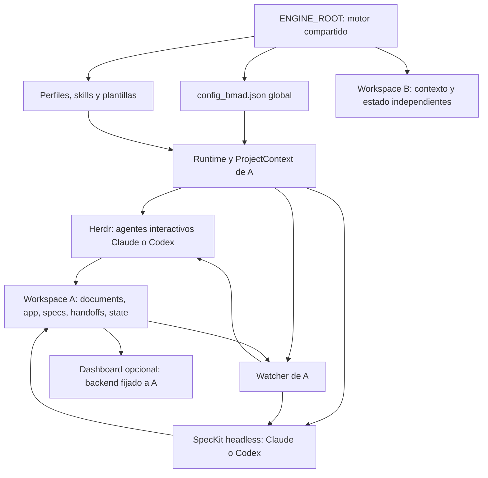
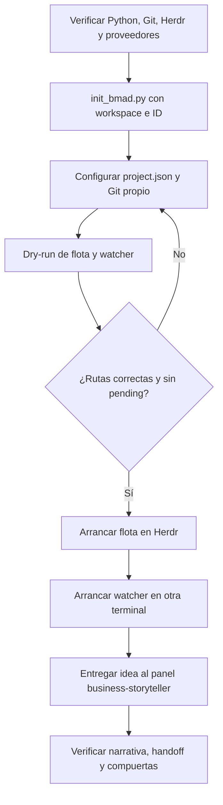
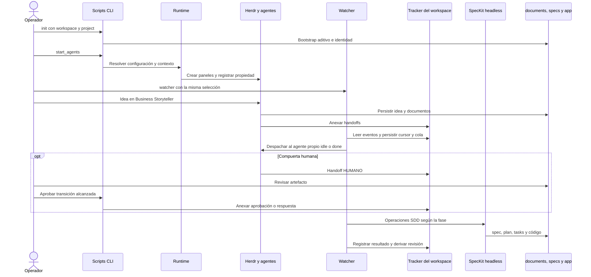
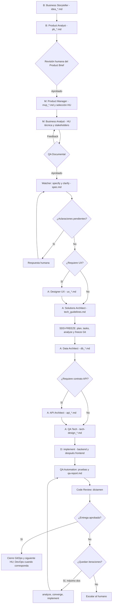
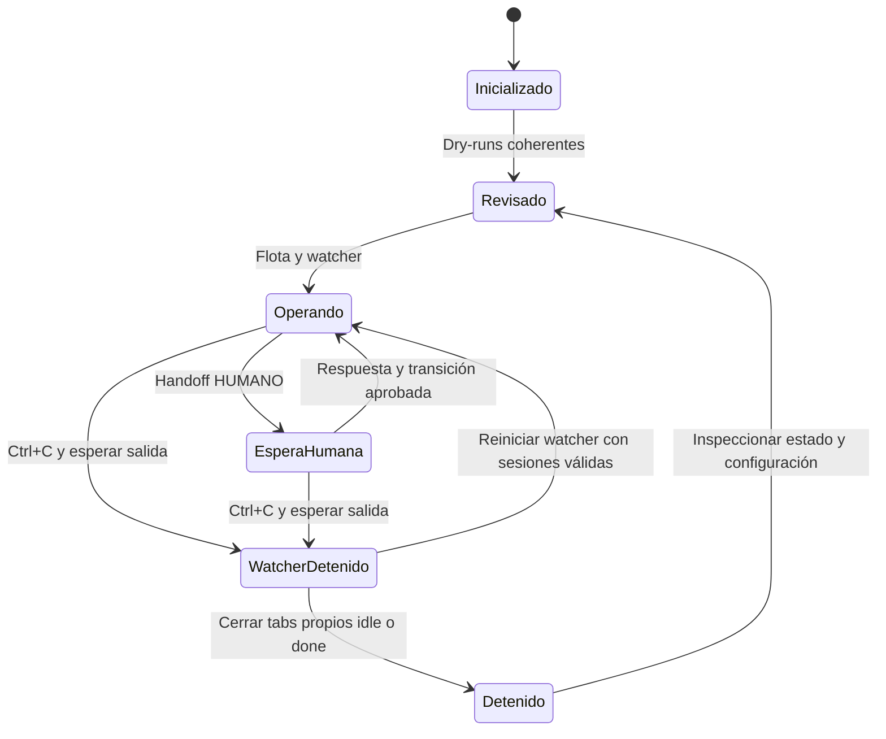

# Instalación, preparación y operación de un proyecto BMAD

Esta es la guía única para instalar el motor, preparar un workspace y operar un proyecto BMAD en Windows y PowerShell. Está contrastada con el bootstrap, parsers, configuración, proveedores y flujo del runtime actual. Los comandos de arranque real son instrucciones para el operador; los dry-runs permiten revisar primero sin agentes ni APIs.

## Motor compartido y workspaces

Instala el motor una sola vez. `ENGINE_ROOT` contiene runtime, utilidades, perfiles de 15 roles, skills, plantillas y dashboard. Cada `WORKSPACE_ROOT` conserva su identidad, configuración propia, documentos, aplicación, especificaciones, handoffs y estado. No clones el motor por proyecto ni copies perfiles o skills al workspace.



El diagrama desarrolla la ejecución de A; B necesita su propio contexto y watcher. El contrato de rutas inyectado a agentes prevalece sobre rutas legacy de perfiles. Es una regla del runtime y sus instrucciones, no una barrera del sistema operativo contra cualquier escritura de herramientas externas.

## Prerrequisitos

| Dependencia | Requisito real | Comprobación |
|---|---|---|
| Python | 3.10 o posterior por la sintaxis y las APIs usadas | `& $Python --version` |
| Git | Repo propio del proyecto para ramas, freeze y cierre GitOps | `git --version` |
| PowerShell | Ejemplos Windows y scripts SpecKit en `.specify/scripts/powershell` | `$PSVersionTable.PSVersion` |
| Herdr | Aplicación abierta y CLI accesible; el motor no instala ni abre el servidor | `herdr agent start --help`, `herdr agent list` |
| Claude y/o Codex | Todos los proveedores de la selección efectiva, instalados y autenticados | `Get-Command claude,codex -ErrorAction SilentlyContinue` |
| Node.js y npm | Opcionales para dashboard; Node 22.18+ para las pruebas con configuración TypeScript nativa | `node --version`, `npm --version` |

El motor no fija una versión mínima numérica de Herdr ni de los CLI de IA: comprueba flags mediante su ayuda antes de ejecución real. En Windows, `CommandRunner` rechaza wrappers `.cmd`, `.bat` y `.ps1`; necesita ejecutables nativos. Herdr debe resolver el mismo ejecutable canónico del proveedor que la configuración.

Abre PowerShell en la raíz del motor. Define estas variables, que se reutilizan en toda la guía:

```powershell
$Engine = (Get-Location).Path
$Python = Join-Path $Engine 'bmad-control-center/backend/.venv/Scripts/python.exe'
$Workspace = Join-Path (Split-Path $Engine -Parent) 'Proyecto A'
$Project = 'proyecto-a'
```

Si falta el entorno, créalo con tu Python 3.10+ instalado:

```powershell
python -m venv bmad-control-center/backend/.venv
& $Python --version
```

El runtime usa la biblioteca estándar. Dashboard backend y pruebas requieren [requirements.txt](bmad-control-center/backend/requirements.txt), que no fija versiones. Frontend necesita npm. Instala solo las dependencias que vayas a utilizar:

```powershell
& $Python -m pip install -r (Join-Path $Engine 'bmad-control-center/backend/requirements.txt')
npm --prefix (Join-Path $Engine 'bmad-control-center/frontend') ci
```

Las dependencias de pruebas backend incluyen AnyIO para los tests asíncronos. Usa las dependencias instaladas si el entorno restringe la red. Los README de [backend](bmad-control-center/backend/README.md) y [frontend](bmad-control-center/frontend/README.md) contienen los comandos específicos del dashboard y sus pruebas.

Verifica los proveedores que aparezcan en los dry-runs:

```powershell
# Si se utiliza Claude
claude --help
claude auth status
# Si se utiliza Codex
codex --help
codex exec --help
codex login status
# Con Herdr abierto; no crea paneles ni inicia agentes
herdr agent start --help
herdr agent list
```

Los subcomandos de autenticación anteriores existen en los CLI locales comprobados al redactar la guía; si tu versión difiere, consulta `claude auth --help` y `codex login --help`. No incluyas credenciales en configuración. La ayuda y el estado de autenticación no prueban cuota, acceso al modelo ni éxito remoto. Gemini está registrado, pero su ejecución no está implementada.

## Inicio rápido



### 1. Inicializar el workspace

Desde el motor, con las variables anteriores:

```powershell
& $Python (Join-Path $Engine 'init_bmad.py') --workspace $Workspace --project $Project
if ($LASTEXITCODE -ne 0) { throw 'Falló el bootstrap; revisa el error.' }
Get-Content -LiteralPath (Join-Path $Workspace 'project.json')
Get-Content -LiteralPath (Join-Path $Workspace 'AGENTS.md')
```

Equivale a `utils/manage_workspace.py init`. Crea la ruta si falta. El ID admite 1–64 letras ASCII, dígitos, `_` o `-`, comienza con letra/dígito y rechaza nombres reservados de Windows. Si existe identidad, debe coincidir. No acepta un workspace igual al motor, que lo contenga ni que se superponga con sus directorios compartidos.

Bootstrap es aditivo: conserva archivos, tracker y memoria, no inicializa Git y no actualiza silenciosamente snapshots de scripts/plantillas al repetirse. El árbol inicial y los elementos creados posteriormente son:

```text
Motor/                              ENGINE_ROOT, instalación compartida
├── init_bmad.py, watcher_bmad.py
├── config_bmad.json
├── bmad_runtime/, utils/
├── <rol>/AGENTS.md                  15 perfiles compartidos
├── .github/skills/                  fuentes de skills
├── .agents/skills/                  instalación para Codex
├── .claude/skills/                  instalación para Claude
├── .specify/scripts/ y templates/
└── bmad-control-center/

Proyecto A/                         WORKSPACE_ROOT, fuera del motor
├── project.json
├── AGENTS.md                       contrato de rutas
├── documents/
│   ├── <rol>/                      una carpeta por cada uno de los 15 roles
│   └── business-analyst/HUs-stakeholders/
├── app/                            inicialmente vacío
│   ├── backend/                    posterior: código, ruta por defecto
│   └── frontend/                   posterior: código, ruta por defecto
├── handoffs/tracker_bmad.md         inicialmente vacío
├── specs/
│   ├── README.md
│   └── XXX-HU_nombre/              posterior: spec.md, plan.md, tasks.md, etc.
├── .specify/
│   ├── memory/constitution.md      plantilla neutral, stack pendiente
│   ├── scripts/ y templates/       snapshots aditivos
│   └── feature.json                posterior: feature activa
├── state/
│   ├── config_bmad.json            vista efectiva generada
│   ├── state.sqlite3               posterior: runtime con persistencia
│   ├── bootstrap.lock              creado por init; permanece tras liberar el lock
│   └── <operación>.lock            posteriores; existencia no implica lock activo
├── logs/                           inicialmente vacío
└── temp/                           inicialmente vacío
```

`logs/` y `temp/` son destinos aislados; no todas las operaciones generan logs allí. El tracker y la consola del watcher son las primeras fuentes de seguimiento. No adaptes rutas de cada perfil compartido para el nuevo proyecto: el contrato generado se encarga de ello.

### 2. Configurar el proyecto y preparar Git

Edita `project.json` del workspace conservando el ID. Este ejemplo mínimo hereda la selección IA global:

```json
{
  "schema_version": 1,
  "project_id": "proyecto-a",
  "config": {
    "project_name": "Proyecto A",
    "project_type": "fullstack",
    "ux_phase": "auto",
    "code_dirs": {"backend": "app/backend", "frontend": "app/frontend"}
  }
}
```

La configuración global actual mezcla Claude y Codex por fase, rol y operación; cambiar solo `ai.defaults` no elimina overrides. Consulta la sección de configuración y revisa todas las selecciones con dry-runs. Bootstrap no comprueba todas las capacidades IA.

Añade principios y restricciones aprobadas a `.specify/memory/constitution.md` del workspace.
Bootstrap crea una plantilla neutral con stack pendiente; existir no implica Brownfield ni aprobación.
La [política del motor](constitution.md) gobierna aislamiento y operación; la constitución local,
las guías y ADRs gobiernan tecnología. Spec Kit y QA-Tech usan el mismo archivo local sin
sobrescribir decisiones aprobadas ni copiar la memoria técnica del motor.

Para Brownfield conserva el árbol existente: `code_dirs` admite carpetas locales como `server`
y `web`, excluyendo directorios operativos. Desde el motor, inspecciona manifests y contexto:

```powershell
& $Python utils/manage_workspace.py context --workspace $Workspace --role solutions-architect
& $Python utils/manage_workspace.py context --workspace $Workspace --record
```

La segunda orden registra `documents/architecture/stack-observations.json`: fuentes, versiones
observadas y diferencias documentales; no declara aprobación ni modifica dependencias. El escaneo
acota tamaño y directorios, omite secretos, enlaces y workspaces anidados; sus límites se muestran
en el resultado. Contrasta también código, CI e infraestructura bajo demanda. Con Python 3.10,
la lectura detallada de pyproject.toml queda pendiente; Python 3.11+ incluye el parser TOML.

Registra el inventario contrastado en `documents/architecture/tech-stack.md` y enlaza arquitectura,
ADRs y guías existentes desde la constitución; no dupliques equivalentes aprobados. Cada decisión
indica Observado, Propuesto, Aprobado (con evidencia) o Pendiente. En Greenfield con stack aprobado,
registra esas restricciones antes de planificar; sin stack, SA propone opciones y usa `@HUMANO:`
para aprobación, seguida de verificación QT. Un plan generado no concede aprobación.

El runtime carga política, constitución, índice técnico pertinente y tarea en launcher, despacho
y Spec Kit, para cada proveedor y effort configurado. PM/BA reciben la constitución breve; SA,
DA, API, QT y desarrolladores reciben además observaciones e índices de guías. Los documentos
especializados se leen bajo demanda, sin duplicarlos en cada prompt.

El dashboard expone el índice y descubrimiento local en `GET /api/v1/project/context`,
sin permitir seleccionar rutas desde la petición.

En un workspace **nuevo**, prepara Git propio antes de usar macros GitOps:

```powershell
git -C $Workspace init
git -C $Workspace status --short
# Crea primero el .gitignore del proyecto: secretos, dependencias, state/, logs/, temp/.
# Revisa los archivos antes de añadirlos.
git -C $Workspace add .
git -C $Workspace diff --cached --stat
git -C $Workspace commit -m 'chore: initialize BMAD workspace'
git -C $Workspace rev-parse --show-toplevel
```

La última salida debe ser exactamente el workspace. Git requiere identidad de autor configurada. Revisa repositorios existentes antes de aplicar estos pasos; el runtime rechaza usar un Git padre. Inicializar Git corresponde al operador, no a los agentes. `ai.git.auto_commit=false` desactiva autosave de seguridad; freeze y macros GitOps aún pueden crear commits y ramas.

### 3. Revisar sin ejecutar agentes

```powershell
& $Python (Join-Path $Engine 'utils/start_agents.py') --workspace $Workspace --project $Project --dry-run
if ($LASTEXITCODE -ne 0) { throw 'Corrige el dry-run de la flota.' }
& $Python (Join-Path $Engine 'watcher_bmad.py') --workspace $Workspace --project $Project --dry-run
if ($LASTEXITCODE -ne 0) { throw 'Corrige el dry-run de SpecKit.' }
```

Comprueba `project_id`, `workspace`/`cwd`, `tracker`, proveedor, modelo y flags de effort. Revisa también `pending`, aunque la salida tenga código cero. `verified_cli_contract` significa comando construido, no CLI ejecutado/autenticado. Ambos dry-runs evitan procesos externos y escrituras de estado, incluida SQLite.

La flota tiene 13 paneles, o 12 al omitir UX. Backend y frontend usan sus perfiles mediante operaciones headless, sin paneles interactivos propios. El watcher prepara siete operaciones: `specify`, `clarify`, `plan`, `tasks`, `analyze`, `converge`, `implement`.

### 4. Arrancar flota y watcher

Con Herdr abierto, ejecuta desde la terminal del motor:

```powershell
& $Python (Join-Path $Engine 'utils/start_agents.py') --workspace $Workspace --project $Project
```

El launcher verifica proveedores, crea tres tabs, registra propiedad en SQLite y termina; los agentes quedan en Herdr esperando trabajo. Comprueba `herdr agent list` y los paneles. Rechaza nombres coincidentes ya existentes; no reemplaza sesiones automáticamente.

En **otra terminal**, define otra vez `$Engine`, `$Python`, `$Workspace` y `$Project` con los mismos valores y arranca:

```powershell
& $Python (Join-Path $Engine 'watcher_bmad.py') --workspace $Workspace --project $Project
```

Espera que indique que escucha `handoffs/tracker_bmad.md` del proyecto. Verifica ayuda headless y equivalencia de skills antes de operar; no inicia la flota. Si falta el tracker puede quedar esperando sin procesar nada, sin error inmediato. Comprueba su existencia antes de entregar la idea.

### 5. Entregar la idea y supervisar

Selecciona el panel cuyo nombre termina en `business-storyteller` e incluye ID y hash del workspace. Pega la idea con actores, problema, objetivo, alcance y restricciones. No existe flag de bootstrap para importar la idea ni archivo inicial que el watcher ingiera automáticamente.

Ejemplo de mensaje para ese panel:

```text
Soy responsable de un centro de atención y gestionamos las citas por teléfono.
Recepción necesita registrar y consultar reservas para evitar cruces de horario.
Queremos comenzar con una agenda interna; no incluimos pagos ni acceso de clientes.
Estructura esta idea siguiendo tu perfil y el contrato del workspace activo.
```

Business Storyteller pide aclaraciones si hace falta. Guarda la narrativa madura en `documents/business-storyteller/idea_<nombre_corto>.md`, verifica su persistencia y anexa el handoff `@PA:`. El nombre corto usa snake_case, hasta cuatro palabras. El archivo contiene párrafos de narrativa en primera persona, sin XML, encabezados decorativos ni bloques de código. Si entregas una idea ya guardada, indica su ruta al panel: guardar el archivo por sí solo no inicia el flujo.

En otra terminal con las variables del inicio:

```powershell
Get-ChildItem -LiteralPath (Join-Path $Workspace 'documents/business-storyteller')
Get-Content -LiteralPath (Join-Path $Workspace 'handoffs/tracker_bmad.md') -Tail 40 -Wait
```

`Ctrl+C` en esa terminal solo detiene la lectura. Revisa cada artefacto antes de aprobar. Un handoff real `@HUMANO:` pausa despacho; atiende la compuerta alcanzada con las herramientas existentes:

```powershell
& $Python (Join-Path $Engine 'utils/approve_step.py') --workspace $Workspace --project $Project
& $Python (Join-Path $Engine 'utils/response_sa.py') --workspace $Workspace --project $Project
```

El primero ofrece un menú y anexa la transición elegida: no acredita por sí solo las fases previas. El menú conserva opciones de despacho directo de desarrollo que no corresponden a los paneles de la flota actual; sigue la ruta SpecKit. El segundo captura respuestas para Solutions Architect hasta escribir `FIN`; no es una aprobación universal.

Para supervisión gráfica sigue los README de [backend](bmad-control-center/backend/README.md) y [frontend](bmad-control-center/frontend/README.md). Comprueba `/api/v1/project` antes de operar gates. El backend queda fijado a un workspace por proceso y el frontend apunta a una API concreta.

## Coordinación y flujo BMAD + SDD



El tracker es el bus: escribir un documento o detectar idle/done no acredita una entrega. Las operaciones headless no emiten handoffs propios; el watcher registra sus resultados. El identificador `XXX-HU_nombre` se conserva en HU, carpeta de feature y ramas.



El recorrido requiere artefactos y handoffs válidos; no se dispara por inicializar. Los rechazos de revisores, incluido QA Automation, pueden activar el ciclo de retrabajo mostrado al final. `project_type=headless` o `ux_phase=off` omiten UX; `on` lo fuerza salvo headless; `auto` consulta `Requiere interfaz: Sí|No` en la HU. Consulta [operación de historias](GUIDE.md) y [entradas por rol](INPUTS_POR_AGENTE.md).

El proyecto está **inicializado** cuando existen identidad, contrato, carpetas y tracker. Está **operativo** cuando los dry-runs son coherentes, la flota pertenece al proyecto, el watcher escucha su tracker y la primera idea tiene artefacto y handoff. La **entrega de una HU** exige revisar especificaciones, tareas, código, pruebas y dictamen: no hay comando que certifique el producto terminado.

Resultados: código en `app/backend` y `app/frontend` o sus `code_dirs`; especificaciones en `specs/XXX-HU_nombre/`; documentos por rol en `documents/`; arquitecturas en `documents/dev-backend/backend-architecture.md` y `documents/dev-frontend/frontend-architecture.md`, además de README en las capas. La decisión de qué capas implementar depende del alcance delegado; no todas las historias modifican ambas.

## Detener y reanudar



1. Detén el watcher con `Ctrl+C` y espera su salida. Si interrumpiste una operación headless, inspecciona resultado y estado: puede quedar `uncertain`.
2. Revisa `herdr agent list`, paneles y artefactos. Espera a los agentes idle/done.
3. Cierra tabs propios comprobados:

```powershell
& $Python (Join-Path $Engine 'utils/stop_agents.py') --workspace $Workspace --project $Project --confirm
```

Sin `--confirm` no cierra nada. No ofrece `--dry-run` ni `--config`. Verifica propiedad, miembros y estado antes de cerrar; rechaza tabs ocupados o no verificables. No borres locks ni SQLite.

Si las sesiones siguen válidas, reinicia solo watcher. Si cerraste la flota, revisa dry-runs, lanza flota y después watcher. Estado persistido recupera cursor y cola; rechaza historial truncado/cambiado. En el primer arranque con tracker no vacío y sin cursor pregunta si retomar **la última línea**, no todo el historial. Iniciar watcher antes de entregar la idea evita esa ambigüedad.

Para inspeccionar registros no terminados desde la raíz del motor, sin operaciones que posean locks watcher/fleet/speckit:

```powershell
& $Python -B -m bmad_runtime.state --workspace $Workspace --project $Project
```

Puede crear/abrir SQLite; no es un dry-run. El contrato permite `--acknowledge ID --confirm` tras inspección para marcar un evento manejado; no lo reintenta ni completa su tarea de negocio. No hay rotación automática de contexto ni `/clear` seguro habilitado.

## Multiworkspace sin clonar el motor

Crea B con el mismo motor y Python:

```powershell
$WorkspaceB = Join-Path (Split-Path $Engine -Parent) 'Proyecto B'
& $Python (Join-Path $Engine 'init_bmad.py') --workspace $WorkspaceB --project proyecto-b
& $Python (Join-Path $Engine 'utils/start_agents.py') --workspace $WorkspaceB --project proyecto-b --dry-run
& $Python (Join-Path $Engine 'watcher_bmad.py') --workspace $WorkspaceB --project proyecto-b --dry-run
```

Completa para B la configuración y preparación anteriores. La selección CLI explícita (`--workspace` y/o `--project`) reemplaza la pareja del entorno. Sin selección CLI se usan `BMAD_WORKSPACE`/`BMAD_PROJECT`; sin ninguna selección, el template exige un workspace y no utiliza el motor como proyecto.

No hay selector global persistente de proyecto activo. Puedes elegir B en **una terminal** y verificarlo antes de arrancar:

```powershell
$env:BMAD_WORKSPACE = $WorkspaceB
$env:BMAD_PROJECT = 'proyecto-b'
& $Python (Join-Path $Engine 'utils/start_agents.py') --dry-run
```

Para limpiar esa selección de terminal:

```powershell
Remove-Item Env:BMAD_WORKSPACE -ErrorAction SilentlyContinue
Remove-Item Env:BMAD_PROJECT -ErrorAction SilentlyContinue
```

`--project` sin ruta consulta `projects` del config global; consulta [ejemplo de registro](examples/multiworkspace.config.json). Rutas relativas CLI se anclan al motor, las del registro al archivo global. ID/ruta incorrectos fallan sin adoptar otro proyecto.

Sesiones incluyen ID, hash de ruta normalizada y rol. Alternar variables no renombra/detiene sesiones, mueve estado ni cambia procesos abiertos. Runtime cachea configuración: reinicia los afectados para aplicar cambios. Usa un watcher por workspace y backend por proceso; frontends apuntan a sus APIs con puertos distintos.

Pruebas con dobles verifican aislamiento de dos workspaces, locks y deduplicación; no certifican flotas reales simultáneas en cualquier Herdr. Comienza operando un proyecto a la vez o comprueba expresamente paneles/puertos antes de concurrencia real. No compartas tracker/state ni enlaces que escapen del workspace. No utilices limpieza legacy para reiniciar proyectos.

## Configuración y proveedores

Origen global: `config_bmad.json` del motor. Overrides: `project.json.config`. `state/config_bmad.json` es una vista generada para consumidores legacy; edita los orígenes. Init la crea si falta y Runtime con persistencia la refresca.

Primero se combina global y proyecto; luego `defaults → fase → agente` o `defaults → fase → operación SpecKit`. Fases: B, M, A, D. Cambiar proveedor descarta modelo/opciones heredados en esa selección; `options` reemplaza el objeto completo. No hay fallback.

Ejemplo de overrides parciales para el objeto `config` de `project.json` (no sustituye la identidad):

```json
{
  "ai": {
    "defaults": {"provider": "claude", "model": null, "options": {"effort": "medium"}},
    "phases": {
      "B": {"provider": "claude", "model": null, "options": {"effort": "medium"}},
      "M": {"provider": "claude", "model": null, "options": {"effort": "medium"}},
      "A": {"provider": "codex", "model": null, "options": {"effort": "high"}},
      "D": {"provider": "codex", "model": null, "options": {"effort": "high"}}
    },
    "agents": {"business-analyst": {"provider": "claude", "model": null, "options": {"effort": "high"}}},
    "speckit": {"implement": {"provider": "codex", "model": null, "options": {"effort": "xhigh"}}}
  }
}
```

Otros overrides globales de agentes/operaciones siguen vigentes: revisa todas las filas de los dry-runs. `model:null` delega al CLI; un nombre explícito válido para el esquema no acredita acceso remoto.

| Clave | Ubicación editable | Ejemplo | Efecto |
|---|---|---|---|
| `schema_version`, `project_id` | Raíz de `project.json` | `1`, `proyecto-a` | Identidad; no cambiarla para alternar proyectos |
| `project_name` | `project.json.config` | `Proyecto A` | Nombre efectivo |
| `project_type`, `ux_phase` | `project.json.config` | `headless`, `off` | Omitir UX; en fullstack usar auto/on según HU |
| `code_dirs` | `project.json.config` | `{"backend":"app/backend"}` | Solo claves backend/frontend; rutas locales de código, fuera de directorios operativos |
| `ai.defaults` | Global o `project.json.config` | `{"provider":"claude","model":null}` | Base IA |
| `ai.phases` | Global o `project.json.config` | `{"D":{"provider":"codex"}}` | Override de fase |
| `ai.agents` | Global o `project.json.config` | `{"business-analyst":{"options":{"effort":"high"}}}` | Override de rol |
| `ai.speckit` | Global o `project.json.config` | `{"implement":{"options":{"effort":"xhigh"}}}` | Override de operación |
| `ai.providers` | Solo global | `{"claude":{"executable":"claude"}}` | Ejecutable sin argumentos; ruta relativa al motor |
| `ai.git.auto_commit` | Solo global | `false` | Desactiva autosave, no todas las mutaciones Git |
| `ai.limits` | Solo global | `{"command_timeout":120,"headless_timeout":1800,"max_output_bytes":1048576,"max_processes":1}` | Límites de ejecución y salida |
| `projects` | Raíz global | `{"proyecto-a":"../Proyecto A"}` | Selección por ID |

El proyecto admite solo project_name/project_type/ux_phase/code_dirs y ai.defaults/phases/agents/speckit. No puede cambiar ejecutables, límites, Git, tracker ni registro de proyectos.

| Proveedor | Implementación | Effort y traducción | Otras opciones |
|---|---|---|---|
| Claude | Interactiva y headless | low/medium/high/xhigh/max → `--effort NIVEL` | permission_mode manual/plan/acceptEdits; max_budget_usd positivo hasta 1000, aplicado solo headless |
| Codex | Interactiva y headless | Mismos niveles → `-c model_reasoning_effort=NIVEL`; max exige modelo explícito gpt-6-astra en la allowlist actual | sandbox read-only/workspace-write; no acepta permission_mode |
| Gemini | Solo registro | Sin traducción; options no vacías rechazadas | Dry-run pending, arranque no disponible |

Omitir effort conserva el default del CLI. Mayúsculas, `ultra` o tipos inválidos fallan sin conversión. Las listas son contratos del adaptador, no promesas del catálogo remoto. Las skills instaladas en `.agents`/`.claude` deben coincidir con `.github/skills`, incluidos recursos; no se sincronizan al arrancar y no son duplicados prescindibles.

Init, manage_workspace, launcher y watcher admiten `--config RUTA`. Ruta explícita inexistente falla antes de bootstrap. Repite el argumento en cada comando: `project.json` no guarda el origen global. Dashboard, aprobaciones y parada no ofrecen ese flag; si los necesitas, mantén configuración compatible en el origen habitual.

## Diagnóstico sin borrar estado

| Síntoma | Comprobación y acción |
|---|---|
| Ruta inexistente o sin identidad | Comprueba workspace; inicializa con ruta e ID explícitos. No omitas selección para evitar el error |
| ID diferente | Lee project.json y corrige el comando; no cambies identidad para tomar otras sesiones |
| Configuración inválida | Valida JSON y claves, repite ambos dry-runs; no edites la vista de state |
| CLI ausente, wrapper o flags faltantes | Get-Command y ayuda del proveedor/Herdr; instala ejecutable nativo compatible |
| Autenticación/cuota/modelo inaccesible | Estado de autenticación y consola local; dry-run no demuestra acceso remoto |
| Watcher sin tracker | `Test-Path (Join-Path $Workspace 'handoffs/tracker_bmad.md')`; revisa selección/bootstrap, no recrees historial activo |
| Idea/documento ausente | Revisa panel BS y preguntas pendientes; no hay ingestión automática del archivo inicial |
| Escritura denegada o salida fuera del perímetro | Revisa permisos y junctions; elige destino propio escribible, sin escapes |
| Sesión previa o arranque parcial | Herdr agent list, paneles y propiedad en estado; no relances sobre nombres existentes ni cierres tabs ajenos |
| Herdr inaccesible o respuesta inválida | Aplicación abierta, CLI y listas de agentes/tabs/panes; gateway exige JSON con result |
| Skill pending/diferente | Coteja recursos instalados con .github/skills; sincroniza mediante mantenimiento revisado del motor |
| uncertain/in_flight o cursor/cola incoherentes | Detén watcher, inspecciona artefactos y estado, reconcilia antes de reanudar; no borres locks/SQLite |
| Git padre, rama o merge rechazados | Revisa show-toplevel y status; resuelve cambios/conflictos propios sin checkout forzado |
| Agente terminó pero no avanza | Revisa artefacto, handoff y pausa humana; idle/done no certifican finalización |

Comprobaciones adicionales sin borrar archivos:

```powershell
Get-Content -Raw -LiteralPath (Join-Path $Workspace 'project.json') | ConvertFrom-Json
herdr tab list
herdr pane list
git -C $Workspace status
```

## Referencia rápida y checklist

Variables: las definidas al comienzo. Los scripts son relativos al motor y las escrituras corresponden al workspace elegido.

| Comando | Cuándo usarlo | Directorio |
|---|---|---|
| `& $Python init_bmad.py --workspace $Workspace --project $Project` | Bootstrap aditivo | Raíz del motor |
| `& $Python utils/manage_workspace.py init --workspace $Workspace --project $Project --dry-run` | Mostrar contexto sin crear workspace | Raíz del motor |
| `& $Python utils/start_agents.py --workspace $Workspace --project $Project --dry-run` | Revisar flota | Raíz del motor |
| `& $Python watcher_bmad.py --workspace $Workspace --project $Project --dry-run` | Revisar operaciones SDD | Raíz del motor |
| `& $Python utils/start_agents.py --workspace $Workspace --project $Project` | Crear flota real | Motor, Herdr abierto |
| `& $Python watcher_bmad.py --workspace $Workspace --project $Project` | Escuchar tracker | Motor, terminal dedicada |
| `& $Python utils/approve_step.py --workspace $Workspace --project $Project` | Aprobar compuerta alcanzada | Motor |
| `& $Python utils/response_sa.py --workspace $Workspace --project $Project` | Respuestas SA hasta FIN | Motor |
| `& $Python utils/stop_agents.py --workspace $Workspace --project $Project --confirm` | Cerrar tabs propios idle/done | Motor, watcher detenido |
| `& $Python -B -m bmad_runtime.state --workspace $Workspace --project $Project` | Inspección SQLite con locks | Motor, sin operaciones activas |
| `herdr agent list`, `herdr tab list`, `herdr pane list` | Inspeccionar Herdr | Terminal con CLI accesible |
| `git -C $Workspace status` | Revisar Git del proyecto | Cualquiera |

- [ ] Python adecuado, proveedores efectivos instalados/autenticados y Herdr abierto.
- [ ] Workspace separado, identidad correcta y contrato AGENTS.md inspeccionado.
- [ ] Configuración de origen revisada, memoria con contexto conocido y Git propio.
- [ ] Ambos dry-runs sin pending, con cwd/tracker/modelo/effort esperados.
- [ ] Flota propia y un solo watcher escuchando antes de entregar la idea.
- [ ] Primera narrativa y handoff verificados; compuertas atendidas según artefactos.
- [ ] Parada/reanudación conocidas, sin borrar historial ni estado.

Más documentación: [CLI y configuración](bmad_runtime/README.md), [arquitectura](ARCHITECTURE.md), [operación de historias](GUIDE.md), [roles](INPUTS_POR_AGENTE.md), [principios y desarrollo BMAD/SDD](framework_bmad.md) y [validación local](README.md#validación-local).
