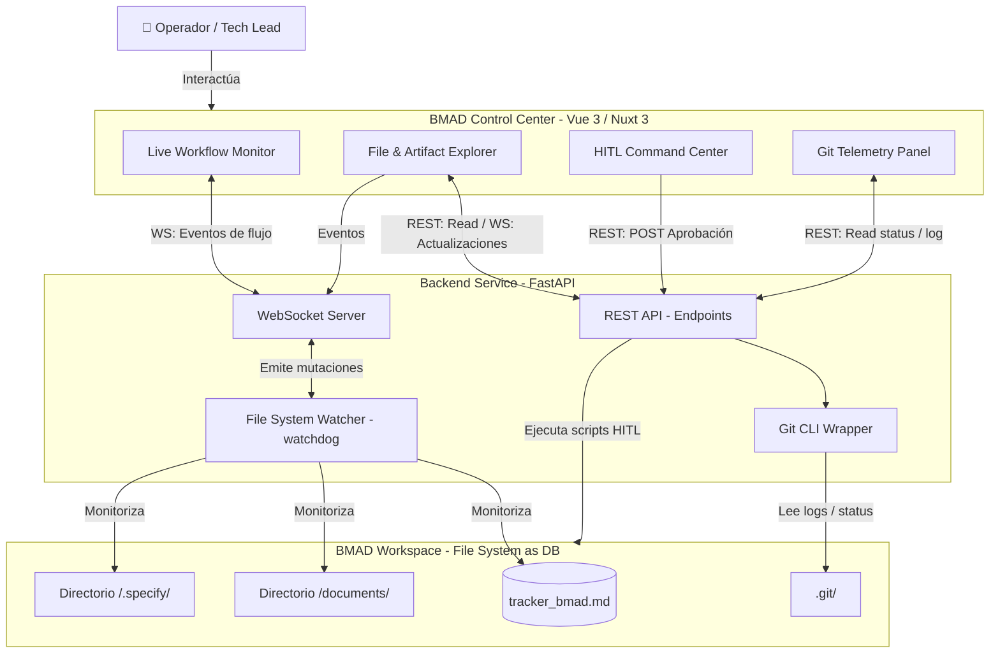

# 📄 Documento de Diseño Técnico: BMAD Control Center

## 1. Resumen Ejecutivo
El **BMAD Control Center** es una interfaz gráfica (Dashboard Web) diseñada para gobernar el enjambre de agentes del ecosistema BMAD. Su propósito es proveer una ventana de observabilidad en tiempo real sobre las operaciones autónomas de los agentes y centralizar la toma de decisiones humanas (HITL - Human-in-the-Loop) sin depender exclusivamente de interacciones por terminal. 

La plataforma operará de manera local (File-System as a Database), actuando como un envoltorio reactivo sobre los archivos generados por los agentes (`tracker_bmad.md`, carpeta `documents/`, `.specify/`). Esto empoderará al Tech Lead u Operador para monitorear estados, inspeccionar el pensamiento del LLM, evaluar entregables y liberar compuertas operativas con fluidez y precisión visual.

## 2. Topología del Sistema

El sistema implementa una arquitectura desacoplada donde un Backend ligero expone el estado del File-System y eventos de Git mediante WebSockets y REST a un Frontend reactivo.

## 3. Decisión de Stack Tecnológico

Tras evaluar las opciones (Angular 22 Zoneless vs. Nuxt 3 / Vue 3), se determina que el stack óptimo para este caso de uso es **Vue 3 con Nuxt 3 y Nitro** para el Frontend, junto con **FastAPI (Python)** para el Backend.

### Frontend: Vue 3 + Nuxt 3 (Nitro) + Tailwind CSS
* **Justificación:** Nuxt 3 con Vue 3 (Composition API) ofrece una reactividad superior y menos verbosidad ("boilerplate") en comparación con Angular. Para un dashboard local altamente reactivo (intensivo en WebSockets), el ecosistema Vue resulta más liviano y veloz de prototipar. Nitro provee un servidor local eficiente si se requieren rutas de API internas o SSR ligero. Considerar que no dependemos del conocimiento actual del agente `@dev-frontend`; de ser necesario, se podrá instanciar un agente especializado en Nuxt/Vue posteriormente.
* **Renderizado de Markdown y Diagramas:** Se integrará `marked.js` para compilar los artefactos de texto a HTML de forma segura, y `mermaid.js` para renderizar en el navegador los diagramas arquitectónicos generados por los agentes. El ecosistema Vue facilita la creación de un componente `<MarkdownViewer>` que actualice dinámicamente el DOM cuando el WebSocket notifica un cambio en un archivo.

### Backend: FastAPI (Python) + Watchdog + Uvicorn
* **Justificación:** Python es el lenguaje nativo del orquestador actual (donde reside `utils/approve_step.py`). FastAPI es asíncrono, ultrarrápido y soporta WebSockets de forma nativa.
* **Integración File-System:** La librería `watchdog` permitirá engancharse a los eventos del sistema de archivos (creación, modificación) y emitirlos al canal de WebSockets de FastAPI hacia el cliente, asegurando la "File-System as a DB" reactividad.

## 4. Diseño de Endpoints y WebSockets

El diseño de comunicaciones cubre los 4 módulos funcionales.

### A. Canal Bidireccional de WebSockets (`ws://localhost:8000/ws/bmad`)
Este canal unificado (o multiplexado) distribuirá los eventos en tiempo real:
* **Eventos de Tracker:** `{"type": "TRACKER_UPDATE", "agent": "QA", "status": "running", "line_added": "..."}`. Mantiene vivo el **Live Workflow Monitor**.
* **Eventos de Archivos:** `{"type": "FILE_CHANGED", "path": "documents/qa-tech/report.md"}`. Dispara el re-renderizado en el **File & Artifact Explorer**.

### B. REST API Endpoints

**1. File & Artifact Explorer**
* `GET /api/fs/tree` -> Retorna el árbol de directorios JSON de `documents/` y `.specify/`.
* `GET /api/fs/file?path={filepath}` -> Retorna el contenido en crudo (Markdown/texto) de un archivo específico para su visualización.

**2. HITL Command Center**
* `GET /api/hitl/status` -> Devuelve las compuertas que actualmente están bloqueadas esperando intervención humana.
* `POST /api/hitl/approve` -> Payload: `{"phase": "A", "agent": "QA"}`. Dispara internamente el equivalente a `utils/approve_step.py`, muta el tracker o el archivo de control necesario y devuelve el resultado de la liberación.
* `POST /api/hitl/reject` -> Payload: `{"reason": "Feedback manual"}`. Inyecta comentarios del Tech Lead de vuelta al tracker o a las instrucciones de los agentes.

**3. Git Telemetry**
* `GET /api/git/status` -> Ejecuta `git status -s` y parsea los archivos en stage/unstage.
* `GET /api/git/log?n=10` -> Ejecuta `git log` atómico para listar los últimos commits realizados por el enjambre de desarrollo.

## 5. Plan de Delegación (SDD Ready)

Este desglose en Épicas está formateado para que nuestro `@BA` y el Spec Kit (`/speckit.specify`) lo consuman de inmediato y generen las Historias de Usuario (HUs) formales.

* **ÉPICA 1: Core Observability Backend (FastAPI + Watchdog)**
  * **Objetivo:** Establecer el servidor FastAPI, montar las rutas estáticas y configurar `watchdog` sobre la raíz del proyecto para emitir eventos de mutación de archivos a través de un endpoint de WebSocket.
  * **Criterios de Aceptación:** El cliente debe poder conectarse a `/ws` y recibir payloads JSON estandarizados cada vez que se guarda un archivo.

* **ÉPICA 2: BMAD Frontend Foundation (Nuxt 3)**
  * **Objetivo:** Inicializar el proyecto Nuxt 3, configurar Tailwind CSS (o el framework UI elegido) y crear el layout base del Dashboard (Sidebar de navegación, Topbar de estatus global, y Área de contenido principal).
  * **Criterios de Aceptación:** Aplicación corriendo localmente, navegable, con un tema oscuro/claro alineado al perfil de desarrolladores.

* **ÉPICA 3: Live Monitor & File Explorer (Integración de Renderizado)**
  * **Objetivo:** Construir los visores visuales. Integrar `marked.js` y `mermaid.js` para parsear los archivos `.md`. Conectar la vista al WebSocket para que si un agente modifica el `tracker_bmad.md` o un artefacto (ej. un Diagrama ER), la interfaz parpadee y actualice la vista sin refrescar la página.
  * **Criterios de Aceptación:** Renderizado correcto de tablas, bloques de código, y diagramas Mermaid con soporte de scroll y zoom de ser necesario.

* **ÉPICA 4: HITL Command Center (Compuertas de Decisión)**
  * **Objetivo:** Construir la interfaz accionable. Un panel central con los botones "Aprobar", "Rechazar" y "Suministrar Feedback" que invocarán los endpoints REST POST del backend.
  * **Criterios de Aceptación:** Presionar "Aprobar" debe ejecutar la lógica local que libera al orquestador hacia el siguiente agente. La UI debe reflejar el estado de "Aprobado" y deshabilitar el botón temporalmente.

* **ÉPICA 5: Panel de Telemetría Git**
  * **Objetivo:** Consumir los endpoints de Git del Backend para mostrar un panel estilo "Source Control" de VSCode, indicando commits recientes y el diff de los archivos tocados por la Fase D (Agentes de desarrollo).
  * **Criterios de Aceptación:** Visualización clara de hashes de commit, mensajes atómicos y estado del working directory.
