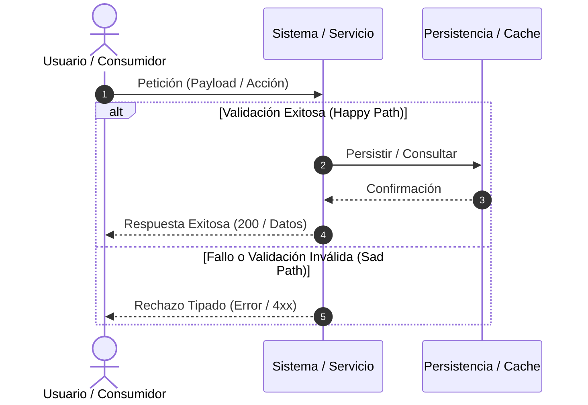

# Plantilla de Historia de Usuario Técnica (Spec Kit Ready) — BMAD

Toda HU Técnica generada por el agente BA usa esta estructura aséptica y determinista, optimizada para su consumo directo por el comando `/speckit.specify` de GitHub Spec Kit.

## Secciones OBLIGATORIAS

| Sección | Por qué es obligatoria |
|---|---|
| `## 1. METADATOS FORMALES` | Indexación por máquina, trazabilidad en Spec Kit y backlog |
| `## 2. ESPECIFICACIÓN FUNCIONAL Y ESCENARIOS GHERKIN` | Sintaxis pura Gherkin (Scenario, Given, When, Then, And) |
| `## 3. MATRIZ DE CASOS BORDE Y EXCEPCIONES` | Cobertura exhaustiva de fallos, tipado de errores y límites |
| `## 4. PRECONDICIONES Y POSTCONDICIONES VERIFICABLES` | Invariantes de estado de datos y seguridad auditables |
| `## 5. 📊 DIAGRAMA DE SECUENCIA / ESTADOS` (bloque `mermaid`) | Flujo visual determinista |
| `## 6. DEFINITION OF DONE (TÉCNICA)` | Criterios de completitud y no-regresión |
| `## 7. ORDEN DE DELEGACIÓN PARA EL QA` | Handoff determinista en una sola línea continua |
| Pie de **origen + `[PROPUESTO]`** | Trazabilidad contra el Product Brief |

## Convención de Nombres de Archivo y Ruta
```
files/business-analyst/XXX-HU_[nombre_corto].md
```
- `XXX`: Identificador secuencial de 3 dígitos (ej. `001`, `002`) provisto exactamente por el `@PM` en el Handoff. Queda estrictamente PROHIBIDO que el BA invente un nombre genérico; debe respetar el prefijo numérico de la orden recibida.
- `nombre_corto`: snake_case, máximo 4 palabras, agnóstico al dominio.

## Esqueleto Completo (rellenar desde el Product Brief; nunca inventar)

```markdown
# ESPECIFICACIÓN TÉCNICA DE HISTORIA DE USUARIO: {{TITULO_HU}}

## 1. METADATOS FORMALES
- **Feature ID:** FEAT-{{ID}}
- **Story ID:** HU-{{ID}}
- **Épica:** {{NOMBRE_EPICA}}
- **Tipo:** {{Feature | Enhancement | Bugfix | Refactor}}
- **Prioridad:** {{Alta | Media | Baja}}
- **Tags:** [{{TAG_1}}, {{TAG_2}}, {{TAG_3}}]
- **Consumo SDD:** `/speckit.specify files/business-analyst/{{XXX}}-HU_{{nombre_corto}}.md`

---

## 2. ESPECIFICACIÓN FUNCIONAL Y ESCENARIOS GHERKIN (BDD)

### 2.1. Descripción de la Capacidad
**Como** {{ROL_USUARIO_O_SERVICIO}}
**Quiero** {{CAPACIDAD_TECNICA_O_FUNCIONAL}}
**Para** {{OBJETIVO_MEDIBLE_DE_SISTEMA}}

### 2.2. Escenarios Formales en Sintaxis Gherkin Pura

```gherkin
Feature: {{TITULO_HU}}
  Como {{ROL_USUARIO_O_SERVICIO}}
  Quiero {{CAPACIDAD_TECNICA_O_FUNCIONAL}}
  Para {{OBJETIVO_MEDIBLE_DE_SISTEMA}}

  Scenario: SC-01 [Happy Path] {{Nombre_Claro_Escenario_Exitoso}}
    Given {{Estado inicial del sistema y precondiciones de datos}}
    When {{Acción precisa del actor o payload de entrada}}
    Then {{Respuesta medible, estado mutado, persistencia o código HTTP}}
    And {{Invariante de seguridad o ausencia de efectos colaterales}}

  Scenario: SC-02 [Sad Path] {{Nombre_Claro_Escenario_Fallo}}
    Given {{Contexto de entrada con datos inválidos o estado inconsistente}}
    When {{El actor intenta ejecutar la acción}}
    Then {{El sistema rechaza la operación con código y tipado de error estandarizado}}
    And {{El estado del sistema permanece intacto sin mutaciones indebidas}}
```

---

## 3. MATRIZ DE CASOS BORDE Y EXCEPCIONES

| ID | Condición Límite / Error | Tipo de Evento | Comportamiento Esperado | Código / Tipo de Respuesta |
|---|---|---|---|---|
| CB-01 | Payload incompleto o nulo | Validación de Esquema | Rechazo inmediato con lista de violaciones | HTTP 400 / ValidationException |
| CB-02 | Recurso solicitado no existe | Consulta | Notificación de recurso inexistente | HTTP 404 / NotFoundException |
| CB-03 | Timeout en dependencia externa | Falla de Red | Ejecución de política de reintento/fallback | HTTP 504 / TimeoutException |

---

## 4. PRECONDICIONES Y POSTCONDICIONES VERIFICABLES

### 4.1. Precondiciones del Sistema
- {{Condición 1 requerida antes de invocar la funcionalidad}}
- {{Condición 2 de autenticación, permisos o existencia de registros}}

### 4.2. Postcondiciones y Mutaciones
- {{Estado final de la base de datos o almacenamiento persistente}}
- {{Eventos o notificaciones emitidas}}
- {{Invariantes preservadas (seguridad, auditoría, no-regresión)}}

---

## 5. 📊 DIAGRAMA DE SECUENCIA / ESTADOS


---

## 6. DEFINITION OF DONE (TÉCNICA)
- [ ] La especificación contiene todos los metadatos requeridos para Spec Kit.
- [ ] Todos los escenarios BDD están escritos en sintaxis pura Gherkin.
- [ ] La matriz de casos borde cubre al menos validación, límites y fallo de persistencia.
- [ ] Las precondiciones y postcondiciones son verificables mediante pruebas automatizadas.
- [ ] El diagrama de secuencia refleja con fidelidad el flujo de Happy y Sad Path.
- [ ] Ausencia de supuestos no tipificados (cualquier inferencia está marcada como ⚠️ [PROPUESTO]).

---
> **Origen:** {{Nombre_del_archivo_fuente}} (Product Brief / Plan de Gestión).
> Todo contenido generado que no esté explícito en la fuente se marca como `⚠️ [PROPUESTO]`.

## 7. ORDEN DE DELEGACIÓN PARA EL QA
*(Generar como una sola línea de texto continuo, sin saltos de línea internos)*

@QA: La Historia de Usuario Técnica {{TITULO_HU}} está lista en el archivo {{XXX}}-HU_{{nombre_corto}}.md (y su versión de stakeholders en files/business-analyst/HUs-stakeholders/{{XXX}}-HU_{{nombre_corto}}.md). Por favor, procede con la auditoría documental contra el Product Brief para asegurar que la historia cumple con los requerimientos originales.
```

### ⚠️ Directiva para Proyectos Headless / Procesamiento de Datos
Si el proyecto no tiene interfaz de usuario (ej. ETL, SSIS, Webhooks, APIs puras):
- **Prohibido usar verbos de UI:** No uses "hacer clic", "ver pantalla" o "mostrar modal".
- **Enfoque Backend:** Los escenarios `Given / When / Then` deben enfocarse en estados de persistencia, respuestas de red, códigos HTTP, logs de error, validación de esquemas (JSON/XML) y tolerancia a fallos.

### ⚠️ Directiva para Ecosistemas Preexistentes (Modo Brownfield)
Si existe el archivo `.specify/memory/constitution.md`:
- **Subordinación de Escenarios:** Léelo en su totalidad. Los escenarios Gherkin deben subordinarse estrictamente a las reglas de negocio, validaciones y máquinas de estado del sistema existente.
- **Enfoque de No-Regresión en DoD:** En la sección `## 6. DEFINITION OF DONE (TÉCNICA)`, incluir obligatoriamente:
  - [ ] La funcionalidad respeta las reglas de negocio y restricciones del ecosistema preexistente documentado.
- **Si el archivo NO existe (Modo Greenfield):** Redacta las especificaciones estándar en base al Product Brief y Backlog de MVP.

[IMPORT_SKILL: skills/hu-validator/SKILL.md]
[IMPORT_SKILL: skills/tracker-logger/SKILL.md]
[IMPORT_SKILL: skills/export-pdf/SKILL.md]