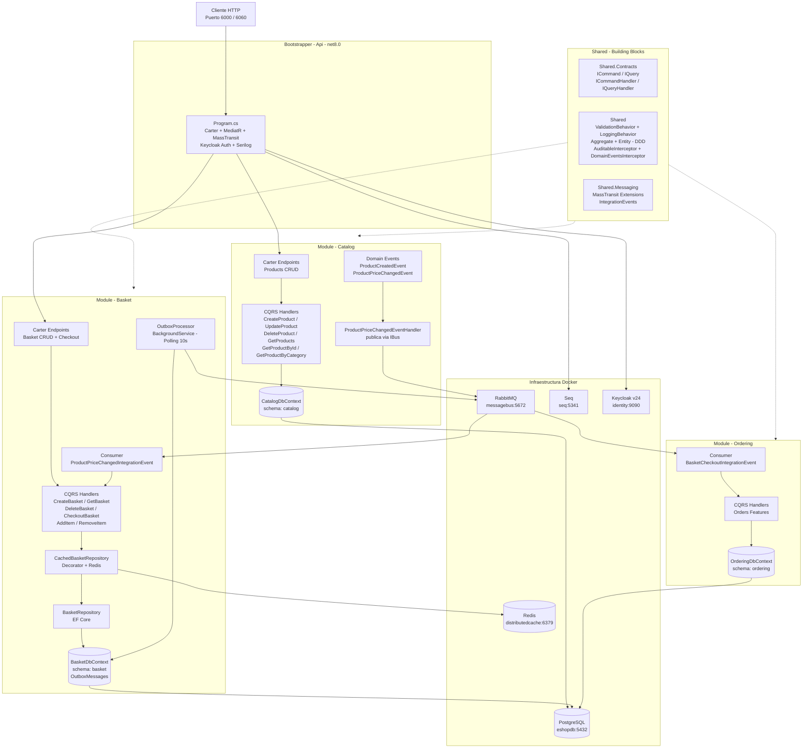
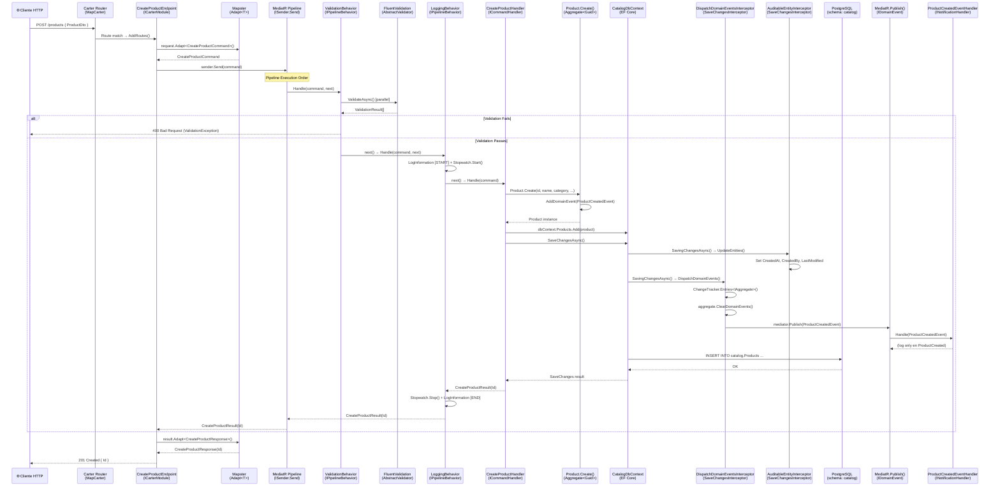

# Backend Template Analysis — EShop Modular Monolith
> **Auditor:** Antigravity (Backend Reverse Engineer) | **Fecha:** 2026-09-25  
> **Repositorio:** `D:\Paulo\templates\EshopModularMonoliths`  
> **Metodología:** Lectura física del código fuente — cero suposiciones.

---

## 1. DIAGNÓSTICO TECNOLÓGICO

### Runtime & Framework
| Componente | Valor Confirmado |
|---|---|
| **Target Framework** | `net8.0` (todos los proyectos) |
| **SDK Web** | `Microsoft.NET.Sdk.Web` (Api.csproj) |
| **OS Target (Docker)** | Linux |

### ORM & Acceso a Datos
| Librería | Versión | Fuente confirmada |
|---|---|---|
| `Microsoft.EntityFrameworkCore` | 8.0.4 | Shared.csproj |
| `Npgsql.EntityFrameworkCore.PostgreSQL` | 8.0.4 | Shared.csproj |
| `Microsoft.EntityFrameworkCore.Tools` | 8.0.4 | Shared.csproj |
| `Microsoft.EntityFrameworkCore.Design` | 8.0.4 | Api.csproj |

Cada módulo tiene su propio **DbContext aislado** con schema de PostgreSQL separado:
- `CatalogDbContext` → schema `catalog`
- `BasketDbContext` → schema `basket` (inferido por convención)
- `OrderingDbContext` → schema `ordering` (inferido por convención)

### Mensajería
| Librería | Versión |
|---|---|
| `MassTransit` | 8.2.3 |
| `MassTransit.RabbitMQ` | 8.2.3 |

Configurado con: `SetKebabCaseEndpointNameFormatter`, `SetInMemorySagaRepositoryProvider`, descubrimiento automático de consumers/sagas/activities por ensamblado.

### CQRS & Mediación
| Librería | Versión |
|---|---|
| `MediatR` (via Shared.Contracts ref `IRequest<T>`) | Implícita en Shared.csproj |

> **Nota:** MediatR no aparece como `PackageReference` explícito en `Shared.csproj` — se infiere por las interfaces `IRequest<T>`, `IPipelineBehavior<,>` y `INotificationHandler<>` usadas directamente en el código.

### API Layer
| Librería | Versión |
|---|---|
| `Carter` | 8.1.0 |

Los endpoints se registran como módulos Carter (`ICarterModule`) con `MapPost`, `Produces<T>()`.

### Validación
| Librería | Versión |
|---|---|
| `FluentValidation` | 11.9.2 |
| `FluentValidation.AspNetCore` | 11.3.0 |
| `FluentValidation.DependencyInjectionExtensions` | 11.9.2 |

Cada feature define su propio `AbstractValidator<TCommand>` colocado en el mismo archivo que el handler.

### Mapeo de Objetos
| Librería | Versión |
|---|---|
| `Mapster` | 7.4.0 |

Se usa para mapear Request → Command y Result → Response en los endpoints Carter.

### Caché Distribuido
| Librería | Versión |
|---|---|
| `Microsoft.Extensions.Caching.StackExchangeRedis` | 8.0.7 |

Implementado con el patrón **Decorator** via `Scrutor`:
- `BasketRepository` (EF Core) decorado por `CachedBasketRepository` (Redis)

### Registro de Dependencias (DI)
| Librería | Versión |
|---|---|
| `Scrutor` | 4.2.2 |

Usado para el decorador `services.Decorate<IBasketRepository, CachedBasketRepository>()`.

### Autenticación & Autorización
| Librería | Versión |
|---|---|
| `Keycloak.AuthServices.Authentication` | 2.5.2 |

Configurado via `AddKeycloakWebApiAuthentication(builder.Configuration)` + `AddAuthorization()`.

### Logging & Observabilidad
| Librería | Versión | Sink |
|---|---|---|
| `Serilog.AspNetCore` | 8.0.1 | Console + Seq |
| `Serilog.Sinks.Seq` | 8.0.0 | `http://seq:5341` |

Enriquecido con: `FromLogContext`, `WithMachineName`, `WithProcessId`, `WithThreadId`.

### Manejo de Errores
Implementado via `IExceptionHandler` custom: `CustomExceptionHandler` registrado con `AddExceptionHandler<CustomExceptionHandler>()`.

Excepciones base en `Shared`:
- `BadRequestException`
- `NotFoundException`
- `InternalServerException`

---

## 2. PATRONES DE ARQUITECTURA DETECTADOS

### 2.1 Modular Monolith (Modulith)
Un **único proceso ASP.NET Core** (`Bootstrapper/Api`) que registra y orquesta tres módulos independientes: `Catalog`, `Basket`, `Ordering`. Cada módulo expone un par de métodos de extensión:
```csharp
services.AddXxxModule(configuration)  // DI registration
app.UseXxxModule()                    // Middleware / migrations
```

### 2.2 Vertical Slice Architecture (VSA)
Cada módulo organiza su código **por feature**, no por capa técnica:
```
Products/
  Features/
    CreateProduct/
      CreateProductEndpoint.cs   ← Carter ICarterModule
      CreateProductHandler.cs    ← Command + Validator + Handler juntos
    GetProducts/
    UpdateProduct/
    DeleteProduct/
    GetProductById/
    GetProductByCategory/
```

### 2.3 CQRS con MediatR
Contratos fuertemente tipados definidos en `Shared.Contracts`:
- `ICommand<TResponse>` → `IRequest<TResponse>` (escritura)
- `ICommand` → `ICommand<Unit>` (escritura sin resultado)
- `IQuery<TResponse>` → `IRequest<TResponse>` (lectura)
- `ICommandHandler<TCommand, TResponse>` → `IRequestHandler<,>`
- `IQueryHandler<TQuery, TResponse>` → `IRequestHandler<,>`

### 2.4 Pipeline Behaviors de MediatR
Dos behaviors registrados globalmente (orden de ejecución):
1. **`ValidationBehavior<TRequest, TResponse>`** — Solo aplica a `ICommand<TResponse>`. Ejecuta validadores FluentValidation en paralelo. Lanza `ValidationException` si falla.
2. **`LoggingBehavior<TRequest, TResponse>`** — Aplica a todos los requests. Mide tiempo de ejecución, loga WARNING si supera 3 segundos.

### 2.5 Domain-Driven Design (DDD) — Building Blocks
Jerarquía base en `Shared`:
```
IEntity → Entity<TId>
IAggregate → Aggregate<TId> : Entity<TId>
  └── DomainEvents: List<IDomainEvent>
      AddDomainEvent() / ClearDomainEvents()
```
`Product` hereda de `Aggregate<Guid>` y emite eventos de dominio (`ProductCreatedEvent`, `ProductPriceChangedEvent`).

### 2.6 EF Core Interceptors (Cross-Cutting)
Dos interceptors `SaveChangesInterceptor` registrados en todos los módulos:
- **`AuditableEntityInterceptor`** — Rellena `CreatedAt`, `CreatedBy`, `LastModified`, `LastModifiedBy` automáticamente.
- **`DispatchDomainEventsInterceptor`** — Antes de cada `SaveChanges`, extrae domain events de los aggregates del ChangeTracker y los publica via `IMediator.Publish()`.

### 2.7 Outbox Pattern (Basket)
El módulo Basket implementa el patrón **Transactional Outbox**:
- Los mensajes se guardan en tabla `OutboxMessage` (mismo contexto de BD).
- `OutboxProcessor` (`BackgroundService`) hace polling cada **10 segundos**, deserializa y publica via `IBus` de MassTransit.

### 2.8 Decorator Pattern (Basket)
El repositorio de basket usa el patrón **Decorator** con Scrutor:
```
IBasketRepository
  └── BasketRepository (EF Core → PostgreSQL)
        ↑ decorado por
  └── CachedBasketRepository (Redis IDistributedCache)
```
La cache en Redis almacena el basket serializado como JSON con converters custom.

### 2.9 Integration Events (Cross-Module Communication)
Los módulos se comunican async via **RabbitMQ/MassTransit** usando eventos en `Shared.Messaging`:
- `ProductPriceChangedIntegrationEvent` → Catalog publica, Basket consume.
- `BasketCheckoutIntegrationEvent` → Basket publica, Ordering consume.

---

## 3. DIAGRAMA DE COMPONENTES



---

## 4. FLUJO DE INTERACCIÓN

Flujo completo para un **Command** (escritura): `POST /products` → CreateProduct



---

## 5. NOTAS Y HALLAZGOS ADICIONALES

### ⚠️ Aspectos a Considerar
- **Schema compartido de BD**: Los tres módulos usan la misma conexión (`ConnectionStrings:Database`) pero distintos schemas PostgreSQL (`catalog`, `basket`, `ordering`). El aislamiento es lógico, no físico.
- **Shared Interceptors**: `AuditableEntityInterceptor` y `DispatchDomainEventsInterceptor` se registran como `Scoped` en **cada módulo** por separado — cuidado con registros duplicados en el contenedor IoC.
- **OutboxProcessor hardcodeado**: El `BackgroundService` hace polling cada 10 segundos con `Task.Delay`. No hay implementación de exponential backoff ni dead-letter handling.
- **AuditableEntityInterceptor** tiene el `CreatedBy`/`LastModifiedBy` hardcodeado como `"mehmet"` — pendiente integrar el `IHttpContextAccessor` para obtener el usuario real.
- **MediatR no declarado explícitamente** en `Shared.csproj` — probablemente se trae como dependencia transitiva a través de otro paquete (revisar si hay un `Directory.Build.props` o si Carter/MassTransit lo traen).

### ✅ Fortalezas de la Plantilla
- Aislamiento completo por módulo (DI, DbContext, schema, handlers, endpoints).
- Building blocks reutilizables bien definidos en `Shared`.
- Pipeline MediatR extensible con behaviors.
- Patrón Outbox garantiza entrega eventual de mensajes entre módulos.
- Cache decorada transparente con Redis (Scrutor Decorator).
- Soporte out-of-the-box para DDD con domain events y aggregate roots.
