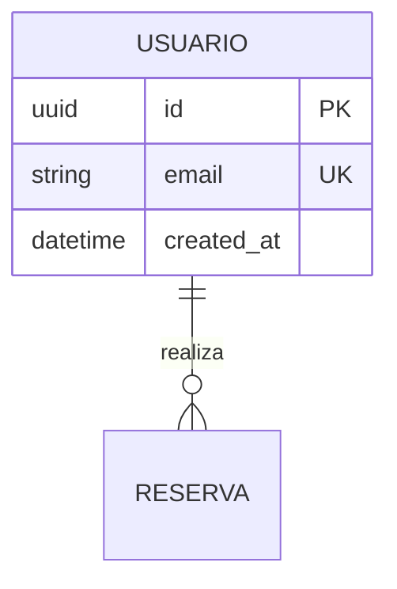

# Plantilla de Base de Datos y Decisiones (MER + ADR) — SDD Bridge

## Convención de Nombres de Archivo
`db_[nombre_corto].md` (ej. `db_motor_reservas.md`)

## Estructura Canónica Obligatoria

```markdown
# DISEÑO DE PERSISTENCIA (MER): {{TITULO_EPICA}}

- **Especificación SDD Base:** `spec.md` y `tasks.md` (Spec Kit)
- **Historias de Usuario Base:** {{Nombres de los archivos hu_*.md procesados}}
- **Diseño Visual UX Auditado:** {{Nombre de ux_*.md auditado o "N/A - Bypass Headless"}}
- **Fecha de Diseño:** {{FECHA_ACTUAL}}
- **Data Architect:** Agente DA Senior BMAD

---

## 1. ARCHITECTURE DECISION RECORDS (ADR - Formato MADR)
*(Justificación técnica de las decisiones estructurales de persistencia derivadas de spec.md y constitution.md)*

### ADR-01: {{Título de la decisión, ej. Motor de Persistencia o Tipo de Llave Primaria}}
- **Estado:** {{ Aceptado | Aceptado (heredado) }}
  > *Regla: Usar "Aceptado (heredado)" si la decisión proviene de files/context/constitution.md o .specify/memory/constitution.md. Las decisiones heredadas no requieren alternativas consideradas.*
- **Contexto:** {{Qué necesidad de modelado de spec.md o restricción del constitution.md motiva la elección}}.
- **Decisión:** {{Tipo de dato, motor, particionamiento o normalización seleccionada en una frase clara y verificable}}.
- **Alternativas Evaluadas (Obligatorio en decisiones nuevas):**
  - **Alternativa A:** {{Opción viable descartada y justificación técnica con argumentos reales}}.
  - **Alternativa B:** {{Opción viable descartada y justificación técnica con argumentos reales}}.
  - *(Exento de alternativas si el estado es Aceptado (heredado))*.
- **Consecuencias:**
  - ✅ **Ventajas / Impacto Positivo:** {{Eficiencia transaccional o integridad garantizada}}.
  - ⚠️ **Trade-off / Costo Real:** {{Complejidad en migraciones, costo de storage o sobrecarga de índices. Prohibido omitir trade-offs reales}}.

---

## 2. MODELO ENTIDAD-RELACIÓN (MER)



---

## 3. DICCIONARIO DE DATOS Y RESTRICCIONES
*(Mapeado estrictamente a las entidades definidas en spec.md y wireframes UX)*

### Tabla: `USUARIO`
- `id` (UUID): Llave primaria.
- `email` (VARCHAR 255): Único, requerido. Formato validado.
- `created_at` (TIMESTAMP WITH TIME ZONE): Auditoría de creación.

---

## 4. RIESGOS DE INTEGRIDAD Y ESCALABILIDAD
- `⚠️ RIESGO:` {{Posibles cuellos de botella en la concurrencia o límites del motor de base de datos según los requerimientos}}.

---

## 5. ORDEN DE DELEGACIÓN PARA EL TRACKER
*(Analiza el Product Brief y el MVP para determinar el siguiente paso y genera una sola línea de texto continuo sin saltos internos)*

- **SI EL PROYECTO REQUIERE COMUNICACIÓN EXTERNA (APIs REST/GraphQL/Eventos):**
  `@API: El modelo de datos (MER) y la persistencia han sido definidos a partir de spec.md y tasks.md. Por favor, diseña los contratos de integración (Endpoints/Payloads) basados en estas tablas.`

- **SI EL PROYECTO ES PURAMENTE DE PROCESAMIENTO / ETL (Sin endpoints externos):**
  `@QT: El modelo de datos y las reglas de procesamiento ETL han sido definidos a partir de spec.md y tasks.md. Al no requerir capa de API, procede directamente con la auditoría y compilación del Tech Design Document (TDD).`
```

---

### ⚠️ DIRECTIVA OBLIGATORIA DE TRAZABILIDAD UI / SPEC KIT -> DATA
1. **Inspección Visual y Contractual de Datos:** El Data Architect audita `spec.md`, `tasks.md` y `files/designer-ux/ux_*.md` (si existe diseño visual) antes de cerrar el MER.
2. **Cero Campos Huérfanos:** Cada elemento de interfaz o entidad de contrato que requiera persistencia o cálculo debe tener su columna y tipo correspondiente en el Diccionario de Datos.
3. **Excepción Headless:** Si el proyecto proviene de un Bypass Headless (sin `ux_*.md`), el modelo se deriva exclusivamente de los contratos de `spec.md`, `tasks.md` y `hu_*.md`.

---

### ⚠️ Directiva de Persistencia para Ecosistemas Preexistentes (Modo Brownfield)
Si existe el archivo `files/context/constitution.md` o `.specify/memory/constitution.md`:
1. **Subordinación Estricta de Persistencia (Lex Superior):** El motor de persistencia, dialecto SQL, tipos de datos y esquemas deben subordinarse estrictamente a lo establecido en la constitución técnica.
2. **Prohibición de Incompatibilidad y Complacencia:** Queda estrictamente prohibido proponer o modelar motores incompatibles sin la sección física `## ⚠️ CLÁUSULA DE EXCEPCIÓN ARQUITECTÓNICA`.
3. **ADR Obligatorio de Coexistencia (MADR):** Redactar un ADR justificando la integración o extensión de tablas heredadas con estado `Aceptado (heredado)`.

[IMPORT_SKILL: skills/tracker-logger/SKILL.md]
