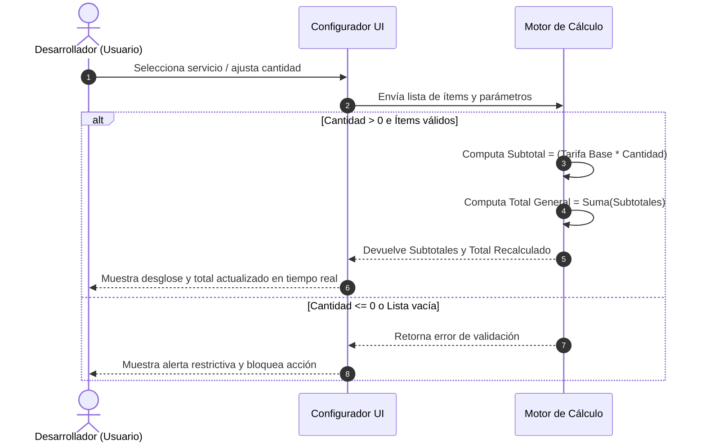

# HISTORIA DE USUARIO TÉCNICA: Configuración Interactiva y Cálculo de Cotizaciones

- **ID de Historia:** 001-HU_configurador_y_calculo_cotizaciones
- **Épica:** P1 - Motor de Cálculo y Configuración Interactiva de Cotizaciones
- **Estado Ledger:** IN-PROGRESS
- **Rama Git:** feat/001-HU_configurador_y_calculo_cotizaciones

---

## 1. METADATOS FORMALES
- **Identificador Universal:** 001-HU_configurador_y_calculo_cotizaciones
- **Módulo / Dominio:** Motor de Cálculo / Configuración Interactiva
- **Prioridad:** P1 (Ruta Crítica)
- **Tipo:** Funcional Core

## 2. ESPECIFICACIÓN FUNCIONAL Y ESCENARIOS GHERKIN
**Como** desarrollador de software independiente (freelance)
**Quiero** seleccionar servicios/módulos web, ajustar cantidades y parámetros personalizados
**Para** calcular en tiempo real subtotales, totales y desgloses de precios eliminando inconsistencias manuales.

### Escenarios BDD (Gherkin Puro)
- **Escenario 01 — Cálculo automático de subtotales y total general (Happy Path):**
  - **Dado** que el usuario ha seleccionado uno o más servicios del catálogo parametrizado con sus tarifas base,
  - **Cuando** modifica la cantidad o ajusta los parámetros de un ítem dentro de la cotización,
  - **Entonces** el sistema computa inmediatamente el subtotal por ítem y recalcula el monto total general del proyecto en tiempo real.

- **Escenario 02 — Selección vacía de servicios o cantidades inválidas (Sad Path):**
  - **Dado** que el usuario está configurando una cotización,
  - **Cuando** intenta procesar la cotización sin ítems seleccionados o asigna una cantidad menor o igual a cero (0),
  - **Entonces** el sistema previene el cálculo invalidador, resalta el error de validación y muestra un mensaje restrictivo impidiendo el avance.

- **Escenario 03 — Modificación o eliminación de ítems de la cotización (Happy Path):**
  - **Dado** que la cotización contiene ítems previamente agregados,
  - **Cuando** el usuario remueve un servicio o altera su tarifa/parámetro individual,
  - **Entonces** el sistema actualiza el desglose de precios y ajusta la suma total acumulada de manera inmediata e implícita.

## 3. MATRIZ DE CASOS BORDE Y EXCEPCIONES
| Caso Borde / Excepción | Condición de Disparo | Comportamiento Esperado del Sistema |
|---|---|---|
| Cantidad nula o negativa | El usuario ingresa una cantidad ≤ 0 en un ítem | El sistema valida la entrada, marca el campo con error de validación y bloquea la actualización del total |
| Deselección total de servicios | Se eliminan todos los ítems de la cotización activa | El sistema resetea los subtotales y el total a cero (0.00), muestra estado de cotización vacía e inhabilita las acciones subsiguientes |
| Inclusión de impuestos (IGV/Retenciones) | Se consulta o evalúa la adición de impuestos en el cálculo | `❓ No documentado`: En el Product Brief no se especifica si aplica IGV (18%) o Recibo por Honorarios (8%); el motor opera sobre subtotales/totales directos hasta definir la regla tributaria |

## 4. PRECONDICIONES Y POSTCONDICIONES VERIFICABLES
- **Precondiciones:**
  - Existe disponibilidad de un catálogo de servicios base con tarifas iniciales.
  - La sesión de configuración de cotización está activa.
- **Postcondiciones:**
  - El monto total resultante refleja con precisión la suma algebraica de los subtotales computados.
  - Los parámetros ajustados quedan consolidados en la estructura de la cotización en curso.

## 5. 📊 DIAGRAMA DE SECUENCIA / ESTADOS

## 6. DEFINITION OF DONE (TÉCNICA)
- [ ] Todos los escenarios Gherkin (Happy Path y Sad Path) están definidos de forma explícita y testable.
- [ ] El motor de cálculo computa montos en tiempo real con precisión matemática exacta.
- [ ] Los casos borde (cantidades inválidas, deselección total) están controlados con validaciones deterministas.
- [ ] Se mantiene la separación limpia de negocio sin incluir referencias a tecnologías de bajo nivel ni bases de datos.
- [ ] La funcionalidad respeta las reglas de negocio del sistema preexistente documentado.

## 7. ORDEN DE DELEGACIÓN PARA EL QA
@QA: Se entregan las HUs Técnica y Stakeholders para la Historia 001-HU_configurador_y_calculo_cotizaciones.

---
> **Origen:** pb_generador_cotizaciones.md / mvp_generador_cotizaciones.md.
> Todo contenido generado que no esté explícito en la fuente se marca como `⚠️ [PROPUESTO]`.
