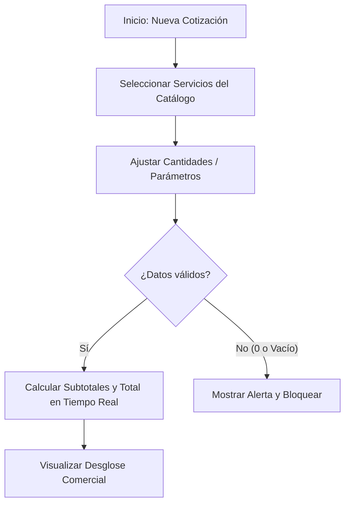

# HISTORIA DE USUARIO (STAKEHOLDERS): Configuración Interactiva y Cálculo de Cotizaciones

- **ID de Historia:** 001-HU
- **Épica:** P1 - Motor de Cálculo y Configuración Interactiva de Cotizaciones
- **Audiencia:** Stakeholders, Product Owner, Usuarios Clave

---

## 1. HISTORIA DE USUARIO
**Como** desarrollador de software independiente (freelance)
**Quiero** contar con un configurador interactivo para seleccionar servicios web y calcular montos automáticamente
**Para** elaborar propuestas comerciales precisas en pocos minutos sin errores de cálculo manual.

## 2. CRITERIOS DE ACEPTACIÓN FUNCIONALES
- **CA-01 — Selección de servicios y cálculo automático en tiempo real (Happy Path):**
  - **Dado** que el usuario está configurando una nueva propuesta comercial,
  - **Cuando** selecciona los servicios deseados y define sus cantidades o parámetros,
  - **Entonces** el sistema calcula y muestra instantáneamente el desglose por servicio y la suma total de la propuesta.

- **CA-02 — Prevención de errores en cotizaciones vacías o con montos inválidos (Sad Path):**
  - **Dado** que el usuario se encuentra en el configurador interactivo,
  - **Cuando** intenta procesar una propuesta sin servicios o asigna cantidades iguales o menores a cero (0),
  - **Entonces** el sistema bloquea la acción y le notifica que debe incluir al menos un servicio válido para continuar.

- **CA-03 — Ajuste dinámico de servicios y precios (Happy Path):**
  - **Dado** que se han agregado servicios a la cotización activa,
  - **Cuando** el usuario remueve un servicio o cambia sus parámetros,
  - **Entonces** el total de la propuesta comercial se recalcula automáticamente reflejando el nuevo presupuesto.

## 3. 📊 DIAGRAMAS DE LA HU

## 4. IMPACTO OPERATIVO Y BENEFICIO DE NEGOCIO
- **Valor Agregado:** Elimina la lentitud y el trabajo repetitivo de calcular costos manualmente en hojas de cálculo, reduciendo el riesgo de cobros erróneos o pérdidas de margen.
- **Métricas Clave:** `⚠️ [PROPUESTO]:` Reducción del tiempo promedio de elaboración de propuestas comerciales a menos de 5 minutos y cero errores en sumas de cotizaciones emitidas.

## 5. DEFINITION OF DONE (STAKEHOLDER)
- [ ] La HU cumple con todos los Criterios de Aceptación declarados desde la perspectiva del usuario.
- [ ] El Happy Path y los Sad Paths están definidos en términos comprensibles de negocio.
- [ ] No incluye jerga técnica de implementación de bajo nivel.
- [ ] Validado con los objetivos del Product Brief.
- [ ] La funcionalidad respeta las reglas de negocio del sistema preexistente documentado.

## Supuestos de Negocio
- `⚠️ SUPUESTO:` El catálogo inicial de servicios cubre las necesidades más frecuentes de proyectos de desarrollo web en Perú.
- `⚠️ SUPUESTO:` Las tarifas de los servicios predefinidos sirven como base orientativa para las cotizaciones.

## ❓ PREGUNTAS Y PUNTOS ABIERTOS
- `❓ No documentado:` ¿Se requiere incluir impuestos locales (ej. IGV 18% o Retención por Recibo por Honorarios 8%) en el desglose total de la propuesta?

---
> **Origen:** pb_generador_cotizaciones.md / mvp_generador_cotizaciones.md.
> Todo contenido generado que no esté explícito en la fuente se marca como `⚠️ [PROPUESTO]`.
