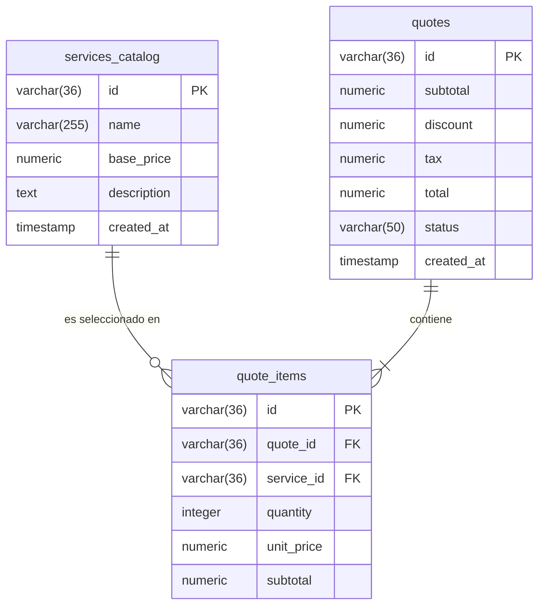

# DISEÑO DE PERSISTENCIA (MER): P1 - Motor de Cálculo y Configuración Interactiva de Cotizaciones

- **Especificación SDD Base:** `specs/002-HU_motor_configuracion_calculo_cotizaciones/data-model.md`, `plan.md` y `tasks.md`
- **Historias de Usuario Base:** `001-HU_configurador_y_calculo_cotizaciones.md`
- **Diseño Visual UX Auditado:** `files/designer-ux/ux_001_configurador_y_calculo_cotizaciones.md`
- **Fecha de Diseño:** 02-10-2026
- **Data Architect:** Agente DA Senior BMAD

---

## 1. ARCHITECTURE DECISION RECORDS (ADR - Formato MADR)

### ADR-01: Motor de Persistencia Relacional PostgreSQL 16
- **Estado:** Aceptado (heredado)
  > *Regla: Usar "Aceptado (heredado)" si la decisión proviene de `.specify/memory/constitution.md` o `tech_guidelines.md`.*
- **Contexto:** Subordinación a la gobernanza global del proyecto registrada en `.specify/memory/constitution.md` y `files/solutions-architect/tech_guidelines.md` para el almacenamiento transaccional del catálogo y las cotizaciones emitidas.
- **Decisión:** Utilizar el motor relacional PostgreSQL 16 como solución de persistencia relacional transaccional (ACID).
- **Consecuencias:**
  - ✅ **Ventajas / Impacto Positivo:** Integridad referencial fuerte, soporte nativo de tipos numéricos precisos (`NUMERIC`/`DECIMAL`), restricciones CHECK a nivel de base de datos para evitar importes negativos.
  - ⚠️ **Trade-off / Costo Real:** Requiere ejecución de migraciones SQL estructuradas (`001_init.sql`) y mantenimiento de esquemas relacionales.

### ADR-02: Identificadores Primarios Basados en Cadenas UUIDv4 (`VARCHAR(36)`)
- **Estado:** Aceptado
- **Contexto:** Se requiere desacoplamiento en la generación de identificadores de entidad tanto en el cliente SPA como en el backend API REST antes de la inserción física.
- **Decisión:** Adoptar cadenas de 36 caracteres compatibles con el estándar UUIDv4 como llave primaria en todas las tablas del esquema.
- **Alternativas Evaluadas:**
  - **Alternativa A (Claves Primarias Enteras Auto-incrementales `BIGSERIAL`):** Descartada por impedir la pre-asignación determinista de IDs en el frontend en estados offline/caché y exponer secuenciales públicos vulnerables a enumeración.
  - **Alternativa B (UUID Nativo `UUID` de Postgres):** Descartada en favor de `VARCHAR(36)` para garantizar compatibilidad directa y ligera con los tipos TypeScript `string` en las interfaces `ServiceItem` y `QuoteItem`.
- **Consecuencias:**
  - ✅ **Ventajas / Impacto Positivo:** Generación de claves universales desacopladas, pre-asignación segura en cliente SPA, cero colisiones.
  - ⚠️ **Trade-off / Costo Real:** Mayor consumo de almacenamiento en índices B-Tree respecto a enteros de 64 bits (`BIGINT`).

### ADR-03: Modelo Relacional Normalizado (1:N) para Cotizaciones y Desglose de Ítems
- **Estado:** Aceptado
- **Contexto:** La cotización puede contener múltiples ítems seleccionados (`quote_items`) vinculados al catálogo base (`services_catalog`), requiriendo persistencia atómica y consultas eficientes de historial.
- **Decisión:** Normalizar el modelo separando la cabecera de cotización (`quotes`) de los detalles (`quote_items`), incluyendo campos numéricos de auditoría financiera (`subtotal`, `discount`, `tax`, `total`).
- **Alternativas Evaluadas:**
  - **Alternativa A (Almacenamiento de Ítems como JSONB dentro de `quotes`):** Descartada por dificultar la integridad referencial contra `services_catalog` y complicar reportes analíticos de consumo por servicio.
- **Consecuencias:**
  - ✅ **Ventajas / Impacto Positivo:** Trazabilidad estricta por servicio, integridad referencial vía Foreign Keys (`ON DELETE CASCADE`), alineación 100% con los contratos TypeScript `ServiceItem`, `QuoteItem` y `CalculationResult`.
  - ⚠️ **Trade-off / Costo Real:** Requiere operaciones `JOIN` transaccionales al recuperar una cotización completa.

---

## 2. MODELO ENTIDAD-RELACIÓN (MER)

---

## 3. DICCIONARIO DE DATOS Y RESTRICCIONES

### Tabla: `services_catalog`
Representa el catálogo parametrizado de servicios base disponibles para cotización.

| Columna | Tipo de Dato | Nulo | Restricción / Default | Descripción / Trazabilidad UI-Data |
|---|---|---|---|---|
| `id` | `VARCHAR(36)` | NO | Primary Key | Identificador único del servicio (`ServiceItem.id`) |
| `name` | `VARCHAR(255)` | NO | - | Nombre público del servicio (`ServiceItem.name` en UI) |
| `base_price` | `NUMERIC(12, 2)` | NO | `CHECK (base_price >= 0)` | Tarifa base parametrizada en USD/PEN (`ServiceItem.basePrice`) |
| `description` | `TEXT` | SÍ | - | Detalle descriptivo del servicio (`ServiceItem.description`) |
| `created_at` | `TIMESTAMP WITH TIME ZONE` | NO | `DEFAULT CURRENT_TIMESTAMP` | Fecha/hora de alta en el catálogo |

---

### Tabla: `quotes`
Representa la cabecera inmutable o borrador de una cotización generada por el usuario.

| Columna | Tipo de Dato | Nulo | Restricción / Default | Descripción / Trazabilidad UI-Data |
|---|---|---|---|---|
| `id` | `VARCHAR(36)` | NO | Primary Key | Identificador único de la cotización |
| `subtotal` | `NUMERIC(12, 2)` | NO | `CHECK (subtotal >= 0)` | Suma de subtotales de ítems (`CalculationResult.subtotal`) |
| `discount` | `NUMERIC(12, 2)` | NO | `DEFAULT 0.00 CHECK (discount >= 0)` | Monto de descuento aplicado (`CalculationResult.discount`) |
| `tax` | `NUMERIC(12, 2)` | NO | `DEFAULT 0.00 CHECK (tax >= 0)` | Monto de impuestos computado (`CalculationResult.tax`) |
| `total` | `NUMERIC(12, 2)` | NO | `CHECK (total >= 0)` | Monto total de la cotización (`CalculationResult.total`) |
| `status` | `VARCHAR(50)` | NO | `DEFAULT 'DRAFT'` | Estado transaccional (`DRAFT`, `COMPLETED`, `CANCELLED`) |
| `created_at` | `TIMESTAMP WITH TIME ZONE` | NO | `DEFAULT CURRENT_TIMESTAMP` | Fecha de creación de la cotización |

---

### Tabla: `quote_items`
Representa el desglose de líneas o módulos seleccionados dentro de una cotización específica.

| Columna | Tipo de Dato | Nulo | Restricción / Default | Descripción / Trazabilidad UI-Data |
|---|---|---|---|---|
| `id` | `VARCHAR(36)` | NO | Primary Key | Identificador único de la línea de detalle |
| `quote_id` | `VARCHAR(36)` | NO | Foreign Key (`quotes.id` ON DELETE CASCADE) | Referencia a la cotización contenedora |
| `service_id` | `VARCHAR(36)` | NO | Foreign Key (`services_catalog.id`) | Referencia al servicio base seleccionado (`QuoteItem.serviceId`) |
| `quantity` | `INTEGER` | NO | `CHECK (quantity > 0)` | Cantidad de unidades/horas (`QuoteItem.quantity`) |
| `unit_price` | `NUMERIC(12, 2)` | NO | `CHECK (unit_price >= 0)` | Precio unitario aplicado al momento del cálculo (`QuoteItem.customPrice`) |
| `subtotal` | `NUMERIC(12, 2)` | NO | `CHECK (subtotal >= 0)` | Subtotal calculado (`quantity * unit_price`) |

---

## 4. AUDITORÍA DE TRAZABILIDAD UI -> DATA (CERO CAMPOS HUÉRFANOS)

- **Panel de Selección / Catálogo (UI):**
  - Chekbox / Nombre de servicio ➔ `services_catalog.name`
  - Tarifa base ➔ `services_catalog.base_price`
  - Input de cantidad ➔ `quote_items.quantity` (con validación DB `CHECK (quantity > 0)`)
- **Panel de Resumen Transaccional (UI):**
  - Desglose por ítem (`1 x $300 = $300.00`) ➔ `quote_items.quantity`, `quote_items.unit_price`, `quote_items.subtotal`
  - Subtotal acumulado ➔ `quotes.subtotal`
  - Descuento acumulado ➔ `quotes.discount`
  - Total General ➔ `quotes.total`
  - Botón "Generar PDF" / Emisión ➔ Mutación del estado `quotes.status`

---

## 5. RIESGOS DE INTEGRIDAD Y ESCALABILIDAD
- `⚠️ RIESGO 1:` **Eliminación o modificación de tarifas en `services_catalog`:** Si el catálogo base altera la tarifa base (`base_price`), las cotizaciones históricas persistidas deben mantener el precio histórico registrado. **Mitigación:** Se exige almacenar `unit_price` de forma explícita en `quote_items` al momento del guardado para desacoplarlo del catálogo.
- `⚠️ RIESGO 2:` **Inserción de cantidades `<= 0` o NaN desde llamadas API directas:** **Mitigación:** Restricciones Check estrictas a nivel de esquema físico (`CHECK (quantity > 0)`) y validaciones en la capa de modelo/controlador.

---

## 6. ORDEN DE DELEGACIÓN PARA EL TRACKER
@API: El modelo de datos (MER) y la persistencia han sido definidos a partir de spec.md y tasks.md. Por favor, diseña los contratos de integración (Endpoints/Payloads) basados en estas tablas.
