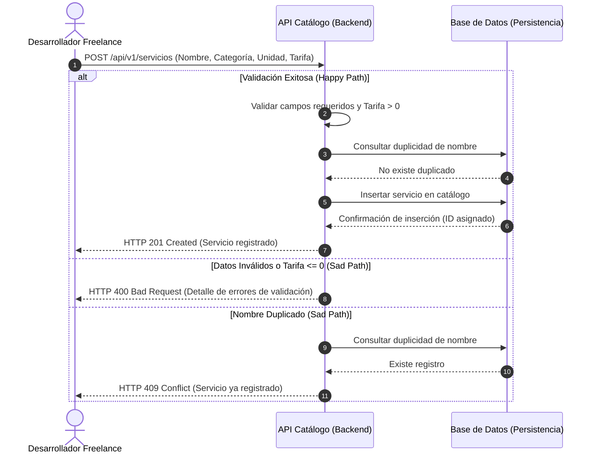

# ESPECIFICACIÓN TÉCNICA DE HISTORIA DE USUARIO: Catálogo de Servicios y Tarifario Parametrizable

## 1. METADATOS FORMALES
- **Feature ID:** FEAT-001
- **Story ID:** 001-HU_catalogo_servicios_tarifario
- **Épica:** [P1] Catálogo de Servicios y Tarifario Parametrizable
- **Tipo:** Feature
- **Prioridad:** Alta
- **Tags:** [catalogo, tarifario, servicios, p1]
- **Consumo SDD:** `/speckit.specify files/business-analyst/001-HU_catalogo_servicios_tarifario.md`

---

## 2. ESPECIFICACIÓN FUNCIONAL Y ESCENARIOS GHERKIN (BDD)

### 2.1. Descripción de la Capacidad
**Como** Desarrollador Freelance (Administrador de Propuestas Comerciales)
**Quiero** registrar, consultar, actualizar y gestionar un catálogo reutilizable de servicios, componentes funcionales y tarifas base (por hora, por complejidad o por módulo)
**Para** estandarizar los precios de desarrollo web y móvil, eliminando el cálculo manual y sirviendo como base de datos maestra para el motor de cotización.

### 2.2. Escenarios Formales en Sintaxis Gherkin Pura

```gherkin
Feature: Catálogo de Servicios y Tarifario Parametrizable
  Como Desarrollador Freelance (Administrador de Propuestas Comerciales)
  Quiero gestionar un catálogo parametrizable de servicios y tarifas
  Para disponer de un listado estandarizado reutilizable en la elaboración de cotizaciones

  Scenario: SC-01 [Happy Path] Registro exitoso de un nuevo servicio o componente en el catálogo
    Given que el desarrollador freelance se encuentra autenticado en el sistema
    And el catálogo de servicios está disponible para edición
    When el desarrollador ingresa un servicio con nombre "Desarrollo de API REST", categoría "Web", unidad de medida "Hora" y tarifa base 50.00 en moneda configurable
    Then el sistema valida la completitud y el formato numérico positivo de la tarifa
    And el sistema persiste el nuevo servicio en el catálogo con un identificador único y estado activo
    And la respuesta confirma la creación exitosa del registro con código HTTP 201 Created

  Scenario: SC-02 [Happy Path] Consulta y filtrado del catálogo de servicios
    Given que existen servicios registrados previamente en el catálogo
    When el desarrollador consulta el catálogo aplicando un filtro opcional por categoría o estado
    Then el sistema retorna la lista paginada o completa de servicios coincidentes con sus respectivas tarifas base y unidades de medida
    And la respuesta retorna código HTTP 200 OK con el listado ordenado

  Scenario: SC-03 [Sad Path] Intentar registrar un servicio con campos obligatorios faltantes o tarifa no positiva
    Given que el desarrollador está en el formulario de registro de servicios
    When intenta guardar un servicio omitiendo el nombre o ingresando una tarifa base menor o igual a cero (ej. -10.00 o 0)
    Then el sistema rechaza la operación antes de la persistencia
    And retorna un mensaje de error explícito indicando las reglas de validación violadas con código HTTP 400 Bad Request
    And el estado de la base de datos permanece inmutable

  Scenario: SC-04 [Sad Path] Intentar registrar o actualizar un servicio con un nombre o código duplicado
    Given que existe un servicio registrado en el catálogo con el nombre "Landing Page Básica"
    When el desarrollador intenta registrar un nuevo servicio con el mismo nombre "Landing Page Básica" en la misma categoría
    Then el sistema detecta la duplicidad de nombre/identificador único
    And rechaza el registro emitiendo una excepción de duplicidad con código HTTP 409 Conflict
    And no crea registros duplicados en el catálogo
```

---

## 3. MATRIZ DE CASOS BORDE Y EXCEPCIONES

| ID | Condición Límite / Error | Tipo de Evento | Comportamiento Esperado | Código / Tipo de Respuesta |
|---|---|---|---|---|
| CB-01 | Payload incompleto o nulo (nombre vacío, unidad faltante) | Validación de Esquema | Rechazo inmediato con lista detallada de violaciones | HTTP 400 / ValidationException |
| CB-02 | Tarifa base menor o igual a cero (`tarifa <= 0`) | Validación de Regla de Negocio | Rechazo de la solicitud especificando que la tarifa debe ser un valor numérico positivo | HTTP 400 / InvalidTariffException |
| CB-03 | Intento de duplicación de servicio existente | Conflicto de Dominio | Prevención de duplicados basada en nombre único dentro de la categoría | HTTP 409 / DuplicateResourceException |
| CB-04 | Recurso solicitado no encontrado (ID inexistente en actualización o inactivación) | Consulta de Dominio | Notificación de recurso no encontrado | HTTP 404 / NotFoundException |
| CB-05 | Falla de conexión con la capa de persistencia | Error de Infraestructura | Captura segura del error sin exponer datos sensibles del servidor | HTTP 500 / InternalServerErrorException |

---

## 4. PRECONDICIONES Y POSTCONDICIONES VERIFICABLES

### 4.1. Precondiciones del Sistema
- El desarrollador freelance debe contar con acceso a la plataforma de administración.
- La moneda base del sistema (ej. PEN o USD) debe estar definida o parametrizada a nivel global ⚠️ [PROPUESTO].

### 4.2. Postcondiciones y Mutaciones
- Todo servicio registrado exitosamente queda disponible de inmediato para ser seleccionado por el motor de configuración y cálculo de cotizaciones (`[P2]`).
- Los cambios en el catálogo (creación, edición, inactivación) quedan registrados con auditoría de fecha de actualización.
- La base de datos mantiene integridad referencial; no se permite la eliminación física de servicios que se encuentren vinculados a cotizaciones históricas emitidas.

---

## 5. 📊 DIAGRAMA DE SECUENCIA / ESTADOS



---

## 6. DEFINITION OF DONE (TÉCNICA)
- [ ] La especificación contiene todos los metadatos requeridos para Spec Kit.
- [ ] Todos los escenarios BDD están escritos en sintaxis pura Gherkin.
- [ ] La matriz de casos borde cubre validación de campos, valores de tarifa inválidos, conflictos de duplicidad y errores de persistencia.
- [ ] Las precondiciones y postcondiciones son verificables mediante pruebas automatizadas de integración y backend.
- [ ] El diagrama de secuencia refleja con fidelidad los flujos de Happy y Sad Path.
- [ ] La funcionalidad respeta las reglas de negocio del sistema y mantiene la separación arquitectónica entre `app/backend/` y `app/frontend/` según `constitution.md`.
- [ ] Ausencia de supuestos no tipificados (cualquier inferencia está marcada como ⚠️ [PROPUESTO]).

---
> **Origen:** files/product-analyst/pb_cotizador_freelance.md y files/product-manager/mvp_cotizador_freelance.md.
> Todo contenido generado que no esté explícito en la fuente se marca como `⚠️ [PROPUESTO]`.

## 7. ORDEN DE DELEGACIÓN PARA EL QA
@QA: La Historia de Usuario Técnica Catálogo de Servicios y Tarifario Parametrizable está lista en el archivo files/business-analyst/001-HU_catalogo_servicios_tarifario.md (y su versión de stakeholders en files/business-analyst/HUs-stakeholders/001-HU_catalogo_servicios_tarifario.md). Por favor, procede con la auditoría documental contra el Product Brief para asegurar que la historia cumple con los requerimientos originales.
