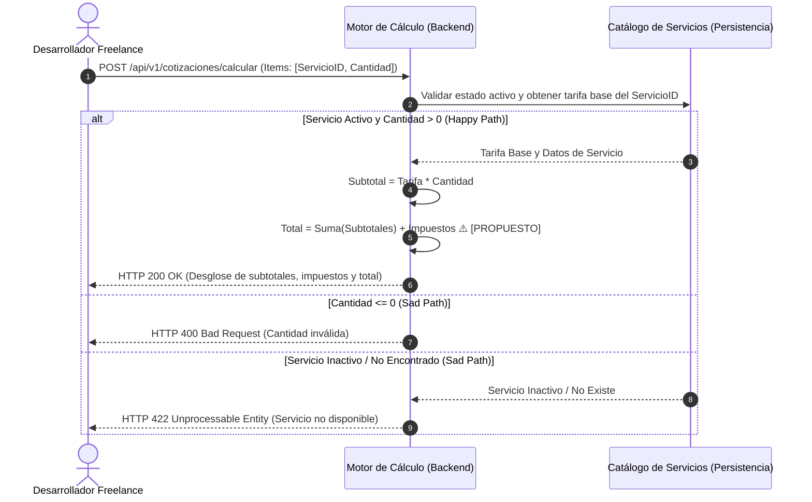

# ESPECIFICACIÓN TÉCNICA DE HISTORIA DE USUARIO: Motor de Configuración y Cálculo de Cotizaciones

## 1. METADATOS FORMALES
- **Feature ID:** FEAT-002
- **Story ID:** 002-HU_motor_configuracion_calculo_cotizaciones
- **Épica:** [P2] Motor de Configuración y Cálculo de Cotizaciones
- **Tipo:** Feature
- **Prioridad:** Alta
- **Tags:** [cotizacion, calculo, motor, configuracion, p2]
- **Consumo SDD:** `/speckit.specify files/business-analyst/002-HU_motor_configuracion_calculo_cotizaciones.md`

---

## 2. ESPECIFICACIÓN FUNCIONAL Y ESCENARIOS GHERKIN (BDD)

### 2.1. Descripción de la Capacidad
**Como** Desarrollador Freelance (Administrador de Propuestas Comerciales)
**Quiero** seleccionar servicios del catálogo activo, ajustar dinámicamente sus cantidades o unidades y calcular en tiempo real los subtotales por ítem, impuestos y el precio total
**Para** eliminar el cálculo manual de presupuestos, garantizar precisión matemática sin margen de error y obtener el desglose financiero inmediato de la propuesta comercial.

### 2.2. Escenarios Formales en Sintaxis Gherkin Pura

```gherkin
Feature: Motor de Configuración y Cálculo de Cotizaciones
  Como Desarrollador Freelance (Administrador de Propuestas Comerciales)
  Quiero seleccionar servicios y parametrizar cantidades
  Para calcular automáticamente subtotales, impuestos y el precio total de una propuesta

  Scenario: SC-01 [Happy Path] Selección de servicios y cálculo automático del presupuesto en tiempo real
    Given que existen servicios activos en el catálogo de tarifas (001-HU_catalogo_servicios_tarifario)
    And el desarrollador inicia el proceso de configuración de una nueva cotización
    When selecciona un servicio con tarifa base de 50.00 y especifica una cantidad de 10 horas
    Then el sistema calcula de forma automática el subtotal del ítem en 500.00
    And actualiza el resumen financiero de la cotización reflejando subtotal acumulado, impuestos aplicables ⚠️ [PROPUESTO] y el total general
    And retorna código HTTP 200 OK con la estructura matemática calculada

  Scenario: SC-02 [Happy Path] Modificación dinámica de cantidades y recalculo instantáneo
    Given que una propuesta comercial en borrador contiene múltiples ítems previamente seleccionados
    When el desarrollador modifica la cantidad de un ítem existente o elimina un servicio del desglose
    Then el sistema recalcula inmediatamente los subtotales de cada ítem, la suma total y los impuestos correspondientes
    And mantiene la consistencia de los datos financieros sin requerir procesamiento manual

  Scenario: SC-03 [Sad Path] Intentar ingresar cantidades inválidas o no positivas en un ítem
    Given que el desarrollador está editando la cantidad para un servicio seleccionado en la cotización
    When ingresa una cantidad menor o igual a cero (ej. 0 o -3)
    Then el sistema rechaza la parametrización de la cantidad
    And emite un mensaje de error de validación con código HTTP 400 Bad Request
    And preserva el estado y totales calculados previamente sin aplicar mutaciones inválidas

  Scenario: SC-04 [Sad Path] Intentar agregar un servicio inactivo o inexistente a la cotización
    Given que un servicio ha sido marcado como inactivo en el catálogo o no existe en el registro
    When el desarrollador intenta añadir dicho servicio a la configuración de la cotización
    Then el sistema bloquea la inclusión del ítem
    And emite una excepción de recurso no disponible con código HTTP 422 Unprocessable Entity
    And no altera la lista de ítems de la propuesta
```

---

## 3. MATRIZ DE CASOS BORDE Y EXCEPCIONES

| ID | Condición Límite / Error | Tipo de Evento | Comportamiento Esperado | Código / Tipo de Respuesta |
|---|---|---|---|---|
| CB-01 | Cantidad de horas/unidades nula o menor/igual a cero | Validación de Esquema | Rechazo inmediato especificando que la cantidad debe ser mayor a 0 | HTTP 400 / InvalidQuantityException |
| CB-02 | Cotización sin ítems seleccionados (lista vacía) | Regla de Negocio | Bloqueo al intentar guardar o emitir presupuesto sin ítems | HTTP 400 / EmptyQuoteException |
| CB-03 | Inclusión de servicio inactivo o eliminado lógicamente | Validación de Referencia | Rechazo de la adición informando que el servicio no está activo | HTTP 422 / InactiveServiceException |
| CB-04 | Desbordamiento o imprecisión decimal en montos grandes | Límite Numérico | Redondeo estándar a 2 decimales bajo norma ISO 4217 sin pérdida de centavos | HTTP 200 / Precisión Garantizada |
| CB-05 | Incompatibilidad de moneda base entre ítem y presupuesto ⚠️ [PROPUESTO] | Conversión de Moneda | Rechazo de agregación si las monedas no coinciden sin tasa definida | HTTP 400 / CurrencyMismatchException |

---

## 4. PRECONDICIONES Y POSTCONDICIONES VERIFICABLES

### 4.1. Precondiciones del Sistema
- El módulo de catálogo de servicios (`001-HU_catalogo_servicios_tarifario`) debe estar activo y contener al menos un registro de servicio habilitado.
- Definición de los parámetros de cálculo tributario (ej. IGV 18% o Retención de 4ta Categoría) ⚠️ [PROPUESTO].

### 4.2. Postcondiciones y Mutaciones
- Los montos calculados (subtotal por ítem, subtotal acumulado, impuestos y total global) se estructuran en memoria o borrador listos para asociarse al cliente (`[P3]`) y exportarse a PDF (`[P4]`).
- Los precios base del catálogo no sufren modificaciones; el cálculo utiliza instantáneas (*snapshots*) de la tarifa al momento de la cotización.

---

## 5. 📊 DIAGRAMA DE SECUENCIA / ESTADOS



---

## 6. DEFINITION OF DONE (TÉCNICA)
- [ ] La especificación contiene todos los metadatos requeridos para Spec Kit.
- [ ] Todos los escenarios BDD están escritos en sintaxis pura Gherkin.
- [ ] La matriz de casos borde cubre validación de cantidades, servicios inactivos, precisión decimal y listas vacías.
- [ ] Las precondiciones y postcondiciones son verificables mediante pruebas automatizadas de integración.
- [ ] El diagrama de secuencia refleja con fidelidad los flujos de cálculo, Happy Path y Sad Paths.
- [ ] La funcionalidad respeta la partición física estricta entre `app/backend/` y `app/frontend/` según `constitution.md`.
- [ ] Ausencia de supuestos no tipificados (cualquier inferencia está marcada como ⚠️ [PROPUESTO]).

---
> **Origen:** files/product-analyst/pb_cotizador_freelance.md y files/product-manager/mvp_cotizador_freelance.md.
> Todo contenido generado que no esté explícito en la fuente se marca como `⚠️ [PROPUESTO]`.

## 7. ORDEN DE DELEGACIÓN PARA EL QA
@QA: La Historia de Usuario Técnica Motor de Configuración y Cálculo de Cotizaciones está lista en el archivo files/business-analyst/002-HU_motor_configuracion_calculo_cotizaciones.md (y su versión de stakeholders en files/business-analyst/HUs-stakeholders/002-HU_motor_configuracion_calculo_cotizaciones.md). Por favor, procede con la auditoría documental contra el Product Brief para asegurar que la historia cumple con los requerimientos originales.
