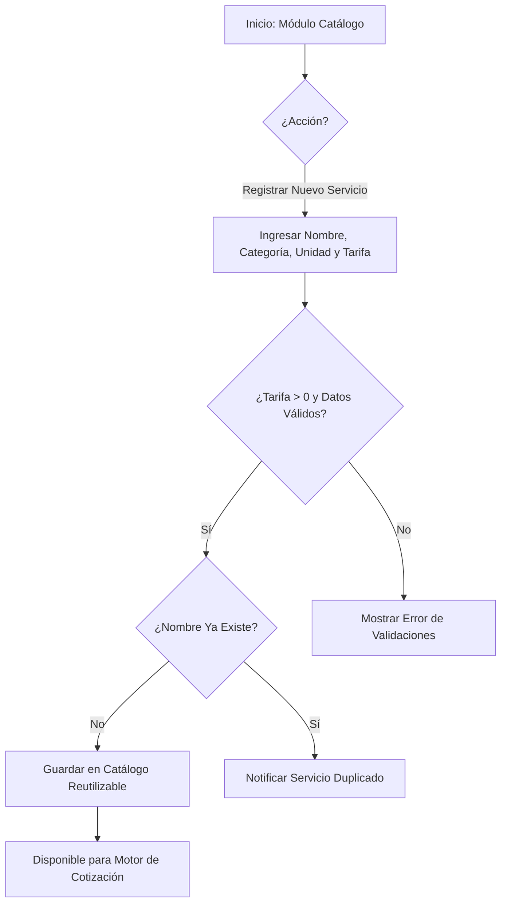

# HISTORIA DE USUARIO (STAKEHOLDERS): Catálogo de Servicios y Tarifario Parametrizable

- **ID de Historia:** 001-HU_catalogo_servicios_tarifario
- **Épica:** [P1] Catálogo de Servicios y Tarifario Parametrizable
- **Audiencia:** Stakeholders, Product Owner, Desarrollador Freelance

---

## 1. HISTORIA DE USUARIO
**Como** Desarrollador Freelance (Administrador Comercial)
**Quiero** registrar y administrar mi catálogo reutilizable de servicios, componentes y tarifas base (por horas, complejidad o módulos) para proyectos web y móvil
**Para** estandarizar los costos de mis servicios, eliminar el trabajo repetitivo de cotización desde cero y garantizar propuestas transparentes y homogéneas.

## 2. CRITERIOS DE ACEPTACIÓN FUNCIONALES
- **CA-01 — Registro exitoso de servicios y tarifas base:**
  - **Dado** que el desarrollador accede al módulo de administración del catálogo,
  - **Cuando** ingresa los datos de un nuevo servicio (nombre, categoría, unidad de medida y tarifa base positiva),
  - **Entonces** el sistema guarda el servicio en el catálogo reutilizable y lo muestra disponible para futuras cotizaciones.
- **CA-02 — Prevención de datos incompletos o tarifas inválidas:**
  - **Dado** que el desarrollador está creando o modificando un servicio en el catálogo,
  - **Cuando** intenta guardar la información omitiendo campos obligatorios o ingresando una tarifa menor o igual a cero,
  - **Entonces** el sistema impide el guardado, resalta los campos corregibles y muestra un mensaje claro orientando al usuario.
- **CA-03 — Prevención de duplicidad de servicios:**
  - **Dado** que ya existe un servicio registrado con un nombre determinado (ej. "Landing Page Básica"),
  - **Cuando** el desarrollador intenta registrar otro servicio con exactamente el mismo nombre dentro de la misma categoría,
  - **Entonces** el sistema notifica que el servicio ya se encuentra registrado y previene duplicaciones accidentales.

## 3. 📊 DIAGRAMAS DE LA HU

## 4. IMPACTO OPERATIVO Y BENEFICIO DE NEGOCIO
- **Valor Agregado:** Elimina la redefinición manual de precios y alcance para cada cliente, centralizando las tarifas en un único catálogo editable y reutilizable.
- **Métricas Clave:** Reducción del tiempo de configuración inicial de propuestas y eliminación total de inconsistencias de precios en proyectos similares.

## 5. DEFINITION OF DONE (STAKEHOLDER)
- [ ] La HU cumple con todos los Criterios de Aceptación declarados desde la perspectiva de negocio del desarrollador freelance.
- [ ] El Happy Path y al menos un Sad Path están definidos en términos comprensibles sin jerga técnica de bajo nivel.
- [ ] Los Criterios de Aceptación y las reglas de validación respetan la visión del Product Brief.
- [ ] La funcionalidad respeta las reglas de negocio del sistema preexistente documentado.

---
> **Origen:** files/product-analyst/pb_cotizador_freelance.md y files/product-manager/mvp_cotizador_freelance.md.
> Todo contenido generado que no esté explícito en la fuente se marca como `⚠️ [PROPUESTO]`.
