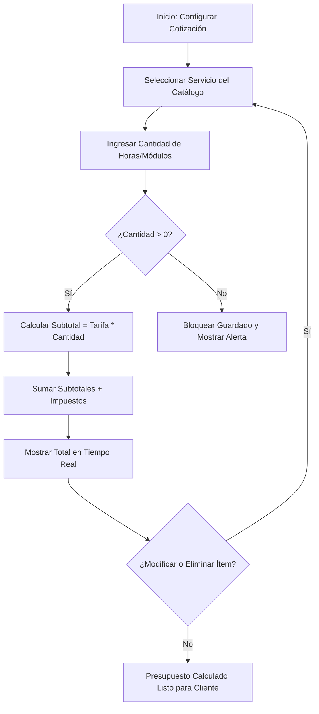

# HISTORIA DE USUARIO (STAKEHOLDERS): Motor de Configuración y Cálculo de Cotizaciones

- **ID de Historia:** 002-HU_motor_configuracion_calculo_cotizaciones
- **Épica:** [P2] Motor de Configuración y Cálculo de Cotizaciones
- **Audiencia:** Stakeholders, Product Owner, Desarrollador Freelance

---

## 1. HISTORIA DE USUARIO
**Como** Desarrollador Freelance (Administrador Comercial)
**Quiero** seleccionar interactivamente servicios de mi catálogo y ajustar sus cantidades
**Para** obtener el cálculo instantáneo y transparente del costo total de una propuesta comercial para un cliente, eliminando errores de cálculo manual.

## 2. CRITERIOS DE ACEPTACIÓN FUNCIONALES
- **CA-01 — Selección de servicios y cálculo en tiempo real:**
  - **Dado** que el desarrollador está configurando una nueva propuesta comercial,
  - **Cuando** selecciona servicios de su catálogo e indica las cantidades (ej. horas o módulos),
  - **Entonces** el sistema calcula inmediatamente el subtotal de cada ítem, aplica los impuestos correspondientes ⚠️ [PROPUESTO] y presenta el monto total a cobrar.
- **CA-02 — Recalculo dinámico por cambios en la cotización:**
  - **Dado** que la cotización en borrador contiene un listado de servicios seleccionados,
  - **Cuando** el desarrollador modifica cantidades o elimina algún servicio de la lista,
  - **Entonces** el sistema actualiza automáticamente los subtotales y el monto final en tiempo real.
- **CA-03 — Prevención de cantidades inválidas o no positivas:**
  - **Dado** que el desarrollador intenta definir la cantidad de horas o módulos para un servicio,
  - **Cuando** ingresa un valor igual o menor a cero (ej. 0 o números negativos),
  - **Entonces** el sistema bloquea el cambio, muestra una alerta explicativa y conserva los valores calculados previamente.

## 3. 📊 DIAGRAMAS DE LA HU

## 4. IMPACTO OPERATIVO Y BENEFICIO DE NEGOCIO
- **Valor Agregado:** Transforma un proceso lento y propenso a errores manuales en un cálculo automático en tiempo real, agilizando la preparación de propuestas.
- **Métricas Clave:** Reducción drástica del tiempo de cotización (contribuyendo a la meta de < 10 min por propuesta) y 0% de margen de error aritmético en presupuestos comerciales.

## 5. DEFINITION OF DONE (STAKEHOLDER)
- [ ] La HU cumple con los Criterios de Aceptación declarados desde la perspectiva operativa del desarrollador.
- [ ] Los escenarios de cálculo exitoso y prevención de errores son claros y no contienen jerga técnica de implementación.
- [ ] Se garantiza la alineación con los objetivos y alcance del Product Brief.
- [ ] La funcionalidad respeta las reglas de negocio del sistema preexistente documentado.

---
> **Origen:** files/product-analyst/pb_cotizador_freelance.md y files/product-manager/mvp_cotizador_freelance.md.
> Todo contenido generado que no esté explícito en la fuente se marca como `⚠️ [PROPUESTO]`.
