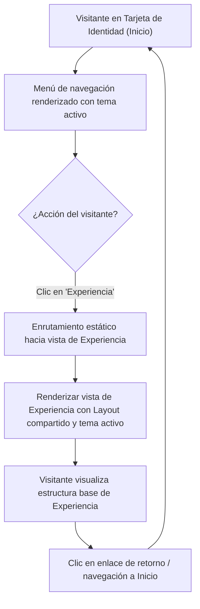

## 1. HISTORIA DE USUARIO
**Como** visitante de la tarjeta de identidad digital
**Quiero** acceder a un componente de menú de navegación estilizado y navegar hacia la vista de Experiencia
**Para** conocer la trayectoria profesional del titular sin perder la coherencia visual ni el rendimiento del sitio

## 2. CRITERIOS DE ACEPTACIÓN (BDD)

- **CA-01 — Visualización e Integración Armónica del Menú de Navegación (Happy Path):** **Dado** que el visitante accede a la tarjeta de identidad digital en cualquier dispositivo (móvil o escritorio), **Cuando** se renderiza la vista principal, **Entonces** el sistema muestra el componente de menú de navegación integrado de manera balanceada y minimalista bajo el perfil, adaptando sus estilos, colores y estados interactivos (hover/focus) al tema activo (Light o Dark Mode) sin alterar la jerarquía de la fotografía y el nombre.
- **CA-02 — Enrutamiento y Navegación Exitosa a la Vista de Experiencia (Happy Path):** **Dado** que el visitante se encuentra en la tarjeta de identidad y hace clic o interactúa con la opción "Experiencia" del menú, **Cuando** se procesa la navegación estática, **Entonces** el sistema carga y presenta de forma inmediata (tiempo de respuesta inferior a 1 segundo ⚠️ [PROPUESTO]) la vista complementaria base de Experiencia, conservando el tema visual seleccionado y la cabecera/layout global sin parpadeos visuales (cero FOUT).
- **CA-03 — Mecanismo de Retorno a la Vista Principal y Resiliencia de Enrutamiento (Sad Path / Fallback):** **Dado** que el visitante se encuentra en la vista complementaria de Experiencia o intenta acceder a una ruta inexistente vinculada a la navegación, **Cuando** activa el control o enlace de retorno al perfil principal, **Entonces** el sistema redirige fluidamente a la tarjeta de identidad central preservando la preferencia de tema en memoria/almacenamiento local sin provocar estados inconsistentes ni pérdida de layout.

## 3. 📊 DIAGRAMAS DE LA HU

## 4. DEFINITION OF DONE
- [ ] La HU cumple con todos los Criterios de Aceptación declarados.
- [ ] El Happy Path y al menos un Sad Path/Fallback están cubiertos con Gherkin testable.
- [ ] No existen detalles de implementación técnica en el cuerpo de la HU.
- [ ] Los ⚠️ SUPUESTOS y ❓ Puntos Abiertos están explícitamente registrados.
- [ ] La funcionalidad respeta las reglas de negocio y restricciones operativas del ecosistema preexistente documentado.

## Supuestos
- `⚠️ SUPUESTO:` La vista de "Experiencia" reutiliza el layout base preexistente para garantizar la persistencia del tema visual y la botonera de conmutación.
- `⚠️ SUPUESTO:` El menú opera mediante navegación nativa sin dependencias de red en servidor, manteniendo la arquitectura estática.

## 🎨 REFERENCIA UX/UI
- **Pantalla / Módulo:** Componente Menú de Navegación (Ubicado en la tarjeta principal y en la vista complementaria de Experiencia). Botonera o lista de enlaces horizontales ultra-minimalista, con soporte para estados activo, hover y adaptabilidad responsiva en temas claro y oscuro.

## ❓ PUNTOS ABIERTOS
1. `❓ No documentado` ¿La navegación hacia "Experiencia" debe realizarse en la misma pestaña del navegador manteniendo una barra de retorno visible o en una vista modal?

---
> **Origen:** pb_menu_navegacion_perfil.md (Product Brief) y mvp_menu_navegacion_perfil.md (Plan de Gestión del MVP).
> Todo contenido generado que no esté explícito en la fuente se marca como `⚠️ [PROPUESTO]`.

## 5. ORDEN DE DELEGACIÓN PARA EL QA
@QA: La Historia de Usuario Componente Menú de Navegación y Enrutamiento a Vista de Experiencia está lista en el archivo hu_01_menu_navegacion_experiencia.md. Por favor, procede con la auditoría documental contra el Product Brief para asegurar que la historia cumple con los requerimientos originales.
