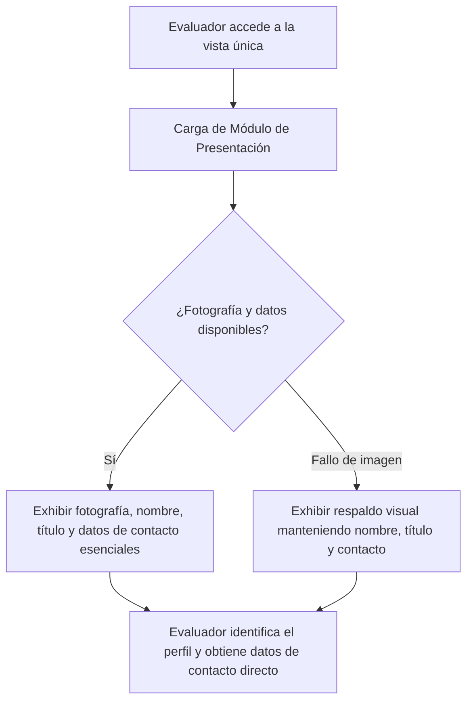

## 1. HISTORIA DE USUARIO
**Como** reclutador técnico o evaluador de talento
**Quiero** visualizar de forma inmediata la presentación personal (fotografía profesional, nombre completo, título profesional) y los datos de contacto esenciales en una única vista
**Para** identificar el perfil del profesional y disponer de sus canales directos de contacto de manera ágil y sin distracciones externas

## 2. CRITERIOS DE ACEPTACIÓN (BDD)

- **CA-01 — Visualización completa de identidad y contacto (Happy Path):** **Dado** que un evaluador de talento accede a la vista única del perfil profesional, **Cuando** la vista se carga en pantalla, **Entonces** el sistema exhibe de manera visible y destacada la fotografía profesional, el nombre completo, el título profesional y los datos de contacto esenciales sin requerir acciones adicionales de navegación.
- **CA-02 — Manejo de indisponibilidad de fotografía profesional (Sad Path):** **Dado** que el archivo o recurso de fotografía profesional no está disponible o no puede ser cargado, **Cuando** se visualiza el módulo de presentación personal, **Entonces** el sistema muestra un indicador o marcador visual de respaldo sin alterar la alineación general ni ocultar el nombre completo, título profesional ni los datos de contacto ⚠️ [PROPUESTO].
- **CA-03 — Cumplimiento de auto-contención sin enlaces a terceros (Sad Path / Restricción):** **Dado** que el módulo de presentación y contacto está renderizado, **Cuando** el evaluador inspecciona la información de contacto, **Entonces** los datos se presentan directamente en texto para su uso sin contener enlaces ni redirecciones a redes sociales o plataformas de terceros externas.

## 3. 📊 DIAGRAMAS DE LA HU

## 4. DEFINITION OF DONE
- [ ] La HU cumple con todos los Criterios de Aceptación declarados.
- [ ] El Happy Path y al menos un Sad Path están cubiertos con Gherkin testable.
- [ ] No existen detalles de implementación técnica en el cuerpo de la HU.
- [ ] Los ⚠️ SUPUESTOS y ❓ Puntos Abiertos están explícitamente registrados.

## Supuestos
- `⚠️ SUPUESTO:` Los datos de contacto mostrados directamente en la vista son suficientes para que el evaluador inicie contacto sin requerir enlaces externos.
- `⚠️ SUPUESTO:` La información de identidad y contacto se gestiona de forma estática en el MVP sin requerir un módulo administrativo ni autenticación.

## 🎨 REFERENCIA UX/UI
- **Pantalla / Módulo:** Módulo de Presentación Personal e Información de Contacto (Cabecera / Sección Principal de la vista única).

## ❓ PUNTOS ABIERTOS
1. `❓ No documentado:` Definición final de los campos específicos que integran los "datos de contacto esenciales" (ej. correo electrónico, número telefónico, ciudad/país).

---
> **Origen:** pb_perfil_profesional.md y mvp_perfil_profesional.md (Product Brief y Plan de Gestión del MVP). Todo contenido generado que no esté explícito en la fuente se marca como `⚠️ [PROPUESTO]`.

## 5. ORDEN DE DELEGACIÓN PARA EL QA
@QA: La Historia de Usuario Presentación Personal e Información de Contacto Directo está lista en el archivo hu_01_presentacion_contacto.md. Por favor, procede con la auditoría documental contra el Product Brief para asegurar que la historia cumple con los requerimientos originales.
