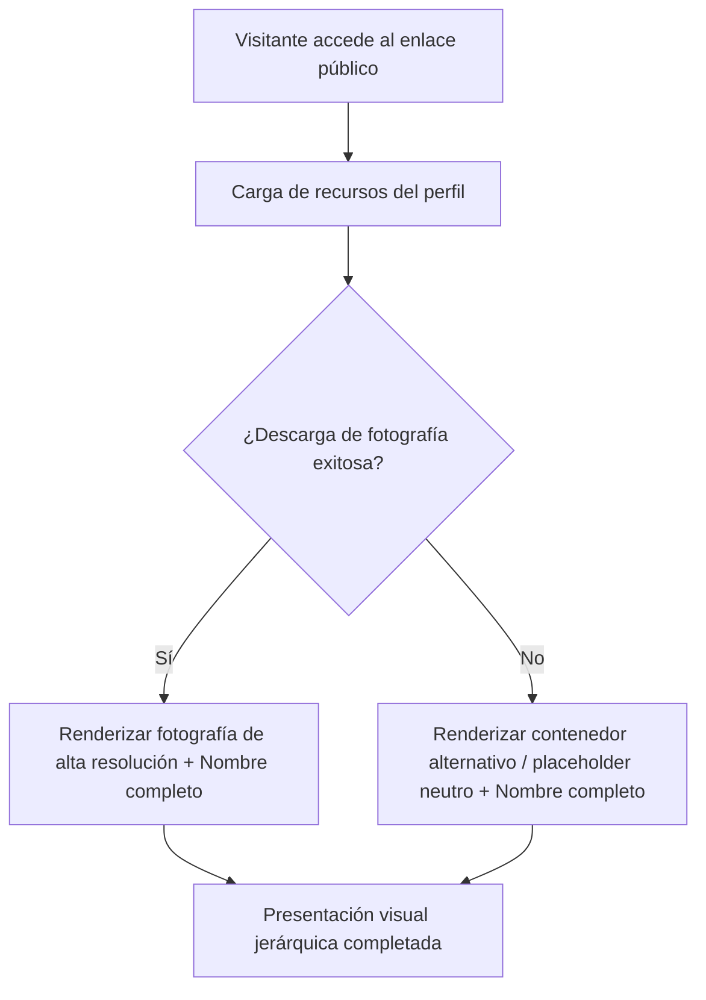

## 1. HISTORIA DE USUARIO
**Como** visitante o contacto profesional que accede a la tarjeta de identidad digital
**Quiero** visualizar de forma inmediata, nítida y jerárquica la fotografía de perfil en alta resolución y el nombre completo del titular
**Para** identificar con certeza y sin distracciones la marca personal y el perfil profesional del titular en pocos segundos

## 2. CRITERIOS DE ACEPTACIÓN (BDD)

- **CA-01 — Visualización Exitosa de Fotografía y Nombre Completo (Happy Path):** **Dado** que el visitante accede al enlace público de la tarjeta de identidad digital del titular, **Cuando** se carga la página principal, **Entonces** el sistema presenta de manera destacada y centrada la fotografía de perfil en alta resolución sin distorsiones geométricas junto al nombre completo del profesional bajo una jerarquía tipográfica claramente legible.
- **CA-02 — Control de Carga y Degradación de Imagen de Perfil (Sad Path):** **Dado** que el visitante accede al enlace y el recurso fotográfico de perfil no está disponible o falla su descarga por problemas de red, **Cuando** se completa el intento de renderizado, **Entonces** el sistema muestra un contenedor/placeholder neutro preservando la estructura visual del perfil y mantiene visible y legible el nombre completo del profesional sin romper el layout.
- **CA-03 — Rendimiento y Adaptabilidad Responsiva (Happy Path Complementario):** **Dado** que el visitante accede desde cualquier dispositivo móvil, tablet o escritorio con conexión estándar, **Cuando** se realiza la petición inicial de la página, **Entonces** el perfil completo (fotografía y nombre) se renderiza de forma balanceada y completamente visible en un tiempo inferior a 2 segundos ⚠️ [PROPUESTO].

## 3. 📊 DIAGRAMAS DE LA HU

## 4. DEFINITION OF DONE
- [ ] La HU cumple con todos los Criterios de Aceptación declarados.
- [ ] El Happy Path y al menos un Sad Path están cubiertos con Gherkin testable.
- [ ] No existen detalles de implementación técnica en el cuerpo de la HU.
- [ ] Los ⚠️ SUPUESTOS y ❓ Puntos Abiertos están explícitamente registrados.

## Supuestos
- `⚠️ SUPUESTO:` El titular proporciona un recurso fotográfico de perfil de alta resolución optimizado para web y el texto exacto de su nombre profesional.
- `⚠️ SUPUESTO:` La visualización opera como una página web pública accesible directamente sin requerir inicio de sesión ni autenticación.

## 🎨 REFERENCIA UX/UI
- **Pantalla / Módulo:** Módulo Central de Presentación de Identidad (Vista Principal de Perfil). Contenedor centrado, fotografía de perfil destacada y tipografía jerárquica limpia con espaciado minimalista.

## ❓ PUNTOS ABIERTOS
1. `❓ No documentado` ¿Se mantendrá la tarjeta de identidad estrictamente limitada a la fotografía y el nombre, o se contemplará la adición de título/cargo profesional o datos de contacto en versiones posteriores?

---
> **Origen:** pb_tarjeta_identidad_digital.md (Product Brief) y mvp_tarjeta_identidad_digital.md (Plan de Gestión del MVP).
> Todo contenido generado que no esté explícito en la fuente se marca como `⚠️ [PROPUESTO]`.

## 5. ORDEN DE DELEGACIÓN PARA EL QA
@QA: La Historia de Usuario Presentación Central de Identidad y Perfil Profesional está lista en el archivo hu_01_presentacion_identidad_perfil.md. Por favor, procede con la auditoría documental contra el Product Brief para asegurar que la historia cumple con los requerimientos originales.
