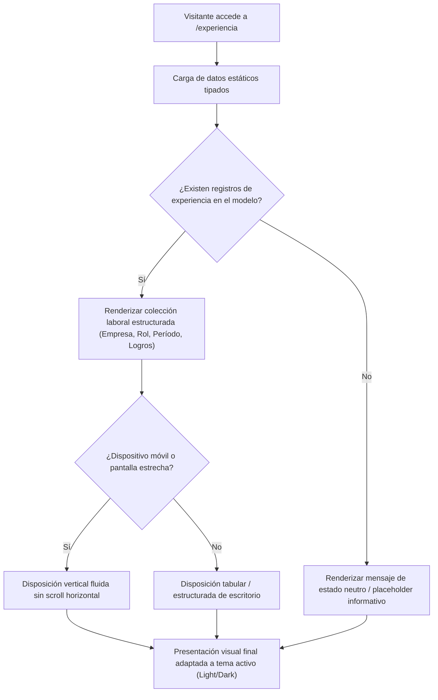

## 1. HISTORIA DE USUARIO
**Como** visitante o reclutador que accede a la vista de Experiencia (`/experiencia`)
**Quiero** visualizar de forma estructurada, ordenada y responsiva la trayectoria laboral del titular (empresa, cargo/rol, período y responsabilidades)
**Para** evaluar y comprender con rapidez los antecedentes y competencias profesionales del titular sin fricciones ni sobrecarga cognitiva

## 2. CRITERIOS DE ACEPTACIÓN (BDD)

- **CA-01 — Visualización Estructurada y Jerárquica de la Experiencia Laboral (Happy Path):** **Dado** que el visitante navega hacia la vista `/experiencia` en cualquier dispositivo, **Cuando** se completa el renderizado de la página, **Entonces** el sistema despliega la colección de puestos de trabajo previos organizados de forma clara (empresa, rol/cargo desempeñado, período de tiempo y lista de responsabilidades principales), adaptando tipografía, fondos y contrastes cromáticos al tema activo (Light o Dark Mode) conforme a los estándares WCAG AA.
- **CA-02 — Adaptabilidad Responsiva y Fluidez Móvil (Happy Path Complementario):** **Dado** que el visitante consulta la trayectoria laboral desde un dispositivo móvil o pantalla estrecha, **Cuando** se visualiza la sección de experiencia, **Entonces** la estructura se reorganiza verticalmente (formato de tarjetas o bloques apilados) evitando desbordamientos horizontales o solapamientos de texto, manteniendo el tiempo de renderizado inferior a 1.0s ⚠️ [PROPUESTO].
- **CA-03 — Resiliencia ante Ausencia de Registros Laborales (Sad Path / Fallback):** **Dado** que el modelo de datos estático de experiencia se encuentra vacío o sin elementos configurados, **Cuando** se inicializa la vista de `/experiencia`, **Entonces** el sistema muestra un mensaje de estado neutro ("No hay registros de experiencia disponibles actualmente") preservando la estructura del layout, la cabecera y los controles de navegación sin provocar fallos de compilación ni pantallas rotas.

## 3. 📊 DIAGRAMAS DE LA HU

## 4. DEFINITION OF DONE
- [ ] La HU cumple con todos los Criterios de Aceptación declarados.
- [ ] El Happy Path y al menos un Sad Path/Fallback están cubiertos con Gherkin testable.
- [ ] No existen detalles de implementación técnica en el cuerpo de la HU.
- [ ] Los ⚠️ SUPUESTOS y ❓ Puntos Abiertos están explícitamente registrados.
- [ ] La funcionalidad respeta las reglas de negocio y restricciones operativas del ecosistema preexistente documentado.

## Supuestos
- `⚠️ SUPUESTO:` Los datos de experiencia se suministran desde la configuración estática local en build-time con una muestra de 2 a 4 cargos representativos.
- `⚠️ SUPUESTO:` La vista opera bajo arquitectura SSG pura ("Zero JS") integrada al layout base global.

## 🎨 REFERENCIA UX/UI
- **Pantalla / Módulo:** Módulo de Experiencia Profesional (`/experiencia`). Contenedor estructurado con tarjetas o filas jerárquicas para cada puesto (Empresa en texto destacado, Rol en subtítulo, Período en badge/etiqueta sutil y lista de responsabilidades concisas).

## ❓ PUNTOS ABIERTOS
1. `❓ No documentado` ¿El orden de despliegue de los puestos laborales debe seguir estrictamente un esquema cronológico inverso (del puesto más reciente al más antiguo)?

---
> **Origen:** pb_modulo_experiencia.md (Product Brief) y mvp_modulo_experiencia.md (Plan de Gestión del MVP).
> Todo contenido generado que no esté explícito en la fuente se marca como `⚠️ [PROPUESTO]`.

## 5. ORDEN DE DELEGACIÓN PARA EL QA
@QA: La Historia de Usuario Componente y Visualización Estructurada de Experiencia Laboral está lista en el archivo hu_01_visualizacion_experiencia_laboral.md. Por favor, procede con la auditoría documental contra el Product Brief para asegurar que la historia cumple con los requerimientos originales.
