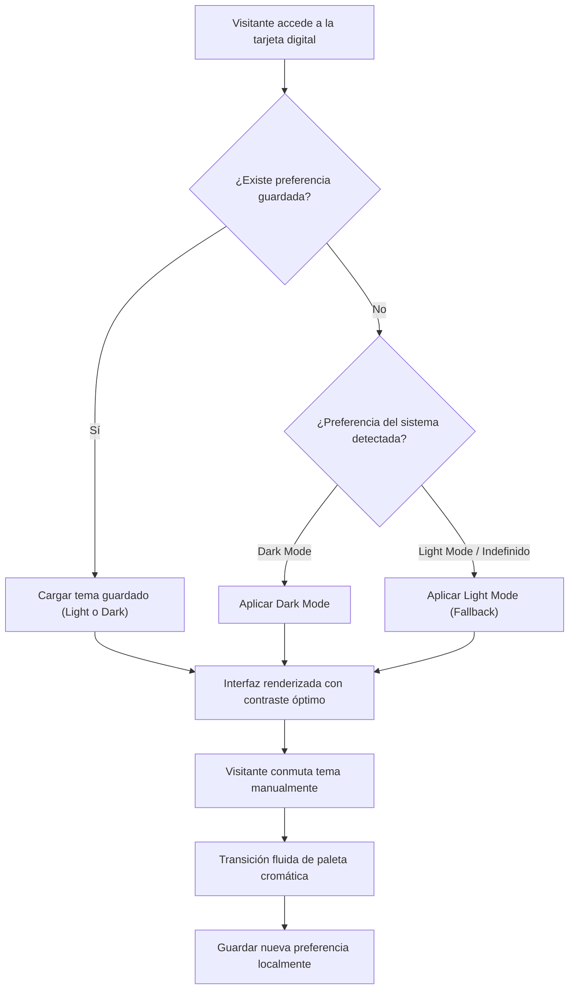

## 1. HISTORIA DE USUARIO
**Como** visitante de la tarjeta de identidad digital
**Quiero** alternar la interfaz entre tema claro (Light Mode) y tema oscuro (Dark Mode)
**Para** adaptar la visualización a mis preferencias de confort visual y a las condiciones de iluminación de mi entorno sin perder legibilidad ni contraste

## 2. CRITERIOS DE ACEPTACIÓN (BDD)

- **CA-01 — Alternancia Manual Fluida entre Modo Claro y Modo Oscuro (Happy Path):** **Dado** que el visitante se encuentra visualizando la tarjeta de identidad digital, **Cuando** activa el control o conmutador de tema visual, **Entonces** el sistema transiciona fluidamente la paleta de colores de fondo, tipografía y elementos estructurales entre tema claro y tema oscuro, garantizando un contraste cromático óptimo y manteniendo inalterada la nitidez de la fotografía de perfil.
- **CA-02 — Persistencia Local de la Preferencia de Tema (Happy Path Complementario):** **Dado** que el visitante ha seleccionado manualmente un tema visual (claro u oscuro), **Cuando** recarga la página o navega nuevamente al enlace en el mismo navegador, **Entonces** el sistema inicializa la interfaz aplicando el tema previamente elegido por el usuario sin parpadeos visuales ni reinicio al valor por defecto ⚠️ [PROPUESTO].
- **CA-03 — Detección Automática de Preferencia de Sistema y Resiliencia (Sad Path / Fallback):** **Dado** que el visitante accede por primera vez sin una preferencia previamente almacenada, o el almacenamiento local del navegador no se encuentra disponible/está bloqueado, **Cuando** se inicializa la tarjeta digital, **Entonces** el sistema detecta la preferencia de tema configurada en el sistema operativo/navegador del usuario (o aplica el tema claro como fallback por defecto) sin provocar errores de renderizado ni bloquear la visualización del perfil.

## 3. 📊 DIAGRAMAS DE LA HU

## 4. DEFINITION OF DONE
- [ ] La HU cumple con todos los Criterios de Aceptación declarados.
- [ ] El Happy Path y al menos un Sad Path/Fallback están cubiertos con Gherkin testable.
- [ ] No existen detalles de implementación técnica en el cuerpo de la HU.
- [ ] Los ⚠️ SUPUESTOS y ❓ Puntos Abiertos están explícitamente registrados.

## Supuestos
- `⚠️ SUPUESTO:` El navegador del visitante soporta mecanismos modernos de conmutación de estilos y detección de preferencias visuales del sistema (`prefers-color-scheme`).
- `⚠️ SUPUESTO:` La conmutación de tema no altera las dimensiones, proporción ni calidad de la fotografía de perfil del titular.

## 🎨 REFERENCIA UX/UI
- **Pantalla / Módulo:** Sistema de Adaptación Visual (Conmutador Light / Dark). Control accesible, minimalista e integrado estéticamente en la tarjeta sin sobrecargar el foco central en la identidad.

## ❓ PUNTOS ABIERTOS
1. `❓ No documentado` ¿El tema por defecto inicial debe sincronizarse estrictamente con el sistema operativo del usuario o fijarse en un tema base predeterminado por el titular?

---
> **Origen:** pb_tarjeta_identidad_digital.md (Product Brief) y mvp_tarjeta_identidad_digital.md (Plan de Gestión del MVP).
> Todo contenido generado que no esté explícito en la fuente se marca como `⚠️ [PROPUESTO]`.

## 5. ORDEN DE DELEGACIÓN PARA EL QA
@QA: La Historia de Usuario Adaptación Visual y Conmutación de Tema está lista en el archivo hu_02_conmutacion_tema_visual.md. Por favor, procede con la auditoría documental contra el Product Brief para asegurar que la historia cumple con los requerimientos originales.
