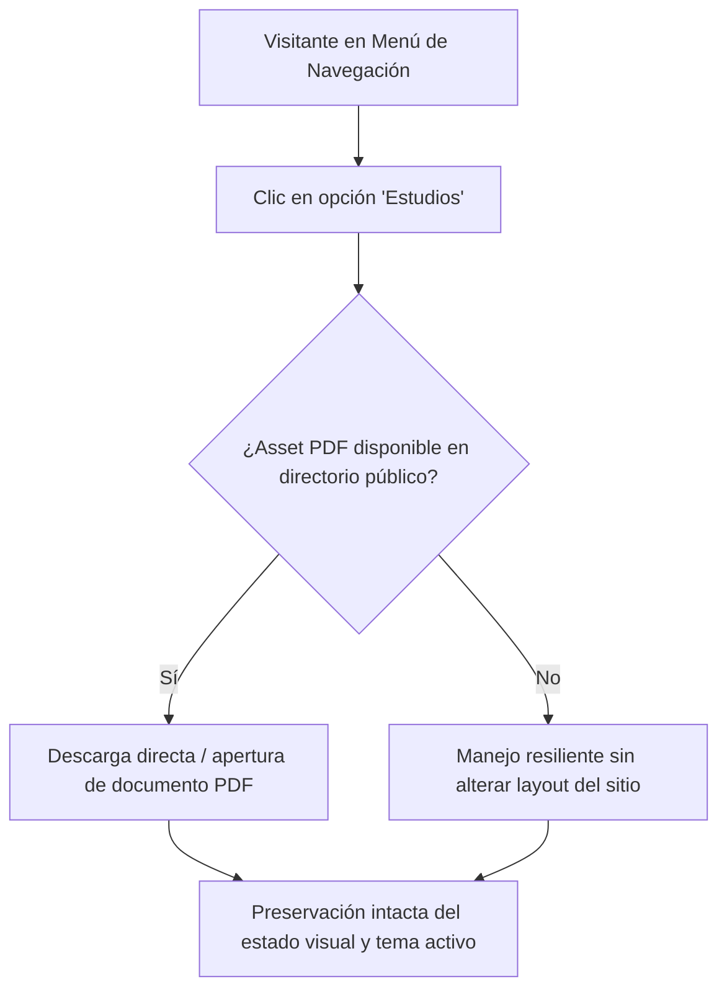

## 1. HISTORIA DE USUARIO
**Como** visitante de la tarjeta de identidad digital
**Quiero** descargar directamente el documento de acreditación de estudios y certificaciones en formato PDF desde el menú de navegación
**Para** validar y conservar los respaldos académicos del titular de manera rápida, confiable y sin intermediarios

## 2. CRITERIOS DE ACEPTACIÓN (BDD)

- **CA-01 — Descarga Directa e Inmediata del Documento PDF (Happy Path):** **Dado** que el visitante se encuentra en la tarjeta de identidad digital (o vista complementaria de navegación), **Cuando** hace clic o interactúa con la opción "Estudios" del menú, **Entonces** el sistema inicia inmediatamente la descarga directa del archivo PDF correspondiente (en un tiempo inferior a 1 segundo ⚠️ [PROPUESTO]) o lo abre en el visor predeterminado del navegador, preservando el estado de la página y el tema visual activo.
- **CA-02 — Preservación de Estética y Rendimiento Estático (Happy Path Complementario):** **Dado** que el visitante interactúa con el botón o enlace de descarga de "Estudios", **Cuando** se ejecuta la acción, **Entonces** la solicitud se resuelve como entrega de asset estático directo sin disparar llamadas a servidores dinámicos ni dependencias pesadas de cliente, manteniendo la arquitectura Zero JavaScript y la respuesta ultra-rápida del sitio.
- **CA-03 — Resiliencia y Manejo ante No Disponibilidad del Asset (Sad Path / Fallback):** **Dado** que el visitante activa la opción de descarga de "Estudios" y el asset físico PDF no se encuentra disponible temporalmente en el repositorio público de assets, **Cuando** el navegador intenta recuperar el recurso, **Entonces** el sistema maneja la solicitud sin romper la interfaz principal de la tarjeta ni colapsar el menú de navegación, permitiendo al usuario continuar interactuando con el resto de opciones.

## 3. 📊 DIAGRAMAS DE LA HU

## 4. DEFINITION OF DONE
- [ ] La HU cumple con todos los Criterios de Aceptación declarados.
- [ ] El Happy Path y al menos un Sad Path/Fallback están cubiertos con Gherkin testable.
- [ ] No existen detalles de implementación técnica en el cuerpo de la HU.
- [ ] Los ⚠️ SUPUESTOS y ❓ Puntos Abiertos están explícitamente registrados.
- [ ] La funcionalidad respeta las reglas de negocio y restricciones operativas del ecosistema preexistente documentado.

## Supuestos
- `⚠️ SUPUESTO:` El archivo PDF acreditativo se encuentra físicamente distribuido como recurso estático dentro del directorio público del proyecto (`public/`).
- `⚠️ SUPUESTO:` La acción de descarga no bloquea la navegación ni recarga la página principal del perfil.

## 🎨 REFERENCIA UX/UI
- **Pantalla / Módulo:** Componente Menú de Navegación (Elemento de Acción "Estudios"). Enlace o botón interactivo con indicación clara de descarga/documento, estilizado acorde a la paleta minimalista en temas claro y oscuro.

## ❓ PUNTOS ABIERTOS
1. `❓ No documentado` ¿El asset PDF descargable debe tener un nombre canónico estandarizado (e.g., `certificados_estudios.pdf` o `acreditacion_academica.pdf`) para la descarga?

---
> **Origen:** pb_menu_navegacion_perfil.md (Product Brief) y mvp_menu_navegacion_perfil.md (Plan de Gestión del MVP).
> Todo contenido generado que no esté explícito en la fuente se marca como `⚠️ [PROPUESTO]`.

## 5. ORDEN DE DELEGACIÓN PARA EL QA
@QA: La Historia de Usuario Descarga Directa de Documento de Estudios está lista en el archivo hu_02_descarga_documento_estudios.md. Por favor, procede con la auditoría documental contra el Product Brief para asegurar que la historia cumple con los requerimientos originales.
