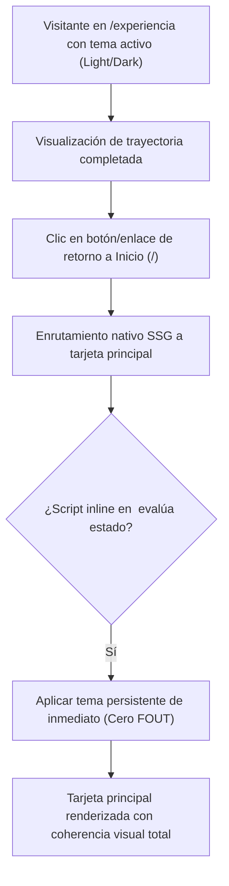

## 1. HISTORIA DE USUARIO
**Como** visitante que se encuentra en la vista de Experiencia (`/experiencia`)
**Quiero** disponer de un mecanismo visible y accesible de retorno hacia la tarjeta principal (`/`)
**Para** alternar fluidamente entre la trayectoria profesional y la tarjeta de identidad central sin parpadeos visuales ni pérdida de la preferencia de tema

## 2. CRITERIOS DE ACEPTACIÓN (BDD)

- **CA-01 — Retorno Intuitivo a la Tarjeta Principal (Happy Path):** **Dado** que el visitante se encuentra en la vista `/experiencia`, **Cuando** hace clic o interactúa con el enlace/botón de retorno (o el elemento correspondiente en la cabecera/menú), **Entonces** el sistema navega de forma instantánea a la página de inicio (`/`), presentando la tarjeta de identidad central sin recargas completas pesadas ni demoras perceptibles (tiempo < 1.0s ⚠️ [PROPUESTO]).
- **CA-02 — Preservación de Estado de Tema y Cero Parpadeo (Happy Path Complementario):** **Dado** que el visitante ha seleccionado un tema visual específico (Dark Mode o Light Mode) durante su sesión, **Cuando** navega entre `/experiencia` e inicio (`/`), **Entonces** el sistema mantiene intacto el tema visual seleccionado y la sincronización con el almacenamiento local (`localStorage`), asegurando una transición visual inmediata sin parpadeo de contenido desestilizado (cero FOUT/FOUC).
- **CA-03 — Resiliencia de Enrutamiento y Coherencia Multirruta (Sad Path / Fallback):** **Dado** que el visitante intenta navegar mediante enlaces directos, refresco forzado o interacción con el historial del navegador, **Cuando** se ejecuta la transición entre rutas, **Entonces** el layout compartido (`Layout.astro`) se renderiza de manera estable, preservando la barra de navegación y el conmutador de tema sin generar estados visuales rotos ni inconsistencias tipográficas.

## 3. 📊 DIAGRAMAS DE LA HU

## 4. DEFINITION OF DONE
- [ ] La HU cumple con todos los Criterios de Aceptación declarados.
- [ ] El Happy Path y al menos un Sad Path/Fallback están cubiertos con Gherkin testable.
- [ ] No existen detalles de implementación técnica en el cuerpo de la HU.
- [ ] Los ⚠️ SUPUESTOS y ❓ Puntos Abiertos están explícitamente registrados.
- [ ] La funcionalidad respeta las reglas de negocio y restricciones operativas del ecosistema preexistente documentado.

## Supuestos
- `⚠️ SUPUESTO:` Ambas rutas (`/` y `/experiencia`) comparten el mismo layout base (`Layout.astro`), garantizando la presencia del conmutador de tema y el script anti-FOUT en `<head>`.
- `⚠️ SUPUESTO:` La navegación entre rutas opera de manera puramente estática sin dependencias de red en servidor.

## 🎨 REFERENCIA UX/UI
- **Pantalla / Módulo:** Navegación Multirruta y Botón de Retorno en `/experiencia`. Elemento de retorno sutil y claramente identificable (ej. "← Volver al Perfil" o navegación en barra superior), con contraste balanceado en temas claro y oscuro.

## ❓ PUNTOS ABIERTOS
1. `❓ No documentado` ¿El mecanismo de retorno debe ubicarse como un botón flotante/superior exclusivo o como una opción integrada en el menú de navegación compartido?

---
> **Origen:** pb_modulo_experiencia.md (Product Brief) y mvp_modulo_experiencia.md (Plan de Gestión del MVP).
> Todo contenido generado que no esté explícito en la fuente se marca como `⚠️ [PROPUESTO]`.

## 5. ORDEN DE DELEGACIÓN PARA EL QA
@QA: La Historia de Usuario Integración de Navegación de Retorno y Coherencia Multirruta está lista en el archivo hu_02_navegacion_retorno_coherencia.md. Por favor, procede con la auditoría documental contra el Product Brief para asegurar que la historia cumple con los requerimientos originales.
