## 1. HISTORIA DE USUARIO
**Como** reclutador técnico o evaluador de talento
**Quiero** visualizar la trayectoria profesional cronológica estructurada con sus periodos de desempeño y las tecnologías dominadas
**Para** evaluar la experiencia técnica previa y calificar el encaje del profesional de forma rápida en una sola vista

## 2. CRITERIOS DE ACEPTACIÓN (BDD)

- **CA-01 — Presentación cronológica de experiencia y tecnologías (Happy Path):** **Dado** que un evaluador de talento accede a la sección de trayectoria profesional en la vista única, **Cuando** la información es renderizada, **Entonces** el sistema exhibe los roles previos ordenados cronológicamente, detallando para cada rol el nombre del puesto, periodo de desempeño y las tecnologías clave asociadas de manera legible.
- **CA-02 — Manejo de sección sin registros de experiencia (Sad Path):** **Dado** que no existen registros de trayectoria disponibles o el listado se encuentra vacío, **Cuando** se carga el módulo de trayectoria, **Entonces** el sistema muestra un mensaje informativo de respaldo (ej. "Trayectoria profesional en actualización") sin romper el diseño de la vista ni afectar las demás secciones ⚠️ [PROPUESTO].
- **CA-03 — Auto-contención de etiquetas tecnológicas sin enlaces externos (Sad Path / Restricción):** **Dado** que se muestran las tecnologías dominadas en los roles previos, **Cuando** el evaluador visualiza las competencias técnicas, **Entonces** las tecnologías se presentan en formato de texto o etiquetas visuales dentro de la misma vista sin redirigir ni incluir hipervínculos hacia plataformas externas.

## 3. 📊 DIAGRAMAS DE LA HU

```mermaid
flowchart TD
    A["Evaluador consulta la sección de trayectoria"] --> B["Carga de Registros Laborales y Tecnologías"]
    B --> C{"¿Existen registros de experiencia?"}
    C -->|Sí| D["Renderizar roles cronológicos con periodos y stack tecnológico"]
    C -->|No / Vacío| E["Mostrar mensaje informativo de respaldo sin romper la vista"]
    D --> F["Evaluador analiza la experiencia técnica en un solo vistazo"]
    E --> F
```

## 4. DEFINITION OF DONE
- [ ] La HU cumple con todos los Criterios de Aceptación declarados.
- [ ] El Happy Path y al menos un Sad Path están cubiertos con Gherkin testable.
- [ ] No existen detalles de implementación técnica en el cuerpo de la HU.
- [ ] Los ⚠️ SUPUESTOS y ❓ Puntos Abiertos están explícitamente registrados.

## Supuestos
- `⚠️ SUPUESTO:` Los roles laborales se ordenan en sentido cronológico inverso (desde la experiencia más reciente a la más antigua) para facilitar la lectura inmediata por parte de reclutadores.
- `⚠️ SUPUESTO:` El catálogo de tecnologías y experiencias proviene de una estructura de datos estática o provista localmente para el MVP.

## 🎨 REFERENCIA UX/UI
- **Pantalla / Módulo:** Módulo de Trayectoria Profesional y Stack Tecnológico (Cuerpo Central de la vista única).

## ❓ PUNTOS ABIERTOS
1. `❓ No documentado:` Nivel de detalle específico a incluir en cada rol (ej. lista de logros clave, descripción de responsabilidades o únicamente títulos y tecnologías).

---
> **Origen:** pb_perfil_profesional.md y mvp_perfil_profesional.md (Product Brief y Plan de Gestión del MVP). Todo contenido generado que no esté explícito en la fuente se marca como `⚠️ [PROPUESTO]`.

## 5. ORDEN DE DELEGACIÓN PARA EL QA
@QA: La Historia de Usuario Trayectoria Profesional Cronológica y Stack Tecnológico está lista en el archivo hu_02_trayectoria_profesional.md. Por favor, procede con la auditoría documental contra el Product Brief para asegurar que la historia cumple con los requerimientos originales.
