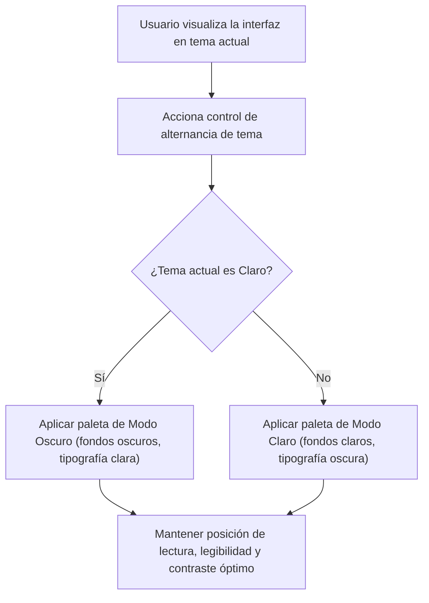

## 1. HISTORIA DE USUARIO
**Como** reclutador técnico o evaluador de talento
**Quiero** disponer de un control interactivo para alternar la vista entre modo claro y modo oscuro
**Para** adaptar la lectura del perfil a mis preferencias de iluminación y ergonomía visual sin perder legibilidad ni alterar el contenido

## 2. CRITERIOS DE ACEPTACIÓN (BDD)

- **CA-01 — Alternancia fluida entre modo claro y oscuro (Happy Path):** **Dado** que un evaluador de talento visualiza el perfil profesional en cualquiera de los dos temas (claro u oscuro), **Cuando** interactúa con el control de alternancia visual, **Entonces** el sistema conmuta instantáneamente la paleta cromática de la interfaz (fondos, textos y componentes) al modo seleccionado, garantizando contraste y legibilidad óptima.
- **CA-02 — Preservación de legibilidad y consistencia ante cambios sucesivos (Sad Path):** **Dado** que el usuario pulsa repetidamente el control de alternancia en un breve periodo de tiempo, **Cuando** se ejecutan las transiciones de tema, **Entonces** el sistema estabiliza el estilo visual seleccionado sin generar parpadeos gráficos erráticos ni superposiciones de colores incompatibles ⚠️ [PROPUESTO].
- **CA-03 — Mantenimiento de contexto y posición de lectura al conmutar tema (Sad Path / Restricción):** **Dado** que el usuario se encuentra explorando una sección específica de la vista, **Cuando** activa el cambio de modo de visualización, **Entonces** el sistema aplica la nueva paleta de color sin recargar la página, sin reiniciar la posición del scroll y preservando intactos todos los datos desplegados.

## 3. 📊 DIAGRAMAS DE LA HU

## 4. DEFINITION OF DONE
- [ ] La HU cumple con todos los Criterios de Aceptación declarados.
- [ ] El Happy Path y al menos un Sad Path están cubiertos con Gherkin testable.
- [ ] No existen detalles de implementación técnica en el cuerpo de la HU.
- [ ] Los ⚠️ SUPUESTOS y ❓ Puntos Abiertos están explícitamente registrados.

## Supuestos
- `⚠️ SUPUESTO:` El sistema inicia por defecto en un modo visual base (ej. modo claro u oscuro según diseño inicial) sin depender obligatoriamente de configuraciones avanzadas del sistema operativo para el MVP.
- `⚠️ SUPUESTO:` El control de alternancia de tema permanece accesible y visible en la interfaz para permitir su uso en cualquier momento.

## 🎨 REFERENCIA UX/UI
- **Pantalla / Módulo:** Componente de Accesibilidad Visual / Selector de Tema (Ubicado estratégicamente en la vista única).

## ❓ PUNTOS ABIERTOS
1. `❓ No documentado:` Definición sobre si la preferencia de tema seleccionada por el usuario debe persistir localmente en el navegador ante futuras visitas o recargas.

---
> **Origen:** pb_perfil_profesional.md y mvp_perfil_profesional.md (Product Brief y Plan de Gestión del MVP). Todo contenido generado que no esté explícito en la fuente se marca como `⚠️ [PROPUESTO]`.

## 5. ORDEN DE DELEGACIÓN PARA EL QA
@QA: La Historia de Usuario Accesibilidad Visual y Alternancia de Tema está lista en el archivo hu_03_alternancia_tema.md. Por favor, procede con la auditoría documental contra el Product Brief para asegurar que la historia cumple con los requerimientos originales.
