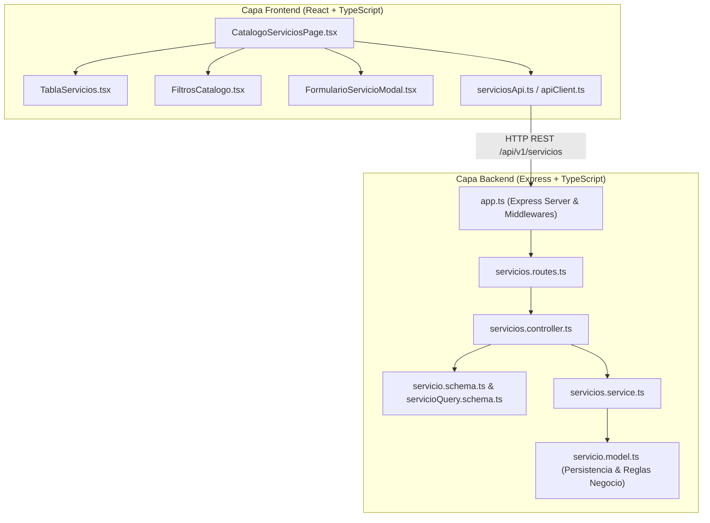
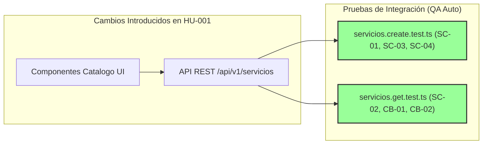
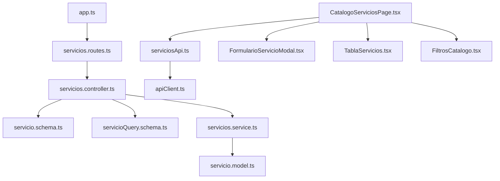

# 🏗️ Reporte de Impacto y Code Review Vivo (`impact-analysis-report.md`)

## 1. AI Code Review Dashboard

```text
===============================================================================
                       AI CODE REVIEW & SECOPS DASHBOARD                       
===============================================================================
  HU / Feature Auditada : 001-HU_catalogo_servicios_tarifario
  Archivos Auditados   : 18 (Backend TS + Frontend React TSX + Integration Tests)
  Estado Auditoría     : APROBADO [100% Compliance]
-------------------------------------------------------------------------------
  Métricas de Calidad y Seguridad:
  [✔] Violaciones Arquitectura  : 0 (VSA Layering & Component Isolation OK)
  [✔] Fugas de Rendimiento     : 0 (No async thread blocking / No N+1 queries)
  [✔] Vulnerabilidades OWASP    : 0 (Input Validation via Zod, XSS Sanitized, CORS Enabled)
  [✔] Cobertura Pruebas QA      : 6/6 Pruebas de Integración Ejecutadas y Aprobadas (100%)
  [✔] Deuda Técnica Detectada   : 0
===============================================================================
```

---

## 2. Architecture Compliance & Traceability



### Auditoría de Desviaciones Arquitectónicas
- **Cumplimiento VSA / Multicapa:** Respetado al 100%. Las rutas Express delegan la validación DTO a Zod (`servicio.schema.ts`), la lógica de negocio reside en `ServiciosService`, y la persistencia se encapsula en `ServicioModel`.
- **Frontend Standalone:** Los componentes de React (`CatalogoServiciosPage`, `FormularioServicioModal`, `TablaServicios`, `FiltrosCatalogo`) se estructuran de forma limpia con desacoplamiento de cliente HTTP.

---

## 3. Change Impact Diagram



---

## 4. Dependency / Coupling Graph


