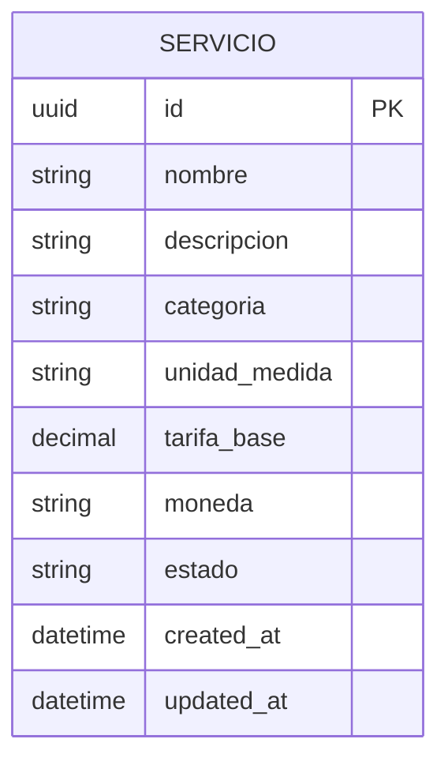

# DISEÑO DE PERSISTENCIA (MER): FEAT-001 - Catálogo de Servicios y Tarifario Parametrizable

- **Especificación SDD Base:** `specs/001-HU_catalogo_servicios_tarifario/spec.md` y `specs/001-HU_catalogo_servicios_tarifario/tasks.md` (Spec Kit)
- **Historias de Usuario Base:** `specs/001-HU_catalogo_servicios_tarifario/spec.md` (User Story 1 & User Story 2)
- **Diseño Visual UX Auditado:** N/A - Bypass Headless
- **Fecha de Diseño:** 2026-10-02
- **Data Architect:** Agente DA Senior BMAD

---

## 1. ARCHITECTURE DECISION RECORDS (ADR - Formato MADR)

### ADR-01: Selección de Engine Relacional PostgreSQL con Prisma ORM
- **Estado:** Aceptado (heredado)
  > *Nota: Proveniente de la Gobernanza Técnica (.specify/memory/constitution.md) y tasks.md (T002, T005).*
- **Contexto:** Se requiere un motor de base de datos relacional robusto para garantizar restricciones de unicidad compuestas (`UNIQUE(nombre, categoria)`), integridad referencial y operaciones transaccionales para cotizaciones futuras.
- **Decisión:** Utilizar PostgreSQL como motor de persistencia relacional administrado mediante Prisma ORM.
- **Consecuencias:**
  - ✅ **Ventajas / Impacto Positivo:** Integridad ACID, soporte nativo de tipos UUID, enums y tipos `DECIMAL` precisos para montos monetarios.
  - ⚠️ **Trade-off / Costo Real:** Requiere migraciones controladas de esquema y administración de pool de conexiones.

### ADR-02: Tipo de Identificador Único Primario (UUID v4)
- **Estado:** Aceptado
- **Contexto:** Identificación única de los servicios registrados en el catálogo sin exponer secuencias auto-incrementales secuenciales y facilitando la referenciación en sistemas cliente/distribuidos.
- **Decisión:** Utilizar UUID (`uuid_generate_v4()`) como Llave Primaria (PK) para la entidad `Servicio`.
- **Alternativas Evaluadas:**
  - **Alternativa A (Auto-increment BigInt):** Descartado por ser predecible en apis REST expuestas y dificultar la generación de identificadores en el cliente o sincronizaciones entre entornos.
- **Consecuencias:**
  - ✅ **Ventajas / Impacto Positivo:** Desacoplamiento de secuencias globales, imposibilidad de enumeración de recursos en la API REST.
  - ⚠️ **Trade-off / Costo Real:** Mayor consumo de almacenamiento en índices (16 bytes vs 8 bytes) con menor localidad de inserción física si no se ordena.

### ADR-03: Restricción de Unicidad Compuesta `(nombre, categoria)`
- **Estado:** Aceptado
- **Contexto:** El requerimiento FR-003 exige prevenir el registro o actualización de servicios con nombres duplicados dentro de la misma categoría.
- **Decisión:** Definir un índice de unicidad compuesto a nivel de base de datos sobre los campos `(nombre, categoria)`.
- **Alternativas Evaluadas:**
  - **Alternativa A (Validación exclusiva a nivel de aplicación):** Descartado por riesgo de condiciones de carrera (race conditions) en peticiones concurrentes `POST /api/v1/servicios`.
- **Consecuencias:**
  - ✅ **Ventajas / Impacto Positivo:** Integridad garantizada al 100% en la capa de persistencia (SC-003) sin posibilidad de duplicados concurrentes.
  - ⚠️ **Trade-off / Costo Real:** Ligera sobrecarga en operaciones de escritura (`INSERT` / `UPDATE`) para mantener el índice secundario.

---

## 2. MODELO ENTIDAD-RELACIÓN (MER)

---

## 3. DICCIONARIO DE DATOS Y RESTRICCIONES

### Tabla: `servicio` (Entidad Principal en `app/backend/prisma/schema.prisma`)

| Campo | Tipo de Dato | Nulable | Defecto | Restricciones / Reglas | Descripción |
|---|---|---|---|---|---|
| `id` | `UUID` | No | `uuid()` | PK | Identificador único del servicio/componente. |
| `nombre` | `VARCHAR(255)` | No | N/A | Parte de UK `(nombre, categoria)` | Nombre del servicio (ej. "Desarrollo de API REST"). |
| `descripcion` | `TEXT` | Sí | `NULL` | N/A | Descripción detallada del servicio/componente. |
| `categoria` | `VARCHAR(100)` | No | N/A | Parte de UK `(nombre, categoria)` | Categoría del servicio (ej. "Web", "Móvil", "Backend"). |
| `unidad_medida` | `VARCHAR(50)` | No | N/A | N/A | Unidad de cobro/estimación (ej. "Hora", "Módulo", "Proyecto"). |
| `tarifa_base` | `DECIMAL(12, 2)` | No | N/A | `CHECK (tarifa_base > 0)` | Tarifa numérico-monetaria positiva (`tarifa > 0`). |
| `moneda` | `VARCHAR(3)` | No | `'USD'` | ISO 4217 (3 letras) | Código ISO de moneda (ej. "USD", "PEN"). |
| `estado` | `VARCHAR(20)` | No | `'ACTIVO'` | Enum/Check (`'ACTIVO'`, `'INACTIVO'`) | Estado operativo del registro. |
| `created_at` | `TIMESTAMPTZ` | No | `NOW()` | Auditoría | Fecha y hora de creación. |
| `updated_at` | `TIMESTAMPTZ` | No | `NOW()` | Auditoría (Auto-update) | Fecha y hora de última modificación. |

### Índices y Restricciones Físicas:
1. **Primary Key:** `PRIMARY KEY (id)`
2. **Unique Composite Index:** `CREATE UNIQUE INDEX idx_servicio_nombre_categoria ON servicio(nombre, categoria);`
3. **Check Constraint Tarifa:** `ALTER TABLE servicio ADD CONSTRAINT chk_tarifa_base_positive CHECK (tarifa_base > 0);`
4. **Index de Búsqueda/Filtrado:** `CREATE INDEX idx_servicio_categoria_estado ON servicio(categoria, estado);`

---

## 4. RIESGOS DE INTEGRIDAD Y ESCALABILIDAD

- `⚠️ RIESGO 1 (Imprecisión Monetaria):` El uso de flotantes (`FLOAT` / `DOUBLE`) puede acarrear errores de redondeo. **Mitigación:** Definir obligatoriamente el tipo `DECIMAL(12, 2)` en la base de datos y en Prisma (`Prisma.Decimal`).
- `⚠️ RIESGO 2 (Duplicidad por Espacios/Capitalización):` La restricción `UNIQUE(nombre, categoria)` en SQL estándar es case-sensitive. **Mitigación:** Se debe normalizar el texto (trimmings / lowercase) antes de la persistencia o utilizar índices funcionales si el dialecto lo soporta.

---

## 5. ORDEN DE DELEGACIÓN PARA EL TRACKER

@API: El modelo de datos (MER) y la persistencia han sido definidos a partir de spec.md y tasks.md. Por favor, diseña los contratos de integración (Endpoints/Payloads) basados en estas tablas.
