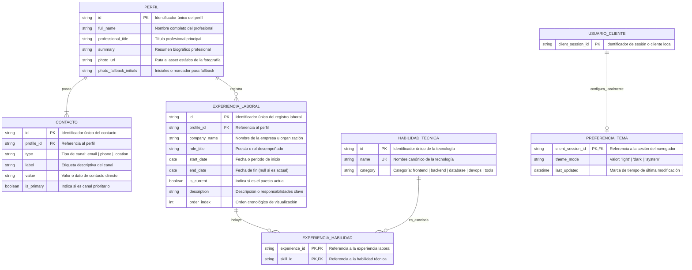

# DISEÑO DE PERSISTENCIA (MER): PERFIL PROFESIONAL DIGITAL

- **Historias de Usuario Base:** hu_01_presentacion_contacto.md, hu_02_trayectoria_profesional.md, hu_03_alternancia_tema.md
- **Fecha de Diseño:** 23-09-2026
- **Data Architect:** Agente DA Senior BMAD

---

## 1. ARCHITECTURE DECISION RECORDS (ADR)

### ADR-01: Almacenamiento Estático en Archivos JSON Tipados vs. Motor de Base de Datos Relacional (SQL)
- **Contexto:** El sistema es una aplicación web Jamstack/SSG (Next.js App Router) orientada a la lectura pública y exhibición estática de un perfil profesional sin autenticación de usuarios, CMS en línea ni concurrencia de escrituras en el backend.
- **Alternativas Evaluadas (Descartadas):**
  - *PostgreSQL / MySQL / SQLite:* Descartados debido a sobrecarga de infraestructura, latencia adicional innecesaria en la carga inicial y costos operativos contrarios a la directriz de Free Tier en Vercel.
  - *Headless CMS externo (Contentful / Strapi):* Descartado por violar el principio de auto-contención y requerir dependencias externas de red en runtime.
- **Decisión:** Implementar un almacenamiento estructurado basado en archivos locales JSON (`src/data/profile.json`) con contratos de tipos estrictos en TypeScript (`src/types/`).
- **Consecuencias:** Máxima velocidad de carga en Edge (renderizado estático pre-compilado en build time), coste cero de infraestructura de base de datos, alta mantenibilidad y consistencia garantizada por el compilador de TypeScript.

### ADR-02: Estructura Lógica Normalizada vs. Objeto Plano Desnormalizado
- **Contexto:** Aunque el almacenamiento físico reside en JSON, la información posee relaciones uno a muchos (un perfil tiene múltiples canales de contacto, múltiples experiencias laborales y cada experiencia referencia múltiples tecnologías).
- **Alternativas Evaluadas (Descartadas):**
  - *Documento desestructurado / Texto plano:* Descartado por dificultad para aplicar validaciones de tipos, testing unitario y renderizado modular por componentes.
- **Decisión:** Diseñar un modelo lógico formalmente normalizado (3FN) que se proyecta en el archivo JSON mediante entidades claramente delimitadas (`profile`, `contacts`, `experiences`, `skills`).
- **Consecuencias:** Permite desacoplamiento limpio entre componentes (`ProfileHeader`, `ContactCard`, `ExperienceTimeline`), facilitando testing unitario y futura extensibilidad o migración sin fricciones a una base de datos relacional si el proyecto evoluciona.

### ADR-03: Persistencia de Preferencias de Tema en Almacenamiento de Cliente (`localStorage`)
- **Contexto:** La HU-03 y el `tech_guidelines.md` requieren alternancia fluida entre modo claro y oscuro con retención de la preferencia seleccionada por el usuario evaluador.
- **Alternativas Evaluadas (Descartadas):**
  - *Cookies del lado del servidor:* Descartadas para evitar transformaciones dinámicas innecesarias en SSR que degraden la naturaleza SSG pura de la aplicación.
  - *Estado volátil en memoria (React State puro):* Descartado porque perdería la selección del usuario al refrescar la página.
- **Decisión:** Almacenar la clave `theme_preference` en `localStorage` del cliente con fallback inicial a la media query del sistema operativo (`prefers-color-scheme`).
- **Consecuencias:** Persistencia inmediata sin impacto en el servidor, compatibilidad universal con navegadores modernos y prevención de parpadeos de carga (FOUC) mediante script inline de inicialización.

---

## 2. MODELO ENTIDAD-RELACIÓN (MER)

---

## 3. DICCIONARIO DE DATOS Y RESTRICCIONES

### 3.1. Entidad: `PERFIL`
*(Almacenada en nodo raíz `profile` dentro de `src/data/profile.json`)*

| Campo | Tipo de Dato | Restricción / Modificador | Descripción | Regla de Validación / Formato |
|---|---|---|---|---|
| `id` | `VARCHAR(36)` / `string` | PK, NOT NULL, UK | Identificador único del perfil | Formato UUIDv4 o slug semántico (`"profile-main"`) |
| `full_name` | `VARCHAR(120)` / `string` | NOT NULL | Nombre completo del profesional | Longitud entre 3 y 120 caracteres |
| `professional_title` | `VARCHAR(150)` / `string` | NOT NULL | Cargo o titular profesional | Longitud entre 3 y 150 caracteres |
| `summary` | `TEXT` / `string` | NOT NULL | Resumen ejecutivo del perfil | Longitud máxima 500 caracteres |
| `photo_url` | `VARCHAR(255)` / `string` | NOT NULL | Ruta al recurso estático de la imagen | Ruta relativa válida (`/images/profile.webp`) |
| `photo_fallback_initials` | `VARCHAR(5)` / `string` | NOT NULL | Respaldo gráfico si falla la imagen (CA-02 de HU-01) | Iniciales en mayúsculas (ej. `"PR"`) |

### 3.2. Entidad: `CONTACTO`
*(Almacenada en arreglo `contacts` dentro de `src/data/profile.json`)*

| Campo | Tipo de Dato | Restricción / Modificador | Descripción | Regla de Validación / Formato |
|---|---|---|---|---|
| `id` | `VARCHAR(36)` / `string` | PK, NOT NULL, UK | Identificador único del canal de contacto | UUIDv4 o slug (`"contact-email"`) |
| `profile_id` | `VARCHAR(36)` / `string` | FK, NOT NULL | Relación con `PERFIL(id)` | Debe existir en `PERFIL` |
| `type` | `ENUM` / `string` | NOT NULL | Tipo de medio de contacto | Valores permitidos: `'email'`, `'phone'`, `'location'` |
| `label` | `VARCHAR(50)` / `string` | NOT NULL | Nombre legible del medio | Ej: `"Correo Electrónico"`, `"Teléfono"`, `"Ubicación"` |
| `value` | `VARCHAR(255)` / `string` | NOT NULL | Valor del dato de contacto | Email válido, teléfono E.164 o ciudad/país |
| `is_primary` | `BOOLEAN` | NOT NULL, DEFAULT `true` | Canal principal destacado | Booleano |

### 3.3. Entidad: `EXPERIENCIA_LABORAL`
*(Almacenada en arreglo `experiences` dentro de `src/data/profile.json`)*

| Campo | Tipo de Dato | Restricción / Modificador | Descripción | Regla de Validación / Formato |
|---|---|---|---|---|
| `id` | `VARCHAR(36)` / `string` | PK, NOT NULL, UK | Identificador único de la experiencia | UUIDv4 o slug (`"exp-01"`) |
| `profile_id` | `VARCHAR(36)` / `string` | FK, NOT NULL | Relación con `PERFIL(id)` | Debe existir en `PERFIL` |
| `company_name` | `VARCHAR(100)` / `string` | NOT NULL | Nombre de la compañía u organización | Longitud entre 2 y 100 caracteres |
| `role_title` | `VARCHAR(100)` / `string` | NOT NULL | Título del puesto desempeñado | Longitud entre 2 y 100 caracteres |
| `start_date` | `VARCHAR(10)` / `string` | NOT NULL | Fecha de inicio | Formato ISO `YYYY-MM` o `YYYY` |
| `end_date` | `VARCHAR(10)` / `string` | NULLABLE | Fecha de fin | Formato ISO `YYYY-MM` o `null` si `is_current=true` |
| `is_current` | `BOOLEAN` | NOT NULL, DEFAULT `false` | Indica si es el puesto actual | Booleano |
| `description` | `TEXT` / `string` | NOT NULL | Descripción de responsabilidades y logros | Longitud entre 10 y 500 caracteres |
| `order_index` | `INT` / `number` | NOT NULL, UK (`profile_id`, `order_index`) | Orden cronológico descendente | Entero positivo `>= 1` |

### 3.4. Entidad: `HABILIDAD_TECNICA`
*(Almacenada en catálogo `skills` dentro de `src/data/profile.json`)*

| Campo | Tipo de Dato | Restricción / Modificador | Descripción | Regla de Validación / Formato |
|---|---|---|---|---|
| `id` | `VARCHAR(36)` / `string` | PK, NOT NULL, UK | Identificador de la tecnología | UUIDv4 o slug (`"skill-react"`) |
| `name` | `VARCHAR(50)` / `string` | NOT NULL, UK | Nombre canónico de la tecnología | Ej: `"Next.js"`, `"TypeScript"`, `"Tailwind CSS"` |
| `category` | `ENUM` / `string` | NOT NULL | Categorización funcional | Valores: `'frontend'`, `'backend'`, `'database'`, `'devops'`, `'tools'` |

### 3.5. Entidad: `EXPERIENCIA_HABILIDAD`
*(Mapeada como arreglo de IDs de tecnologías `skill_ids: string[]` dentro de cada elemento de `experiences`)*

| Campo | Tipo de Dato | Restricción / Modificador | Descripción | Regla de Validación / Formato |
|---|---|---|---|---|
| `experience_id` | `VARCHAR(36)` / `string` | PK, FK, NOT NULL | Relación con `EXPERIENCIA_LABORAL(id)` | Debe existir en `EXPERIENCIA_LABORAL` |
| `skill_id` | `VARCHAR(36)` / `string` | PK, FK, NOT NULL | Relación con `HABILIDAD_TECNICA(id)` | Debe existir en `HABILIDAD_TECNICA` |

### 3.6. Entidad de Cliente: `PREFERENCIA_TEMA`
*(Persistida en `localStorage` del navegador del evaluador)*

| Clave | Tipo | Valores Permitidos | Valor por Defecto | Descripción |
|---|---|---|---|---|
| `theme_preference` | `string` | `'light'`, `'dark'`, `'system'` | `'system'` | Preferencia activa del modo visual del usuario |
| `theme_last_updated` | `string (ISO Date)` | Formato ISO 8601 | Timestamp de almacenamiento | Fecha y hora de la última modificación en cliente |

---

## 4. RIESGOS DE INTEGRIDAD Y ESCALABILIDAD

- `⚠️ RIESGO 1: Desalineación entre Esquema JSON y Tipos de TypeScript:` Al no existir un motor SQL con enforcement de constraints en tiempo de ejecución, una propiedad faltante o mal escrita en `src/data/profile.json` podría causar errores de renderizado.  
  *Mitigación:* Definición de esquema de validación en tiempo de compilación mediante interfaces TypeScript estrictas y tests unitarios en Vitest que validen la integridad de los datos cargados.
- `⚠️ RIESGO 2: Ruptura de Integridad Referencial en Relaciones Skill-Experiencia:` Modificar el `id` o `name` de una tecnología sin actualizar los arreglos de experiencias podría dejar referencias huérfanas.  
  *Mitigación:* Validación automatizada en pruebas unitarias para asegurar que todo `skill_id` asignado a una experiencia exista en el catálogo maestro de habilidades.
- `⚠️ RIESGO 3: Desincronización de Estado y Parpadeo de Tema (FOUC):` Si el script de lectura de `localStorage` se ejecuta de forma tardía tras la hidratación de React, puede ocurrir un destello de color blanco en entornos configurados en modo oscuro.  
  *Mitigación:* Inyección de script síncrono bloqueante en el `<head>` del layout raíz (`src/app/layout.tsx`) que lea `localStorage` y aplique la clase `dark` al elemento `<html>` antes del primer pintado.

---

## 5. ORDEN DE DELEGACIÓN PARA EL TRACKER

@QT: El modelo de datos, persistencia en archivos JSON tipados y reglas de estado local han sido formalmente definidos. Al tratarse de una arquitectura Jamstack/SSG sin endpoints de API externos, procede directamente con la auditoría y compilación del Tech Design Document (TDD).
