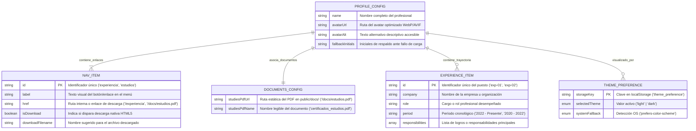

# DISEÑO DE PERSISTENCIA (MER): Módulo de Experiencia Profesional y Trayectoria Laboral

- **Historias de Usuario Base:** `hu_01_visualizacion_experiencia_laboral.md`, `hu_02_navegacion_retorno_coherencia.md`
- **Diseño Visual UX Auditado:** `ux_01_visualizacion_experiencia_laboral.md`, `ux_02_navegacion_retorno_coherencia.md`
- **Fecha de Diseño:** 25-09-2026
- **Data Architect:** Agente DA Senior BMAD
- **Modo de Operación:** Brownfield (Subordinado estrictamente a `files/context/constitution.md`)

---

## 1. ARCHITECTURE DECISION RECORDS (ADR - Formato MADR)

### ADR-01: Esquema de Datos Estático Tipado con Validación Zod en Build-Time
- **Estado:** Aceptado (heredado)
- **Contexto:** Decisión consolidada en `constitution.md` y `tech_guidelines.md` (ADR-003 / ADR-005). El sistema opera bajo arquitectura Jamstack/SSG pura sin bases de datos SQL/NoSQL en servidor. Toda la persistencia de datos reside en `src/config/profile.config.json` y se audita con contratos TypeScript/Zod (`src/config/profile.schema.ts`).
- **Decisión:** Mantener la persistencia estática mediante `profile.config.json` validado en tiempo de compilación con `ProfileConfigSchema` de Zod.
- **Consecuencias:**
  - ✅ **Ventajas / Impacto Positivo:** Costo de infraestructura $0, latencia de red cero, seguridad absoluta contra inyecciones y validación estricta de tipos previa a cada despliegue.
  - ⚠️ **Trade-off / Costo Real:** Cualquier cambio de datos requiere un commit y re-ejecución del pipeline de build SSG.

### ADR-02: Persistencia Cliente de Preferencia de Tema Visual con Fallback Resiliente
- **Estado:** Aceptado (heredado)
- **Contexto:** Decisión heredada de `constitution.md` (ADR-002 / ADR-006). La preferencia de tema (Light/Dark Mode) se persiste en el cliente a través de `localStorage` bajo la clave `theme_preference`, consumida por un script bloqueante inline en `<head>` para garantizar cero FOUT/FOUC en transiciones multirruta (`/` <-> `/experiencia`).
- **Decisión:** Conservar la clave `theme_preference` en `localStorage` con fallback a `prefers-color-scheme` y degradación segura a memoria volátil en entornos restrictivos.
- **Consecuencias:**
  - ✅ **Ventajas / Impacto Positivo:** Transiciones instantáneas sin parpadeo visual entre la tarjeta principal y la vista de trayectoria laboral.
  - ⚠️ **Trade-off / Costo Real:** El almacenamiento de tema es local al navegador del usuario.

### ADR-03: Extensión del Modelo de Datos para Menú de Navegación y Documentos Descargables
- **Estado:** Aceptado (heredado)
- **Contexto:** Decisión consolidada en `constitution.md` (ADR-007 / ADR-008). Estructuración de colecciones tipadas para items de navegación (`navItems`) y metadata documental (`documents`).
- **Decisión:** Mantener las entidades `NAV_ITEM` y `DOCUMENTS_CONFIG` centralizadas en `profile.config.json`.
- **Consecuencias:**
  - ✅ **Ventajas / Impacto Positivo:** Centralización de rutas internas y descarga de PDF (`/docs/estudios.pdf`).
  - ⚠️ **Trade-off / Costo Real:** Requiere mantener sincronizados los enlaces y nombres de archivos de descarga.

### ADR-04: Extensión del Esquema Tipado para la Colección de Experiencia Laboral (`experience`) y Soporte de Empty State
- **Estado:** Aceptado
- **Contexto:** La Historia de Usuario HU-01 y las especificaciones UX (`ux_01_visualizacion_experiencia_laboral.md`) exigen estructurar la trayectoria profesional del titular (empresa, cargo/rol, período cronológico y lista de responsabilidades) dentro de la fuente de verdad centralizada, soportando además un estado vacío defensivo (Sad Path CA-03) si no existen registros.
- **Decisión:** Extender la entidad raíz `PROFILE_CONFIG` incorporando la colección tipada `experience: Array<EXPERIENCE_ITEM>` (pre-ordenada en cronología inversa en build-time con valor por defecto `default([])` en el esquema Zod), asegurando compatibilidad hacia atrás y tipado exhaustivo.
- **Alternativas Evaluadas (Obligatorio en decisiones nuevas):**
  - **Alternativa A: Crear un archivo de configuración separado (`experience.config.json`):** Fragmenta la fuente de verdad del proyecto, obligando a los componentes a importar múltiples fuentes de datos estáticas e incrementando la fricción de mantenimiento.
  - **Alternativa B: Hardcodear la lista de puestos directamente en el componente `ExperienceList.astro`:** Viola el principio de desacoplamiento entre datos y presentación, impidiendo la validación tipada con Zod y complicando futuras actualizaciones de contenido.
- **Consecuencias:**
  - ✅ **Ventajas / Impacto Positivo:** Fuente de verdad única consolidada en `profile.config.json`, validación estructural estricta con Zod en build-time, soporte nativo para Empty State y cero impacto en rendimiento (0 KB de JavaScript adicional).
  - ⚠️ **Trade-off / Costo Real:** Aumento moderado del tamaño del archivo `profile.config.json` en el repositorio.

---

## 2. MODELO ENTIDAD-RELACIÓN (MER)



---

## 3. DICCIONARIO DE DATOS Y RESTRICCIONES EXTENDIDO

### 3.1. Entidad Principal: `PROFILE_CONFIG` (Fuente de Verdad Centralizada)
- **Ubicación:** `src/config/profile.config.json`
- **Validador de Esquema:** `src/config/profile.schema.ts`

| Atributo | Tipo de Dato | Requerido | Restricciones / Validación | Descripción |
|---|---|---|---|---|
| `name` | `VARCHAR(150)` / `string` | Sí (Heredado) | `min: 2, max: 150`, no vacío | Nombre y apellidos del titular para la cabecera H1. |
| `avatarUrl` | `VARCHAR(255)` / `string` | Sí (Heredado) | Ruta relativa válida (`/src/assets/images/*` o `/assets/*`) | Asset fotográfico optimizado (WebP / AVIF). |
| `avatarAlt` | `VARCHAR(200)` / `string` | Sí (Heredado) | `min: 5, max: 200`, descriptivo a11y | Atributo `alt` para accesibilidad. |
| `fallbackInitials` | `VARCHAR(4)` / `string` | Sí (Heredado) | `length: 1-4`, alfabético mayúsculas | Iniciales para el SVG fallback (Sad Path). |
| `navItems` | `Array<NAV_ITEM>` | Sí (Heredado) | Mínimo 1 elemento, IDs únicos | Colección de opciones del menú de navegación. |
| `documents` | `DOCUMENTS_CONFIG` | Sí (Heredado) | Objeto con URLs de documentos válidos | Metadata de assets documentales estáticos. |
| `experience` | `Array<EXPERIENCE_ITEM>` | Sí (Nuevo / Extendido) | `default([])`, orden cronológico inverso | Colección de puestos y antecedentes laborales. |

---

### 3.2. Sub-Entidad: `EXPERIENCE_ITEM` (Puestos de Trabajo / Trayectoria)
- **Contexto:** Estructura de datos consumida por `ExperienceList.astro` en `/experiencia`.

| Atributo | Tipo de Dato | Requerido | Restricciones / Validación | Descripción |
|---|---|---|---|---|
| `id` | `VARCHAR(50)` / `string` | Sí | `min: 1, max: 50`, alfanumérico / `kebab-case` único | Identificador único del registro de experiencia. |
| `company` | `VARCHAR(100)` / `string` | Sí | `min: 1, max: 100`, no vacío | Nombre de la empresa, institución u organización. |
| `role` | `VARCHAR(100)` / `string` | Sí | `min: 1, max: 100`, no vacío | Título del cargo o puesto profesional desempeñado. |
| `period` | `VARCHAR(50)` / `string` | Sí | `min: 1, max: 50`, ej. `'2022 - Presente'` | Rango temporal del cargo para visualización en badge. |
| `responsibilities` | `Array<string>` | Sí | Mínimo 1 elemento, cada string `min: 1` | Lista de logros, responsabilidades o funciones clave. |

---

### 3.3. Sub-Entidades Heredadas: `NAV_ITEM` y `DOCUMENTS_CONFIG`

| Entidad | Atributo | Tipo | Requerido | Restricciones / Descripción |
|---|---|---|---|---|
| `NAV_ITEM` | `id` | `string` | Sí | Identificador semántico (`'experiencia'`, `'estudios'`). |
| `NAV_ITEM` | `label` | `string` | Sí | Texto visual del enlace en la barra de navegación. |
| `NAV_ITEM` | `href` | `string` | Sí | Ruta destino (`/experiencia`, `/docs/estudios.pdf`). |
| `NAV_ITEM` | `isDownload` | `boolean` | No | Flag para descarga directa HTML5 (Default: `false`). |
| `NAV_ITEM` | `downloadFilename` | `string` | No | Nombre de archivo sugerido al descargar. |
| `DOCUMENTS_CONFIG` | `studiesPdfUrl` | `string` | Sí | Ruta pública del PDF en `public/docs/`. |
| `DOCUMENTS_CONFIG` | `studiesPdfName` | `string` | Sí | Nombre canónico de distribución del archivo PDF. |

---

### 3.4. Entidad Cliente: `THEME_PREFERENCE` (Persistencia en Navegador)
- **Ubicación:** `localStorage` (Browser Runtime)

| Atributo | Tipo de Dato | Requerido | Restricciones / Valores Permitidos | Descripción |
|---|---|---|---|---|
| `theme_preference` | `ENUM` / `string` | No (Opcional) | `'light'` \| `'dark'` | Preferencia guardada en el cliente. |
| `systemFallback` | `ENUM` / `string` | Sí (Runtime) | `'light'` \| `'dark'` | Detección síncrona vía `prefers-color-scheme`. |

---

### 3.5. Ejemplo Completo de Instancia JSON (`src/config/profile.config.json`)

```json
{
  "name": "Alex Morgan",
  "avatarUrl": "/assets/images/profile-avatar.webp",
  "avatarAlt": "Fotografía de perfil profesional de Alex Morgan",
  "fallbackInitials": "AM",
  "navItems": [
    {
      "id": "experiencia",
      "label": "Experiencia",
      "href": "/experiencia",
      "isDownload": false
    },
    {
      "id": "estudios",
      "label": "Estudios ⤓",
      "href": "/docs/estudios.pdf",
      "isDownload": true,
      "downloadFilename": "certificados_estudios.pdf"
    }
  ],
  "documents": {
    "studiesPdfUrl": "/docs/estudios.pdf",
    "studiesPdfName": "certificados_estudios.pdf"
  },
  "experience": [
    {
      "id": "exp-01",
      "company": "Tech Corp Inc.",
      "role": "Senior Frontend & Architecture Specialist",
      "period": "2022 - Presente",
      "responsibilities": [
        "Liderazgo en diseño de interfaces SSG y accesibilidad WCAG AA.",
        "Optimización de Core Web Vitals alcanzando LCP < 1.0s."
      ]
    },
    {
      "id": "exp-02",
      "company": "Global Solutions Ltd.",
      "role": "Software Developer & UI Specialist",
      "period": "2020 - 2022",
      "responsibilities": [
        "Implementación de componentes de diseño y contratos Zod.",
        "Integración de sistemas de conmutación de temas (Dark/Light)."
      ]
    }
  ]
}
```

---

### 3.6. Contrato Tipado Consolidado con Validación Zod (`src/config/profile.schema.ts`)

```typescript
import { z } from 'zod';

export const ExperienceItemSchema = z.object({
  id: z.string().min(1).max(50),
  company: z.string().min(1).max(100),
  role: z.string().min(1).max(100),
  period: z.string().min(1).max(50),
  responsibilities: z.array(z.string().min(1)).min(1)
});

export const NavItemSchema = z.object({
  id: z.string().min(2).max(50),
  label: z.string().min(1).max(50),
  href: z.string().min(1).max(255),
  isDownload: z.boolean().optional().default(false),
  downloadFilename: z.string().optional()
});

export const DocumentsSchema = z.object({
  studiesPdfUrl: z.string().min(1).max(255),
  studiesPdfName: z.string().min(3).max(100)
});

export const ProfileConfigSchema = z.object({
  name: z.string().min(2).max(150),
  avatarUrl: z.string().min(1).max(255),
  avatarAlt: z.string().min(5).max(200),
  fallbackInitials: z.string().min(1).max(4).regex(/^[A-ZÁÉÍÓÚÑ]+$/),
  navItems: z.array(NavItemSchema).min(1),
  documents: DocumentsSchema,
  experience: z.array(ExperienceItemSchema).default([])
});

export type ExperienceItem = z.infer<typeof ExperienceItemSchema>;
export type NavItem = z.infer<typeof NavItemSchema>;
export type DocumentsConfig = z.infer<typeof DocumentsSchema>;
export type ProfileConfig = z.infer<typeof ProfileConfigSchema>;
```

---

## 4. AUDITORÍA DE TRAZABILIDAD UI -> DATA (Cruce con Wireframes UX)

| Elemento de Interfaz (UX) | Archivo UX Auditado | Campo en Diccionario de Datos | Estado de Trazabilidad |
|---|---|---|---|
| Nombre de Empresa / Organización | `ux_01_visualizacion_experiencia_laboral.md` (Estado 1, 2) | `experience[].company` (string) | ✅ Cubierto 100% |
| Cargo / Rol Desempeñado | `ux_01_visualizacion_experiencia_laboral.md` (Estado 1, 2) | `experience[].role` (string) | ✅ Cubierto 100% |
| Badge de Período Temporal | `ux_01_visualizacion_experiencia_laboral.md` (Estado 1, 2) | `experience[].period` (string) | ✅ Cubierto 100% |
| Viñetas de Responsabilidades / Logros | `ux_01_visualizacion_experiencia_laboral.md` (Estado 1, 2) | `experience[].responsibilities` (string[]) | ✅ Cubierto 100% |
| Fallback Visual Estado Vacío (Empty State) | `ux_01_visualizacion_experiencia_laboral.md` (Estado 3) | `experience.length === 0` (default `[]`) | ✅ Cubierto 100% |
| Control de Retorno `[← Volver al Perfil]` | `ux_02_navegacion_retorno_coherencia.md` (Estado 1) | Enlace estático nativo `href="/"` en Layout | ✅ Cubierto 100% |
| Persistencia de Tema en Transición Circular | `ux_02_navegacion_retorno_coherencia.md` (Estado 2) | `theme_preference` en `localStorage` (anti-FOUT) | ✅ Cubierto 100% |
| Estabilidad Multirruta ante Refresco (F5) | `ux_02_navegacion_retorno_coherencia.md` (Estado 3) | Renderizado SSG autónomo en `src/pages/experiencia.astro` | ✅ Cubierto 100% |

*Cero campos huérfanos. Todas las propiedades visuales de la vista de Experiencia y los flujos de navegación cuentan con su tipado correspondiente en el modelo de datos.*

---

## 5. RIESGOS DE INTEGRIDAD Y ESCALABILIDAD
- `⚠️ RIESGO:` **Desincronización cronológica de registros:** Si se introducen registros desordenados en `profile.config.json`, la trayectoria podría desplegarse de manera confusa.
  - *Mitigación:* Se establece en `tech_guidelines.md` que la extracción de datos en el frontmatter de Astro aplique ordenamiento consistente o mantenga el JSON pre-ordenado cronológicamente de forma inversa.
- `⚠️ RIESGO:` **Array de responsabilidades vacío en un puesto:** Un puesto de trabajo sin responsabilidades generaría un contenedor visual desbalanceado.
  - *Mitigación:* Validación mandatoria en Zod (`responsibilities: z.array(z.string().min(1)).min(1)`), impidiendo puestos sin descripción funcional.

---

## 6. ORDEN DE DELEGACIÓN PARA EL TRACKER

@QT: El modelo de datos estructurado para el módulo de Experiencia Profesional (MER, esquema Zod `ProfileConfigSchema` con `experience`, soporte de Empty State y auditoría de trazabilidad UI-Data Brownfield) ha sido consolidado y verificado. Procede directamente con la auditoría técnica y compilación del Tech Design Document (TDD).
