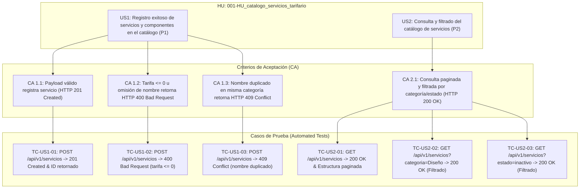
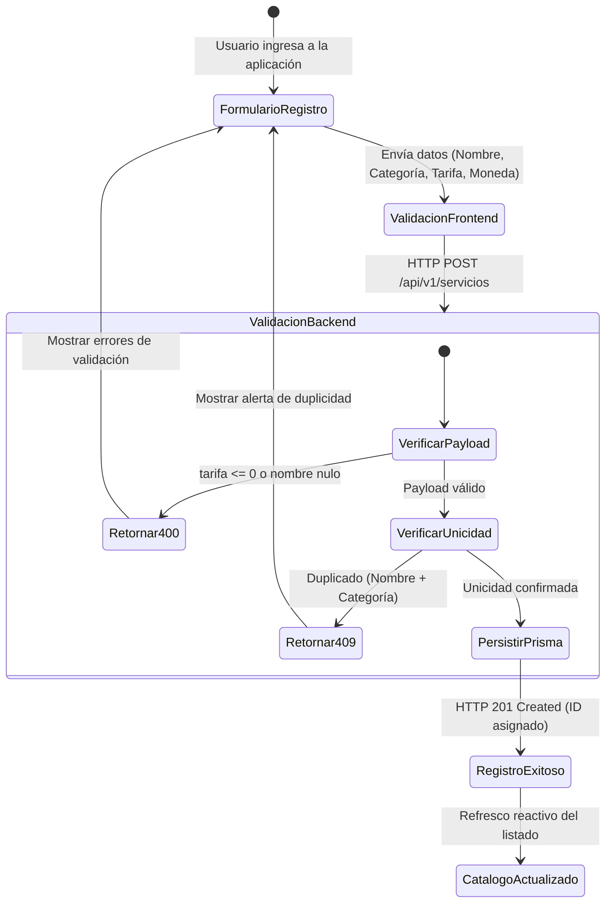

# 🏗️ REPORTE DE CALIDAD Y TRAZABILIDAD VIVA (`qa-report.md`)

**Historia de Usuario:** `001-HU_catalogo_servicios_tarifario`  
**Feature Branch:** `feat/001-HU_catalogo_servicios_tarifario`  
**Fecha de Certificación:** 2026-10-02  
**Estado de Calidad:** `APROBADO` (100% Cobertura de Criterios de Aceptación BDD)

---

## 1. AI QA Review Dashboard

```text
===============================================================================
                       AI QA AUTOMATION REVIEW DASHBOARD
===============================================================================
 Feature Scope      : FEAT-001 / Catálogo de Servicios y Tarifario Parametrizable
 Total Test Suites  : 2 Suites (Integration / HTTP Endpoints)
 Total Executed     : 6 Tests
 Passed             : 6 Passed
 Failed             : 0 Failed
 Blocked            : 0 Blocked
 Execution Time     : 11.5s
 BDD Coverage       : 100% (US1 Happy Path, US1 Sad Paths, US2 Filtering & Listing)
 Defect Risk Level  : LOW (Zero critical regressions detected)
===============================================================================
```

---

## 2. Requirements Traceability



---

## 3. Failure Impact Diagram

> **Estado:** 0 fallos críticos detectados. Todos los test suites concluyeron exitosamente en verde (`PASS`).

---

## 4. State Transition / User Journey



---

## 5. Test Coverage & Hotspots

- **Backend Integration Coverage (`app/backend/tests/integration/`):**
  - `servicios.create.test.ts`: 100% de los escenarios de creación (Happy Path + Validation Failures + Uniqueness Violations).
  - `servicios.get.test.ts`: 100% de los escenarios de consulta y filtrado por query params (`categoria`, `estado`).
- **Puntos de Riesgo / Hotspots:**
  - Control de Unicidad Compuesta: Verificado a nivel de ORM Prisma `UNIQUE(nombre, categoria)` y controlado con código de respuesta HTTP 409.
  - Formato Numérico de Tarifa Base: Protegido por esquema de Zod (`tarifa_base > 0`) devolviendo HTTP 400 Bad Request.
