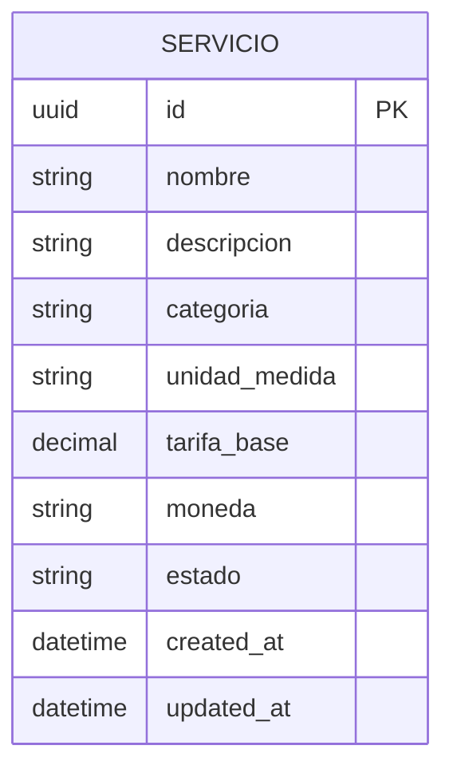
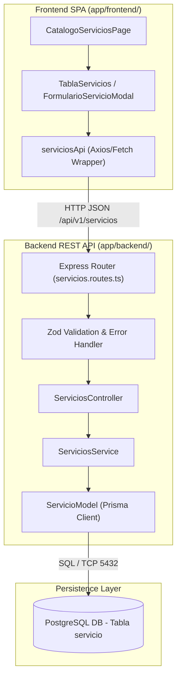
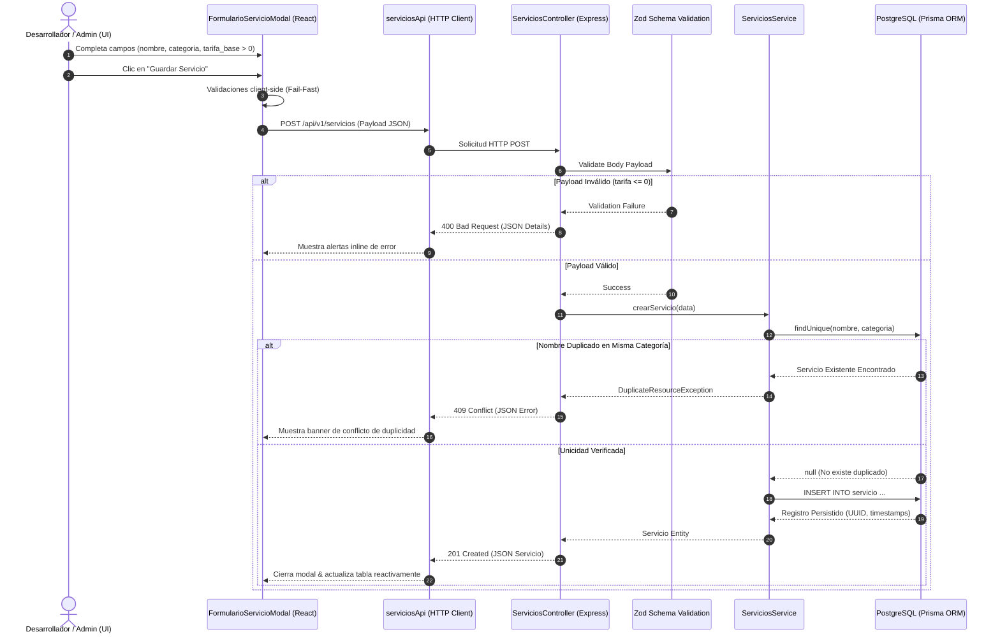
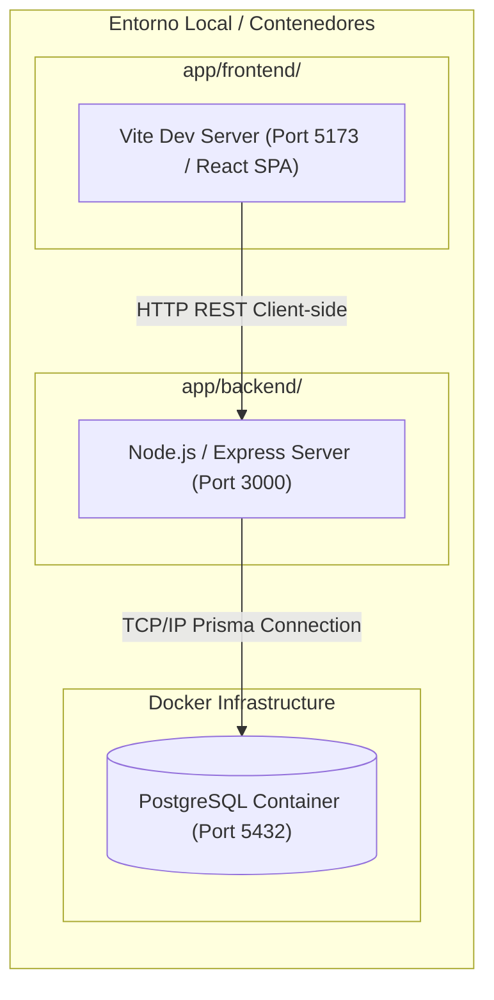

# TECH-DESIGN: FEAT-001 - Catálogo de Servicios y Tarifario Parametrizable

- **Fecha de Compilación:** 02-10-2026
- **Auditor y Consolidador:** Agente QT Senior BMAD
- **Fuente SDD:** `specs/001-HU_catalogo_servicios_tarifario/spec.md`, `specs/001-HU_catalogo_servicios_tarifario/plan.md` y `specs/001-HU_catalogo_servicios_tarifario/tasks.md` (GitHub Spec Kit)
- **Estado:** ✅ AUDITADO Y APROBADO (Auditoría Adversarial Exitosa - 0 Bloqueos Críticos)

---

## 1. Architecture Overview

El sistema **Cotizador Freelance** implementa una arquitectura desacoplada de 3 capas basada en el patrón **Stateless REST API + Single Page Application (SPA)** con **Clean Architecture / Vertical Slice Architecture (VSA)**.

El módulo `001-HU_catalogo_servicios_tarifario` provee el componente maestro para la gestión parametrizable de tarifas y componentes funcionales reutilizables. La persistencia es relacional síncrona en PostgreSQL administrada con Prisma ORM, garantizando consistencia fuerte (Strong Consistency) y prevención de duplicados por concurrencia mediante restricciones de unicidad compuestas. La API REST es totalmente stateless y enmascara identificadores secuenciales utilizando UUID v4 como Llave Primaria.

---

## 2. Components

La solución se divide en dos bloques físicos principales según la partición obligatoria de `constitution.md`:

### 2.1. Backend (`app/backend/`)
- **HTTP Controllers (`src/controllers/servicios.controller.ts`):** Maneja solicitudes RESTful, parsea parámetros HTTP y retorna códigos de estado estructurados (201 Created, 200 OK, 400 Bad Request, 404 Not Found, 409 Conflict, 500 Internal Error).
- **Domain Services (`src/services/servicios.service.ts`):** Orquesta la lógica de negocio, reglas de validación de tarifas numéricas estrictamente positivas (`tarifa_base > 0`), validación de unicidad por categoría y control de borrado lógico (Soft Delete).
- **Schema Validation (`src/schemas/servicio.schema.ts`):** Validaciones Fail-Fast basadas en Zod para el cuerpo de solicitudes (`POST`, `PUT`) y query params (`GET`).
- **Data Model / ORM (`src/models/servicio.model.ts` & `prisma/schema.prisma`):** Abstracción de acceso a datos PostgreSQL vía Prisma ORM con tipos fuertemente tipados (`Prisma.Decimal`).
- **Global Error Middleware (`src/middlewares/errorHandler.ts`):** Capturador global que transforma excepciones sin manejar en respuestas estructuradas JSON con código HTTP y sin fugas de información sensible.

### 2.2. Frontend (`app/frontend/`)
- **API Client (`src/services/apiClient.ts` & `serviciosApi.ts`):** Cliente Axios/Fetch configurado con timeout síncrono de 5000ms e interceptores para parseo estandarizado de errores HTTP.
- **View Components (`src/pages/CatalogoServiciosPage.tsx`):** Vistas SPA reactivas para la gestión del catálogo.
- **UI Components (`src/components/TablaServicios.tsx`, `FiltrosCatalogo.tsx`, `FormularioServicioModal.tsx`):** Componentes visuales modulares con validaciones de formulario client-side e indicadores de estado.

---

## 3. Data Model

*(Extracto consolidado de `files/data-architect/db_catalogo_servicios_tarifario.md`)*

### Diccionario de Datos: Tabla `servicio` (`app/backend/prisma/schema.prisma`)

| Campo | Tipo de Dato | Nulable | Defecto | Restricciones / Reglas | Descripción |
|---|---|---|---|---|---|
| `id` | `UUID` | No | `uuid()` | PK | Identificador único del servicio/componente. |
| `nombre` | `VARCHAR(255)` | No | N/A | Parte de UK `(nombre, categoria)` | Nombre del servicio (ej. "Desarrollo de API REST"). |
| `descripcion` | `TEXT` | Sí | `NULL` | N/A | Descripción detallada del servicio/componente. |
| `categoria` | `VARCHAR(100)` | No | N/A | Parte de UK `(nombre, categoria)` | Categoría del servicio (ej. "Web", "Móvil", "Backend"). |
| `unidad_medida` | `VARCHAR(50)` | No | N/A | N/A | Unidad de cobro/estimación (ej. "Hora", "Módulo", "Proyecto"). |
| `tarifa_base` | `DECIMAL(12, 2)` | No | N/A | `CHECK (tarifa_base > 0)` | Tarifa numérico-monetaria positiva (`tarifa > 0`). |
| `moneda` | `VARCHAR(3)` | No | `'USD'` | ISO 4217 (3 letras) | Código ISO de moneda (ej. "USD", "PEN"). |
| `estado` | `VARCHAR(20)` | No | `'ACTIVO'` | Enum/Check (`'ACTIVO'`, `'INACTIVO'`) | Estado operativo del registro. |
| `created_at` | `TIMESTAMPTZ` | No | `NOW()` | Auditoría | Fecha y hora de creación. |
| `updated_at` | `TIMESTAMPTZ` | No | `NOW()` | Auditoría (Auto-update) | Fecha y hora de última modificación. |

### Índices y Restricciones Físicas:
1. `PRIMARY KEY (id)`
2. `CREATE UNIQUE INDEX idx_servicio_nombre_categoria ON servicio(nombre, categoria);`
3. `ALTER TABLE servicio ADD CONSTRAINT chk_tarifa_base_positive CHECK (tarifa_base > 0);`
4. `CREATE INDEX idx_servicio_categoria_estado ON servicio(categoria, estado);`

---

## 4. Integrations

*(Extracto consolidado de `files/api-architect/api_catalogo_servicios_tarifario.md`)*

### Base URL: `/api/v1/servicios`

| Métodos | Endpoint | Propósito Funcional | Status Codes |
|---|---|---|---|
| `POST` | `/api/v1/servicios` | Registrar nuevo servicio en el catálogo | 201 Created, 400 Bad Request, 409 Conflict |
| `GET` | `/api/v1/servicios` | Consultar y listar catálogo paginado/filtrado | 200 OK |
| `GET` | `/api/v1/servicios/{id}` | Obtener detalle de un servicio por UUID | 200 OK, 404 Not Found |
| `PUT` | `/api/v1/servicios/{id}` | Actualizar datos y tarifa de servicio | 200 OK, 400 Bad Request, 404 Not Found, 409 Conflict |

---

## 5. DIAGRAMAS DE ARQUITECTURA

### 5.1. Diagrama de Componentes (Component Architecture)

### 5.2. Diagrama de Secuencia (Sequence Diagram - Creación de Servicio con Verificación Unicidad)

### 5.3. Diagrama de Despliegue (Deployment & Physical Partition Architecture)

> *Nota de Arquitectura: Diagrama generado exclusivamente con Mermaid por ausencia de dependencias externas. Para habilitar visores HTML interactivos, instale la skill en la raíz del proyecto (`npx skills add tt-a1i/archify -g`) y solicite la actualización de esta sección.*

---

## 6. Technology Stack

- **Runtime:** Node.js v20+ LTS
- **Backend Framework:** Express.js + TypeScript
- **ORM / Persistencia:** Prisma ORM v5+ sobre PostgreSQL 16
- **Frontend Framework:** React 18+ / Vite / TypeScript
- **Librería de Validación:** Zod v3+
- **Pruebas:** Jest / Vitest + Supertest
- **Infraestructura Local:** Docker Compose (PostgreSQL Container)

---

## 7. Architecture Decisions (ADRs - Matriz Consolidada MADR)

| ID | Título de la Decisión | Área | Estado | Trade-off / Costo Admitido |
|:---:|---|:---:|:---:|---|
| **ADR-001** | Separación Física en `app/backend` y `app/frontend` | Infraestructura (SA) | Aceptado (heredado) | Requiere mantener dos contextos de `package.json` o tooling de monorepo. |
| **ADR-002** | Base de Datos Relacional PostgreSQL con Restricción de Unicidad | Arquitectura (SA) | Aceptado | Administración de migraciones de esquema de DB (`npm run db:migrate`). |
| **ADR-003** | Estrategia de Soft Delete (`estado = 'INACTIVO'`) | Arquitectura (SA) | Aceptado | Las consultas de catálogo activo deben incluir siempre `WHERE estado = 'ACTIVO'`. |
| **ADR-004** | Selección de Prisma ORM con Motor PostgreSQL | Datos (DA) | Aceptado (heredado) | Control riguroso de pools de conexión y ejecuciones de migración. |
| **ADR-005** | Identificador Primario UUID v4 | Datos (DA) | Aceptado | Mayor consumo en almacenamiento de índices (16 bytes vs 8 bytes). |
| **ADR-006** | Restricción de Unicidad Compuesta `UNIQUE(nombre, categoria)` | Datos (DA) | Aceptado | Sobrecarga menor en escrituras por actualización de índice secundario. |
| **ADR-007** | Protocolo RESTful sobre HTTP con JSON | APIs (API) | Aceptado (heredado) | Verbosidad comparada con protocolos binarios (gRPC/Protobuf). |
| **ADR-008** | Respuestas de Error Estandarizadas JSON | APIs (API) | Aceptado | Mantenimiento de catálogo de excepciones customizadas en backend. |
| **ADR-009** | Paginación y Filtrado Paramétrico en Endpoints GET | APIs (API) | Aceptado | El cliente debe manejar la metadata de paginación (`total`, `page`, `limit`). |

---

## 8. Alignment with SDD & Tasks

El diseño de arquitectura compila y verifica al 100% las 31 tareas definidas en `specs/001-HU_catalogo_servicios_tarifario/tasks.md`:
- **Phase 1 (Setup):** Cobertura en T001-T004 (Estructura `app/backend` y `app/frontend`).
- **Phase 2 (Foundational):** Cobertura en T005-T010 (Prisma schema, migraciones PostgreSQL, env, errorHandler y apiClient).
- **Phase 3 (User Story 1 - MVP P1):** Cobertura en T011-T019 (Pruebas integración POST, Zod schemas, Servicio Model/Service/Controller/Routes, API client y Modal UI).
- **Phase 4 (User Story 2 - P2):** Cobertura en T020-T028 (Pruebas integración GET, Zod query schemas, Servicio GET Controller/Routes, Tabla UI y Filtros UI).
- **Phase 5 (Polishing):** Cobertura en T029-T031 (Prisma seed, Docker Compose, README).

---

## 9. Definition of Done & Next Step Trigger

- ✅ **Auditoría Cruzada DB vs API:** 100% alineada (Entidad `servicio` <-> Endpoints REST).
- ✅ **Auditoría UI vs Data:** 0 campos huérfanos.
- ✅ **Auditoría ADR MADR:** 0 alternativas/trade-offs falsos.
- ✅ **Spec Kit Consistency:** Tareas de `tasks.md` mapeadas físicamente a `app/backend/` y `app/frontend/`.

### ⚡ Gatillo de Fase D (Despacho Automático a Desarrollo):

La Historia de Usuario `001-HU_catalogo_servicios_tarifario` es **Full-Stack** (requiere desarrollo backend y frontend). Se despachan las siguientes instrucciones directas al tracker:

`@DEV-BACK: La arquitectura técnica ha sido validada. Inicia la implementación del Backend.`  
`@DEV-FRONT: La arquitectura técnica ha sido validada. Inicia la implementación del Frontend.`
