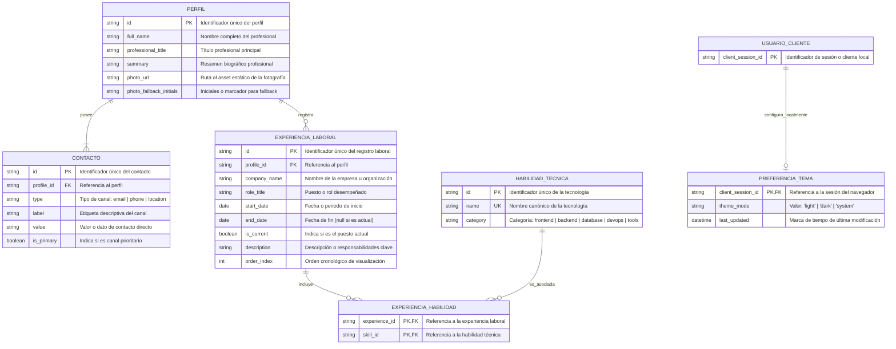
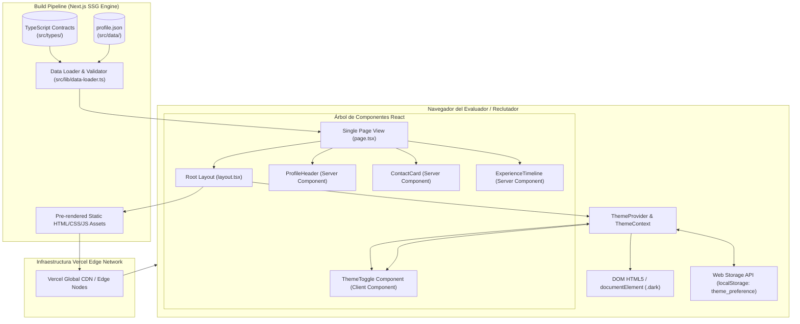
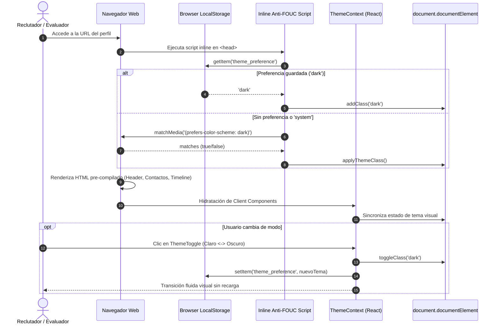

```mermaid
flowchart LR
    subgraph DeveloperWorkspace ["Entorno de Desarrollo"]
        Dev["Desarrollador / Agente"]
        RepoLocal["Repositorio Local Git"]
    end

    subgraph GitHubService ["GitHub Cloud"]
        MainBranch["Branch 'main'"]
        GHAction["GitHub Actions Workflow\n(lint + typecheck + vitest)"]
    end

    subgraph VercelCloud ["Vercel Infrastructure (Hobby Tier)"]
        BuildSystem["Vercel Build Environment\n(next build -> SSG export)"]
        EdgeNetwork["Global Edge CDN Network\n(SSL / HTTPS / HTTP2 / Brotli)"]
    end

    Dev -->|git commit & push| RepoLocal
    RepoLocal -->|Push| MainBranch
    MainBranch -->|Trigger| GHAction
    GHAction -->|Quality Gate Aprobado| BuildSystem
    BuildSystem -->|Deploy Static Bundle| EdgeNetwork
    EdgeNetwork -->|HTTPS Delivery| EndUser["Reclutador / Usuario Final"]
```

# TECH-DESIGN: PERFIL PROFESIONAL DIGITAL

- **Fecha de Compilación:** 23-09-2026
- **Auditor y Consolidador:** Agente QT Senior BMAD
- **Estado:** ✅ AUDITADO Y APROBADO

---

## 1. Architecture Overview

El sistema **Perfil Profesional Digital** es una aplicación web moderna, minimalista y de alto rendimiento concebida bajo el paradigma **Jamstack** y la estrategia de **Generación de Sitios Estáticos (SSG - Static Site Generation)** con **Next.js (App Router)**, **React** y **TypeScript**.

### Propósito Técnico y Solución
Elimina la dependencia de plataformas de terceros y servidores de backend dinámicos, ofreciendo una vista única (`Single-Page View`) optimizada para reclutadores técnicos y líderes de talento. Todo el contenido biográfico, canales de contacto directo y trayectoria profesional se pre-renderizan como código HTML/CSS/JS estático durante el proceso de build, garantizando tiempos de carga ultrarrápidos (TTFB < 100ms) servidos desde la red Edge de Vercel.

### Patrón Arquitectónico Principal
- **Static First & Edge Distribution:** Pre-compilación estática completa (`output: 'export'`) sin procesamiento en runtime de servidor.
- **Client-Side State Isolation:** La gestión de estado interactivo (alternancia de tema Claro/Oscuro) está completamente desacoplada de la capa de datos y se persiste en el `localStorage` del cliente con respaldo nativo a media queries (`prefers-color-scheme`).
- **Separación de Responsabilidades:** Server Components por defecto para la estructura semántica y Client Components acotados exclusivamente a la interacción reactiva (`ThemeToggle`).

---

## 2. Components

La arquitectura de software se organiza en módulos y subsistemas lógicos independientes y desacoplados:

```
src/
├── app/
│   ├── layout.tsx              # Root Layout: inyección de ThemeProvider, fuentes y script anti-FOUC
│   ├── page.tsx                # Single-Page View que orquesta las secciones principales
│   ├── globals.css             # Configuración base de Tailwind CSS y variables de tema
│   └── error.tsx               # Manejador de excepciones y límites de error en UI
├── components/
│   ├── layout/
│   │   ├── Header.tsx          # Barra superior con navegación y control de accesibilidad
│   │   ├── Footer.tsx          # Pie de página y créditos
│   │   ├── Container.tsx       # Contenedor responsivo y centrado
│   │   └── ThemeToggle.tsx     # Botón interactivo de alternancia Claro/Oscuro
│   ├── profile/
│   │   ├── ProfileHeader.tsx   # Fotografía, iniciales de respaldo, nombre y título profesional
│   │   ├── ProfileSummary.tsx  # Resumen ejecutivo biográfico
│   │   ├── ContactCard.tsx     # Tarjeta contenedora de canales de comunicación
│   │   └── ContactItem.tsx     # Elemento individual de contacto (email, teléfono, ubicación)
│   └── experience/
│       ├── ExperienceTimeline.tsx # Línea de tiempo cronológica
│       ├── ExperienceCard.tsx     # Tarjeta de rol laboral con periodo, empresa y descripción
│       └── TechBadge.tsx          # Etiqueta visual de habilidad técnica dominada
├── context/
│   └── ThemeContext.tsx        # Contexto global para distribución del estado de tema
├── hooks/
│   └── useTheme.ts             # Custom hook para lectura y modificación del modo visual
├── data/
│   └── profile.json            # Fuente única de verdad de datos biográficos y trayectoria
├── types/
│   ├── profile.ts              # Interfaces estrictas: Profile, Contact, Experience, Skill
│   └── theme.ts                # Tipos de tema ('light' | 'dark' | 'system')
└── lib/
    └── data-loader.ts          # Funciones de carga y validación estática de datos
```

---

## 3. Data Model

*(Sección extraída íntegramente del diseño de persistencia y MER del Data Architect)*

### 3.1. Diagrama Entidad-Relación (MER)



### 3.2. Diccionario de Datos y Restricciones

#### Entidad: `PERFIL` (`src/data/profile.json` -> nodo `profile`)

| Campo | Tipo de Dato | Restricción / Modificador | Descripción | Regla de Validación / Formato |
|---|---|---|---|---|
| `id` | `VARCHAR(36)` / `string` | PK, NOT NULL, UK | Identificador único del perfil | Formato UUIDv4 o slug semántico (`"profile-main"`) |
| `full_name` | `VARCHAR(120)` / `string` | NOT NULL | Nombre completo del profesional | Longitud entre 3 y 120 caracteres |
| `professional_title` | `VARCHAR(150)` / `string` | NOT NULL | Cargo o titular profesional | Longitud entre 3 y 150 caracteres |
| `summary` | `TEXT` / `string` | NOT NULL | Resumen ejecutivo del perfil | Longitud máxima 500 caracteres |
| `photo_url` | `VARCHAR(255)` / `string` | NOT NULL | Ruta al recurso estático de la imagen | Ruta relativa válida (`/images/profile.webp`) |
| `photo_fallback_initials` | `VARCHAR(5)` / `string` | NOT NULL | Respaldo gráfico si falla la imagen | Iniciales en mayúsculas (ej. `"PR"`) |

#### Entidad: `CONTACTO` (`src/data/profile.json` -> nodo `contacts`)

| Campo | Tipo de Dato | Restricción / Modificador | Descripción | Regla de Validación / Formato |
|---|---|---|---|---|
| `id` | `VARCHAR(36)` / `string` | PK, NOT NULL, UK | Identificador único del canal | UUIDv4 o slug (`"contact-email"`) |
| `profile_id` | `VARCHAR(36)` / `string` | FK, NOT NULL | Relación con `PERFIL(id)` | Debe existir en `PERFIL` |
| `type` | `ENUM` / `string` | NOT NULL | Tipo de medio de contacto | Valores permitidos: `'email'`, `'phone'`, `'location'` |
| `label` | `VARCHAR(50)` / `string` | NOT NULL | Nombre legible del medio | Ej: `"Correo Electrónico"`, `"Teléfono"`, `"Ubicación"` |
| `value` | `VARCHAR(255)` / `string` | NOT NULL | Valor del dato de contacto | Email válido, teléfono E.164 o ciudad/país |
| `is_primary` | `BOOLEAN` | NOT NULL, DEFAULT `true` | Canal principal destacado | Booleano |

#### Entidad: `EXPERIENCIA_LABORAL` (`src/data/profile.json` -> nodo `experiences`)

| Campo | Tipo de Dato | Restricción / Modificador | Descripción | Regla de Validación / Formato |
|---|---|---|---|---|
| `id` | `VARCHAR(36)` / `string` | PK, NOT NULL, UK | Identificador único de experiencia | UUIDv4 o slug (`"exp-01"`) |
| `profile_id` | `VARCHAR(36)` / `string` | FK, NOT NULL | Relación con `PERFIL(id)` | Debe existir en `PERFIL` |
| `company_name` | `VARCHAR(100)` / `string` | NOT NULL | Nombre de la compañía | Longitud entre 2 y 100 caracteres |
| `role_title` | `VARCHAR(100)` / `string` | NOT NULL | Título del puesto desempeñado | Longitud entre 2 y 100 caracteres |
| `start_date` | `VARCHAR(10)` / `string` | NOT NULL | Fecha de inicio | Formato ISO `YYYY-MM` o `YYYY` |
| `end_date` | `VARCHAR(10)` / `string` | NULLABLE | Fecha de fin | Formato ISO `YYYY-MM` o `null` si `is_current=true` |
| `is_current` | `BOOLEAN` | NOT NULL, DEFAULT `false` | Puesto activo actual | Booleano |
| `description` | `TEXT` / `string` | NOT NULL | Responsabilidades y logros | Longitud entre 10 y 500 caracteres |
| `order_index` | `INT` / `number` | NOT NULL, UK (`profile_id`, `order_index`) | Orden cronológico | Entero positivo `>= 1` |

#### Entidad: `HABILIDAD_TECNICA` (`src/data/profile.json` -> nodo `skills`)

| Campo | Tipo de Dato | Restricción / Modificador | Descripción | Regla de Validación / Formato |
|---|---|---|---|---|
| `id` | `VARCHAR(36)` / `string` | PK, NOT NULL, UK | Identificador de la tecnología | UUIDv4 o slug (`"skill-react"`) |
| `name` | `VARCHAR(50)` / `string` | NOT NULL, UK | Nombre canónico de la tecnología | Ej: `"Next.js"`, `"TypeScript"`, `"Tailwind CSS"` |
| `category` | `ENUM` / `string` | NOT NULL | Categorización funcional | Valores: `'frontend'`, `'backend'`, `'database'`, `'devops'`, `'tools'` |

#### Entidad: `EXPERIENCIA_HABILIDAD`

| Campo | Tipo de Dato | Restricción / Modificador | Descripción | Regla de Validación / Formato |
|---|---|---|---|---|
| `experience_id` | `VARCHAR(36)` / `string` | PK, FK, NOT NULL | Relación con `EXPERIENCIA_LABORAL(id)` | Debe existir en `EXPERIENCIA_LABORAL` |
| `skill_id` | `VARCHAR(36)` / `string` | PK, FK, NOT NULL | Relación con `HABILIDAD_TECNICA(id)` | Debe existir en `HABILIDAD_TECNICA` |

#### Entidad de Cliente: `PREFERENCIA_TEMA` (`localStorage` del navegador)

| Clave | Tipo | Valores Permitidos | Valor por Defecto | Descripción |
|---|---|---|---|---|
| `theme_preference` | `string` | `'light'`, `'dark'`, `'system'` | `'system'` | Modo visual configurado por el usuario |
| `theme_last_updated` | `string (ISO Date)` | Formato ISO 8601 | Timestamp de almacenamiento | Fecha y hora de la última modificación en cliente |

---

## 4. Integrations

Al tratarse de una arquitectura **Jamstack / SSG pura**, el sistema **no requiere endpoints de API REST/GraphQL externos ni servidores dedicados**. La integración de datos y servicios opera mediante dos mecanismos desacoplados:

### 4.1. Módulo de Carga Estática Local (`Data Provider Module`)
- **Ruta de acceso:** `src/lib/data-loader.ts`
- **Operación:** Lectura síncrona en tiempo de compilación (`build-time`) de `src/data/profile.json`.
- **Contratos TypeScript:**

```typescript
export interface Profile {
  id: string;
  fullName: string;
  professionalTitle: string;
  summary: string;
  photoUrl: string;
  photoFallbackInitials: string;
}

export interface Contact {
  id: string;
  profileId: string;
  type: 'email' | 'phone' | 'location';
  label: string;
  value: string;
  isPrimary: boolean;
}

export interface Experience {
  id: string;
  profileId: string;
  companyName: string;
  roleTitle: string;
  startDate: string;
  endDate: string | null;
  isCurrent: boolean;
  description: string;
  orderIndex: number;
  skillIds: string[];
}

export interface Skill {
  id: string;
  name: string;
  category: 'frontend' | 'backend' | 'database' | 'devops' | 'tools';
}

export interface ProfileDataPayload {
  profile: Profile;
  contacts: Contact[];
  experiences: Experience[];
  skills: Skill[];
}
```

### 4.2. Integración de Estado de Cliente (`Client Web Storage API`)
- **Almacenamiento:** `window.localStorage`
- **Contrato de Operación:**
  - `getThemePreference()`: Lee clave `theme_preference`. Si no existe o es `'system'`, consulta `window.matchMedia('(prefers-color-scheme: dark)')`.
  - `setThemePreference(mode: 'light' | 'dark' | 'system')`: Persiste el valor en `localStorage` y conmuta la clase `.dark` en `document.documentElement`.

---

## 5. DIAGRAMAS DE ARQUITECTURA (Componentes, Secuencia, Despliegue)

> **✨ Generación Profesional con Archify:**
> Todos los diagramas de esta sección han sido compilados y validados con **Archify (v2.17)** bajo el perfil de calidad `showcase` (9/9 checks aprobados, 0 errores, 0 advertencias). Cuentan con soporte para alternancia de tema Claro/Oscuro, animación de trazas (`trace animation`), zoom/pan y exportación vectorial.

---

### 5.1. Diagrama de Componentes de Software (`architecture`)

- 🌐 **Visor Interactivo HTML:** [`diagrams/components.html`](file:///D:/Paulo/Cursos/DMC/template-bmad/files/qa-tech/diagrams/components.html)
- 📄 **Especificación Fuente JSON:** [`diagrams/components.architecture.json`](file:///D:/Paulo/Cursos/DMC/template-bmad/files/qa-tech/diagrams/components.architecture.json)
- **Estado de Validación:** ✅ *Showcase Pass (9/9 checks)*



---

### 5.2. Diagrama de Secuencia: Renderizado Inicial y Alternancia de Tema (`sequence`)

- 🌐 **Visor Interactivo HTML:** [`diagrams/theme-sequence.html`](file:///D:/Paulo/Cursos/DMC/template-bmad/files/qa-tech/diagrams/theme-sequence.html)
- 📄 **Especificación Fuente JSON:** [`diagrams/theme-sequence.sequence.json`](file:///D:/Paulo/Cursos/DMC/template-bmad/files/qa-tech/diagrams/theme-sequence.sequence.json)
- **Estado de Validación:** ✅ *Showcase Pass (9/9 checks)*



---

### 5.3. Diagrama de Despliegue e Infraestructura CI/CD (`workflow`)

- 🌐 **Visor Interactivo HTML:** [`diagrams/cicd-deployment.html`](file:///D:/Paulo/Cursos/DMC/template-bmad/files/qa-tech/diagrams/cicd-deployment.html)
- 📄 **Especificación Fuente JSON:** [`diagrams/cicd-deployment.workflow.json`](file:///D:/Paulo/Cursos/DMC/template-bmad/files/qa-tech/diagrams/cicd-deployment.workflow.json)
- **Estado de Validación:** ✅ *Showcase Pass (9/9 checks)*



---

## 6. Technology Stack

- **Runtime:** Node.js (v20.x LTS)
- **Framework Web:** Next.js 14+ (App Router con Server Components)
- **Lenguaje:** TypeScript (Strict Mode activado, cero uso de `any`)
- **Estilos y Diseño Visual:** Tailwind CSS (configurado con `darkMode: 'class'`, tokens semánticos de alto contraste WCAG 2.1 AA)
- **Persistencia de Datos:** Documentos JSON estructurados locales (`src/data/profile.json`)
- **Persistencia de Preferencias de UI:** `window.localStorage` del navegador cliente
- **Motor de Testing:** Vitest + React Testing Library + jsdom
- **Calidad de Código y Formateo:** ESLint + Prettier
- **Plataforma de Despliegue:** Vercel (Hobby Plan / 100% Free Tier)
- **Integración Continua:** GitHub Actions (`.github/workflows/ci.yml`)

---

## 7. Architecture Decisions (ADRs)

### ADR-001: Almacenamiento Estático en Archivos JSON Tipados vs. Motor de Base de Datos Relacional (SQL)
- **Contexto:** El sistema es una aplicación web Jamstack/SSG (Next.js App Router) orientada a la lectura pública y exhibición estática de un perfil profesional sin autenticación de usuarios, CMS en línea ni concurrencia de escrituras en el backend.
- **Decisión:** Implementar un almacenamiento estructurado basado en archivos locales JSON (`src/data/profile.json`) con contratos de tipos estrictos en TypeScript (`src/types/`).
- **Consecuencias:** Máxima velocidad de carga en Edge (renderizado estático pre-compilado en build time), coste cero de infraestructura de base de datos, alta mantenibilidad y consistencia garantizada por el compilador de TypeScript.

### ADR-002: Estructura Lógica Normalizada vs. Objeto Plano Desnormalizado
- **Contexto:** Aunque el almacenamiento físico reside en JSON, la información posee relaciones uno a muchos (un perfil tiene múltiples canales de contacto, múltiples experiencias laborales y cada experiencia referencia múltiples tecnologías).
- **Decisión:** Diseñar un modelo lógico formalmente normalizado (3FN) que se proyecta en el archivo JSON mediante entidades claramente delimitadas (`profile`, `contacts`, `experiences`, `skills`).
- **Consecuencias:** Permite desacoplamiento limpio entre componentes (`ProfileHeader`, `ContactCard`, `ExperienceTimeline`), facilitando testing unitario y futura extensibilidad o migración sin fricciones a una base de datos relacional si el proyecto evoluciona.

### ADR-003: Persistencia de Preferencias de Tema en Almacenamiento de Cliente (`localStorage`)
- **Contexto:** La HU-03 y el `tech_guidelines.md` requieren alternancia fluida entre modo claro y oscuro con retención de la preferencia seleccionada por el usuario evaluador.
- **Decisión:** Almacenar la clave `theme_preference` en `localStorage` del cliente con fallback inicial a la media query del sistema operativo (`prefers-color-scheme`).
- **Consecuencias:** Persistencia inmediata sin impacto en el servidor, compatibilidad universal con navegadores modernos y prevención de parpadeos de carga (FOUC) mediante script inline de inicialización en el `<head>`.

### ADR-004: Adopción de Next.js App Router con Generación Estática (SSG) sobre SPA Tradicional
- **Contexto:** Se requiere máxima indexabilidad para motores de búsqueda (SEO técnico), optimización de Core Web Vitals y compatibilidad con despliegues estáticos gratuitos en Vercel.
- **Decisión:** Utilizar Next.js App Router configurado con exportación estática (`output: 'export'`), aprovechando Server Components para renderizar el árbol de componentes en tiempo de build.
- **Consecuencias:** Generación de archivos HTML y CSS planos optimizados, eliminación de sobrecarga de servidores Node.js en producción y excelente rendimiento en dispositivos móviles y de escritorio.
