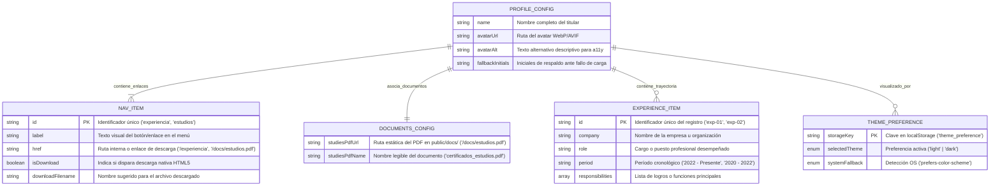
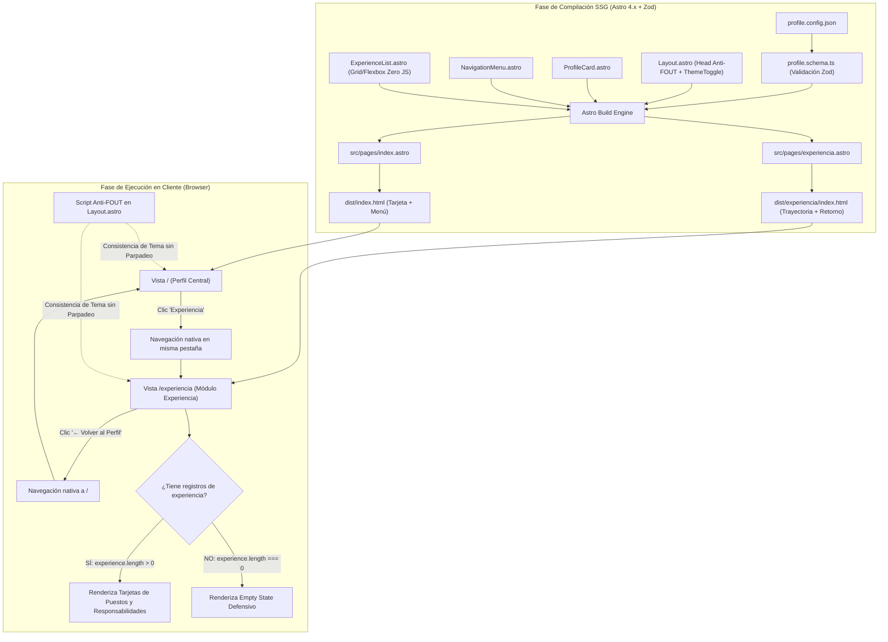
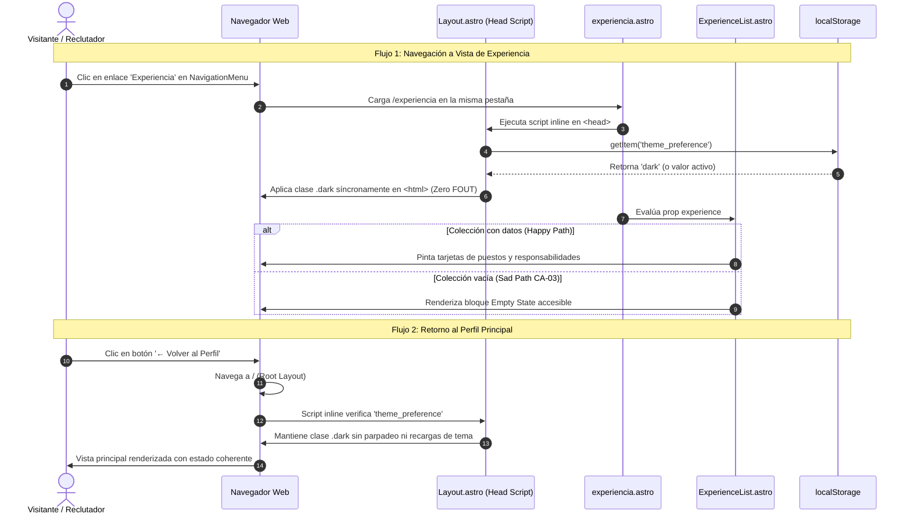

# TECH-DESIGN: Tarjeta de Identidad Digital con Menú Multirruta, Descarga de Documentos y Módulo de Experiencia Profesional

- **Fecha de Compilación:** 25-09-2026
- **Auditor y Consolidador:** Agente QT Senior BMAD
- **Modo de Operación:** Brownfield (Evolución de Arquitectura Subordinada a `legacy_ecosystem.md`)
- **Estado:** ✅ AUDITADO Y APROBADO (Auditoría Adversarial Exitosa - 0 Bloqueos Críticos)

---

## 1. Architecture Overview

La **Tarjeta de Identidad Digital Ultra-Minimalista con Módulo de Experiencia Profesional** consolida el ecosistema de marca personal del titular, complementando la tarjeta central de identidad y la descarga de credenciales académicas con una vista dedicada para el historial laboral estructurado (`/experiencia`), optimizada para una lectura ágil en desktop y dispositivos móviles sin sobrecarga cognitiva ni degradación de rendimiento.

El sistema mantiene el patrón arquitectónico **Jamstack / Static Site Generation (SSG) Multirruta** con **Astro 4.x** y **Tailwind CSS 3.x**, operando bajo el principio de *"Zero JavaScript by default"* para todos los componentes de presentación (`ProfileCard.astro`, `NavigationMenu.astro`, `ExperienceList.astro`). La vista de experiencia (`src/pages/experiencia.astro`) consume el layout maestro compartido (`Layout.astro`), reutilizando la barra superior con el conmutador de tema (`ThemeToggle.astro`) y el script síncrono inline anti-FOUT en `<head>`. Esto asegura una navegación bidireccional instantánea entre la tarjeta principal y la trayectoria laboral, preservando el tema visual seleccionado (`theme_preference` en `localStorage`) sin parpadeos de estilo ni reinicios de estado.

El modelo de datos centralizado en `src/config/profile.config.json` se valida exhaustivamente en tiempo de compilación mediante **Zod** y **TypeScript** (`src/config/profile.schema.ts`), garantizando integridad tipada para los puestos de trabajo (`experience`), enlaces del menú (`navItems`) y documentos descargables (`documents`), e incorporando soporte nativo para *Empty State* defensivo. La infraestructura perimetral (**Edge CDN** en Vercel / GitHub Pages) distribuye los artefactos estáticos con compresión Brotli y TLS 1.3, mientras que el pipeline de CI/CD en GitHub Actions ejecuta suites automatizadas de validación estática, tests unitarios (Vitest), pruebas E2E (Playwright) y auditoría de Core Web Vitals (LCP < 1.0s, CLS = 0).

---

## 2. Components

La arquitectura modular garantiza una estricta separación de responsabilidades y la no-regresión sobre los componentes preexistentes:

```text
src/
├── components/
│   ├── ExperienceList.astro  # Componente SSG responsivo de trayectoria laboral (Grid/Cards)
│   ├── NavigationMenu.astro  # Componente SSG reutilizable para menú de navegación
│   ├── ProfileCard.astro     # Componente núcleo de presentación de identidad (Heredado)
│   └── ThemeToggle.astro     # Componente interactivo ultra-ligero de conmutación Light/Dark
├── config/
│   ├── profile.config.json   # Fuente de verdad única: identidad, navegación, docs y experiencia
│   └── profile.schema.ts     # Contrato tipado y validación de esquemas con Zod
├── layouts/
│   └── Layout.astro          # Layout maestro global compartido (Inyección anti-FOUT en <head>)
├── pages/
│   ├── index.astro           # Vista principal: Tarjeta de identidad con NavigationMenu
│   ├── experiencia.astro     # Vista de trayectoria laboral con ExperienceList y botón de retorno
│   └── 404.astro             # Vista estática de resiliencia ante rutas inexistentes
├── scripts/
│   └── theme-manager.ts      # Módulo cliente encapsulado de resolución y persistencia de tema
└── styles/
    ├── globals.css           # Tokens de diseño y variables CSS (Light/Dark)
    └── tailwind.css          # Directivas de utilidad atómica Tailwind CSS
```

### Descripción Detallada de Componentes:
1. **`Layout.astro` (Layout Maestro Global):** Envoltorio HTML5 compartido que inyecta en `<head>` el script síncrono bloqueante anti-FOUT, pre-carga fuentes y assets críticos, renderiza el encabezado accesible con `ThemeToggle.astro` y asegura la coherencia visual multirruta.
2. **`ExperienceList.astro` (Módulo de Trayectoria Laboral):** Componente de presentación SSG pura que itera la colección `experience` de forma pre-ordenada cronológicamente de manera inversa. Utiliza CSS Grid y Flexbox con stacking vertical en móviles (cero desbordamiento horizontal), badges semánticos para períodos temporales, viñetas accesibles para responsabilidades y un bloque defensivo de *Empty State* con iconografía SVG ante colecciones vacías.
3. **`NavigationMenu.astro` (Menú de Navegación):** Renderiza la barra de navegación semántica `<nav>` a partir de `navItems`, gestionando el enlace hacia `/experiencia` y la descarga directa de `/docs/estudios.pdf` con atributos HTML5 `download`.
4. **`ProfileCard.astro` (Tarjeta de Identidad):** Componente SSG que muestra la fotografía optimizada (WebP/AVIF con `object-fit: cover`), el H1 semántico del profesional y el fallback vectorial SVG con iniciales (`fallbackInitials`) ante errores de carga de imagen.
5. **`experiencia.astro` (Página de Trayectoria):** Página estática que integra `ExperienceList.astro` y un botón de navegación semántica de retorno al perfil principal (`[← Volver al Perfil]`).
6. **`ThemeToggle.astro` & `theme-manager.ts`:** Conmutador interactivo y módulo TypeScript cliente (~1 KB) que gestiona la alternancia de la clase `.dark` y la persistencia en `localStorage` tolerante a fallos en modo incógnito.
7. **`profile.schema.ts` & `profile.config.json`:** Fuente de datos y esquema Zod consolidado que validan en build time la estructura íntegra del perfil, menú, documentos y trayectoria.

---

## 3. Data Model

### 3.1. Modelo Entidad-Relación (MER Consolidado)



---

### 3.2. Diccionario de Datos y Especificación de Tipos

#### Entidad Principal: `PROFILE_CONFIG` (Fuente de Verdad Centralizada)
- **Ubicación Física:** `src/config/profile.config.json`
- **Validador de Integridad:** `src/config/profile.schema.ts`

| Atributo | Tipo de Dato | Requerido | Restricciones / Validación | Descripción |
|---|---|---|---|---|
| `name` | `VARCHAR(150)` / `string` | Sí (Heredado) | `min: 2, max: 150`, no vacío | Nombre y apellidos del profesional para el H1 de la tarjeta. |
| `avatarUrl` | `VARCHAR(255)` / `string` | Sí (Heredado) | Ruta relativa local (`/src/assets/images/*` o `/assets/*`) | Asset fotográfico optimizado (WebP / AVIF). |
| `avatarAlt` | `VARCHAR(200)` / `string` | Sí (Heredado) | `min: 5, max: 200`, descriptivo a11y | Texto alternativo para lectores de pantalla. |
| `fallbackInitials` | `VARCHAR(4)` / `string` | Sí (Heredado) | `length: 1-4`, alfabético mayúsculas `^[A-ZÁÉÍÓÚÑ]+$` | Iniciales para el placeholder SVG (Sad Path CA-02). |
| `navItems` | `Array<NAV_ITEM>` | Sí (Heredado) | Mínimo 1 elemento, IDs únicos | Colección de opciones del menú de navegación. |
| `documents` | `DOCUMENTS_CONFIG` | Sí (Heredado) | Objeto con URLs de documentos válidos | Metadata de assets documentales estáticos. |
| `experience` | `Array<EXPERIENCE_ITEM>` | Sí (Brownfield) | `default([])`, orden cronológico inverso | Colección de registros de trayectoria laboral. |

#### Sub-Entidad: `EXPERIENCE_ITEM` (Puestos de Trabajo / Trayectoria)
- **Ubicación:** Embebido en `profile.config.json` -> `experience`

| Atributo | Tipo de Dato | Requerido | Restricciones / Validación | Descripción |
|---|---|---|---|---|
| `id` | `VARCHAR(50)` / `string` | Sí | `min: 1, max: 50`, alfanumérico / `kebab-case` único | Identificador único del registro de experiencia. |
| `company` | `VARCHAR(100)` / `string` | Sí | `min: 1, max: 100`, no vacío | Nombre de la empresa o institución. |
| `role` | `VARCHAR(100)` / `string` | Sí | `min: 1, max: 100`, no vacío | Cargo o función profesional desempeñada. |
| `period` | `VARCHAR(50)` / `string` | Sí | `min: 1, max: 50`, ej. `'2022 - Presente'` | Rango temporal visualizado en badge. |
| `responsibilities` | `Array<string>` | Sí | Mínimo 1 elemento, cada string `min: 1` | Lista de responsabilidades y logros destacados. |

#### Sub-Entidades Heredadas: `NAV_ITEM` y `DOCUMENTS_CONFIG`
- `NAV_ITEM`: `{ id: string, label: string, href: string, isDownload?: boolean, downloadFilename?: string }`
- `DOCUMENTS_CONFIG`: `{ studiesPdfUrl: string, studiesPdfName: string }`

#### Entidad Cliente: `THEME_PREFERENCE` (Persistencia en Navegador)
- **Ubicación Física:** `localStorage` (`theme_preference: 'light' | 'dark'`) con fallback síncrono a `matchMedia('(prefers-color-scheme: dark)')`.

---

### 3.3. Ejemplo Completo de Instancia JSON (`src/config/profile.config.json`)

```json
{
  "name": "Alex Morgan",
  "avatarUrl": "/assets/images/profile-avatar.webp",
  "avatarAlt": "Fotografía de perfil profesional de Alex Morgan",
  "fallbackInitials": "AM",
  "navItems": [
    {
      "id": "experiencia",
      "label": "Experiencia",
      "href": "/experiencia",
      "isDownload": false
    },
    {
      "id": "estudios",
      "label": "Estudios ⤓",
      "href": "/docs/estudios.pdf",
      "isDownload": true,
      "downloadFilename": "certificados_estudios.pdf"
    }
  ],
  "documents": {
    "studiesPdfUrl": "/docs/estudios.pdf",
    "studiesPdfName": "certificados_estudios.pdf"
  },
  "experience": [
    {
      "id": "exp-01",
      "company": "Tech Corp Inc.",
      "role": "Senior Frontend & Architecture Specialist",
      "period": "2022 - Presente",
      "responsibilities": [
        "Liderazgo en diseño de interfaces SSG y accesibilidad WCAG AA.",
        "Optimización de Core Web Vitals alcanzando LCP < 1.0s."
      ]
    },
    {
      "id": "exp-02",
      "company": "Global Solutions Ltd.",
      "role": "Software Developer & UI Specialist",
      "period": "2020 - 2022",
      "responsibilities": [
        "Implementación de componentes de diseño y contratos Zod.",
        "Integración de sistemas de conmutación de temas (Dark/Light)."
      ]
    }
  ]
}
```

---

### 3.4. Contrato Tipado Consolidado con Validación Zod (`src/config/profile.schema.ts`)

```typescript
import { z } from 'zod';

export const ExperienceItemSchema = z.object({
  id: z.string().min(1).max(50),
  company: z.string().min(1).max(100),
  role: z.string().min(1).max(100),
  period: z.string().min(1).max(50),
  responsibilities: z.array(z.string().min(1)).min(1)
});

export const NavItemSchema = z.object({
  id: z.string().min(2).max(50),
  label: z.string().min(1).max(50),
  href: z.string().min(1).max(255),
  isDownload: z.boolean().optional().default(false),
  downloadFilename: z.string().optional()
});

export const DocumentsSchema = z.object({
  studiesPdfUrl: z.string().min(1).max(255),
  studiesPdfName: z.string().min(3).max(100)
});

export const ProfileConfigSchema = z.object({
  name: z.string().min(2).max(150),
  avatarUrl: z.string().min(1).max(255),
  avatarAlt: z.string().min(5).max(200),
  fallbackInitials: z.string().min(1).max(4).regex(/^[A-ZÁÉÍÓÚÑ]+$/),
  navItems: z.array(NavItemSchema).min(1),
  documents: DocumentsSchema,
  experience: z.array(ExperienceItemSchema).default([])
});

export type ExperienceItem = z.infer<typeof ExperienceItemSchema>;
export type NavItem = z.infer<typeof NavItemSchema>;
export type DocumentsConfig = z.infer<typeof DocumentsSchema>;
export type ProfileConfig = z.infer<typeof ProfileConfigSchema>;
```

---

### 3.5. Auditoría de Trazabilidad UI -> Data (Cruce con Wireframes UX)

| Elemento de Interfaz (UX) | Archivo UX Auditado | Campo en Diccionario de Datos | Estado de Trazabilidad |
|---|---|---|:---:|
| Nombre de Empresa / Organización | `ux_01_visualizacion_experiencia_laboral.md` | `experience[].company` (string) | ✅ 100% Cubierto |
| Cargo o Puesto Profesional | `ux_01_visualizacion_experiencia_laboral.md` | `experience[].role` (string) | ✅ 100% Cubierto |
| Badge de Período Temporal | `ux_01_visualizacion_experiencia_laboral.md` | `experience[].period` (string) | ✅ 100% Cubierto |
| Lista de Responsabilidades | `ux_01_visualizacion_experiencia_laboral.md` | `experience[].responsibilities` (string[]) | ✅ 100% Cubierto |
| Bloque de Fallback (Empty State) | `ux_01_visualizacion_experiencia_laboral.md` | `experience.length === 0` (default `[]`) | ✅ 100% Cubierto |
| Botón `[← Volver al Perfil]` | `ux_02_navegacion_retorno_coherencia.md` | Enlace nativo semántico `href="/"` en Layout | ✅ 100% Cubierto |
| Persistencia de Tema en Transición Circular | `ux_02_navegacion_retorno_coherencia.md` | `theme_preference` en `localStorage` (anti-FOUT) | ✅ 100% Cubierto |
| Estabilidad Multirruta ante Refresco | `ux_02_navegacion_retorno_coherencia.md` | SSG autónomo en `src/pages/experiencia.astro` | ✅ 100% Cubierto |
| Enlaces del Menú y Descarga PDF | `ux_01_menu_navegacion_experiencia.md` / `ux_02_descarga_*.md` | `navItems` y `documents` | ✅ 100% Cubierto |
| Avatar y Nombre en Tarjeta Central | `ux_01_presentacion_identidad_perfil.md` | `avatarUrl`, `name`, `fallbackInitials` | ✅ 100% Cubierto |

*Resultado: Cero campos huérfanos. Todo elemento visual, de interacción y de estado vacío cuenta con respaldo estricto en el modelo de datos.*

---

## 4. Integrations

### 4.1. Integraciones de Red y Servicios Externos (Headless SSG Bypass)
- **APIs REST / GraphQL Externas:** No aplican ($0$ llamadas remotas en runtime). El sitio se pre-renderiza 100% de manera estática.
- **Distribución de Documentos:** Entrega directa desde `public/docs/estudios.pdf` en la CDN perimetral con cabeceras `Content-Type: application/pdf`.

### 4.2. Integraciones con APIs Nativas del Navegador (Browser Runtime)
1. **Web Storage API (`localStorage`):** Persistencia de `theme_preference` protegida con `try/catch` defensivo para soportar modo incógnito.
2. **CSS Object Model Media Queries (`window.matchMedia`):** Detección síncrona de `prefers-color-scheme: dark` y escucha de eventos `change`.
3. **HTML5 Download API:** Atributo `download="certificados_estudios.pdf"` para activación directa de descarga.

---

## 5. DIAGRAMAS DE ARQUITECTURA (Componentes, Secuencia, Despliegue)

### 5.1. Diagrama de Componentes y Flujo de Renderizado Multirruta (Component Architecture)



> *Nota de Arquitectura: Diagrama generado exclusivamente con Mermaid por ausencia de dependencias externas. Para habilitar visores HTML interactivos, instale la skill en la raíz del proyecto (`npx skills add tt-a1i/archify -g`) y solicite la actualización de esta sección.*

---

### 5.2. Diagrama de Secuencia: Navegación Bidireccional y Persistencia de Tema (Sequence Architecture)



> *Nota de Arquitectura: Diagrama generado exclusivamente con Mermaid por ausencia de dependencias externas. Para habilitar visores HTML interactivos, instale la skill en la raíz del proyecto (`npx skills add tt-a1i/archify -g`) y solicite la actualización de esta sección.*

---

### 5.3. Diagrama de Despliegue y Quality Gates en CI/CD (Deployment Architecture)

```mermaid
flowchart LR
    subgraph VCS["Control de Versiones (GitHub)"]
        DEV["Commits en main"] --> REPO["Repositorio GitHub"]
    end

    subgraph CI["Pipeline de Automatización (GitHub Actions)"]
        REPO --> WF["Workflow: ci-cd.yml"]
        WF --> LINT["npm run lint (ESLint + Prettier)"]
        LINT --> TYPECHECK["npm run typecheck (astro check)"]
        TYPECHECK --> UNIT["npm run test (Vitest: Validación Zod y Schemas)"]
        UNIT --> E2E["npm run test:e2e (Playwright: Navegación, DOM y Empty State)"]
        E2E --> PERF_GATE{"Métrica LCP < 1.0s & Asset Check"}
        PERF_GATE -->|Pass| BUILD["npm run build (Astro SSG Multirruta)"]
        PERF_GATE -->|Fail| STOP["Falla Pipeline"]
        BUILD --> DIST["Directorio /dist"]
    end

    subgraph Edge["Infraestructura Cloud Edge (Vercel / GitHub Pages)"]
        DIST --> DEPLOY["Despliegue Perimetral Global"]
        DEPLOY --> CDN["Edge CDN Multi-Región (Anycast)"]
        CDN --> CLIENTS["Visitantes Web (Desktop / Mobile)"]
    end
```



> *Nota de Arquitectura: Diagrama generado exclusivamente con Mermaid por ausencia de dependencias externas. Para habilitar visores HTML interactivos, instale la skill en la raíz del proyecto (`npx skills add tt-a1i/archify -g`) y solicite la actualización de esta sección.*

---

## 6. Technology Stack

- **Framework SSG:** Astro 4.x (Node.js 20.x LTS) — Enrutamiento estático multirruta y arquitectura "Zero JavaScript by default".
- **Capa de Diseño y Estilos:** Tailwind CSS 3.x con modo oscuro por clases (`darkMode: 'class'`) y contraste certificado WCAG 2.1 AA.
- **Tipado e Integridad:** TypeScript 5.x estricto + Zod 3.x para validación de esquemas en tiempo de compilación.
- **Entorno de Testing:** Vitest (Pruebas unitarias de esquemas y parseo JSON) + Playwright (Pruebas E2E de renderizado, navegación bidireccional, PDF y accesibilidad).
- **Control de Calidad:** ESLint, Prettier y `astro check`.
- **Infraestructura & CDN:** Vercel / GitHub Pages con distribución perimetral global (Edge CDN), compresión Brotli y HTTPS forzado.
- **Pipeline CI/CD:** GitHub Actions con Quality Gates de build, testing y Core Web Vitals.

---

## 7. Architecture Decisions (ADRs - Matriz Consolidada MADR)

| ID | Título de la Decisión | Área | Estado | Trade-off / Costo Admitido |
|:---:|---|:---:|:---:|---|
| **ADR-001** | Selección del Framework SSG (Astro + Tailwind CSS) | Frontend (SA) | Aceptado (heredado) | Compilación obligatoria en CI/CD y sintaxis `.astro`. |
| **ADR-002** | Gestión de Tema con Script Inline Anti-FOUT y Persistencia Local | Estado (SA) | Aceptado (heredado) | Inyección de script bloqueante inline en `Layout.astro`. |
| **ADR-003** | Fuente de Datos Estática Tipada (`profile.config.json`) | Persistencia (SA) | Aceptado (heredado) | Modificación de contenido exige commit y rebuild. |
| **ADR-004** | Infraestructura y Despliegue en Edge CDN con CI/CD | Infraestructura (SA) | Aceptado (heredado) | Límites estándar de tiers gratuitos en cloud. |
| **ADR-005** | Validación de Contratos con Zod y TypeScript | Integridad (DA) | Aceptado (heredado) | Dependencia de desarrollo ligera de Zod. |
| **ADR-006** | Persistencia Cliente de Preferencia de Tema (`localStorage`) | Datos (DA) | Aceptado (heredado) | Estado local al navegador sin sincronización multi-dispositivo. |
| **ADR-007** | Enrutamiento Estático Multirruta y `NavigationMenu.astro` | Frontend & Rutas (SA) | Aceptado (heredado) | Navegación estándar del navegador sin animaciones SPA complejas. |
| **ADR-008** | Extensión del Esquema Tipado para Enlaces y Documentos | Datos & Esquemas (SA/DA) | Aceptado (heredado) | Requiere sincronización de contratos Zod y pruebas unitarias. |
| **ADR-009** | Distribución de Documentos Estáticos en `/public/docs/` y CI/CD | Infraestructura (SA) | Aceptado (heredado) | El archivo PDF incrementa el tamaño del repositorio. |
| **ADR-010** | Componente de Visualización de Experiencia (`ExperienceList.astro`) | UI & Frontend (SA) | Aceptado | Mayor número de clases de utilidad Tailwind para maquetación responsiva. |
| **ADR-011** | Extensión del Esquema Tipado para `experience` con Empty State | Datos & Esquemas (SA/DA) | Aceptado | Incremento moderado en el tamaño del archivo `profile.config.json`. |
| **ADR-012** | Navegación de Retorno Bidireccional y Quality Gates en CI/CD | Navegación & DevOps (SA) | Aceptado | Mayor tiempo de ejecución en el pipeline de GitHub Actions (~45s). |

---

### ADR-010: Componente de Visualización de Experiencia (`ExperienceList.astro`) basado en Tarjetas Grid/Flexbox Responsivas
- **Estado:** Aceptado
- **Contexto:** El despliegue de los antecedentes laborales (empresa, rol, período, responsabilidades) debe ser altamente legible, sin desbordamientos horizontales en dispositivos móviles y con renderizado estático puro.
- **Decisión:** Implementar el componente `ExperienceList.astro` utilizando una estructura semántica basada en listas (`<ul>` / `<li>`) y tarjetas con Tailwind CSS (CSS Grid / Flexbox con stacking vertical automático en viewports reducidos), prescindiendo de tablas HTML tradicionales rígidas.
- **Alternativas Evaluadas:**
  - *Alternativa A (Tabla HTML tradicional `<table>`):* Genera desbordamiento horizontal en pantallas móviles (overflow-x) o requiere barras de scroll secundarias que degradan la experiencia de usuario y el minimalismo del diseño.
  - *Alternativa B (Componente interactivo con acordeones desplegables en JS):* Obligaría a introducir librerías de componentes reactivos en cliente, violando el principio de arquitectura "Zero JavaScript by default".
- **Consecuencias (Beneficios y Costos Reales):**
  - ✅ **Beneficios:** Adaptabilidad fluida en cualquier resolución, marcado semántico limpio, lectura visual ágil y cero sobrepeso de JavaScript.
  - ⚠️ **Trade-off Admitido:** Mayor cantidad de clases de utilidad en Tailwind para gestionar bordes y espaciados responsivos.

---

### ADR-011: Extensión del Esquema Tipado para la Colección de Experiencia Laboral (`experience`) con Soporte de Empty State
- **Estado:** Aceptado
- **Contexto:** Se requiere estructurar los registros de experiencia laboral en el modelo centralizado de persistencia, manteniendo tipado estricto en tiempo de compilación y tolerancia a fallos ante ausencia de datos.
- **Decisión:** Extender `src/config/profile.schema.ts` y `src/config/profile.config.json` con la colección `experience: Array<ExperienceItem>` (validada con Zod) conteniendo `id`, `company`, `role`, `period` y `responsibilities`, pre-ordenada en cronología inversa y con soporte de fallback (Empty State) en el componente Astro.
- **Alternativas Evaluadas:**
  - *Alternativa A (Archivo JSON independiente `experience.config.json`):* Fragmenta la fuente de verdad y obliga a gestionar múltiples lecturas de archivos de configuración en build time.
  - *Alternativa B (Carga dinámica vía fetch en cliente hacia un endpoint mock):* Introduce latencia de red, riesgo de fallos en ejecución y rompe la arquitectura SSG estática.
- **Consecuencias (Beneficios y Costos Reales):**
  - ✅ **Beneficios:** Fuente de verdad única unificada, validación exhaustiva en tiempo de compilación y resiliencia visual ante colecciones vacías.
  - ⚠️ **Trade-off Admitido:** El archivo `profile.config.json` incrementa su tamaño de bytes en el repositorio.

---

### ADR-012: Navegación de Retorno Bidireccional Multirruta y Quality Gates en CI/CD
- **Estado:** Aceptado
- **Contexto:** La vista `/experiencia` requiere un mecanismo de retorno accesible a la tarjeta principal (`/`) preservando el tema visual, respaldado por pruebas automatizadas de integración y rendimiento en CI.
- **Decisión:** Integrar un botón/enlace de retorno explícito en la cabecera de la vista de experiencia utilizando enrutamiento nativo de Astro, respaldado por una suite en GitHub Actions que ejecuta Vitest (validación de schema Zod), Playwright (navegación bidireccional y DOM) y chequeo de LCP < 1.0s.
- **Alternativas Evaluadas:**
  - *Alternativa A (Depender únicamente del botón "Atrás" del navegador):* Es poco intuitivo en interfaces web de escritorio y no ofrece trazabilidad clara dentro del diseño visual.
  - *Alternativa B (Omitir pruebas E2E de navegación en el pipeline de CI):* Aumenta el riesgo de regresiones visuales o enlaces rotos en despliegues futuros a producción.
- **Consecuencias (Beneficios y Costos Reales):**
  - ✅ **Beneficios:** Navegación bidireccional accesible, verificación exhaustiva en cada pull request y garantía de performance perimetral.
  - ⚠️ **Trade-off Admitido:** Tiempo de ejecución ligeramente mayor en el pipeline de GitHub Actions (~45s adicionales).
