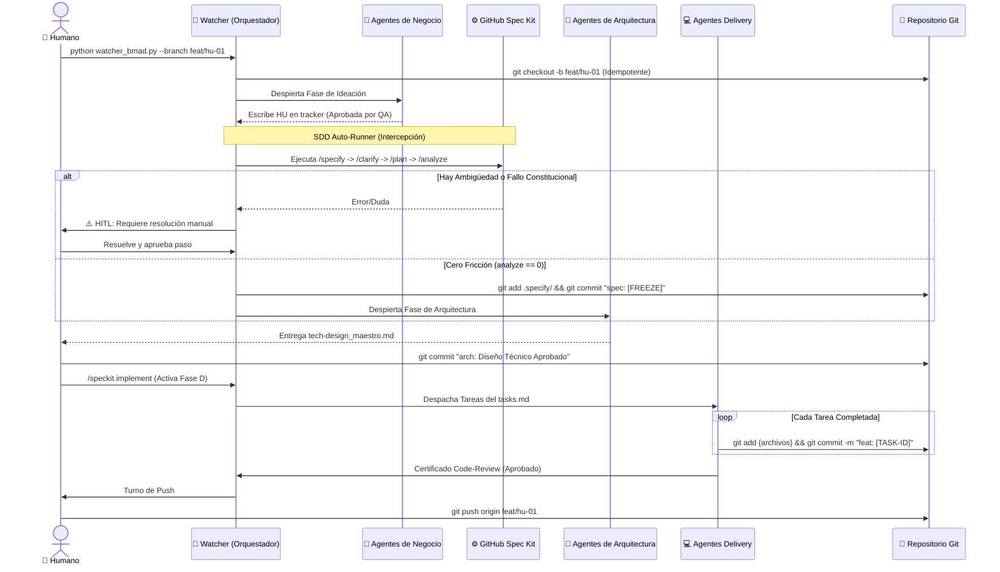
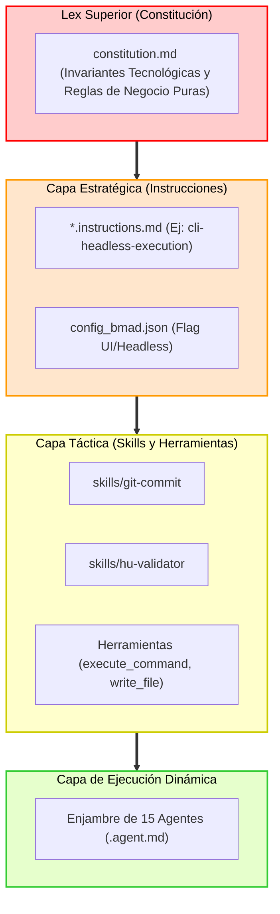

# 🧠 Framework BMAD v2.0 — Arquitectura Maestra

Este es el documento canónico del ecosistema **BMAD** (Business, Management, Architecture & Development). Define la topología, el motor de ejecución, y las reglas inmutables que gobiernan al enjambre de agentes de IA.

---

## 1. ¿Qué es BMAD v2.0?

BMAD es un framework de desarrollo de software estructurado como una "fábrica" determinista. En lugar de tener un único agente genérico, BMAD emplea un **enjambre de agentes hiper-especializados** que se comunican de forma secuencial y asíncrona a través de un bus de datos en texto plano (`files/tracker_bmad.md`).

En su versión 2.0, el framework integra **Spec-Driven Development (SDD)** nativo y un motor de **Ejecución Headless Automática**. Esto permite que el enjambre traduzca requerimientos abstractos de negocio en código de producción altamente testeado, controlado por un sistema Git determinista, minimizando la intervención humana a decisiones puramente estratégicas.

---

## 2. El Motor: Spec Kit y Control de Versiones (Git)

El corazón de BMAD v2.0 es el `watcher_bmad.py`, que actúa no solo como orquestador del tracker, sino como un **Compilador Modular** y **Gatekeeper**.

### A. Integración Git Segura y Autonómica
El framework impone políticas *Zero-Trust* sobre el control de versiones para proteger el repositorio:
1. **Arranque Aislado (`--branch`):** El orquestador requiere obligatoriamente que el humano especifique una rama al arrancar (`python watcher_bmad.py --branch feat/mi-rama`). El script ejecuta la verificación de idempotencia, y crea/reactiva la rama automáticamente. Ningún agente opera sobre `main`.
2. **Spec Freeze:** Al completar el diseño técnico, el propio orquestador realiza un commit congelando las especificaciones (`git commit -m "spec: [SPEC-FREEZE]"`).
3. **Commits Atómicos Headless:** Durante la Fase de Desarrollo, los agentes no pueden usar prompts interactivos, resolver conflictos de merge, ni hacer `git push`. Usan el skill inyectado (`git-commit`) para ejecutar estrictamente `git add {archivos}` y `git commit -m "{convencion} [{TASK-ID}]"`. El push al remoto se reserva como el privilegio final e indelegable del humano.

### B. SDD Auto-Runner y HITL por Excepción
En la versión 2.0, la transición entre el análisis de negocio y el diseño arquitectónico ya no es manual.
1. **Intercepción SDD Gatekeeper:** Cuando QA Documental emite su certificado de aprobación, el watcher intercepta el evento.
2. **Ejecución Autónoma:** Inicia silenciosamente el ciclo GitHub Spec Kit (`specify -> clarify -> plan -> tasks -> analyze`).
3. **HITL (Human-in-the-Loop) por Excepción:** El watcher *solo* pausa la ejecución y despierta al Humano si detecta símbolos de ambigüedad (preguntas o dudas en la fase de clarificación) o si la auditoría técnica falla por violación a la constitución. Si no hay fricción, el sistema hace el handoff directamente al Arquitecto de Soluciones (`@SA`) o de UI (`@UX`) leyendo el flag dinámico en `config_bmad.json`.

---

## 3. Flujo Narrativo por Agente (El Enjambre)

El ciclo de vida del software en BMAD atraviesa 4 grandes fases cronológicas:

### FASE B & M (Ideación, Análisis y QA Documental)
*   **`@BS` (Business Storyteller):** Recibe la idea abstracta del humano y la expande en una narrativa de negocio, analizando viabilidad y mercado.
*   **`@PA` (Product Analyst):** Estructura la narrativa en un Product Brief formal (PRD), definiendo objetivos, métricas y restricciones.
*   **`@PM` (Product Manager):** Extrae el alcance real, prioriza y diseña el documento del Producto Mínimo Viable (MVP).
*   **`@BA` (Business Analyst):** Emplea una estrategia "Dual-Output". Genera Historias de Usuario (HUs) técnicas en Gherkin puro, y en paralelo, versiones comprensibles para los stakeholders de negocio.
*   **`@QA` (QA Documental):** Ejerce de auditor de las HUs. Verifica la consistencia, el comportamiento no-tautológico y la coherencia general. Su "Aprobado" activa el SDD Auto-Runner.

### FASE A (Arquitectura y Diseño Técnico)
*(Esta fase es pre-alimentada por el Spec Freeze automático del SDD Auto-Runner).*
*   **`@UX` (Designer UX):** (Solo en proyectos con UI). Calca la funcionalidad de la HU en wireframes de texto (ASCII/Skeleton) y define jerarquías visuales.
*   **`@SA` (Solutions Architect):** Lee el `constitution.md` y dicta las Technical Guidelines, decidiendo el stack y los ADRs (Architecture Decision Records).
*   **`@DA` (Data Architect):** Modela las estructuras de persistencia, generando el MER y asegurando el aislamiento (ej. por schema).
*   **`@API` (API Architect):** Define los contratos REST o GraphQL, mapeando las fronteras del backend.
*   **`@QT` (QA Tech):** Actúa como el Compilador Humano. Cruza contratos y modelos, y genera el `tech-design.md` maestro. Tras su aprobación, se gatilla el implementador de la Fase D.

### FASE D (Delivery, Ejecución Headless)
Los constructores reciben tareas granulares del archivo `tasks.md` generado en el Spec Kit. Trabajan localmente y efectúan commits atómicos asíncronos.
*   **`@DEVOPS`:** Aprovisiona la infraestructura asíncrona (Docker, DBs, Keycloak) mediante scripts no interactivos.
*   **`@DEV-BACK`:** Modela los endpoints, la lógica de dominio (VSA) y la persistencia EF Core.
*   **`@DEV-FRONT`:** Desarrolla los componentes UI (ej. Angular 22 Zoneless) respetando el esqueleto dictado por UX.
*   **`@QA-AUTO`:** Escribe pruebas end-to-end e integración (xUnit, Jest, Playwright) con cobertura de casos felices y tristes.
*   **`@CODE-REVIEW`:** El Gatekeeper final. Audita seguridad (SecOps), adherencia a las reglas y decide si la rama puede ser liberada.

---

## 4. Diagramas de Arquitectura

### I. Arquitectura Lógica de Alto Nivel

### II. Flujo de Trabajo Secuencial (Git + Agentes)

### III. Capa Transversal (Modelo de Capas de Restricción)

