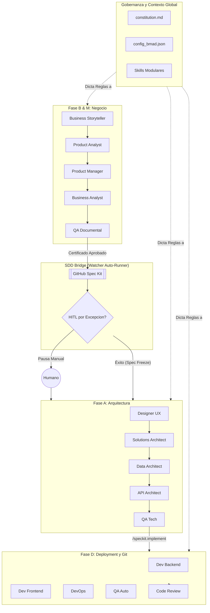
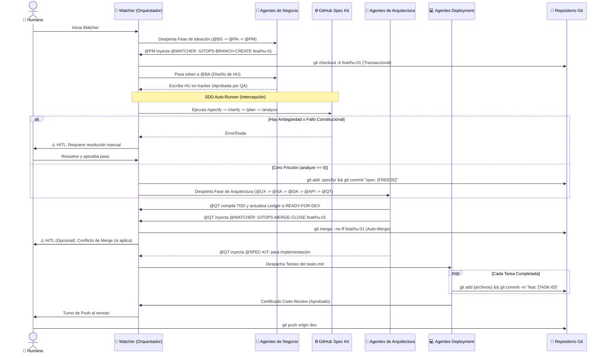
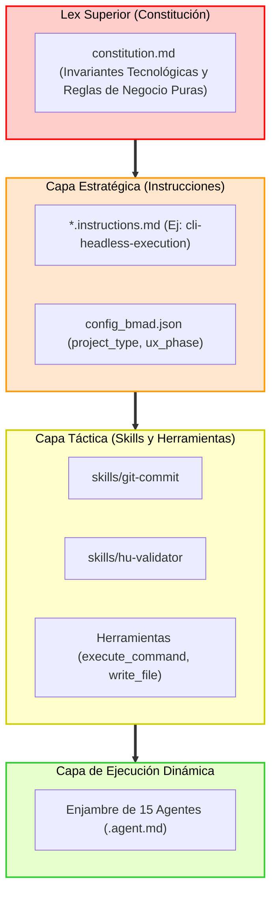
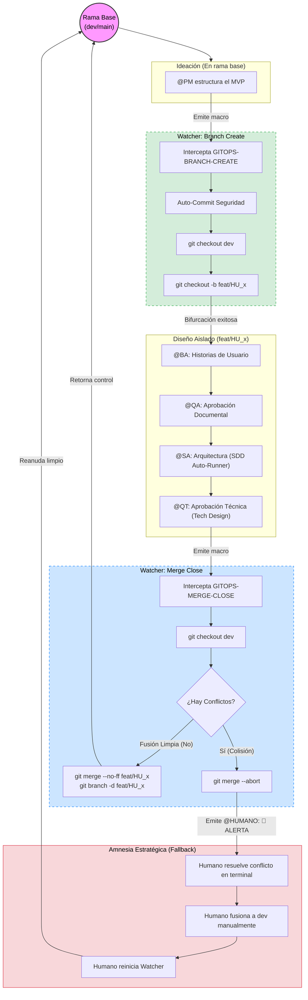
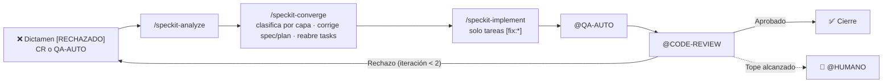

# 🧠 Framework BMAD v2.0 — Arquitectura Maestra

Este es el documento canónico del ecosistema **BMAD** (Business, Management, Architecture & Development). Define la topología, el motor de ejecución, y las reglas inmutables que gobiernan al enjambre de agentes de IA.

---

## 1. ¿Qué es BMAD v2.0?

BMAD es un framework de desarrollo de software estructurado como una "fábrica" determinista. En lugar de tener un único agente genérico, BMAD emplea un **enjambre de agentes hiper-especializados** que se comunican de forma secuencial y asíncrona a través de un bus de datos en texto plano (`documents/tracker_bmad.md`).

En su versión 2.0, el framework integra **Spec-Driven Development (SDD)** nativo y un motor de **Ejecución Headless Automática**. Esto permite que el enjambre traduzca requerimientos abstractos de negocio en código de producción altamente testeado, controlado por un sistema Git determinista, minimizando la intervención humana a decisiones puramente estratégicas.

---

## 2. El Motor: Spec Kit y Control de Versiones (Git)

El corazón de BMAD v2.0 es el `watcher_bmad.py`, que actúa no solo como orquestador del tracker, sino como un **Compilador Modular** y **Gatekeeper**.

### A. Integración Git Segura y Autonómica (GitOps)
El framework impone políticas *Zero-Trust* sobre el control de versiones, delegando toda mutación del VCS al orquestador principal mediante *Event-Sourcing*:
1. **Arranque con State Hydration:** Al iniciar, el orquestador escanea la historia del `tracker_bmad.md`. Si detecta que una sesión fue interrumpida en plena creación de una feature, reanuda automáticamente comprobando y saltando a la rama huérfana.
2. **Feature Branching Automatizado:** El Watcher intercepta directivas macro en el tracker (ej. `@WATCHER: GITOPS-BRANCH-CREATE feat/hu`). Antes de procesarlas, verifica la limpieza del *working directory* (`git status --porcelain`), realiza auto-commits de seguridad (`chore: auto-commit pre-branch switch`) y bifurca el repositorio para aislar el diseño de la nueva HU.
3. **Auto-Merge Seguro y Degradación Elegante:** Al finalizar la auditoría (cuando el QT dicta `READY-FOR-DEV`), el Watcher intercepta la directiva `@WATCHER: GITOPS-MERGE-CLOSE`. Realiza la fusión a `dev` de manera síncrona mediante `try/except`. Si hay conflictos, aplica `git merge --abort` y solicita intervención humana inyectando un protocolo instruccional en el tracker. El sistema entra en "Amnesia Estratégica", delegando la jurisdicción de resolución al humano, quien completará el merge y simplemente reiniciará el Watcher sin manipular el bus de datos.
4. **Commits Atómicos Headless:** Durante la Fase de Desarrollo, los agentes no resuelven conflictos ni hacen push. Usan el skill inyectado (`git-commit`) para ejecutar estrictamente `git add {archivos}` y `git commit -m "{convencion} [{TASK-ID}]"`.

### B. SDD Auto-Runner y HITL por Excepción
En la versión 2.0, la transición entre el análisis de negocio y el diseño arquitectónico ya no es manual.
1. **Intercepción SDD Gatekeeper:** Cuando QA Documental emite su certificado de aprobación, el watcher intercepta el evento.
2. **Ejecución Autónoma:** Inicia silenciosamente el ciclo GitHub Spec Kit (`specify -> clarify -> plan -> tasks -> analyze`).
3. **HITL (Human-in-the-Loop) por Excepción:** El watcher *solo* pausa la ejecución y despierta al Humano si detecta símbolos de ambigüedad (preguntas o dudas en la fase de clarificación) o si la auditoría técnica falla por violación a la constitución. Si no hay fricción, el sistema hace el handoff directamente al Arquitecto de Soluciones (`@SA`) o de UI (`@UX`) según `ux_routing.py` (`project_type`, `ux_phase` en `config_bmad.json` y el campo `Requiere interfaz` de la HU).

---

## 3. Flujo Narrativo por Agente (El Enjambre)

El ciclo de vida del software en BMAD atraviesa 4 grandes fases cronológicas:

### FASE B & M (Ideación, Análisis y QA Documental)
*   **`@BS` (Business Storyteller):** Recibe la idea abstracta del humano y la expande en una narrativa de negocio, analizando viabilidad y mercado.
*   **`@PA` (Product Analyst):** Estructura la narrativa en un Product Brief formal (PRD), definiendo objetivos, métricas y restricciones.
*   **`@PM` (Product Manager):** Extrae el alcance real, prioriza y diseña el documento del Producto Mínimo Viable (MVP).
*   **`@BA` (Business Analyst):** Emplea una estrategia "Dual-Output". Genera Historias de Usuario (HUs) técnicas en Gherkin puro, y en paralelo, versiones comprensibles para los stakeholders de negocio.
*   **`@QA` (QA Documental):** Ejerce de auditor de las HUs. Verifica la consistencia, el comportamiento no-tautológico y la coherencia general. Su "Aprobado" activa el SDD Auto-Runner.

### FASE A (Arquitectura y Diseño Técnico)
*(Esta fase es pre-alimentada por el Spec Freeze automático del SDD Auto-Runner).*
*   **`@UX` (Designer UX):** (Solo si la HU requiere interfaz: lo decide `ux_routing.py` según `project_type`, `ux_phase` y el campo `Requiere interfaz` de la HU; si se omite, el flujo pasa a `@SA`). Calca la funcionalidad de la HU en wireframes de texto (ASCII/Skeleton) y define jerarquías visuales.
*   **`@SA` (Solutions Architect):** Lee el `constitution.md` y dicta las Technical Guidelines, decidiendo el stack y los ADRs (Architecture Decision Records).
*   **`@DA` (Data Architect):** Modela las estructuras de persistencia, generando el MER y asegurando el aislamiento (ej. por schema).
*   **`@API` (API Architect):** Define los contratos REST o GraphQL, mapeando las fronteras del backend.
*   **`@QT` (QA Tech):** Actúa como el Compilador Humano. Cruza contratos y modelos, y genera el `tech-design.md` maestro. Tras su aprobación, se gatilla el implementador de la Fase D.

### FASE D (Deployment, Ejecución Masiva Headless)
La fase de construcción masiva se delega enteramente al motor de **SpecKit (`/speckit.implement`)**, que opera como "obrero", pero controlado bajo el paradigma de **Montaje de Alma (Soul Mounting)**. El Watcher copia dinámicamente las directrices de los agentes hacia la memoria de SpecKit antes de ejecutarlo.
*   **`@DEVOPS`:** Define los contenedores y pipelines asíncronos.
*   **`@DEV-BACK`:** Ejerce como la "Constitución del Backend". No programa manualmente archivo por archivo, sino que inyecta sus reglas innegociables (ej. VSA, Carter) al motor SpecKit y exige la actualización de la Arquitectura Viva (`backend-architecture.md`).
*   **`@DEV-FRONT`:** Ejerce como la "Constitución del Frontend". Inyecta las reglas de interfaces (ej. Angular Zoneless, PrimeNG) al motor SpecKit y exige la actualización de la Arquitectura Viva (`frontend-architecture.md`).
*   **`@QA-AUTO`:** Escribe pruebas end-to-end e integración (xUnit, Jest, Playwright) con cobertura de casos felices y tristes. Recibe el handoff cuando SpecKit termina.
*   **`@CODE-REVIEW`:** El Gatekeeper final. Audita seguridad (SecOps), adherencia a las reglas arquitectónicas y documenta el análisis de impacto antes de autorizar la fusión (`GITOPS-MERGE-CLOSE`).

---

## 4. Diagramas de Arquitectura

### I. Arquitectura Lógica de Alto Nivel

### II. Flujo de Trabajo Secuencial (GitOps + Agentes)

### III. Capa Transversal (Modelo de Capas de Restricción)

## 5. Ledger de Estado del Producto (Mapa de Specs)

El ecosistema BMAD implementa un **Mapa de Specs** (ubicado en `specs/README.md`) que actúa como un Ledger inmutable del ciclo de vida de las funcionalidades. Este artefacto soluciona la pérdida de contexto en proyectos de larga duración.

### Gobernanza del Ledger:
1. **Lectura Obligatoria:** Los agentes de diseño (`@BA`, `@SA`) consumen este mapa antes de cualquier iteración para alinear las nuevas HUs con la topología existente y evitar solapamientos.
2. **Escritura Orquestada:** Los agentes de validación y gestión (`@PM`, `@QT`) utilizan la habilidad `update-specs-map` para actualizar determinísticamente el estado de las funcionalidades (ACTIVE, IN-PROGRESS, DEPRECATED) mediante manipulaciones precisas de Markdown.

Este mecanismo garantiza una fuente única de verdad libre de alucinaciones algorítmicas, esencial para la correcta transición de Modos Greenfield a Brownfield.

## 6. Ciclo de Vida de Ramas (GitOps Workflow)

El siguiente diagrama detalla cómo el ecosistema aisla el trabajo en ramas de *feature* y cómo el **Watcher** orquesta los cambios de estado en el control de versiones, incluyendo el protocolo de resiliencia ante conflictos (Amnesia Estratégica).

---

## 🛑 Regla de Oro: Principio de Vertical Slicing Estricto

El ecosistema BMAD v2.0 opera bajo un modelo de **Vertical Slicing Estricto** para garantizar la salud del State Ledger y evitar divergencias arquitectónicas.

*   **Prohibición de Desarrollo Horizontal:** Queda estrictamente prohibido abrir o diseñar múltiples Historias de Usuario (HUs) a la vez. No se puede avanzar al diseño de una nueva característica si la anterior no ha cerrado su ciclo.
*   **Ciclo de Vida de Rebanada Vertical:** Toda HU debe atravesar el ciclo completo antes de iniciar la siguiente: `PM -> BA -> QA -> UX -> SA -> (Fases Técnicas) -> QT -> Retorno a PM`.
*   **Regla de Ramas GitOps:** Queda terminantemente prohibido que el `@PM` inicie una nueva historia y emita un `GITOPS-BRANCH-CREATE` si la historia anterior no ha sido debidamente compilada y fusionada en el código base principal por el `@QT` mediante `GITOPS-MERGE-CLOSE`.

---

## 🔒 Consistencia de Nomenclatura y Trazabilidad (Identificador Universal)

El ecosistema BMAD v2.0 impone una trazabilidad matemática exacta (1:1) entre el Product State Ledger, el control de versiones y el sistema de archivos físico mediante el uso de un **Identificador Universal Estricto**.

1. **Formato Inmutable:** Todas las historias de usuario deben adoptar la nomenclatura `XXX-HU_nombre_en_snake_case` (ej. `001-HU_tarjeta_identidad_digital`).
2. **Columnas del Ledger:** La tabla del Ledger (`specs/README.md`) utiliza oficialmente la estructura: `| N° | Épica Origen | Nombre spec / HU | Qué aporta | Estado | Rama |`.
3. **Uso Obligatorio Transversal:** Este identificador exacto y sin truncar se utiliza obligatoriamente para:
   - Registrar la funcionalidad en la columna `Nombre spec / HU` y en la columna `Rama` (`feat/001-HU_...`) del Ledger.
   - Orquestar la bifurcación GitOps (`@WATCHER: GITOPS-BRANCH-CREATE feat/XXX-HU_...`).
   - Nombrar los archivos físicos `.md` generados por los agentes (`@BA`, `@BS`, `@SA`, etc.). Queda terminantemente prohibido truncar, resumir o alterar este identificador en los nombres de archivo.

---

## 🚪 El Motor: "Doble Compuerta SDD" (Two-Stage Gatekeeper)
El orquestador BMAD implementa un "Two-Stage Gatekeeper" para fraccionar la ejecución automática del puente **Spec Kit**. Esto evita la alucinación técnica y asegura que el modelo tecnológico propuesto por el orquestador obedezca a los arquitectos.

*   **Compuerta 1 (Negocio):** Al recibir la aprobación del `@QA` (QA Documental), el Watcher intercepta la ejecución para lanzar de forma independiente `/speckit.specify` y `/speckit.clarify`. El Watcher fija de forma explícita la carpeta de la especificación (`specs/XXX-HU_nombre`, igual al identificador universal) y detiene la fase si Spec Kit no la respeta. Esto detalla funcionalmente el comportamiento sin inferir el stack.
*   **Compuerta 2 (Arquitectura):** Tras el diseño de gobernanza del `@SA` (Solutions Architect), este agente emite la macro `@WATCHER: SDD-FREEZE`. El orquestador pausa el flujo nuevamente y ejecuta `/speckit.plan`, `/speckit.tasks` y `/speckit.analyze`. En esta fase, Spec-Kit asimila las guidelines inyectadas por el Arquitecto para generar un plan técnico realista y congelarlo (`[SPEC-FREEZE]`).
*   **Compuerta 3 (Implementación):** Tras la compilación del Tech Design maestro por el `@QT` (QA Tech), este emite la señal `@SPEC-KIT:`. El Watcher intercepta esta señal y ejecuta de manera totalmente aislada y secuencial la Fase D. Mediante la inyección de la "Tarea Fantasma", SpecKit programa bajo la identidad del agente y, obligatoriamente, debe generar y actualizar la documentación de **Arquitectura Viva** antes de devolver el control y hacer handoff a `@QA-AUTO` (que, al aprobar, deriva a `@CODE-REVIEW`).
*   **Compuerta 4 (Retrabajo):** Si `@CODE-REVIEW` o `@QA-AUTO` rechazan la implementación, el Watcher no despacha a un agente: ejecuta el ciclo de convergencia (`/speckit-analyze` → `/speckit-converge` → `/speckit-implement` acotado a las tareas `[fix:*]`) y devuelve el turno a `@QA-AUTO` y luego a `@CODE-REVIEW`, con tope de 2 iteraciones antes de escalar a `@HUMANO:`. Ver *Ciclo de Retrabajo SDD*.

> **Nota Operativa:** Durante el desarrollo asistido, el usuario notará que el Watcher (`watcher_bmad.py`) detiene el avance automático en estos dos hitos exactos de la línea de tiempo, delegando silenciosamente la ejecución hacia el puente SDD antes de reanudar el Handoff hacia los desarrolladores.

---

## 🔁 Ciclo de Retrabajo SDD (Rechazos de `@CODE-REVIEW` / `@QA-AUTO`)

En SDD la fuente de verdad es la especificación, no el código. Por eso un dictamen `[RECHAZADO]` **no se parchea directamente en el código**: se clasifica por la **capa de origen** y se corrige desde ahí hacia abajo. Cuando `@CODE-REVIEW` o `@QA-AUTO` rechazan y su handoff asigna `@DEV-BACK:` / `@DEV-FRONT:`, el Watcher (**Compuerta 4**) ejecuta el ciclo de convergencia en lugar de despachar a un agente:

| Paso | Comando | Qué ocurre |
|---|---|---|
| 1 | `/speckit-analyze` | Auditoría de consistencia spec ↔ plan ↔ tasks (solo lectura). Revela si el rechazo esconde una grieta entre artefactos. |
| 2 | (dentro de converge) | Se corrige primero la capa que falló, con el cambio mínimo: contrato → `spec.md`; diseño incompleto → `plan.md`; si es solo código, **no se tocan spec ni plan**. |
| 3 | `/speckit-converge` | Compara el código real con spec, plan y tasks. Reabre las tareas falsamente `[X]` y añade al final de `tasks.md` una tarea por hallazgo: `T0NN [fix:CAPA:n]`. |
| 4 | `/speckit-implement` | Ejecuta **solo** las tareas `[fix:*]`, con alcance backend o frontend según el handoff y con Soul Mounting. |
| 5 | Re-validación | El último bloque DEV deriva a `@QA-AUTO:` y este, al aprobar, a `@CODE-REVIEW:`. El ciclo cierra cuando ambos aprueban. |

**Etiquetado por capa.** `code-review` y `qa-auto` incluyen la instrucción `rework-layer-labeling.instructions.md`: cada hallazgo lleva `[CAPA:SPEC]`, `[CAPA:PLAN]`, `[CAPA:TASKS]` o `[CAPA:CODE]`. Si todos son `CODE`/`TASKS`, el Watcher ordena no modificar spec ni plan; si hay `SPEC`/`PLAN`, se corrigen primero. Sin etiquetas, `converge` clasifica con criterio conservador (ante la duda, la capa superior).

**Principios**
- **Trazabilidad:** cada hallazgo se convierte en una tarea con ID (`[fix:...]`), así se puede probar que se resolvió.
- **La verdad de "terminado" es la verificación, no el `[X]`:** `converge` reconcilia las tareas falsamente cerradas.
- **Constitución como árbitro:** si un hallazgo viola `.specify/memory/constitution.md`, se corrige el código; si la constitución es ambigua, se enmienda con `/speckit-constitution`, no se reinterpreta.
- **Alcance mínimo:** cada iteración corrige solo lo rechazado, sin regenerar lo aprobado.
- **Tope de iteraciones:** máximo **2** por rama (`.specify/memory/rework_state.json`, se reinicia con `GITOPS-BRANCH-CREATE` / `GITOPS-MERGE-CLOSE`). Al excederlo, el Watcher escribe un handoff a `@HUMANO:` y se detiene: la causa suele estar en la spec o el plan.

**Límites conocidos.** Los cambios de spec/plan los aplica `converge` con edición mínima; el Watcher no vuelve a recorrer la cadena `@BA → @QA → @UX → @SA → @DA → @API → @QT` (regenerar `spec.md`/`tasks.md` borraría el progreso `[X]`). En su lugar deja una nota en el tracker para sincronizar manualmente los artefactos de diseño de `@BA`, `@API` y `@DA`. La clasificación por capa depende de que el revisor etiquete bien sus hallazgos. La última clasificación queda en `.specify/memory/rework_last_classification.md`.

**Reflejo en `bmad-control-center`.** El *Pipeline de Agentes* muestra el rechazo en vivo: el revisor aparece en rojo (`✗ [RECHAZADO]`), las etapas a corregir en ámbar (`↻ [RETRABAJO i/2]`) y un banner resume el ciclo. El backend lo proyecta desde el tracker (`rework` + `rework_state` por etapa) y lo emite en `WORKFLOW_UPDATED`.

## Enrutamiento del diseño UX (interruptor global y por HU)

El diseño UX es una pieza removible del pipeline. **Quien decide si una HU pasa por UX es el Watcher, no el QA Documental**:
el token `@UX:`/`@SA:` que escribe el QA en su aprobación es informativo, porque el Gate 1 lo intercepta y el Watcher
despacha el handoff real al terminar `specify` + `clarify`.

| Orden | Fuente | Efecto |
|:---:|---|---|
| 1 | `project_type: headless` en `config_bmad.json` | Se omite UX siempre |
| 2 | `ux_phase` en `config_bmad.json`: `off` / `on` / `auto` (por defecto) | `off` omite, `on` diseña siempre, `auto` pasa a la HU |
| 3 | Campo `Requiere interfaz: Sí o No` de la HU técnica (lo declara el BA, lo verifica el QA) | `No` omite, `Sí` diseña |
| 4 | Sin campo | Se diseña (valor seguro por defecto) |

- **Dónde vive la regla:** `ux_routing.py` (raíz). Solo usa la biblioteca estándar y no depende del Watcher ni de herdr; devuelve `RutaUX(destino, motivo, omitida)`. El Watcher traduce `destino` al token del tracker (`decidir_ruta_ux` / `registrar_traspaso_fase_a` en `watcher_bmad.py`).
- **Cambio de orquestador:** son datos y contratos y sobreviven: `ux_phase`, el campo de la HU y el bloque del tracker. Hay que reimplementar solo el nodo de enrutamiento, que importa `ux_routing`.
- **Lectura en caliente:** el config se lee en cada decisión; no hay que reiniciar el Watcher. Tras un `off`, reiniciar `utils/start_agents.py` para volver a levantar el panel de `designer-ux`.
- **Huella en el tracker:** al omitir, el Watcher escribe un bloque `WATCHER` con `⏭️ [UX] Diseño UX omitido: <motivo>` y un handoff al `@SA:`. Ese texto no puede contener "aprobad…" o re-dispararía el Gate 1.
- **Dashboard:** `WorkflowService` marca la etapa UX como `SKIPPED` (cuenta como avance) y `WorkflowStepper.vue` la muestra como `[⏭ OMITIDA]`.
- **Panel:** con `ux_phase=off` o proyecto headless, `start_agents.py` no levanta `designer-ux` (`ux_routing.agentes_omitidos`).
