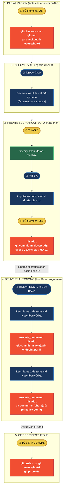

```mermaid
flowchart TD
    %% Estilos
    classDef humano fill:#ecc94b,stroke:#b7791f,stroke-width:2px,color:#000
    classDef agente fill:#1a365d,stroke:#2b6cb0,stroke-width:2px,color:#fff
    classDef speckit fill:#276749,stroke:#48bb78,stroke-width:2px,color:#fff
    classDef gitCmd fill:#f14e32,stroke:#c53030,stroke-width:2px,color:#fff,font-weight:bold

    subgraph ETAPA1 ["1. INICIALIZACIÓN (Antes de arrancar BMAD)"]
        direction TB
        H1(["👤 TÚ (Terminal OS)"]):::humano --> G1["git checkout main<br>git pull<br>git checkout -b feature/hu-01"]:::gitCmd
    end

    subgraph ETAPA2 ["2. DISCOVERY (El negocio diseña)"]
        direction TB
        A1(["🤖 @BA y @QA"]):::agente --> T1["Generan las HUs y el QA aprueba<br>(Orquestador se pausa)"]:::agente
    end

    subgraph ETAPA3 ["3. PUENTE SDD Y ARQUITECTURA (El Plan)"]
        direction TB
        H2(["👤 TÚ (CLI)"]):::humano --> S1["/specify, /plan, /tasks, /analyze"]:::speckit
        S1 --> A2(["🤖 FASE A"]):::agente
        A2 --> T2["Arquitectos completan el diseño técnico"]:::agente
        T2 --> H3(["👤 TÚ (Terminal OS)"]):::humano
        H3 --> G2["git add .<br>git commit -m 'docs(sdd): specs y tasks para HU-01'"]:::gitCmd
    end

    subgraph ETAPA4 ["4. DELIVERY AUTÓNOMO (Los Devs programan)"]
        direction TB
        A3(["🤖 @DEV-FRONT / @DEV-BACK"]):::agente --> T3["Leen Tarea 1 de tasks.md y escriben código"]:::agente
        T3 --> G3["execute_command:<br>git add .<br>git commit -m 'feat(api): endpoint perfil'"]:::gitCmd
        
        G3 --> T4["Leen Tarea 2 de tasks.md y escriben código"]:::agente
        T4 --> G4["execute_command:<br>git add .<br>git commit -m 'chore(ui): primeflex config'"]:::gitCmd
    end

    subgraph ETAPA5 ["5. CIERRE Y DESPLIEGUE"]
        direction TB
        H4(["👤 TÚ o 🤖 @DEVOPS"]):::humano --> G5["git push -u origin feature/hu-01<br>gh pr create"]:::gitCmd
    end

    ETAPA1 --> ETAPA2
    ETAPA2 --> ETAPA3
    ETAPA3 -- "Liberas el orquestador hacia Fase D" --> ETAPA4
    ETAPA4 -- "Devuelven el turno" --> ETAPA5
```