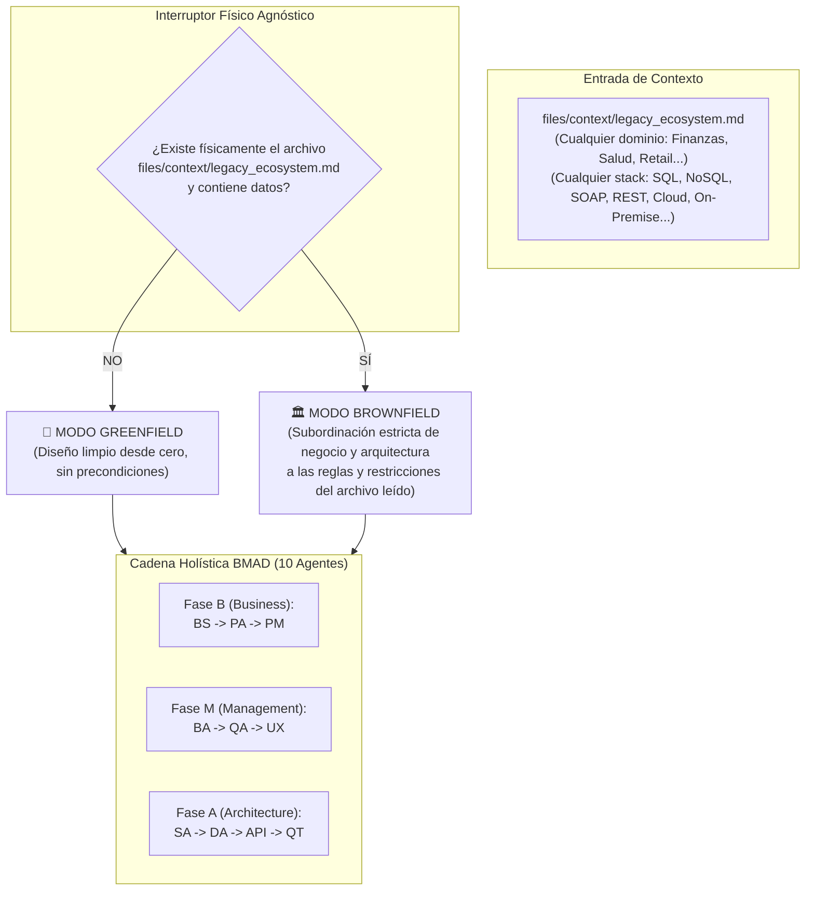

# 🏗️ PLAN DE IMPLEMENTACIÓN MAESTRO: SOPORTE DUAL GREENFIELD / BROWNFIELD 100% AGNÓSTICO EN BMAD

- **Documento:** `plan-brownfield.md`
- **Ubicación:** Raíz del proyecto BMAD
- **Autor:** BMAD Core Architect (CTO del Swarm)
- **Fecha:** 23-09-2026
- **Propósito:** Corrección arquitectónica para soporte holístico Brownfield sin hardcodeo de dominio ni tecnología
- **Estado:** 📋 PLAN MAESTRO RECTIFICADO (Listo para Ejecución)

---

## 1. 🎯 RECTIFICACIÓN ARQUITECTÓNICA Y PRINCIPIO RECTOR

### 1.1. Diagnóstico del Error Previo
En la propuesta inicial se cometió un error metodológico al citar términos particulares del caso de prueba actual (*"Leasing"*, *"SQL Server"*, *"SOAP"*, *".NET 4.8"*) dentro de las directivas del framework. 
Hacer eso rompería el propósito fundacional de BMAD: **ser un framework agnóstico, reutilizable y universal para cualquier industria y stack tecnológico**.

### 1.2. Principio Rector: Agnostismo Absoluto y Subordinación Dinámica
El framework BMAD actúa como un **meta-modelo**. No conoce ni debe conocer de antemano el negocio ni la tecnología de un proyecto:
* Si el proyecto es **Greenfield**, los agentes definen negocio y arquitectura desde cero a partir de la interacción con el usuario y las mejores prácticas modernas.
* Si el proyecto es **Brownfield**, existe un descriptor en [`files/context/legacy_ecosystem.md`](file:///D:/Paulo/Cursos/DMC/template-bmad/files/context/legacy_ecosystem.md). Los agentes deben **subordinar dinámicamente** su diseño a lo que dicte dicho archivo, **sea cual sea su contenido** (sea un sistema bancario en Cobol/DB2, una aplicación de seguros en .NET/SQL Server, un monolito PHP/MySQL o microservicios Java/Kafka).



---

## 2. 📜 LA DIRECTIVA CONDICIONAL UNIVERSAL (AGNOSTIC RULE)

Todos los agentes del enjambre incorporarán en sus instrucciones (`.instructions.md` / `.agent.md`) la siguiente regla universal canónica:

> ### ⚙️ POLÍTICA UNIVERSAL DE INGESTIÓN DE CONTEXTO (GREENFIELD / BROWNFIELD)
> 
> Antes de iniciar el análisis, generación de artefactos o handoff, debes evaluar la naturaleza del entorno de ejecución:
> 
> 1. **Detección de Contexto:** Usa `read_file` para comprobar la existencia del archivo `files/context/legacy_ecosystem.md`.
> 
> 2. **ESCENARIO A — Modo Brownfield (Archivo detectado con contenido):**
>    - Estás operando sobre un sistema preexistente.
>    - **Regla de Subordinación Obligatoria:** Lee el archivo en su totalidad y subordina tu diseño (sea de negocio, producto, requerimientos funcionales, UX o arquitectura técnica) a las reglas, dominio, máquinas de estado, restricciones de infraestructura y directivas tecnológicas descritas allí, **sean cuales sean**.
>    - Tienes **estrictamente prohibido** inventar o asumir tecnologías, motores de base de datos o flujos de negocio que colisionen con las restricciones del archivo legacy.
>    - En tus entregables, documenta explícitamente cómo tu diseño convive, se integra o respeta el ecosistema heredado.
> 
> 3. **ESCENARIO B — Modo Greenfield (Archivo inexistente o vacío):**
>    - Estás operando en un proyecto 100% nuevo desde cero.
>    - Aplica las políticas estándar de descubrimiento, innovación y mejores prácticas definidas en tus plantillas por defecto, sin asumir restricciones heredadas.

---

## 3. 🧩 MATRIZ HOLÍSTICA DE SUBORDINACIÓN POR AGENTE (LOS 10 AGENTES)

A continuación se detalla cómo interpreta la regla agnóstica cada uno de los 10 agentes del ecosistema BMAD:

### 3.1. Fase de Negocio y Producto (Discovery)

| Agente | En Modo Greenfield (Sin Archivo) | En Modo Brownfield (Con Archivo Legacy) |
|---|---|---|
| **Business Storyteller (`BS`)** | Optimiza la idea del stakeholder creando un contexto de negocio y dolor desde cero. | Lee la sección de dominio y reglas de negocio del archivo legacy. Contextualiza el dolor y actores subordinándolos al ecosistema preexistente, evitando crear un modelo de negocio paralelo o desconectado. |
| **Product Analyst (`PA`)** | Elabora el Product Brief en 8 secciones canónicas deduciendo supuestos y restricciones libres. | Delimita en la **Sección 4 (Alcance)** qué partes del sistema legacy se integran y cuáles quedan fuera de alcance. En la **Sección 5 (Restricciones y Dependencias)** cataloga como restricciones duras todas las tecnologías, integraciones y reglas del archivo legacy. |
| **Product Manager (`PM`)** | Prioriza el MVP estructurando épicas y ruta crítica de valor sin dependencias preexistentes. | Al priorizar el MVP (`mvp_*.md`), categoriza las épicas considerando el riesgo de integración con el legado y cataloga en la matriz de riesgos los impactos sobre componentes existentes descritos en el archivo. |

### 3.2. Fase de Requerimientos y Experiencia (Management)

| Agente | En Modo Greenfield (Sin Archivo) | En Modo Brownfield (Con Archivo Legacy) |
|---|---|---|
| **Business Analyst (`BA`)** | Redacta Historias de Usuario con BDD Gherkin independientes y criterios de aceptación modernos. | Lee las reglas operativas y máquinas de estado del archivo legacy. Los escenarios Gherkin (`Dado que... Cuando... Entonces...`) deben subordinarse a las reglas y limitaciones del negocio preexistente. Su DoD exige no-regresión contra el sistema actual. |
| **QA Documental (`QA`)** | Audita las HUs contra el Product Brief bajo dimensiones INVEST y formato BDD. | Audita en doble vía: contra el Product Brief Y contra las reglas del archivo `legacy_ecosystem.md`. Si una HU pretende ejecutar acciones prohibidas por el ecosistema heredado, emite dictamen `RECHAZADO`. |
| **Designer UX (`UX`)** | Diseña wireframes y especificaciones visuales modernas con total libertad de componentes. | Lee las restricciones de presentación del archivo legacy (ej. si convive con un portal existente, CMS o aplicaciones de escritorio). Documenta cómo se acopla ergonómicamente la interfaz para no romper la consistencia del usuario final. |

### 3.3. Fase de Arquitectura Técnica y Compilación (Architecture)

| Agente | En Modo Greenfield (Sin Archivo) | En Modo Brownfield (Con Archivo Legacy) |
|---|---|---|
| **Solutions Architect (`SA`)** | Pregunta al humano las 5 preguntas estratégicas estándar (Cloud, lenguaje, base de datos, presupuesto, Greenfield/Brownfield). | **Cero Fricción:** Auto-detecta que es Brownfield. Asume las restricciones de infraestructura y stack descritas en el archivo. En su cuestionario al `@HUMANO:`, no pregunta lo ya documentado; pregunta únicamente cómo se desea desplegar e implementar el **nuevo módulo/extensión** para interoperar con lo existente. En `tech_guidelines.md` declara `Naturaleza: Brownfield` y define reglas de no-regresión. |
| **Data Architect (`DA`)** | Modela el MER y diccionario de datos en el motor que decida el SA (PostgreSQL, NoSQL, JSON, etc.). | **Subordinación Estricta de Persistencia:** Adopta obligatoriamente el motor de base de datos, dialecto SQL y restricciones relacionales descritas en el archivo legacy. Relaciona las nuevas tablas con las entidades existentes y documenta un ADR de coexistencia de datos. |
| **API Architect (`API`)** | Diseña contratos de endpoints (REST/GraphQL) asumiendo comunicación directa y moderna. | **Subordinación Estricta de Red:** Diseña contratos de interfaz subordinados a los protocolos de comunicación y servicios descritos en el archivo legacy (REST, SOAP, RPC, Colas, Stored Procedures). Diseña capas de adaptación (BFF / Facade) y mapeo de errores del sistema heredado. |
| **QA Tech (`QT`)** | Audita coherencia entre MER y API y compila el documento maestro `tech-design_*.md`. | **Árbitro de Cumplimiento Legacy:** Audita que el MER no use motores prohibidos en el archivo legacy y que los contratos de red respeten los protocolos heredados. Sus diagramas de arquitectura reflejan la topología y servidores preexistentes. Si detecta desviaciones, emite rechazo hacia `@DA:` o `@API:`. |

---

## 4. 📝 ESPECIFICACIÓN DE INYECCIÓN EN ARCHIVOS `.instructions.md`

Para no tocar el código operativo de los agentes de forma destructiva, la inyección se realiza incorporando bloques canónicos en las plantillas e instrucciones correspondientes:

### 4.1. Plantilla de Historias de Usuario (`business-analyst/instructions/hu-template.instructions.md`)
Se añade la sección condicional agnóstica:
```markdown
### ⚠️ Directiva para Ecosistemas Preexistentes (Modo Brownfield)
Si existe el archivo `files/context/legacy_ecosystem.md`:
1. Los Criterios de Aceptación (BDD) deben subordinarse a las reglas de negocio, validaciones y máquinas de estado descritas en dicho archivo.
2. En la sección `## 4. DEFINITION OF DONE`, es obligatorio incluir el ítem:
   - [ ] La funcionalidad respeta las restricciones operativas y reglas de negocio del ecosistema preexistente documentado.
```

### 4.2. Plantilla de Tech Guidelines (`solutions-architect/instructions/guidelines-template.instructions.md`)
Se añade la sección condicional agnóstica:
```markdown
### ⚠️ Directiva para Gobernanza de Arquitectura (Modo Brownfield)
Si existe el archivo `files/context/legacy_ecosystem.md`:
1. En la Sección 1 (Project Overview), consignar obligatoriamente: `Naturaleza del Proyecto: Brownfield (Subordinado a las directrices de files/context/legacy_ecosystem.md)`.
2. En la Sección 3 (Tech Stack) y Sección 5 (Architecture Rules), explicitar las tecnologías heredadas y las reglas de coexistencia obligatorias que rigen para las capas de datos, servicios e infraestructura.
```

### 4.3. Plantilla de Base de Datos (`data-architect/instructions/db-template.instructions.md`)
Se añade la sección condicional agnóstica:
```markdown
### ⚠️ Directiva de Persistencia para Ecosistemas Preexistentes (Modo Brownfield)
Si existe el archivo `files/context/legacy_ecosystem.md`:
1. El dialecto SQL, tipos de datos y motor de persistencia deben ser exactamente los definidos en dicho archivo (o subordinarse al motor transaccional del sistema preexistente).
2. Queda estrictamente prohibido proponer motores incompatibles con las directrices del archivo legacy.
3. Debe incluirse un ADR justificando cómo el nuevo modelo se integra o coexiste con el esquema de datos heredado.
```

### 4.4. Plantilla de APIs e Integración (`api-architect/instructions/api-template.instructions.md`)
Se añade la sección condicional agnóstica:
```markdown
### ⚠️ Directiva de Interfaz para Ecosistemas Preexistentes (Modo Brownfield)
Si existe el archivo `files/context/legacy_ecosystem.md`:
1. Los contratos de integración deben subordinarse a los protocolos de comunicación, servicios de red y mecanismos de autenticación especificados en el documento legacy.
2. Si el sistema preexistente utiliza protocolos específicos o procedimientos almacenados, diseñar los adaptadores necesarios y el mapeo de errores correspondiente.
```

### 4.5. Plantilla del Tech Design Maestro (`qa-tech/instructions/tech-design-template.instructions.md`)
Se añade la sección condicional agnóstica:
```markdown
### ⚠️ Directiva de Auditoría y Compilación (Modo Brownfield)
Si existe el archivo `files/context/legacy_ecosystem.md`:
1. El auditor QT debe verificar que ni el MER (`db_*.md`) ni la API (`api_*.md`) hayan violado las restricciones del archivo legacy.
2. Los diagramas de arquitectura (Sección 5) deben representar explícitamente los componentes, nodos e infraestructura preexistente en convivencia con la nueva solución.
```

---

## 5. 🛡️ GARANTÍAS DE NO-REGRESIÓN GREENFIELD

1. **Evaluación de Existencia No Bloqueante:**
   El código y las instrucciones utilizan siempre la cláusula:
   `SI EXISTE files/context/legacy_ecosystem.md Y NO ESTÁ VACÍO -> Aplicar subordinación. DE LO CONTRARIO -> Operar normalmente (Greenfield).`
2. **Cero Dependencias Forzadas:**
   Si la carpeta `files/context/` no existe o está vacía, ningún agente detiene el proceso ni lanza excepciones. El enjambre asume Greenfield limpio con 100% de paridad con su funcionamiento actual.
3. **Preservación del Bus de Datos:**
   El formato del `tracker_bmad.md` y los handoffs deterministas (`@BA:`, `@QA:`, `@SA:`, `@DA:`, `@API:`, `@QT:`) no cambian su sintaxis en ninguna circunstancia.

---

## 6. 🚀 PLAN DE ACCIÓN PASO A PASO (EJECUCIÓN)

| Paso | Objetivo | Archivos Afectados |
|---|---|---|
| **Paso 1** | Incorporar la política agnóstica en el Meta-Agente y Configuración | [`AGENTS.md`](file:///D:/Paulo/Cursos/DMC/template-bmad/AGENTS.md), [`config_bmad.json`](file:///D:/Paulo/Cursos/DMC/template-bmad/config_bmad.json) |
| **Paso 2** | Inyectar directiva agnóstica en la Fase de Negocio y Producto | `business-storyteller/`, `product-analyst/`, `product-manager/` (`.agent.md` e `.instructions.md`) |
| **Paso 3** | Inyectar directiva agnóstica en la Fase de Requisitos y Experiencia | `business-analyst/`, `qa-documental/`, `designer-ux/` (`.agent.md` e `.instructions.md`) |
| **Paso 4** | Inyectar directiva agnóstica en la Fase de Arquitectura Técnica | `solutions-architect/`, `data-architect/`, `api-architect/`, `qa-tech/` (`.agent.md` e `.instructions.md`) |
| **Paso 5** | Verificación de No-Regresión Greenfield y Validación Brownfield | Auditoría de archivos modificados y confirmación |
