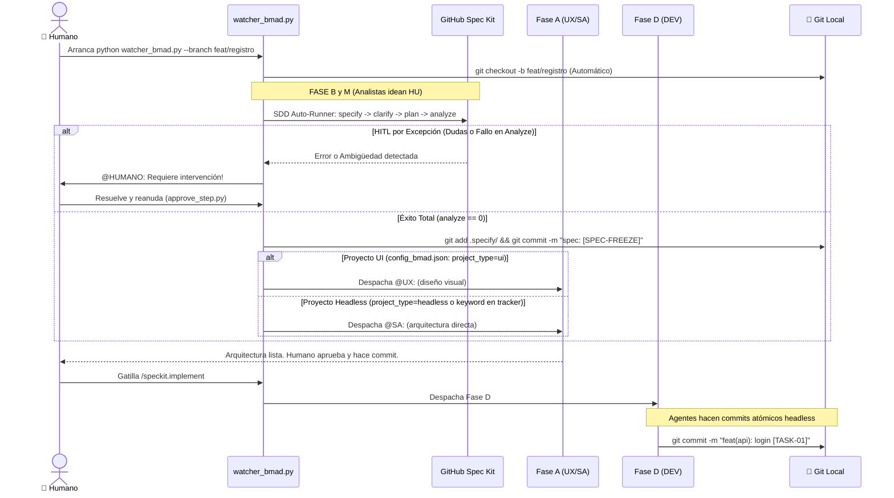

# 🌿 Plan de Integración de Git — Framework BMAD v2.0 (SDD)

> **Tipo:** Documento de Diseño (Planificación)  
> **Estado:** BORRADOR — Pendiente de aprobación humana antes de inyectar en agentes  
> **Fecha:** 2026-09-27  
> **Autor:** BMAD Core Architect (Meta-Agente)  
> **Alcance:** Definir un modelo de control de versiones Git por Feature Branch que coexista con el ciclo SDD, las compuertas HITL y la ejecución autónoma Headless de la Fase D.

---

## 1. PRINCIPIOS DE DISEÑO

Antes de entrar al flujo etapa por etapa, se establecen tres axiomas que guían todas las decisiones:

| # | Axioma | Razonamiento |
|:---:|:---|:---|
| **A1** | **El orquestador Python (`watcher_bmad.py`) crea la feature branch automáticamente. El Humano es el único Actor Git autorizado para operaciones de push.** | Al detectar una nueva Historia de Usuario en el tracker, `watcher_bmad.py` ejecuta silenciosamente `git checkout -b feat/HU-{ID}-{slug}` antes de despertar a los agentes analistas. Esto garantiza que todo el trabajo del enjambre quede aislado en su propia rama desde el primer instante, sin fricción humana. El push al remoto sigue siendo responsabilidad exclusiva del Humano, ya que es el acto de gobernanza irreversible que requiere juicio estratégico. |
| **A2** | **Los Agentes constructores pueden hacer `git add` y `git commit` locales, nunca `git push`.** | Los agentes operan en modo Headless y su output son commits atómicos trazables por tarea. El push es la compuerta de seguridad irreversible que requiere juicio humano. |
| **A3** | **El SDD Auto-Runner realiza el Spec Freeze automáticamente.** | El orquestador `watcher_bmad.py` ejecutará autónomamente Spec Kit. Si la auditoría (`/speckit.analyze`) es exitosa, el propio orquestador ejecutará el commit de congelamiento (`Spec Freeze`) antes de delegar a Fase A. El humano solo intervendrá bajo el patrón HITL por Excepción (si hay dudas de negocio o fallos arquitectónicos). |

---

## 2. FLUJO DE TRABAJO GIT POR ETAPA

### ETAPA 0 — Creación de la Rama de Feature (watcher_bmad.py)

**Actor:** 🤖 `watcher_bmad.py` + 🧑 HUMANO (prerequisito)  
**Cuándo:** Al arrancar el watcher para una nueva sesión de trabajo.

> [!CAUTION]
> **`--branch` es un argumento REQUERIDO.** Si el humano no lo provee, el watcher lanza un error descriptivo y **no arranca**. Esto protege la rama `main` de recibir commits accidentales del enjambre.

El humano provee el nombre de la feature branch como argumento obligatorio al iniciar `watcher_bmad.py`. El watcher crea (o reactiva) la rama **inmediatamente, antes de procesar el tracker y antes de despertar al primer agente analista**.

```bash
# Prerequisito: asegurarse de que main esté actualizado
git checkout main && git pull origin main

# Arrancar el watcher con el nombre de la rama — argumento OBLIGATORIO
python watcher_bmad.py --branch feat/registro-usuario

# ❌ Sin --branch → el watcher aborta con error y no arranca:
# python watcher_bmad.py
# → ERROR: El argumento --branch es obligatorio.
#           Uso correcto: python watcher_bmad.py --branch feat/<nombre-feature>
#           El watcher no puede iniciarse sin una feature branch destino.
#           Protege main: ningún agente escribirá en la rama base.
```

**Lógica Python que se inyectará en `watcher_bmad.py`:**

```python
# Fragmento a inyectar en el bloque if __name__ == "__main__":
import argparse, subprocess, sys

parser = argparse.ArgumentParser(description="BMAD Watcher — Orquestador de Agentes")
parser.add_argument(
    "--branch",
    required=True,                          # ← REQUERIDO: falla si no se provee
    metavar="feat/<nombre>",
    help="Nombre de la feature branch de destino (ej. feat/registro-usuario)"
)
args = parser.parse_args()
branch_name = args.branch

# Idempotencia: verificar si la rama ya existe antes de crearla
existing = subprocess.run(
    ["git", "branch", "--list", branch_name],
    capture_output=True, text=True
)
if existing.stdout.strip():
    subprocess.run(["git", "checkout", branch_name], check=True)
    print(f"[WATCHER-GIT] ✅ Rama existente reactivada: {branch_name}")
else:
    subprocess.run(["git", "checkout", "-b", branch_name], check=True)
    print(f"[WATCHER-GIT] ✅ Rama nueva creada: {branch_name}")

# A partir de aquí, el watcher continúa con su ciclo normal de monitoreo
```

> [!IMPORTANT]
> **Idempotencia garantizada:** Si el watcher se reinicia con la misma `--branch`, la verificación `git branch --list {nombre}` detecta la rama existente y ejecuta `git checkout {nombre}` en lugar de `git checkout -b`, evitando el error `fatal: A branch named '...' already exists`.

**Convención de nomenclatura de ramas:**

| Tipo | Patrón | Ejemplo |
|:---|:---|:---|
| Feature (HU nueva) | `feat/{slug}` | `feat/registro-usuario` |
| Fix (corrección) | `fix/{slug}` | `fix/validacion-email-login` |
| Infraestructura | `infra/{slug}` | `infra/docker-compose-auth` |
| Especificación SDD | `spec/{slug}` | `spec/autenticacion-jwt` |

> [!NOTE]
> La Fase B y M (Ideación: `@BS`, `@PA`, `@PM`, `@BA`) opera sobre archivos Markdown en `files/`. Al exigir `--branch` al arranque, el enjambre ya está en la rama correcta desde el primer instante y todo artefacto producido queda bajo control de versiones sin esfuerzo adicional.

---

### ETAPA 1 — Fase B y M: Ideación y Discovery (Humano / Opcional)

**Actor:** 🧑 HUMANO (opcional, a discreción del Tech Lead)  
**Cuándo:** Al finalizar la revisión de los artefactos de negocio.

```bash
# Commit opcional al cierre de la Fase M (después de que @BA y @QA aprueban)
git add files/business-analyst/hu_042_registro_usuario.md
git add files/business-analyst/HUs-stakeholders/hu_042_registro_usuario.md
git add files/qa-documental/
git commit -m "docs(hu-042): HU técnica y stakeholder aprobadas por QA Documental"
```

**Razonamiento:** Un commit aquí no es obligatorio pero sí recomendable como "snapshot de negocio" antes de entrar al Spec Kit. Si el SDD Bridge descubre ambigüedades que reabren la HU, se puede hacer `git revert` sin contaminar commits de código.

---


### ETAPA 2 — Hito Arquitectónico: SDD Auto-Runner & Spec Freeze

**Actor:** 🤖 `watcher_bmad.py` (HITL por Excepción)  
**Cuándo:** Inmediatamente después de que el `@QA` aprueba la Historia de Usuario.

El orquestador intercepta la aprobación y ejecuta la función `ejecutar_ciclo_sdd(ruta_hu)` de forma totalmente automatizada:

1. **Ejecuta:** `specify files/business-analyst/...`
2. **Ejecuta:** `specify clarify`
   - *HITL (Human-in-the-Loop):* Si el output tiene errores, dudas (`?`) o palabras clave ("ambiguity"), el script pausa, etiqueta al `@HUMANO:` en el tracker y aborta. El humano resuelve y reanuda con `approve_step.py` (Opción 5).
3. **Ejecuta:** `specify plan` → `specify tasks` → `specify analyze`
   - *HITL Auditoría:* Si `analyze` falla (returncode != 0), el script pausa por violación a la constitución técnica y llama al `@HUMANO:`.
4. **Spec Freeze Automático (Si hay éxito total):**
   Si `analyze` termina en código 0, el Watcher ejecuta subprocesos de Git para congelar la especificación *antes* de despertar a la Fase A:
   ```bash
   git add .specify/
   git commit -m "spec(hu-{ID}): [SPEC-FREEZE] Ciclo SDD automático completado y validado"
   ```

---


**Handoff Dinámico (UI vs Headless) — Función `determinar_handoff_fase_a()`:**

Tras el Spec Freeze automático exitoso, el watcher NO escribe `@UX:` a ciegas. Ejecuta la función de detección de topología antes de escribir en el tracker:

```python
# Fragmento de la función ejecutar_ciclo_sdd() en watcher_bmad.py
import json, re

def determinar_handoff_fase_a(tracker_path: str, config_path: str = "config_bmad.json") -> str:
    """
    Determina si el proyecto es UI o Headless y retorna el handoff correcto.
    Estrategia de detección (por orden de prioridad):
      1. Flag explícito en config_bmad.json: {"project_type": "headless" | "ui"}
      2. Palabra clave "headless" en las últimas 50 líneas del tracker_bmad.md
    Retorna: "@UX:" si UI  |  "@SA:" si Headless
    """
    # Prioridad 1: flag en config_bmad.json
    try:
        with open(config_path, encoding="utf-8") as f:
            config = json.load(f)
        project_type = config.get("project_type", "").lower()
        if project_type == "headless":
            return "@SA:"
        if project_type == "ui":
            return "@UX:"
    except (FileNotFoundError, json.JSONDecodeError):
        pass  # Sin flag explícito → pasar a Prioridad 2

    # Prioridad 2: palabra clave "headless" en el tracker
    try:
        with open(tracker_path, encoding="utf-8") as f:
            ultimas_lineas = f.readlines()[-50:]
        contenido = " ".join(ultimas_lineas).lower()
        if "headless" in contenido:
            return "@SA:"
    except FileNotFoundError:
        pass

    # Default: proyecto con UI (convención BMAD)
    return "@UX:"

# Uso dentro de ejecutar_ciclo_sdd(), tras el Spec Freeze exitoso:
# handoff = determinar_handoff_fase_a(TRACKER_PATH)
# mensaje = f"{handoff} El ciclo SDD ha concluido con éxito. Procede según tu rol."
# # Escribir mensaje en tracker → watcher lo detecta y despacha al agente correcto
```

> [!IMPORTANT]
> **Fuente de Verdad para el flag:** La clave `"project_type"` debe añadirse a [`config_bmad.json`](file:///D:/Paulo/Cursos/DMC/template-bmad/config_bmad.json) con valor `"ui"` o `"headless"` al iniciar el proyecto. Esta es la forma canónica y determinista. La detección por keyword en el tracker es el fallback por resiliencia, no el camino principal.


---

### ETAPA 3 — Fase A: Arquitectura (Humano — Al aprobar cada entregable)

**Actor:** 🧑 HUMANO (al aprobar cada compuerta HITL)  
**Cuándo:** Tras cada aprobación en `approve_step.py` (opciones 8, 9, 10).

Los agentes de Fase A (`@UX`, `@SA`, `@DA`, `@API`, `@QT`) producen artefactos de diseño en `files/`. El humano puede optar por commitear estos al aprobar cada transición o acumularlos en un solo commit de "Arquitectura completa".

**Estrategia recomendada — Commit por hito de aprobación:**

```bash
# Al aprobar UX (approve_step opción 8 → SA)
git add files/designer-ux/
git commit -m "design(hu-042): wireframes ASCII aprobados por Tech Lead"

# Al aprobar SA → DA (opción 9)
git add files/solutions-architect/tech_guidelines.md
git commit -m "arch(hu-042): tech_guidelines.md — stack y ADRs definidos"

# Al aprobar QT → /speckit.implement (opción 10)
git add files/data-architect/ files/api-architect/ files/qa-tech/
git commit -m "arch(hu-042): [ARCH-FREEZE] tech-design maestro aprobado — gatillo Fase D"
```

---

### ETAPA 4 — Fase D: Ejecución Autónoma (Agentes — Commits Atómicos)

**Actor:** 🤖 AGENTES (`@DEV-BACK`, `@DEV-FRONT`, `@QA-AUTO`)  
**Cuándo:** Durante la implementación de cada tarea del `tasks.md`.

Esta es la etapa de mayor complejidad en la integración Git. Los agentes tienen `execute_command` y operan en modo 100% Headless. Cada agente DEBE:

1. **Leer su tarea del `tasks.md`** (identificada por su ID, ej. `TASK-042-BE-01`).
2. **Implementar el código.**
3. **Ejecutar un commit atómico** por tarea completada — ni antes (commit parcial), ni después de múltiples tareas (commit gigante).
4. **Nunca ejecutar `git push`.**

**Algoritmo de commit para agentes (pseudo-código):**

```
PARA CADA tarea en tasks.md asignada a mi agente:
  1. Implementar código de la tarea
  2. git add {archivos específicos generados}   ← NUNCA git add .
  3. git commit -m "{tipo}({scope}): {mensaje}"  ← SIEMPRE con -m inline

  SI el comando git add o git commit retorna error o detecta conflicto:
    ├─ ABORTAR inmediatamente la ejecución de la tarea
    ├─ PROHIBIDO intentar git rebase, git merge, git pull o cualquier
    │  resolución autónoma del conflicto
    ├─ write_file → reportar el error en tracker_bmad.md con el mensaje:
    │  "@HUMANO: Conflicto/error de Git detectado en TASK-{ID}. Error:
    │   {stderr exacto del comando fallido}. Requiere resolución manual.
    │   El agente ha abortado. Reanuda cuando el conflicto esté resuelto."
    └─ Devolver el turno — no continuar con las siguientes tareas

  SI no hay error:
    4. read_file de cada archivo commiteado        ← Verificación anti-fantasma
    5. Reportar en tracker: tarea commiteada con hash
```

**Restricciones Git Headless — Reglas de Oro:**

```bash
# ✅ CORRECTO — commit con mensaje inline (nunca abre editor)
git commit -m "feat(auth): implementar endpoint POST /api/auth/login [TASK-042-BE-01]"

# ❌ PROHIBIDO — abre vim/nano y congela el agente
git commit

# ✅ CORRECTO — add de archivos específicos
git add src/Auth/Features/Login/LoginEndpoint.cs
git add src/Auth/Features/Login/LoginCommand.cs

# ❌ PROHIBIDO — puede incluir archivos no intencionados o archivos de otro agente
git add .

# ❌ PROHIBIDO — operación remota, rompe la restricción de seguridad
git push
git push origin feat/HU-042-registro-usuario

# ❌ PROHIBIDO — interactivo, congela la terminal
git commit --amend
git rebase -i HEAD~3
git merge --no-ff (si requiere resolución de conflictos interactiva)
```

---

### ETAPA 5 — Validación y Cierre (Humano — Compuerta Final)

**Actor:** 🧑 HUMANO  
**Cuándo:** Tras el veredicto `[APROBADO]` de `@CODE-REVIEW`.

El humano revisa los commits locales producidos por los agentes, hace squash si es necesario para limpiar el historial, y ejecuta el push al remoto:

```bash
# Revisión del historial local de la feature branch
git log --oneline feat/HU-042-registro-usuario

# Opcional: squash de commits de agentes en un commit semántico limpio
git rebase -i main  # El humano decide la granularidad final

# Push al remoto — ÚNICO ACTOR AUTORIZADO
git push origin feat/HU-042-registro-usuario

# Crear Pull Request / Merge Request hacia main/develop
# (proceso externo al framework BMAD)
```

---

## 3. DIAGRAMA DE FLUJO GIT + BMAD



---

## 4. ESTÁNDARES DE CONVENTIONAL COMMITS PARA AGENTES

Los agentes de la Fase D (`@DEV-BACK`, `@DEV-FRONT`, `@QA-AUTO`) deben seguir estrictamente la especificación [Conventional Commits v1.0](https://www.conventionalcommits.org/). El formato obligatorio es:

```
<tipo>(<scope>): <descripción imperativa en minúsculas> [TASK-{ID}]
```

### 4.1 Tipos Permitidos por Agente

| Tipo | Descripción | Agentes que lo usan |
|:---|:---|:---|
| `feat` | Nueva funcionalidad o endpoint | `@DEV-BACK`, `@DEV-FRONT` |
| `fix` | Corrección de bug detectado en review | `@DEV-BACK`, `@DEV-FRONT` |
| `test` | Pruebas automatizadas (unitarias, E2E) | `@QA-AUTO` |
| `refactor` | Refactorización sin cambio de comportamiento | `@DEV-BACK`, `@DEV-FRONT` |
| `chore` | Scaffolding, configuración de proyecto, `.csproj` | `@DEV-BACK`, `@DEV-FRONT`, `@DEVOPS` |
| `infra` | Docker, compose, CI/CD, Terraform | `@DEVOPS` |
| `docs` | Artefactos de diseño, README, ADRs | Humano (Fase A) |
| `spec` | Artefactos de Spec Kit (spec.md, tasks.md) | Humano (Spec Freeze) |
| `arch` | Entregables de arquitectura (tech-design, guidelines) | Humano (Arch Freeze) |

### 4.2 Scopes por Dominio

El `scope` debe coincidir con el nombre del módulo o feature del `tasks.md`. Ejemplos reales basados en el stack del proyecto:

```bash
# Backend (.NET Modulith — Vertical Slice Architecture)
feat(auth): implementar handler LoginCommandHandler [TASK-042-BE-01]
feat(auth): registrar endpoint POST /api/auth/login via Carter [TASK-042-BE-02]
feat(auth): configurar fluent API para tabla Users en schema auth [TASK-042-BE-03]
test(auth): pruebas unitarias LoginCommandHandler con xUnit [TASK-042-QA-01]

# Frontend (Angular 22 Zoneless)
feat(login): generar componente LoginFormComponent standalone [TASK-042-FE-01]
feat(login): implementar AuthService con HttpClient e inject() [TASK-042-FE-02]
feat(login): maquetación PrimeFlex en login.component.html [TASK-042-FE-03]
test(login): pruebas E2E Playwright flujo de login [TASK-042-QA-02]

# DevOps
chore(docker): agregar servicio auth-api al docker-compose.yml [TASK-042-OPS-01]
infra(ci): pipeline GitHub Actions para build y test de auth-module [TASK-042-OPS-02]
```

### 4.3 Reglas Adicionales

1. **Imperativo y minúsculas:** La descripción siempre en imperativo (`implementar`, `agregar`, `configurar`) y sin mayúscula inicial.
2. **Máximo 72 caracteres** en la línea del subject (sin incluir el `[TASK-ID]`).
3. **El `[TASK-ID]` es obligatorio** al final para trazabilidad entre el commit y el `tasks.md`.
4. **Sin breaking changes en Fase D:** Los agentes no deben introducir `BREAKING CHANGE:` en el footer. Si detectan un conflicto constitucional, deben detener la tarea y reportar en el tracker.

---

## 5. MATRIZ DE IMPACTO — Archivos a Modificar en el Futuro

Esta es la lista exacta de archivos que requerirán modificación para inyectar el comportamiento Git descrito en este plan. **Ninguno ha sido modificado aún** — este documento es solo el diseño.

### 5.1 Archivos de Instrucciones (`.instructions.md`)

| # | Archivo | Sección a Modificar | Reglas Git a Inyectar |
|:---:|:---|:---|:---|
| 1 | [`dev-backend/instructions/cli-headless-execution.instructions.md`](file:///D:/Paulo/Cursos/DMC/template-bmad/dev-backend/instructions/cli-headless-execution.instructions.md) | Nueva sección `## REGLAS DE CONTROL DE VERSIONES (GIT HEADLESS)` | Prohibición de `git commit` sin `-m`, `git add .`, `git push`. Patrón obligatorio: `git add {archivos específicos}` + `git commit -m "{conventional}"`. Prohibición de `git commit --amend`, `git rebase -i`. |
| 2 | [`dev-frontend/instructions/cli-headless-execution.instructions.md`](file:///D:/Paulo/Cursos/DMC/template-bmad/dev-frontend/instructions/cli-headless-execution.instructions.md) | Nueva sección `## REGLAS DE CONTROL DE VERSIONES (GIT HEADLESS)` | Idéntico al archivo de backend. El flag `--skip-git` en `ng new` ya es correcto — el agente gestiona Git manualmente, no delega a Angular CLI. |
| 3 | [`devops/instructions/cli-headless-execution.instructions.md`](file:///D:/Paulo/Cursos/DMC/template-bmad/devops/instructions/cli-headless-execution.instructions.md) | Ampliar sección Git existente (Líneas 37–40) | Añadir reglas de commit atómico para archivos de infra. Reforzar que `git push --no-verify` también está prohibido para DevOps en BMAD. |
| 4 | [`qa-auto/instructions/cli-headless-execution.instructions.md`](file:///D:/Paulo/Cursos/DMC/template-bmad/qa-auto/instructions/cli-headless-execution.instructions.md) | Nueva sección `## CONTROL DE VERSIONES` | `git add tests/` específico por suite. Commit con tipo `test(scope): ...`. Prohibición de push. |
| 5 | `skills/git-commit/SKILL.md` *(actualmente vacío)* | Completar el SKILL completo | Este skill debe contener: el algoritmo completo de commit atómico, los tipos de Conventional Commits por agente, el patrón de `[TASK-ID]`, la lista negra de comandos prohibidos y ejemplos canónicos por stack (.NET y Angular). |

### 5.2 Archivos de Agentes (`.agent.md`)

| # | Archivo | Sección a Modificar | Reglas Git a Inyectar |
|:---:|:---|:---|:---|
| 6 | [`dev-backend/agents/dev-backend.agent.md`](file:///D:/Paulo/Cursos/DMC/template-bmad/dev-backend/agents/dev-backend.agent.md) | `### ⚙️ ALGORITMO DE EJECUCIÓN` (Paso 4) | Después de `write_file`, añadir Paso 4.5: `git add {archivos_generados}` + `git commit -m "feat({módulo}): {descripción} [{TASK-ID}]"`. Importar `[IMPORT_SKILL: skills/git-commit/SKILL.md]`. |
| 7 | [`dev-frontend/agents/dev-frontend.agent.md`](file:///D:/Paulo/Cursos/DMC/template-bmad/dev-frontend/agents/dev-frontend.agent.md) | `### ⚙️ ALGORITMO DE EJECUCIÓN` (Paso 4) | Idéntico al backend, ajustando scope a componentes Angular. Importar `[IMPORT_SKILL: skills/git-commit/SKILL.md]`. |
| 8 | [`devops/agents/devops.agent.md`](file:///D:/Paulo/Cursos/DMC/template-bmad/devops/agents/devops.agent.md) | `### ⚙️ ALGORITMO DE EJECUCIÓN` | Commit con tipo `infra` o `chore` tras generar cada archivo de infraestructura. Importar skill. |
| 9 | [`qa-auto/agents/qa-auto.agent.md`](file:///D:/Paulo/Cursos/DMC/template-bmad/qa-auto/agents/qa-auto.agent.md) | `### ⚙️ ALGORITMO DE EJECUCIÓN` | Commit con tipo `test` tras generar cada suite. Importar skill. |

### 5.3 Motor Orquestador (Python)

| # | Archivo | Sección a Modificar | Lógica a Inyectar |
|:---:|:---|:---|:---|
| 10 | [`watcher_bmad.py`](file:///D:/Paulo/Cursos/DMC/template-bmad/watcher_bmad.py) | Bloque de inicializacion (`if __name__ == '__main__':`) + nueva funcion `ejecutar_ciclo_sdd()` | **(A) argparse:** `--branch` como `required=True`. **(B) Idempotencia:** `git branch --list` antes de `checkout -b`. **(C) Spec Freeze automatico:** tras `analyze` exitoso -> `git add .specify/` + `git commit -m 'spec: [SPEC-FREEZE]'`. **(D) Handoff dinamico — funcion `determinar_handoff_fase_a()`:** Lee `config_bmad.json['project_type']`; `'headless'` -> escribe `@SA:` en tracker; `'ui'` o ausente -> escribe `@UX:`. Fallback: busca keyword `'headless'` en ultimas 50 lineas del tracker. **Nunca hardcodear `@UX:`.**  |
| 10b | [`config_bmad.json`](file:///D:/Paulo/Cursos/DMC/template-bmad/config_bmad.json) | Raiz del JSON | Anadir clave `'project_type': 'ui'` o `'project_type': 'headless'` como flag canonico de topologia. Es la fuente de verdad primaria que consume `determinar_handoff_fase_a()`. |

### 5.4 Cero Impacto (No Requieren Modificación)

| Archivo | Razón |
|:---|:---|
| `utils/approve_step.py` | Las compuertas HITL son el momento del commit del Humano, no del script. El script no debe automatizar git. |
| `code-review/agents/code-review.agent.md` | El auditor no produce código ni commits. Solo lee y emite veredicto. |
| Agentes de Fase A (`SA`, `DA`, `API`, `UX`, `QT`) | Sus entregables son Markdown en `files/`. El commit de estos artefactos es responsabilidad humana en las compuertas HITL. |
| Agentes de Fase B/M (`BS`, `PA`, `PM`, `BA`, `QA`) | Igual que Fase A. Producen documentación, no código. |
| `.specify/memory/constitution.md` | No requiere mencionar Git. La restricción se inyecta en las instrucciones de los agentes que ya la leen. |

---

## 6. RIESGOS Y MITIGACIONES

| Riesgo | Probabilidad | Impacto | Mitigación |
|:---|:---:|:---:|:---|
| Agente ejecuta `git commit` sin `-m` y abre el editor de texto | Alta | 🔴 CRÍTICO — congela el framework | Regla explícita en `cli-headless-execution` + ejemplos negativos canónicos |
| Agente ejecuta `git add .` e incluye archivos del tracker o de otro agente | Media | 🟡 MEDIO — commit contaminado | Obligar `git add {rutas específicas}` y nunca wildcards globales |
| Agente ejecuta `git push` | Baja | 🔴 CRÍTICO — exposición no autorizada al remoto | Prohibición explícita en todos los archivos `.instructions.md` y en el SKILL |
| Conflicto de merge en la feature branch entre DEV-BACK y DEV-FRONT | Media | 🟡 MEDIO — requiere intervención humana | **Política estricta:** El agente tiene PROHIBIDO intentar resolver el conflicto vía `git rebase`, `git merge` o `git pull`. Debe abortar la tarea, reportar el `stderr` exacto en el tracker con etiqueta `@HUMANO:` y devolver el turno. |
| Commit message que no sigue Conventional Commits | Alta | 🟢 BAJO — pérdida de trazabilidad | El SKILL debe incluir plantillas de mensaje obligatorias con `[TASK-ID]` |

---

## 7. DICTAMEN Y PRÓXIMOS PASOS

```
╔══════════════════════════════════════════════════════════════════╗
║                                                                  ║
║   📋 PLAN LISTO PARA REVISIÓN HUMANA                            ║
║                                                                  ║
║   Este documento NO modifica ningún archivo del framework.      ║
║   Es un diseño técnico que requiere aprobación antes de         ║
║   inyectarse en los agentes.                                    ║
║                                                                  ║
║   Acciones pendientes de aprobación humana:                     ║
║   1. Revisar este plan y validar los axiomas A1, A2, A3.        ║
║   2. Decidir si el commit de Fase A es por hito o acumulado.    ║
║   3. Autorizar la escritura del SKILL.md de git-commit.         ║
║   4. Autorizar la inyección en los 9 archivos de la Matriz      ║
║      de Impacto (Sección 5).                                    ║
║                                                                  ║
║   Archivos a modificar: 9 (0 modificados hasta ahora)          ║
║   Archivos sin impacto: 12                                      ║
║                                                                  ║
╚══════════════════════════════════════════════════════════════════╝
```

---

> **Firmado por:** BMAD Core Architect (Meta-Agente `bmad-architect`)  
> **Clasificación:** Documento de Planificación — Solo Lectura hasta aprobación HITL  
> **Referencia:** Ver `auditoria_bmad.md` para contexto del estado del ecosistema previo a esta integración.
